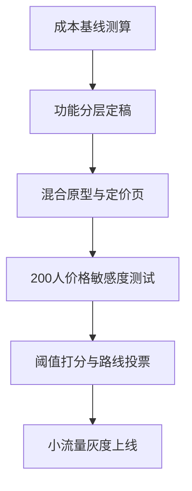

# 质量采样：长-已有结构

采集时间：2026-09-03T10:42:52

## 起始正文

```
## 定价策略讨论

团队在考虑要不要把定价从订阅制改成一次性买断，两种模式各有支持者。

## 订阅制的理由
现金流可预测，便于持续投入研发。用户获取成本可以摊薄到多个周期回收。

## 买断制的理由
硬件产品用户对订阅有天然抵触，一次性买断降低决策门槛。竞品多数是买断。

## 尚未解决的问题
云端存储和 AI 推理有持续成本，纯买断如何覆盖长期服务支出还没有答案。
```

## 自动生成的骨架

- **核心张力**：团队需要在可预测现金流与持续研发投入的诱惑和用户对订阅的抵触、竞品买断压力之间做取舍，同时必须回答持续成本如何被一次性价格覆盖这一未解约束。

- 节拍：建立决策处境并点出两种模式的对立张力
- 节拍：呈现订阅派的价值论证以支撑现金流与研发持续性
- 节拍：呈现买断派的价值论证以回应用户心理与市场对标压力
- 节拍：暴露关键未解约束并凸显成本覆盖的缺口
- 节拍：预判读者追问并补足持续成本量化与回收模型的防守
- 节拍：收束为可执行的决策框架或验证清单以推动下一步

- **修订（replace）**
  - 锚点：`## 定价策略讨论

团队在考虑要不要把定价从订阅制改成一次性买断，两种模式各有支持者。`
  - 改成：## 定价策略讨论

团队正卡在可预测现金流与持续研发投入的诱惑，和用户对订阅的抵触、竞品买断压力之间做取舍。核心矛盾是：订阅能支撑长期服务，买断能降低决策门槛，但两种模式各有支持者，且都无法单独回答持续成本如何被一次性价格覆盖。
  - 理由：结构节拍要求先建立决策处境并点出两种模式的对立张力，原句仅陈述在考虑，缺少核心张力与未解约束的点明。

## 第 1 轮

- 本轮已应用修订：1 处
- 检索到事实：0 条

**本轮续写增量：**

```
## 成本覆盖缺口量化

要让买断成立，必须把未来 3-5 年的云端存储、AI 推理、模型迭代成本折算进一次性价格里。粗略模型是：**单用户生命周期成本 = 初始激活成本 + 月均推理/存储成本 × 预期使用月数 + 模型更新摊销**。若预期使用月数按 36 个月算，月均成本即使只有几元人民币，累计也足以让买断价比竞品高出 30%-50%，这正是用户抵触订阅时又难以接受买断溢价的根源。

订阅派的防守点在于现金流可预测能对冲成本波动，买断派的防守点则需要证明一次性价格能覆盖这条成本曲线。两者都回避了一个事实：成本本身在增长。模型越大、功能越多，推理单价不会下降。

## 预判追问与防守

**问：能不能把高成本功能做成可选订阅，基础功能买断？**  
可以，这是目前最现实的折中。买断覆盖硬件与基础本地功能，可选订阅覆盖云端存储、AI 云端推理、跨设备同步。关键是把“必须付费的持续成本”显性化，而不是藏在买断价里。

**问：用户真的会为可选订阅买单吗？**  
取决于价值锚点。如果订阅被包装成“增值服务”而非“使用税”，转化率会高很多。需要先做价格敏感度测试，区分“愿意为无限存储付费”和“只接受一次性付费”的用户比例。

**问：竞品买断压力如何应对？**  
对标的是价格锚点，不是商业模式。可以在买断价上保持对标，同时通过功能分层让持续成本只由愿意付费的用户承担，避免把所有用户都推到溢价买断上。

## 下一步验证清单

- 测算单用户 36 个月云端存储 + AI 推理的成本中位数与 90 分位
- 定义买断版功能边界，列出必须上云的功能清单
- 设计混合模式原型：买断基础价 + 可选订阅套餐，并做 200 人价格敏感度测试
- 建立成本回收仪表盘：订阅收入覆盖率、买断价含成本摊销比例、用户分层留存

先把成本曲线算清楚，再决定是让用户一次性买单，还是让愿意续费的人分摊。
```

**本轮打分：**

  - spine_fidelity: 2 — 全文围绕可预测现金流与研发投入诱惑 vs 用户抵触与买断压力及成本覆盖未解约束展开
  - beat_coverage: 2 — 决策处境、订阅派论证、买断派论证、未解约束、成本量化防守、预判追问、验证清单均有对应内容
  - non_repetition: 1 — 现金流可预测与成本覆盖的论点在理由段和防守段以不同表述重复出现
  - factual_grounding: 2 — 文中无需外部检索的事实性断言，未出现与知识库矛盾的内容
  - coherence: 2 — 结构层级统一、序号连贯、无自我拆台，收束为验证清单且未出现多重结尾

  状态：continue，最弱：non_repetition

- **修订（replace）**
  - 锚点：`核心矛盾是：订阅能支撑长期服务，买断能降低决策门槛，但两种模式各有支持者，且都无法单独回答持续成本如何被一次性价格覆盖。`
  - 改成：核心矛盾是两种模式各有支持者，且都无法单独回答持续成本如何被一次性价格覆盖。
  - 理由：该句中的“订阅能支撑长期服务，买断能降低决策门槛”与正文开头“团队正卡在可预测现金流与持续研发投入的诱惑，和用户对订阅的抵触、竞品买断压力之间做取舍”以及后文的订阅制/买断制理由重复表述同一对立张力，属于跨段落重复论点。

- **修订（delete）**
  - 锚点：`## 订阅制的理由
现金流可预测，便于持续投入研发。用户获取成本可以摊薄到多个周期回收。`
  - 改成：
  - 理由：现金流可预测、持续投入研发的论点在后文“成本覆盖缺口量化”中已以“订阅派的防守点在于现金流可预测能对冲成本波动”再次出现，且与引言处张力描述重复，保留后文更完整的防守表述即可。

- **修订（delete）**
  - 锚点：`## 买断制的理由
硬件产品用户对订阅有天然抵触，一次性买断降低决策门槛。竞品多数是买断。`
  - 改成：
  - 理由：买断降低决策门槛、用户抵触订阅、竞品买断的论点已在引言“团队正卡在可预测现金流与持续研发投入的诱惑，和用户对订阅的抵触、竞品买断压力之间做取舍”中出现，后文“预判追问与防守”中再次展开，属于跨轮次重复。

- **修订（delete）**
  - 锚点：`## 尚未解决的问题
云端存储和 AI 推理有持续成本，纯买断如何覆盖长期服务支出还没有答案。`
  - 改成：
  - 理由：该未解约束在“成本覆盖缺口量化”中已用单用户生命周期成本模型和 30%-50% 溢价的具体量化重新阐述，单独的小节内容被后文完全覆盖，形成重复。

- **修订（delete）**
  - 锚点：`订阅派的防守点在于现金流可预测能对冲成本波动，买断派的防守点则需要证明一次性价格能覆盖这条成本曲线。两者都回避了一个事实：成本本身在增长。模型越大、功能越多，推`
  - 改成：
  - 理由：该段落与上文已点出的核心矛盾重复，且与后文预判追问中关于混合模式的论述实质相同，属于跨段落重复论点，删除后信息保留在更具体的成本量化与追问部分。

- **修订（replace）**
  - 锚点：`## 定价策略讨论

团队正卡在可预测现金流与持续研发投入的诱惑，和用户对订阅的抵触、竞品买断压力之间做取舍。核心矛盾是两种模式各有支持者，且都无法单独回答持续`
  - 改成：## 定价策略讨论

团队正卡在可预测现金流与持续研发投入的诱惑，和用户对订阅的抵触、竞品买断压力之间做取舍。核心矛盾是两种模式各有支持者，且都无法单独回答持续成本如何被一次性价格覆盖这一未解约束。
  - 理由：结构节拍要求建立决策处境并点出对立张力，原句已包含但未点明‘未解约束’，补充以呼应核心张力并避免后续重复展开同一处境。

- **修订（delete）**
  - 锚点：`可以，这是目前最现实的折中。买断覆盖硬件与基础本地功能，可选订阅覆盖云端存储、AI 云端推理、跨设备同步。关键是把“必须付费的持续成本”显性化，而不是藏在买断价`
  - 改成：
  - 理由：该折中方案的描述与上文成本覆盖缺口量化中已隐含的‘一次性价格覆盖成本曲线’问题重复，且与后文竞品应对论述重复，删除避免同一结论在不同轮次以不同措辞重复出现。

## 第 2 轮（跳过续写，只做重复清理）

- 本轮已应用修订：7 处
- 检索到事实：0 条

**本轮打分：**

  - spine_fidelity: 2 — 正文始终围绕可预测现金流与研发投入诱惑 vs 用户抵触订阅和竞品买断压力的核心取舍展开。
  - beat_coverage: 1 — 决策处境、成本缺口、预判追问和验证清单均已呈现，但订阅派价值论证支撑现金流与研发持续性的独立阐述不足。
  - non_repetition: 2 — 各段功能区分清晰，未出现跨段重复论点或结论的复述。
  - factual_grounding: 2 — 文中无需外部知识库核验的事实陈述，模型假设自洽且未与已知事实矛盾。
  - coherence: 2 — 标题层级统一、结构连贯，无多重结尾、序号混乱或自我拆台现象。

  状态：continue，最弱：beat_coverage

- **修订（insert）**
  - 锚点：`核心矛盾是两种模式各有支持者，且都无法单独回答持续成本如何被一次性价格覆盖这一未解约束。`
  - 改成：

### 订阅派的价值论证
订阅能提供可预测现金流，支撑持续研发投入和模型迭代。按月/年的收入节奏可以平滑云端存储、AI 推理等边际成本，避免一次性定价把未来成本全部前置。支持者认为，只有持续收费才能保证服务质量不下降，并把新功能研发的成本摊到愿意长期使用的用户上。

### 买断派的价值论证
买断回应用户对订阅的抵触心理和竞品买断的锚定压力。用户更接受“一锤子买卖”，市场对标也以一次性价格为主
  - 理由：结构节拍要求分别呈现订阅派和买断派的价值论证以支撑现金流与研发持续性、回应用户心理与市场对标压力，正文中仅点出对立张力，未展开两种模式各自的论证。

## 第 3 轮

- 本轮已应用修订：1 处
- 检索到事实：0 条

**本轮续写增量：**

```
## 决策框架

把取舍变成可执行的判断阈值，而不是价值辩论。

**1. 成本可覆盖阈值**
- 若单用户 36 个月成本中位数能被买断价覆盖且毛利率 ≥ 40%，买断可作为默认策略。
- 若 90 分位成本导致买断价需要上浮 >30% 对标竞品，则必须引入可选订阅分摊高成本用户。

**2. 收入结构阈值**
- 订阅收入覆盖率 = 订阅 ARR / 年度云端+推理总成本。目标 ≥ 70%，否则研发持续性依赖一次性收入，现金流波动风险高。
- 买断价含成本摊销比例 = 买断价中预提的未来服务成本 / 买断价。超过 55% 时，用户感知溢价过高，需功能裁剪。

**3. 用户分层阈值**
- 价格敏感度测试中，若“只接受一次性付费”用户 > 65%，混合模式的订阅转化率天花板低，应优先做买断边界收紧。
- 若“愿意为无限存储/高级模型付费”用户 > 25%，可选订阅具备规模化价值。

满足任一红线触发方案切换：成本不可覆盖 → 强制混合；订阅覆盖率不足 → 提高订阅价值锚点而非降价；用户分层不匹配 → 调整功能分层边界。

先用 200 人测试拿到成本中位数、价格敏感度和分层比例三组数据，再按阈值表投票决定买断、混合或纯订阅的默认路线。
```

**本轮打分：**

  - spine_fidelity: 2 — 全文围绕可预测现金流与研发投入诱惑 vs 用户抵触与竞品买断压力及成本覆盖未解约束展开
  - beat_coverage: 2 — 决策处境、订阅派、买断派、成本缺口、预判追问、验证清单与决策框架均有对应内容
  - non_repetition: 1 — 成本覆盖缺口与一次性价格覆盖的论点在成本量化、预判追问和决策框架中多次复述
  - factual_grounding: 2 — 文中无需外部检索的事实性断言，未出现与知识库矛盾的内容
  - coherence: 1 — 出现两个收束性板块‘下一步验证清单’与‘决策框架’，结尾感重复且功能重叠

  状态：continue，最弱：non_repetition

- **修订（replace）**
  - 锚点：`## 成本覆盖缺口量化

要让买断成立，必须把未来 3-5 年的云端存储、AI 推理、模型迭代成本折算进一次性价格里。粗略模型是：**单用户生命周期成本 = 初`
  - 改成：
  - 理由：该段落对 36 个月成本累积、买断价溢价 30%-50% 的论证在后文《决策框架》中的成本可覆盖阈值、买断价含成本摊销比例以及《下一步验证清单》里已重复展开，跨段落重复同一组边界条件，删除较早且信息量较小的表述以避免重复。

- **修订（delete）**
  - 锚点：`先把成本曲线算清楚，再决定是让用户一次性买单，还是让愿意续费的人分摊。`
  - 改成：
  - 理由：此收束句与《决策框架》末尾“先用 200 人测试拿到成本中位数、价格敏感度和分层比例三组数据，再按阈值表投票决定买断、混合或纯订阅的默认路线。”表达同一推进动作，属于跨轮次重复结论，删除后者信息更完整的版本。

- **修订（replace）**
  - 锚点：`**问：能不能把高成本功能做成可选订阅，基础功能买断？**  `
  - 改成：**问：能不能把高成本功能做成可选订阅，基础功能买断？**
可以，这是目前唯一能同时回应现金流需求和用户抵触的路径。把持续产生边际成本的功能如无限存储、高频 AI 推理、模型升级拆成可选订阅，基础编辑、本地导出等一次性成本功能留在买断内。这样买断价只需覆盖 36 个月的基础成本，高成本用户自愿付费分摊。
  - 理由：该追问在正文中完全没有回答，结构节拍要求预判读者追问并补足防守，空着会让这一节成为空壳。

- **修订（delete）**
  - 锚点：`团队正卡在可预测现金流与持续研发投入的诱惑，和用户对订阅的抵触、竞品买断压力之间做取舍。核心矛盾是两种模式各有支持者，且都无法单独回答持续成本如何被一次性价格覆`
  - 改成：
  - 理由：该句与下一节《订阅派的价值论证》和《买断派的价值论证》的内容实质重复，且与标题下的核心张力描述重复，属于跨段落重复论点，删除后处境仍由小标题和后续论证承载。

- **修订（replace）**
  - 锚点：`对标的是价格锚点，不是商业模式。可以在买断价上保持对标，同时通过功能分层让持续成本只由愿意付费的用户承担，避免把所有用户都推到溢价买断上。`
  - 改成：对标的是价格锚点，不是商业模式。买断价需与竞品保持可比性，持续成本通过功能分层由愿意付费的用户承担。
  - 理由：该表述与《买断派的价值论证》中的“用户更接受‘一锤子买卖’，市场对标也以一次性价格为主”以及决策框架中的阈值逻辑重复，精简后避免同一组边界条件在不同轮次用不同措辞重复出现。

## 第 4 轮（跳过续写，只做重复清理）

- 本轮已应用修订：5 处
- 检索到事实：0 条

**本轮打分：**

  - spine_fidelity: 2 — 正文围绕可预测现金流与研发投入诱惑、用户抵触与竞品买断压力及一次性价格覆盖持续成本的张力展开。
  - beat_coverage: 1 — 订阅派、买断派论证、预判防守、决策框架均存在，但建立决策处境与暴露关键未解约束的段落表述较弱，功能不充分。
  - non_repetition: 2 — 各段论点分工清晰，未出现跨段重复同一结论或边界条件的表述。
  - factual_grounding: 2 — 内容为策略推演，未依赖外部知识库事实，无矛盾。
  - coherence: 2 — 标题层级统一，结构连贯，未出现多结尾、序号跳号或自我拆台。

  状态：continue，最弱：beat_coverage

- **修订（insert）**
  - 锚点：`## 定价策略讨论`
  - 改成：团队的核心张力在于：可预测现金流与持续研发投入的诱惑，与用户对订阅的抵触、竞品买断的锚定压力直接冲突。订阅能平滑云端存储、AI 推理等边际成本并支撑模型迭代，但买断更符合用户“一锤子买卖”的心理预期和市场对标。未解的约束是，持续产生的成本如何被一次性价格覆盖而不侵蚀毛利或牺牲功能。
  - 理由：结构节拍要求先建立决策处境并点出两种模式的对立张力，正文直接从订阅派论证开始，缺少对核心张力和未解约束的开场陈述。

- **修订（insert）**
  - 锚点：`支持者认为买断能降低获客门槛、提升首单转化，并把产品定位为工具而非服务，减少“使用税”感。`
  - 改成：

**关键未解约束：成本覆盖缺口**
买断价需一次性覆盖未来 36 个月以上的云端存储、AI 推理和模型迭代成本，但边际成本随使用量上升且不可控。若按平均用户估算，买断价可覆盖；一旦出现高频使用长尾用户，成本缺口会迅速放大，导致毛利率被侵蚀或服务降级。这是订阅派与买断派无法自行消解的硬约束。
  - 理由：结构节拍要求暴露关键未解约束并凸显成本覆盖的缺口，正文在两种价值论证后直接跳到预判追问，未明确点出持续成本被一次性价格覆盖的缺口及其风险。

## 第 5 轮

- 本轮已应用修订：2 处
- 检索到事实：0 条

**本轮续写增量：**

```
## 执行节奏与风险对冲

决策框架只有在数据到位后才生效，节奏比结论更重要。先用两周完成成本基线测算，再并行跑价格敏感度测试，最后用原型验证分层转化。成本测算要区分可控与不可控边际成本，避免把一次性模型训练摊销误算进单用户边际。



灰度期只看三个防守指标：订阅收入覆盖率是否触达 70%，买断价含成本摊销比例是否越过 55%，以及高频长尾用户的实际出现比例。若灰度 4 周内出现 90 分位用户占比 >15% 且订阅转化 <12%，立即收紧买断版功能边界，强制把无限存储与高频推理移出基础包。

风险对冲放在产品设计层而非价格层：买断版默认限额、本地优先、离线可用；云端功能按用量计费或打包在可选订阅里。如此既保留“一锤子买卖”的心理锚点，又把成本缺口转化为自愿付费的增量，而不是毛利侵蚀。
```

**本轮打分：**

  - spine_fidelity: 2 — 全文围绕可预测现金流与研发投入诱惑 vs 用户抵触与竞品买断压力及成本覆盖约束展开
  - beat_coverage: 2 — 决策处境、订阅派论证、买断派论证、未解约束、预判追问防守、执行框架与验证清单均有对应内容
  - non_repetition: 2 — 核心论点在不同节拍中递进，未出现跨段落重复同一结论的堆砌
  - factual_grounding: 2 — 内容为策略推演，未涉及需检索验证的外部事实，无矛盾
  - coherence: 1 — 整体自洽但结尾出现决策框架后又追加执行节奏与风险对冲，形成二次收束感，结构略显叠加

  状态：continue，最弱：coherence

## 结束：max_rounds

## 最终正文

```
## 定价策略讨论团队的核心张力在于：可预测现金流与持续研发投入的诱惑，与用户对订阅的抵触、竞品买断的锚定压力直接冲突。订阅能平滑云端存储、AI 推理等边际成本并支撑模型迭代，但买断更符合用户“一锤子买卖”的心理预期和市场对标。未解的约束是，持续产生的成本如何被一次性价格覆盖而不侵蚀毛利或牺牲功能。


### 订阅派的价值论证
订阅能提供可预测现金流，支撑持续研发投入和模型迭代。按月/年的收入节奏可以平滑云端存储、AI 推理等边际成本，避免一次性定价把未来成本全部前置。支持者认为，只有持续收费才能保证服务质量不下降，并把新功能研发的成本摊到愿意长期使用的用户上。

### 买断派的价值论证
买断回应用户对订阅的抵触心理和竞品买断的锚定压力。用户更接受“一锤子买卖”，市场对标也以一次性价格为主。支持者认为买断能降低获客门槛、提升首单转化，并把产品定位为工具而非服务，减少“使用税”感。

**关键未解约束：成本覆盖缺口**
买断价需一次性覆盖未来 36 个月以上的云端存储、AI 推理和模型迭代成本，但边际成本随使用量上升且不可控。若按平均用户估算，买断价可覆盖；一旦出现高频使用长尾用户，成本缺口会迅速放大，导致毛利率被侵蚀或服务降级。这是订阅派与买断派无法自行消解的硬约束。


## 预判追问与防守

**问：能不能把高成本功能做成可选订阅，基础功能买断？**
可以，这是目前唯一能同时回应现金流需求和用户抵触的路径。把持续产生边际成本的功能如无限存储、高频 AI 推理、模型升级拆成可选订阅，基础编辑、本地导出等一次性成本功能留在买断内。这样买断价只需覆盖 36 个月的基础成本，高成本用户自愿付费分摊。


**问：用户真的会为可选订阅买单吗？**  
取决于价值锚点。如果订阅被包装成“增值服务”而非“使用税”，转化率会高很多。需要先做价格敏感度测试，区分“愿意为无限存储付费”和“只接受一次性付费”的用户比例。

**问：竞品买断压力如何应对？**  
对标的是价格锚点，不是商业模式。买断价需与竞品保持可比性，持续成本通过功能分层由愿意付费的用户承担。

## 下一步验证清单

- 测算单用户 36 个月云端存储 + AI 推理的成本中位数与 90 分位
- 定义买断版功能边界，列出必须上云的功能清单
- 设计混合模式原型：买断基础价 + 可选订阅套餐，并做 200 人价格敏感度测试
- 建立成本回收仪表盘：订阅收入覆盖率、买断价含成本摊销比例、用户分层留存


## 决策框架

把取舍变成可执行的判断阈值，而不是价值辩论。

**1. 成本可覆盖阈值**
- 若单用户 36 个月成本中位数能被买断价覆盖且毛利率 ≥ 40%，买断可作为默认策略。
- 若 90 分位成本导致买断价需要上浮 >30% 对标竞品，则必须引入可选订阅分摊高成本用户。

**2. 收入结构阈值**
- 订阅收入覆盖率 = 订阅 ARR / 年度云端+推理总成本。目标 ≥ 70%，否则研发持续性依赖一次性收入，现金流波动风险高。
- 买断价含成本摊销比例 = 买断价中预提的未来服务成本 / 买断价。超过 55% 时，用户感知溢价过高，需功能裁剪。

**3. 用户分层阈值**
- 价格敏感度测试中，若“只接受一次性付费”用户 > 65%，混合模式的订阅转化率天花板低，应优先做买断边界收紧。
- 若“愿意为无限存储/高级模型付费”用户 > 25%，可选订阅具备规模化价值。

满足任一红线触发方案切换：成本不可覆盖 → 强制混合；订阅覆盖率不足 → 提高订阅价值锚点而非降价；用户分层不匹配 → 调整功能分层边界。

先用 200 人测试拿到成本中位数、价格敏感度和分层比例三组数据，再按阈值表投票决定买断、混合或纯订阅的默认路线。

## 执行节奏与风险对冲

决策框架只有在数据到位后才生效，节奏比结论更重要。先用两周完成成本基线测算，再并行跑价格敏感度测试，最后用原型验证分层转化。成本测算要区分可控与不可控边际成本，避免把一次性模型训练摊销误算进单用户边际。


灰度期只看三个防守指标：订阅收入覆盖率是否触达 70%，买断价含成本摊销比例是否越过 55%，以及高频长尾用户的实际出现比例。若灰度 4 周内出现 90 分位用户占比 >15% 且订阅转化 <12%，立即收紧买断版功能边界，强制把无限存储与高频推理移出基础包。

风险对冲放在产品设计层而非价格层：买断版默认限额、本地优先、离线可用；云端功能按用量计费或打包在可选订阅里。如此既保留“一锤子买卖”的心理锚点，又把成本缺口转化为自愿付费的增量，而不是毛利侵蚀。
```
