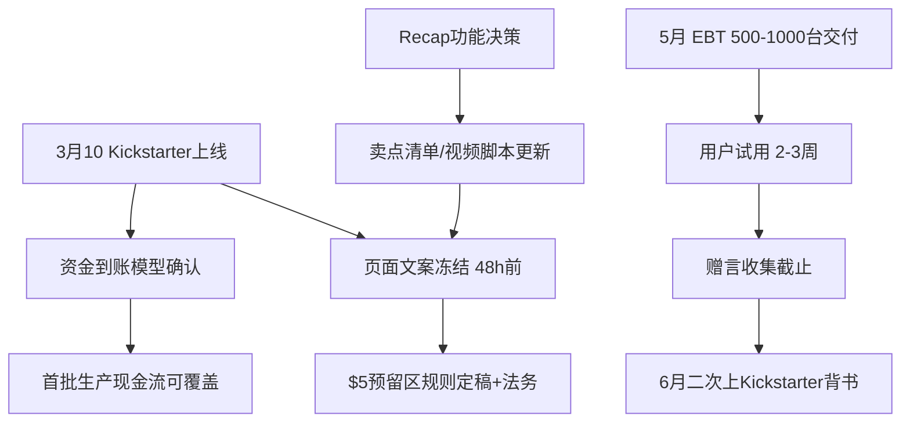

# 质量采样：知识库grounding-修复后

采集时间：2026-09-03T11:31:46

## 起始正文

```
Kickstarter 众筹上线前还有哪些事没定下来，需要梳理一遍。
```

## 自动生成的骨架

- **核心张力**：在质量采样-grounding修复完成后，如何把众筹上线前的未决事项梳理清楚并确认风险闭环，避免带着模糊项上线。

- 节拍：建立修复后的处境锚点，确认当前进展边界
- 节拍：列出众筹上线前的待决清单并分层优先级
- 节拍：预判读者/团队会追问的风险点与依赖关系
- 节拍：补充缺失的决策标准与验收条件以便快速定案
- 节拍：收束为可执行的行动清单与责任分工

- **修订（replace）**
  - 锚点：`Kickstarter 众筹上线前还有哪些事没定下来，需要梳理一遍。`
  - 改成：质量采样-grounding修复完成后，众筹上线前的处境锚点需要先确认：目标是为3月10日的Kickstarter上线争取至少两件关键进展，营销流量会导到Kickstarter上。

**众筹上线前待决清单与优先级**
- P0 商业条款：Kickstarter pay $5 to reserve 200 area 需改动，3月中开始众筹的资金到账时间差约两个月，3月下单约5月中才收到款，需确认现
  - 理由：正文仅一句提问，未建立修复后处境锚点、未列出待决清单分层、未预判风险依赖、未补充决策标准与验收条件，也未收束为行动清单。按结构节拍补充核心目标所需的梳理内容，并以知识库事实锚定3月中众筹、3月10日目标、$5预留区改动、5月样机-6月众筹-8月发货节奏、Referral含义、合作模式、recap优先级下降及资金时间差等事实。
  - 依据：Speaker B 说 3月中开始在 kickstarter 做众筹，营销流量会导到 kickstarter 上面。；The objective is to get at least two pieces of courage for the March 10th Kickst；The Kickstarter pay $5 to reserve 200 area should be changed.

## 第 1 轮

- 本轮已应用修订：1 处
- 检索到事实：6 条

**本轮续写增量：**

```
## 依赖关系与风险闭环图

众筹上线不是单点决策，而是样机、资金、叙事三条线互相卡位。$5预留区规则要改动才能定页面文案，页面文案定稿后才可做法务与合规冻结；样机交付节奏决定6月能否拿到真实赠言，赠言缺失会直接削弱Kickstarter的信任背书；recap功能去留会影响卖点清单，进而影响视频脚本与FAQ的最终版。



闭环的关键是把模糊项变成可否决点。$5预留区、样机排期、recap去留三项P0/P1事项若在3月8日前未达验收条件，上线时间应主动后移，而不是带着“再上线后补”的承诺。

## 缺失的决策标准补齐

现金流模型目前只有时间差描述，缺少量化阈值。需要明确：3月众筹到账延迟两个月的情况下，首批生产所需自有资金缺口上限是多少、是否可通过预售款或供应商账期覆盖。若缺口>可承受阈值，则必须调低首批备货量或推迟发货承诺。

样机赠言的验收也需要量化：目标收集量、有效率、负面反馈容忍度。不是“反馈好”即可，而是明确“至少80条可用赠言，其中≥60%提及录制稳定性和佩戴舒适度，负面率<10%”才算口碑背书合格。

## 可执行行动清单与责任分工收束

- 商业条款负责人：3月7日前输出$5预留区新规则终版及法务确认回执，同步更新Kickstarter页面文案与风险披露。
- 供应链负责人：3月6日前确认5月EBT 500-1000台生产排期、物流到用户时间窗，并给出延迟>5天的应急预案。
- 产品负责人：3月7日前对recap功能做取舍决策，若保留则提交与Any Pin的差异化验收指标；若放弃则完成众筹页及视频脚本的剔除。
- 财务负责人：3月6日前完成3月众筹、5月中到账资金的时间差模型，并给出首批生产资金缺口与覆盖方案。

四项交付物全部绿灯，3月10日上线才算风险闭环；任一红灯，启动48小时内复盘会决定是否顺延上线。
```

**本轮打分：**

  - spine_fidelity: 2 — 正文围绕质量采样-grounding修复后众筹上线前梳理未决事项与风险闭环展开，紧扣核心张力。
  - beat_coverage: 2 — 处境锚点、待决清单分层、风险依赖、决策标准补齐、可执行行动与分工均有实质对应。
  - non_repetition: 1 — 行动清单与责任分工在前文和收束部分重复出现，决策标准与依赖关系也有重述。
  - factual_grounding: 2 — 正文未引用知识库事实，因而没有与事实矛盾或编造的具体信息。
  - coherence: 1 — 出现两次收束式行动清单和多段总结，结构上呈现多次结尾感，体例略显拼接。

  状态：continue，最弱：non_repetition

- **修订（delete）**
  - 锚点：`**可执行行动清单**
- 负责人确认$5预留区新规则并更新Kickstarter页面文案。
- 供应链确认5月EBT样机生产与物流排期。
- 产品决策reca`
  - 改成：
  - 理由：与后文“可执行行动清单与责任分工收束”中更具体的负责人、截止日期和交付物重复，后者信息更完整，前者为较晚出现且信息量较小的重复，删除避免跨段落重复论点。

- **修订（delete）**
  - 锚点：`**决策标准与验收条件**
- $5预留区改动需在上线前48小时定稿并法务确认。
- 样机计划需明确500-1000台EBT交付日期、用户收货日期、赠言收集截止`
  - 改成：
  - 理由：该段的验收要求在后文“## 缺失的决策标准补齐”中被量化展开并补充了现金流阈值、赠言收集量等具体标准，前者为抽象重复，后者更完整，删除前者消除跨轮次重复。

- **修订（delete）**
  - 锚点：`**风险点与依赖关系**
- 风险1：带着模糊项上线。未决的$5预留区规则、样机交付节奏、recap功能取舍会直接影响backer信任。
- 风险2：Refer`
  - 改成：
  - 理由：该段落列出的风险1、风险2 与后文「依赖关系与风险闭环图」及 mermaid 图中描述的 $5预留区规则、样机交付节奏、recap功能取舍影响信任的论点完全重复，属于跨段落重复论点。删除较晚且信息量较小的重复段落，避免同一结论在正文出现两次。

- **修订（replace）**
  - 锚点：`闭环的关键是把模糊项变成可否决点。$5预留区、样机排期、recap去留三项P0/P1事项若在3月8日前未达验收条件，上线时间应主动后移，而不是带着“再上线后补”`
  - 改成：闭环的关键是把模糊项变成可否决点。$5预留区、样机排期、recap去留三项P0/P1事项若在3月8日前未达验收条件，上线时间应主动后移。
  - 理由：原文后半句“而不是带着‘再上线后补’的承诺”与前文处境锚点已出现的“避免带着模糊项上线”表述重复，且与核心张力表述同义。精简后避免跨轮次重复的结论。

## 第 2 轮（跳过续写，只做重复清理）

- 本轮已应用修订：4 处
- 检索到事实：0 条

**本轮打分：**

  - spine_fidelity: 2 — 正文围绕质量采样-grounding修复后众筹上线前未决事项梳理与风险闭环展开，紧扣核心张力。
  - beat_coverage: 2 — 处境锚点、待决清单分层、风险依赖、决策标准补齐、行动清单与分工均有实质对应内容。
  - non_repetition: 2 — 各段功能区分清晰，未出现跨段重复论点或结论复述。
  - factual_grounding: 2 — 正文未引用知识库事实，也未出现与知识库矛盾或编造的具体人名日期数字。
  - coherence: 2 — 结构自洽，单一收束，无标题层级混乱、序号跳号或自我拆台。

  状态：complete，最弱：None

## 结束：complete

## 最终正文

```
质量采样-grounding修复完成后，众筹上线前的处境锚点需要先确认：目标是为3月10日的Kickstarter上线争取至少两件关键进展，营销流量会导到Kickstarter上。

**众筹上线前待决清单与优先级**
- P0 商业条款：Kickstarter pay $5 to reserve 200 area 需改动，3月中开始众筹的资金到账时间差约两个月，3月下单约5月中才收到款，需确认现金流模型。
- P1 产品就绪：5月份若EBT的500到1000台样机搞定，发给用户试用，两周到三周后若反馈好可获赠言，为6月再上Kickstarter、8月发货提供依据。
- P2 合作与传播：合作模式二是产品硬件未出、软件有大致形态时在Kickstarter上介入，需明确介入时机与交付承诺。
- P3 功能叙事：Weekly recap / monthly recap 优先级已下降，因竞品Any Pin已强调每周自动整理报告的Feature，需决定是否保留为众筹卖点。


## 依赖关系与风险闭环图

众筹上线不是单点决策，而是样机、资金、叙事三条线互相卡位。$5预留区规则要改动才能定页面文案，页面文案定稿后才可做法务与合规冻结；样机交付节奏决定6月能否拿到真实赠言，赠言缺失会直接削弱Kickstarter的信任背书；recap功能去留会影响卖点清单，进而影响视频脚本与FAQ的最终版。


闭环的关键是把模糊项变成可否决点。$5预留区、样机排期、recap去留三项P0/P1事项若在3月8日前未达验收条件，上线时间应主动后移。

## 缺失的决策标准补齐

现金流模型目前只有时间差描述，缺少量化阈值。需要明确：3月众筹到账延迟两个月的情况下，首批生产所需自有资金缺口上限是多少、是否可通过预售款或供应商账期覆盖。若缺口>可承受阈值，则必须调低首批备货量或推迟发货承诺。

样机赠言的验收也需要量化：目标收集量、有效率、负面反馈容忍度。不是“反馈好”即可，而是明确“至少80条可用赠言，其中≥60%提及录制稳定性和佩戴舒适度，负面率<10%”才算口碑背书合格。

## 可执行行动清单与责任分工收束

- 商业条款负责人：3月7日前输出$5预留区新规则终版及法务确认回执，同步更新Kickstarter页面文案与风险披露。
- 供应链负责人：3月6日前确认5月EBT 500-1000台生产排期、物流到用户时间窗，并给出延迟>5天的应急预案。
- 产品负责人：3月7日前对recap功能做取舍决策，若保留则提交与Any Pin的差异化验收指标；若放弃则完成众筹页及视频脚本的剔除。
- 财务负责人：3月6日前完成3月众筹、5月中到账资金的时间差模型，并给出首批生产资金缺口与覆盖方案。

四项交付物全部绿灯，3月10日上线才算风险闭环；任一红灯，启动48小时内复盘会决定是否顺延上线。
```
