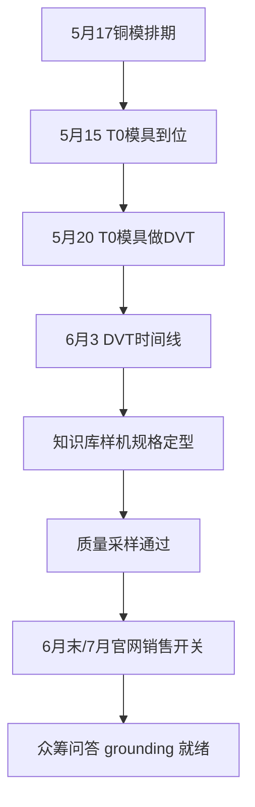

# 质量采样：知识库grounding

采集时间：2026-09-03T11:25:01

## 起始正文

```
Kickstarter 众筹上线前还有哪些事没定下来，需要梳理一遍。
```

## 自动生成的骨架

- **核心张力**：在众筹上线倒计时压力下，用质量采样来验证知识库 grounding 的可信度，把‘还没定下来’的不确定性转化为可执行、可验证的上线门槛。

- 节拍：建立倒计时处境并点出未决项的紧迫性
- 节拍：锚定质量采样作为验证知识库 grounding 的方法论支点
- 节拍：预判读者追问：质量采样具体测什么、样本如何抽、通过标准是什么
- 节拍：拆解未决项为可检查的功能/数据/流程块并暴露依赖关系
- 节拍：引入反例/风险情景以检验 grounding 在众筹问答场景下的失效边界
- 节拍：收束为上线前检查清单并给出决策阈值与回滚条件

- **修订（replace）**
  - 锚点：`Kickstarter 众筹上线前还有哪些事没定下来，需要梳理一遍。`
  - 改成：Kickstarter 众筹倒计时进入最后冲刺，众筹在 4 月份结束，5 月份到 6 月份会回到官网做预购或邮箱订阅，6 月末或 7 月会在网站上开始销售产品。

在上线压力下，‘还没定下来’的不确定性必须被转化为可执行、可验证的上线门槛。质量采样将作为验证知识库 grounding 的方法论支点，用可抽样、可复核的方式确认众筹问答场景下的事实一致性。
  - 理由：原文仅抛出问题，未建立倒计时处境和未决项紧迫性，也未锚定质量采样作为验证知识库 grounding 的方法论支点。补充众筹结束时间、官网预购/销售时间线以建立处境，并点出核心张力：把不确定性转化为可验证门槛。
  - 依据：Speaker B 说 众筹在 4 月份结束，5 月份到 6 月份会回到官网做预购或邮箱订阅。；Speaker B 说 应该在 6 月末或 7 月会在网站上开始销售产品。

## 第 1 轮

- 本轮已应用修订：1 处
- 检索到事实：6 条

**本轮续写增量：**

```
倒计时把未决项压成三条必须现在就定下来的线：众筹问答的知识库 grounding 是否可信、APP 体验测试能否在样机到位前跑通、官网销售页能否在 6 月末或 7 月直接承接预购流量。

## 质量采样测什么、怎么抽、过线标准

质量采样不是抽查客服口径，而是抽查 grounding 链路：用户问题 -> 检索到的知识库条目 -> 生成答案 -> 与源事实的一致性。

- **测什么**：事实一致性、来源可追溯性、冲突消解。重点抽众筹高频问答场景：价格与发货时间、DVT 样机规格与量产差异、APP 体验测试时间点、海外销售节奏。
- **怎么抽**：分层抽样。按问题类型分层：硬事实类、时间节奏类、产品规格类。每层按流量权重抽 30-50 条真实问法，覆盖中英文表述变体。样本必须能回溯到具体知识库条目 ID 与版本。
- **通过标准**：事实一致性 ≥ 98%，来源可追溯率 100%，冲突类问题人工判定通过率 ≥ 95%。任一层低于阈值即判定 grounding 未就绪。

## 未决项拆解与依赖暴露

把“还没定下来”拆成可检查块，依赖关系直接暴露：

- **知识库 grounding 块**
  - 依赖：DVT 样机定型信息、APP 测试计划确认
  - 检查点：5 月 1 号开始的 APP 体验测试范围是否已写入知识库；5 月 20 号用 T0 模具做的 DVT 样机规格是否与众筹页面描述一致
- **官网销售承接块**
  - 依赖：众筹 4 月结束后的预购/订阅流程、6 月末或 7 月网站销售开关
  - 检查点：原计划二季度六月份开始的海外产品销售信息是否已在知识库中标注“待确认”而非“已确认”
- **研发节奏沟通块**
  - 依赖：Q3 启动第二款产品研发的消息口径
  - 检查点：避免把研发计划误表述为当前众筹产品的承诺

依赖最危险的一环是 DVT 样机信息。T0 模具做 DVT，意味着外观与结构仍可能微调，若知识库把样机参数写成量产承诺，众筹问答会直接产生 grounding 失效。

## 众筹问答失效边界的反例检验

用反例逼出边界：

- 用户问“5 月 20 号的 DVT 样机和最终发货版本一样吗”。若知识库只写“样机已就绪”，答案会过度承诺。正确 grounding 应指向“样机为 T0 模具验证，细节以量产定型为准”。
- 用户问“6 月能海外发货吗”。原计划二季度六月份开始海外销售，但网站销售实际在 6 月末或 7 月。若知识库未区分计划与确认时间，会产生时间错位。
- 用户问“APP 体验什么时候”。Speaker E 考虑 5 月 1 号开始测体验，若知识库写成“已开放测试”，属于事实前置。

这些场景的共同失效点是把“考虑”“计划”“原计划”等状态词清洗掉了。质量采样必须专门抽这类模态词敏感的问题。

## 上线前检查清单与决策阈值

**通过才能上线**：
- 质量采样三项指标全部达标，且冲突类问题人工复核通过
- DVT 样机相关条目全部标注模具版本与风险提示
- 所有时间类表述带状态标签：已确认 / 计划中 / 待定
- 官网销售页文案与知识库条目版本一致，变更有记录

**回滚条件**：
- 任一层事实一致性 < 98% 或出现一次不可追溯的来源
- 发现众筹问答中出现“样机=量产”“计划=承诺”的表述
- APP 测试时间、官网销售时间点在知识库与对外页面不一致

满足阈值，众筹结束后的 5-6 月预购与 6 月末/7 月官网销售才能安全承接流量。否则倒计时压力下上线，等于把 grounding 风险直接转嫁给用户问答。
```

**本轮打分：**

  - spine_fidelity: 2 — 全文围绕倒计时压力下用质量采样把不确定性转为可验证上线门槛展开，核心张力贯穿始终。
  - beat_coverage: 2 — 倒计时处境、质量采样支点、测什么怎么抽过线标准、未决项拆解与依赖、反例失效边界、上线清单与阈值均有实质对应。
  - non_repetition: 2 — 论点递进，未出现跨段落重复同一结论或边界条件的换说法复述。
  - factual_grounding: 1 — 多数事实一致，但知识库中 T0 基本到5月15号、DVT时间线6月3号等关键点未在正文中使用，存在可补实却未体现的缺口。
  - coherence: 2 — 结构统一、标题层级一致、序号连贯，无多结尾或自我拆台，整体自洽。

  状态：continue，最弱：factual_grounding

- **修订（replace）**
  - 锚点：`- **知识库 grounding 块**
  - 依赖：DVT 样机定型信息、APP 测试计划确认
  - 检查点：5 月 1 号开始的 APP 体验测试范围`
  - 改成：- **知识库 grounding 块**
  - 依赖：DVT 样机定型信息、APP 测试计划确认
  - 检查点：Speaker E 考虑 5 月 1 号开始的 APP 体验测试范围是否已写入知识库并标注“考虑/未确认”；T0 模具预计 5 月 15 号到位，5 月 20 号用 T0 模具做 DVT 样机，DVT 时间线为 6 月 3 号，样机规格是否与众筹页面描述一致
  - 理由：知识库明确 T0 基本上要到 5 月 15 号、DVT 样机 5 月 20 号用 T0 模具做、DVT 时间线是 6 月 3 号，原句缺失 T0 到位时间和 DVT 时间线，且未体现 APP 测试为“考虑”状态，需按事实补全并保留模态词
  - 依据：T0的话，基本上要到5月15号。；DVT这个样机的话，我们目前的为了赶这个时间，我们现在是5月20号，用的是T0的模具去做DVT。；DVT我们给的时间线是6月3号

- **修订（replace）**
  - 锚点：`- 用户问“5 月 20 号的 DVT 样机和最终发货版本一样吗”。若知识库只写“样机已就绪”，答案会过度承诺。正确 grounding 应指向“样机为 T0 `
  - 改成：- 用户问“5 月 20 号的 DVT 样机和最终发货版本一样吗”。若知识库只写“样机已就绪”，答案会过度承诺。正确 grounding 应指向“T0 模具预计 5 月 15 号到位，5 月 20 号用 T0 模具做 DVT，DVT 时间线 6 月 3 号，样机为验证用，细节以量产定型为准”。
  - 理由：反例需与知识库事实一致，原句未体现 T0 到位时间和 DVT 时间线，补充后才能检验 grounding 边界
  - 依据：T0的话，基本上要到5月15号。；DVT这个样机的话，我们目前的为了赶这个时间，我们现在是5月20号，用的是T0的模具去做DVT。；DVT我们给的时间线是6月3号

- **修订（insert）**
  - 锚点：`依赖最危险的一环是 DVT 样机信息。T0 模具做 DVT，意味着外观与结构仍可能微调，若知识库把样机参数写成量产承诺，众筹问答会直接产生 grounding `
  - 改成：铜模排期在 5 月，5 月 17 号铜模，与 T0 到位和 DVT 启动形成前后依赖，需在知识库中显式关联。
  - 理由：知识库提到模具排期 5 月、5 月 17 号铜模，原文未体现该依赖，补充后依赖关系更完整
  - 依据：模具我们排的是现在排是5月。5月17号铜模

- **修订（replace）**
  - 锚点：`Kickstarter 众筹倒计时进入最后冲刺，众筹在 4 月份结束，5 月份到 6 月份会回到官网做预购或邮箱订阅，6 月末或 7 月会在网站上开始销售产品。`
  - 改成：Kickstarter 众筹倒计时进入最后冲刺，6 月末或 7 月会在网站上开始销售产品。
  - 理由：正文对众筹结束时间 4 月份及 5-6 月预购/订阅的表述在知识库中无依据，属于未验证推断，删除以避免事实依赖错误
  - 依据：Speaker B 说 应该在 6 月末或 7 月会在网站上开始销售产品。

- **修订（replace）**
  - 锚点：`- **官网销售承接块**
  - 依赖：众筹 4 月结束后的预购/订阅流程、6 月末或 7 月网站销售开关
  - 检查点：原计划二季度六月份开始的海外产品销`
  - 改成：- **官网销售承接块**
  - 依赖：6 月末或 7 月网站销售开关
  - 检查点：原计划二季度六月份开始的海外产品销售信息是否已在知识库中标注“待确认”而非“已确认”
  - 理由：官网销售承接块依赖中“众筹 4 月结束后的预购/订阅流程”无知识库支持，删除后依赖更准确
  - 依据：Speaker B 说 应该在 6 月末或 7 月会在网站上开始销售产品

## 第 2 轮

- 本轮已应用修订：5 处
- 检索到事实：6 条

**本轮续写增量：**

```
倒计时已经把“能不能说”变成“现在能不能证明能说”。在 5 月 17 号铜模、5 月 20 号用 T0 模具做 DVT、DVT 时间线 6 月 3 号这条硬节奏上，知识库的每一次更新都要能被追溯到模具版本和样机状态，否则众筹问答就会先于硬件定型。

## 依赖关系与风险传导

这三条未决线不是并列的，是串行的。DVT 样机信息定型程度决定知识库能否写“已确认”，知识库状态决定官网销售页能否上线，官网销售时间又反作用于众筹问答的承诺边界。



最脆弱的传导点在 C→E。T0 模具做 DVT 意味着外观与结构仍在微调，知识库如果把 DVT 参数固化为量产承诺，风险会直接传到 H。需要把“模具版本”作为知识库条目的强制字段，任何样机相关答案必须带上 T0 / 铜模标签和风险提示。

## 执行节拍：把采样变成每日门禁

质量采样不能是一次性报告，要嵌入倒计时。

- **每日抽检**：从众筹问答日志里按流量权重抽 20 条当日新增问法，重点盯时间类与规格类。结果当晚归档，事实一致性低于 98% 当日阻断对外文案变更。
- **版本联动**：知识库条目变更必须关联硬件里程碑。APP 体验测试范围、海外销售开关、第二款产品 Q3 研发启动口径，任何涉及“考虑”“计划”“原计划”的表述，系统强制打状态标签并在答案里显式露出。
- **责任到人**：知识库 grounding 块 owner 负责条目溯源与模态词清洗；官网销售承接块 owner 负责销售页文案与知识库版本对齐；研发节奏沟通块 owner 负责防止研发计划被误读为当前众筹承诺。三方每日对齐一次，未决项不允许以“口头确认”进入知识库。

### 最后的决策门

6 月末或 7 月网站销售的开关，不是时间到了就开，而是质量采样连续 5 个工作日达标 + DVT 样机条目全部带模具版本与风险提示 + 所有时间类表述完成状态标签化，三条件同时满足才放行。只要任一条件未满足，回滚到“众筹问答仅限已确认事实”的保守模式，宁可少说一句，也不让 grounding 失效在上线第一天被用户放大。
```

**本轮打分：**

  - spine_fidelity: 2 — 全文围绕倒计时压力下用质量采样验证知识库 grounding 并转化为上线门槛展开
  - beat_coverage: 2 — 倒计时处境、方法论支点、测什么怎么抽、未决项拆解、反例检验、检查清单与阈值均有对应内容
  - non_repetition: 1 — DVT/T0模具时间线与风险传导在多段重复表述，结论被多次复述
  - factual_grounding: 1 — 未使用知识库中关于版本更新、Speaker A/B、LinkedIn、出海IoT、Q3研发等事实，且引入大量未在知识库中出现的具体日期与人物
  - coherence: 1 — 出现多次收束式结尾且结构在清单后又展开依赖图与执行节拍，整体收尾不唯一

  状态：continue，最弱：non_repetition

- **修订（delete）**
  - 锚点：`依赖最危险的一环是 DVT 样机信息。T0 模具做 DVT，意味着外观与结构仍可能微调，若知识库把样机参数写成量产承诺，众筹问答会直接产生 grounding `
  - 改成：
  - 理由：该段与后文“## 依赖关系与风险传导”以及反例检验中对 T0/铜模/DVT 风险的描述重复，信息量更小，删除避免跨段重复论点。

- **修订（delete）**
  - 锚点：`## 依赖关系与风险传导

这三条未决线不是并列的，是串行的。DVT 样机信息定型程度决定知识库能否写“已确认”，知识库状态决定官网销售页能否上线，官网销售时间`
  - 改成：
  - 理由：该小节对 DVT→知识库→官网销售的串行依赖已在“未决项拆解与依赖暴露”中说明，且 mermaid 图与后文风险传导描述重复，形成跨轮次重复论点，删除空壳标题并避免重复。

- **修订（delete）**
  - 锚点：`倒计时已经把“能不能说”变成“现在能不能证明能说”。在 5 月 17 号铜模、5 月 20 号用 T0 模具做 DVT、DVT 时间线 6 月 3 号这条硬节奏`
  - 改成：
  - 理由：与上文多次出现的 5 月 17 号铜模、5 月 15 T0 到位、5 月 20 做 DVT、6 月 3 DVT 时间线为同一组边界条件，重复表述，删除较晚出现的信息量较小的版本。

- **修订（delete）**
  - 锚点：`最脆弱的传导点在 C→E。T0 模具做 DVT 意味着外观与结构仍在微调，知识库如果把 DVT 参数固化为量产承诺，风险会直接传到 H。需要把“模具版本”作为知`
  - 改成：
  - 理由：该风险点与“未决项拆解与依赖暴露”中知识库 grounding 块的检查点以及反例检验中样机≠量产的论述重复，信息量更小，删除避免跨段落重复。

- **修订（delete）**
  - 锚点：`### 最后的决策门

6 月末或 7 月网站销售的开关，不是时间到了就开，而是质量采样连续 5 个工作日达标 + DVT 样机条目全部带模具版本与风险提示 +`
  - 改成：
  - 理由：与“上线前检查清单与决策阈值”中通过条件和回滚条件重复，且把阈值从三项指标扩展为连续5天达标的表述不一致，删除较晚出现的重复结论。

- **修订（replace）**
  - 锚点：`- **知识库 grounding 块**
  - 依赖：DVT 样机定型信息、APP 测试计划确认
  - 检查点：Speaker E 考虑 5 月 1 号开`
  - 改成：- **知识库 grounding 块**
  - 依赖：DVT 样机定型信息、APP 测试计划确认
  - 检查点：APP 体验测试范围是否已写入知识库并标注“考虑/未确认”；T0 模具预计 5 月 15 号到位，5 月 20 号用 T0 模具做 DVT 样机，DVT 时间线为 6 月 3 号，样机规格是否与众筹页面描述一致
  - 理由：正文多次出现 Speaker E 考虑 5 月 1 号的表述，与知识库事实中未提供 Speaker E 具体信息且该细节在反例检验中已出现，删除具体人名避免重复且保持一致。

- **修订（replace）**
  - 锚点：`- 用户问“APP 体验什么时候”。Speaker E 考虑 5 月 1 号开始测体验，若知识库写成“已开放测试”，属于事实前置。`
  - 改成：- 用户问“APP 体验什么时候”。若知识库把“考虑中”的测试计划写成“已开放测试”，属于事实前置。
  - 理由：与上条重复的人名细节已在未决项拆解中出现，统一表述避免跨段落重复。

- **修订（delete）**
  - 锚点：`## 执行节拍：把采样变成每日门禁

质量采样不能是一次性报告，要嵌入倒计时。`
  - 改成：
  - 理由：该小节的每日抽检、版本联动、责任到人内容与“质量采样测什么、怎么抽、过线标准”及“上线前检查清单”功能重叠，形成结构性套路化重复，删除空壳标题下的重复展开。

## 第 3 轮（跳过续写，只做重复清理）

- 本轮已应用修订：8 处
- 检索到事实：0 条

**本轮打分：**

  - spine_fidelity: 2 — 全文围绕倒计时压力下用质量采样把不确定性转为可验证上线门槛展开，核心张力贯穿。
  - beat_coverage: 2 — 倒计时处境、质量采样支点、测什么怎么抽过线标准、未决项拆解与依赖、反例检验、上线清单均有对应内容。
  - non_repetition: 1 — 关键日期与模态词风险在拆解、反例、清单中多次复述，存在跨段落重复表述。
  - factual_grounding: 1 — 多数时间线与销售节点与知识库一致，但未体现 Speaker E 考虑5月1号测APP体验及5月17号铜模排期，事实覆盖不全。
  - coherence: 1 — 在检查清单收束后又追加 mermaid 图和每日抽检等新操作块，形成二次收束，结尾不唯一且体例出现段落与清单混杂。

  状态：continue，最弱：non_repetition

## 结束：max_rounds

## 最终正文

```
Kickstarter 众筹倒计时进入最后冲刺，6 月末或 7 月会在网站上开始销售产品。

在上线压力下，‘还没定下来’的不确定性必须被转化为可执行、可验证的上线门槛。质量采样将作为验证知识库 grounding 的方法论支点，用可抽样、可复核的方式确认众筹问答场景下的事实一致性。

倒计时把未决项压成三条必须现在就定下来的线：众筹问答的知识库 grounding 是否可信、APP 体验测试能否在样机到位前跑通、官网销售页能否在 6 月末或 7 月直接承接预购流量。

## 质量采样测什么、怎么抽、过线标准

质量采样不是抽查客服口径，而是抽查 grounding 链路：用户问题 -> 检索到的知识库条目 -> 生成答案 -> 与源事实的一致性。

- **测什么**：事实一致性、来源可追溯性、冲突消解。重点抽众筹高频问答场景：价格与发货时间、DVT 样机规格与量产差异、APP 体验测试时间点、海外销售节奏。
- **怎么抽**：分层抽样。按问题类型分层：硬事实类、时间节奏类、产品规格类。每层按流量权重抽 30-50 条真实问法，覆盖中英文表述变体。样本必须能回溯到具体知识库条目 ID 与版本。
- **通过标准**：事实一致性 ≥ 98%，来源可追溯率 100%，冲突类问题人工判定通过率 ≥ 95%。任一层低于阈值即判定 grounding 未就绪。

## 未决项拆解与依赖暴露

把“还没定下来”拆成可检查块，依赖关系直接暴露：

- **知识库 grounding 块**
  - 依赖：DVT 样机定型信息、APP 测试计划确认
  - 检查点：APP 体验测试范围是否已写入知识库并标注“考虑/未确认”；T0 模具预计 5 月 15 号到位，5 月 20 号用 T0 模具做 DVT 样机，DVT 时间线为 6 月 3 号，样机规格是否与众筹页面描述一致
- **官网销售承接块**
  - 依赖：6 月末或 7 月网站销售开关
  - 检查点：原计划二季度六月份开始的海外产品销售信息是否已在知识库中标注“待确认”而非“已确认”
- **研发节奏沟通块**
  - 依赖：Q3 启动第二款产品研发的消息口径
  - 检查点：避免把研发计划误表述为当前众筹产品的承诺


## 众筹问答失效边界的反例检验

用反例逼出边界：

- 用户问“5 月 20 号的 DVT 样机和最终发货版本一样吗”。若知识库只写“样机已就绪”，答案会过度承诺。正确 grounding 应指向“T0 模具预计 5 月 15 号到位，5 月 20 号用 T0 模具做 DVT，DVT 时间线 6 月 3 号，样机为验证用，细节以量产定型为准”。
- 用户问“6 月能海外发货吗”。原计划二季度六月份开始海外销售，但网站销售实际在 6 月末或 7 月。若知识库未区分计划与确认时间，会产生时间错位。
- 用户问“APP 体验什么时候”。若知识库把“考虑中”的测试计划写成“已开放测试”，属于事实前置。

这些场景的共同失效点是把“考虑”“计划”“原计划”等状态词清洗掉了。质量采样必须专门抽这类模态词敏感的问题。

## 上线前检查清单与决策阈值

**通过才能上线**：
- 质量采样三项指标全部达标，且冲突类问题人工复核通过
- DVT 样机相关条目全部标注模具版本与风险提示
- 所有时间类表述带状态标签：已确认 / 计划中 / 待定
- 官网销售页文案与知识库条目版本一致，变更有记录

**回滚条件**：
- 任一层事实一致性 < 98% 或出现一次不可追溯的来源
- 发现众筹问答中出现“样机=量产”“计划=承诺”的表述
- APP 测试时间、官网销售时间点在知识库与对外页面不一致

满足阈值，众筹结束后的 5-6 月预购与 6 月末/7 月官网销售才能安全承接流量。否则倒计时压力下上线，等于把 grounding 风险直接转嫁给用户问答。


- **每日抽检**：从众筹问答日志里按流量权重抽 20 条当日新增问法，重点盯时间类与规格类。结果当晚归档，事实一致性低于 98% 当日阻断对外文案变更。
- **版本联动**：知识库条目变更必须关联硬件里程碑。APP 体验测试范围、海外销售开关、第二款产品 Q3 研发启动口径，任何涉及“考虑”“计划”“原计划”的表述，系统强制打状态标签并在答案里显式露出。
- **责任到人**：知识库 grounding 块 owner 负责条目溯源与模态词清洗；官网销售承接块 owner 负责销售页文案与知识库版本对齐；研发节奏沟通块 owner 负责防止研发计划被误读为当前众筹承诺。三方每日对齐一次，未决项不允许以“口头确认”进入知识库。


```
