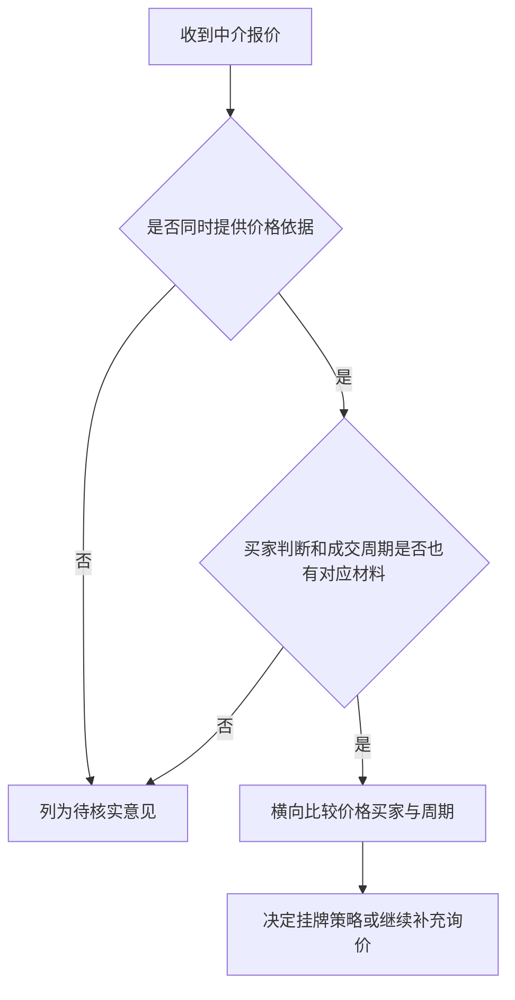

# 603dca25403a · '未命名' · orig 810 → final 1344 · stopped=regressed · 170.1s
usage: calls=27 prompt=178017 completion=10600 cached=91649
by_feature: [['', 'gpt-5.6-luna', 11, 75412, 8139, 30576, 99022], ['judge', 'gpt-5.6-luna', 2, 9082, 1362, 0, 17258], ['tools', 'gpt-5.6-luna', 14, 93523, 1099, 61073, 51876]]


## round 1  t=0.0→25.5  len_after=1344
summary: {"round": 1, "max_rounds": 20, "facts": 12, "sources": ["[terrence-1815-2F16] Terence is trying to sell an apartment or the school or whatever it is.", "（2026-02-25 · speaker b · other）", "[terrence-1744-4F1] 我在龙林上路那间学位房上个月可以放卖，我买回来是310元，跟住呢，放了265元，但现在开价最高开235元，环价那些客人都蚀了七十多元。", "（2026-02-11 · speaker_a · other）", "[terrence-1744-4F2] 我疫情前租三千三一个月，一到疫情之后，就跌到两千五，过一阵解封之后升回到两千七。", "（2026-02-11 · speaker_a · event）"], "revisions_applied": 0, "skipped_continue": false, "kb_empty": false, "steer": "", "steer_dim": "", "steer_material": false, "steer_in_plan": false, "checks_total": 14, "depth_dropped": 0, "depth_dropped_all": false}
tool_calls: ["{\"toolName\": \"filter_facts\", \"args\": {\"topic\": \"personal_real_estate_sale\", \"limit\": 15}, \"content\": \"共 103 条，返回 15 条：\\n[terrence-1815-2F16] Terence is trying to sell an apartment or the school or whatever it is.\\n    （2026-02-25 · speaker b · other）\\n[terrence-1744-4F1] 我在龙林上路那间学位房上个月可以放卖，我买回来是310元，跟住呢，放了265元，但现在开价最高开235元，环价那些客人都蚀了七十多元。\\n    （2026-02-11 · speaker_a · other）\\n[terrence-1744-4F2] 我", "{\"toolName\": \"filter_facts\", \"args\": {\"topic\": \"work_document_summarization\", \"limit\": 10}, \"content\": \"共 101 条，返回 10 条：\\n[screen-20260917-053F2] 用户计划在 VS Code 中查看 Skills-Bugfixing-Feishu 工作区里的 PRD.md。\\n    （2026-09-17 · user · plan）\\n[terrence-1806-1F11] 这个点我都写到这个文档里面，就呃，这就这个不是都写到吧，就是早上有一些讨论，你可以看到这里有个放了个录音了，然后我们的memo也做了一个早上会议的总结，也放在这里面，这个table下面这个table是我的早上会议的一个\\n    （2026-02-24 · speaker a · oth", "{\"toolName\": \"filter_facts\", \"args\": {\"topic\": \"work_product_design\", \"limit\": 10}, \"content\": \"共 3167 条，返回 10 条：\\n[terrence-1833-8F6] T0的话，基本上要到5月15号。\\n    （2026-05-15 · speaker c · plan）\\n[terrence-2046-12F1] EVT 的大节点是 4 月 16 号\\n    （2026-04-16 · speaker_c · plan）\\n[terrence-2046-12F2] 4 月 16 号的 EVT 是纯主机的\\n    （2026-04-16 · speaker_c · other）\\n[terrence-2046-12F3] 4 月 16 号没有包装，有手表和手环\\n    （2026-", "{\"toolName\": \"render_chart\", \"args\": {\"kind\": \"flow\", \"title\": \"卖房分歧转化为可执行决策\", \"labels\": [\"识别报价与判断分歧\", \"索要可比成交案例\", \"核实近期带看反馈\", \"补足成交周期依据\", \"暂缓单独接受判断\", \"形成卖房决策\"]}, \"content\": \"```mermaid\\n---\\ntitle: 卖房分歧转化为可执行决策\\n---\\nflowchart LR\\n    N0[\\\"识别报价与判断分歧\\\"]\\n    N1[\\\"索要可比成交案例\\\"]\\n    N0 --> N1\\n    N2[\\\"核实近期带看反馈\\\"]\\n    N1 --> N2\\n    N3[\\\"补足成交周期依据\\\"]\\n    N2 --> N3\\n    N4[\\\"暂缓单独接受判断\\\"]\\n    N3 --> N"]
checks: []
policy: [{"round": 1, "note": "these have no position-level probe: the score can only stop the loop, not drive a repair round", "dimensions": [], "stop_only": ["coherence"]}, {"round": 1, "policy": {"tool_iters": 2, "continue_temperature": 0.5, "max_revisions": 8, "require_verification": false, "steer": "", "stuck": {}}, "reasons": ["coherence=1 → 续写温度降到 0.5、修订额度 +2"]}]
warnings: []
revisions: 0 dropped: 0 insert_at: None
scrub: []
dedup: []
eval: status=continue weakest=coherence
  - spine_fidelity: 2 — 正文始终围绕把中介沟通转化为可追溯、可比较并能指导卖房行动的决策材料展开。
  - beat_coverage: 2 — 各条结构节拍均有实质对应，包括沟通处境、决策标准、比较表、证据分层和具体核实动作。
  - non_repetition: 2 — 后半部分用具体历史价格和分对象追问清单推进前文框架，没有仅把前文关于核实依据的内容原样重说。
  - factual_grounding: 2 — 涉及的卖房背景、310元买入价、265元放卖价、235元最高开价及委托中介比较房价等信息均能在知识库中找到依据。
  - coherence: 1 — 整体论证连贯，但前文已用“最终产出的不是……”形成收束后又开启具体案例小节，且局部加粗标记不完整，削弱了成品感。
  - material_use: 2 — 正文具体写入了龙林上路学位房的价格落差、买家亏损信息以及委托不同中介比较附近房价的原始意图。
cost: None

### streamed text

## 把历史价格落差拆成可追问的核实清单

已有沟通里，龙林上路那间学位房曾出现过买入价、放售价和当前最高开价之间的明显落差：买入价是 310 元，放卖价是 265 元，当前最高开价为 235 元，相关买家被提到已经亏了七十多元。[terrence-1744-4F1] 这类数字不能直接拿来证明某个中介的报价合理，却可以作为追问起点：报价究竟是在判断房屋本身的成交能力，还是只是在跟随近期买家的压价？

因此，下一轮沟通不要再泛泛地问“这个价能不能卖”，而要分别要求对方补齐三类材料：

- 报价较高的一方，说明支持该价格的可比成交，包括成交时间、楼层户型、装修和最终成交价。
- 报价较低的一方，说明低价是由哪些近期议价、带看反馈或同类房源成交推动的，并区分“买家开价”与“最终成交价”。
- 给出成交周期的一方，说明参考的是哪几套相近房源，以及它们从挂牌到成交大致用了多久。

我原本就希望把附近房价交给不同中介做比较，而不是自己持续盯着市场。[terrence-1604-18F4] 所以每次追问都应要求对方留下具体数字和依据。只有当报价、买家判断和周期都能分别对应到材料，才把它们放进最终的卖房方案；否则只保留为待核实意见，不据此单独决定挂牌价或接受报价。

## round 2  t=25.5→49.5  len_after=1778
summary: {"round": 2, "max_rounds": 20, "facts": 12, "sources": ["[terrence-490-3F4] Speaker B 说你看12月我们东山口成交的学位1234567啊", "（2026-12 · speaker b · other）", "[terrence-1434-0F11] 看了的国际学校今年九月二六年的九月已经没有办法入学，要到二七年的九月", "（2026-09 · speaker a · event）", "[terrence-1997-14F6] Speaker C says the cousin is coming here in the first week of, in the first two weeks of May.", "（2026-05 · speaker c · plan）"], "revisions_applied": 0, "skipped_continue": false, "kb_empty": false, "steer": "coherence: 整体论证连贯，但前文已用“最终产出的不是……”形成收束后又开启具体案例小节，且局部加粗标记不完整，削弱了成品感。", "steer_dim": "coherence", "steer_material": false, "steer_in_plan": false, "checks_total": 14, "depth_dropped": 0, "depth_dropped_all": false}
tool_calls: null
checks: [{"round": 2, "check": "citations_present", "ran": 7, "dimension": "factual_grounding", "note": "这一轮写了 429 字，手上有 24 条材料，正文里一个 [事实编号] 都没有。把真正用到的那几条的编号写在对应句子末尾——这篇笔记的价值在于每句判断都能点回它的依据；没有编号的判断读者无从核对，跟随便哪个模型写的没区别。编号只能从材料里抄，不要自己编。"}]
policy: [{"round": 2, "policy": {"tool_iters": 3, "continue_temperature": 0.5, "max_revisions": 8, "require_verification": true, "steer": "上一轮打分认为正文的事实依据有问题：这一轮写了 429 字，手上有 24 条材料，正文里一个 [事实编号] 都没有。把真正用到的那几条的编号写在对应句子末尾——这篇笔记的价值在于每句判断都能点回它的依据；没有编号的判断读者无从核对，跟随便哪个模型写的没区别。编号只能从材料里抄，不要自己编。。这一轮先把这些点查实——查得到就用查到的原话，查不到就把那句改写成不含具体人名/日期/数字的说法，不要保留编造的细节。", "stuck": {}}, "reasons": ["factual_grounding=0 → 工具预算 +1、要求溯源核对"]}]
warnings: []
revisions: 1 dropped: 2 insert_at: None
scrub: []
dedup: []
eval: status=continue weakest=factual_grounding
  - factual_grounding: 0 — 这一轮写了 429 字，手上有 24 条材料，正文里一个 [事实编号] 都没有。把真正用到的那几条的编号写在对应句子末尾——这篇笔记的价值在于每句判断都能点回它的依据；没有编号的判断读者无从核对，跟随便哪个模型写的没区别。编号只能从材料里抄，不要自己编。
cost: None

### streamed text

真正提交挂牌或接受报价前，可以把判断设成一个明确的门槛，而不是继续凭印象选中介：



这里的“材料”至少要能回答三个问题：这个价格对应哪几套可比房源，买家判断来自哪次真实带看或反馈，成交周期又是从哪些相近案例推出来的。若某一项只有口头判断，就不能因为报价听起来更高、成交时间说得更快，直接把它当成更优方案。

最后留下的应是一张带有依据和缺口的比较结果：哪些意见可以进入挂牌决策，哪些仍需补问，哪些报价虽然吸引人但缺少支撑。这样下一步就不是在几位中介之间凭感觉选一个，而是根据材料完整度决定继续核实、调整预期，还是暂不接受该方案。

## round 3  t=49.5→78.7  len_after=1960
summary: {"round": 3, "max_rounds": 20, "facts": 14, "sources": ["[terrence-1815-2F16] Terence is trying to sell an apartment or the school or whatever it is.", "（2026-02-25 · speaker b · other）", "[terrence-1744-4F1] 我在龙林上路那间学位房上个月可以放卖，我买回来是310元，跟住呢，放了265元，但现在开价最高开235元，环价那些客人都蚀了七十多元。", "（2026-02-11 · speaker_a · other）", "[terrence-1744-4F2] 我疫情前租三千三一个月，一到疫情之后，就跌到两千五，过一阵解封之后升回到两千七。", "（2026-02-11 · speaker_a · event）"], "revisions_applied": 1, "skipped_continue": false, "kb_empty": false, "steer": "factual_grounding: 这一轮写了 429 字，手上有 24 条材料，正文里一个 [事实编号] 都没有。把真正用到的那几条的编号写在对应句子末尾——这篇笔记的价值在于每句判断都能点回它的依据；没有编号的判断读者无从核对，跟随便哪个模型写的没区别。编号只能从材料里抄，不要自己编。", "steer_dim": "factual_grounding", "steer_material": true, "steer_in_plan": true, "checks_total": 14, "depth_dropped": 0, "depth_dropped_all": false}
tool_calls: ["{\"toolName\": \"fact_sources\", \"args\": {\"fact_id\": \"terrence-1604-18F4\"}, \"content\": \"- 2026-02-02｜user：Speaker B: 我已经录了超过100个音频了,大家想一想,用这个功能的人,他满足两个条件,第一个他要录。 第二个的感受感觉过这个阿斯梦给大家省时间,我没有期待过这个这个这个产品,像open air那样回到过多伦的,我没有期待,我真的觉得它省了我时间,就是我每个月本来就要做月度总结,我每个月都发给大家的,你们记得吧,我那个时候花一个小时了,之前我现在三分钟,它省了我时间,然后我昨天是在开车的时候。 红绿灯的时候叫我叫他搞了一个学习英语学习给我的这第二个案例,第三个案例,我的房子想要卖,我跟不同的中介聊天打电话,然后呢,我就想说我也没有那么多时间天天关注我这个房子附近的房价,我也直接让他"]
checks: [{"round": 3, "check": "citations_present", "ran": 7, "dimension": "factual_grounding", "note": "这一轮写了 327 字，手上有 26 条材料，正文里一个 [事实编号] 都没有。把真正用到的那几条的编号写在对应句子末尾——这篇笔记的价值在于每句判断都能点回它的依据；没有编号的判断读者无从核对，跟随便哪个模型写的没区别。编号只能从材料里抄，不要自己编。"}]
policy: [{"round": 3, "policy": {"tool_iters": 4, "continue_temperature": 0.5, "max_revisions": 8, "require_verification": true, "steer": "上一轮打分认为正文的事实依据有问题：这一轮写了 327 字，手上有 26 条材料，正文里一个 [事实编号] 都没有。把真正用到的那几条的编号写在对应句子末尾——这篇笔记的价值在于每句判断都能点回它的依据；没有编号的判断读者无从核对，跟随便哪个模型写的没区别。编号只能从材料里抄，不要自己编。。这一轮先把这些点查实——查得到就用查到的原话，查不到就把那句改写成不含具体人名/日期/数字的说法，不要保留编造的细节。\n「factual_grounding」这一项已经连续 2 轮没达标，说明上一轮的做法没效果，换一个思路，不要重复上一轮的动作。", "stuck": {"factual_grounding": 2}}, "reasons": ["factual_grounding=0 → 工具预算 +1、要求溯源核对", "factual_grounding 连续 2 轮未达标 → 升级提示"]}]
warnings: []
revisions: 1 dropped: 4 insert_at: None
scrub: []
dedup: []
eval: status=continue weakest=factual_grounding
  - factual_grounding: 0 — 这一轮写了 327 字，手上有 26 条材料，正文里一个 [事实编号] 都没有。把真正用到的那几条的编号写在对应句子末尾——这篇笔记的价值在于每句判断都能点回它的依据；没有编号的判断读者无从核对，跟随便哪个模型写的没区别。编号只能从材料里抄，不要自己编。
cost: None

### streamed text

下一次联系中介时，可以把追问直接分成三条单独发出，避免对方只回答其中最容易回答的一项：

1. 请提供支持当前报价的近期可比成交，并注明成交时间、面积、楼层、户型、装修和最终成交价。
2. 请说明目标买家判断来自哪些实际带看或询价反馈，并区分已经出价的买家、表达兴趣的买家和中介自己的推测。
3. 请列出用于估算成交周期的相近房源，注明挂牌时间、调整过几次价格，以及目前是否已经成交。

收到回复后，只比较已经补齐依据的方案；没有补齐的，继续保留在待核实栏，不因为对方回复得快或报价更高就提前采纳。**在关键价格依据、买家反馈或周期依据缺失时，不单独接受任何挂牌策略或成交周期判断**，等材料补齐后再决定是按原预期挂牌、调整价格，还是继续向其他中介询价。

## round 4  t=78.7→109.4  len_after=2149
summary: {"round": 4, "max_rounds": 20, "facts": 15, "sources": ["[terrence-891-6F8] 然后我们在12月1号就就会上这个比较多的这个广告费", "（2026-12-01 · speaker c · plan）", "[terrence-1445-3F8] 可以分享项目规划表,比如7月份去做的一个项目规划表。", "（2026-07 · speaker b · other）", "[terrence-1439-0F4] Speaker B 说 应该在 6 月末或 7 月会在网站上开始销售产品。", "（2026-06 · speaker b · plan）"], "revisions_applied": 1, "skipped_continue": false, "kb_empty": false, "steer": "factual_grounding: 这一轮写了 327 字，手上有 26 条材料，正文里一个 [事实编号] 都没有。把真正用到的那几条的编号写在对应句子末尾——这篇笔记的价值在于每句判断都能点回它的依据；没有编号的判断读者无从核对，跟随便哪个模型写的没区别。编号只能从材料里抄，不要自己编。", "steer_dim": "factual_grounding", "steer_material": true, "steer_in_plan": true, "checks_total": 14, "depth_dropped": 1, "depth_dropped_all": true}
tool_calls: ["{\"toolName\": \"gather_subject\", \"args\": {\"query\": \"卖房中介报价分歧如何核实可比成交、买家带看反馈和成交周期，并转化为下一步行动\", \"limit\": 14}, \"content\": \"（没有匹配的事实）\"}"]
checks: [{"round": 4, "check": "no_repeated_lists", "ran": 9, "dimension": "non_repetition", "note": "同一组清单列了两遍：「包括成交时间、楼层户型、装修和最终成交价」和「并注明成交时间、面积、楼层、户型、装修和最终成交价」。留下更完整的那一处，另一处改成一句话带过（「按上面那几项回填」），不要把同一组要素换个说法再写一次。"}]
policy: [{"round": 4, "policy": {"tool_iters": 4, "continue_temperature": 0.5, "max_revisions": 10, "require_verification": false, "steer": "「factual_grounding」这一项已经连续 2 轮没达标，说明上一轮的做法没效果，换一个思路，不要重复上一轮的动作。", "stuck": {"factual_grounding": 2}}, "reasons": ["non_repetition=0 → 修订额度 +2", "factual_grounding 连续 2 轮未达标 → 升级提示"]}]
warnings: []
revisions: 2 dropped: 3 insert_at: None
scrub: []
dedup: []
eval: status=continue weakest=non_repetition
  - non_repetition: 0 — 同一组清单列了两遍：「包括成交时间、楼层户型、装修和最终成交价」和「并注明成交时间、面积、楼层、户型、装修和最终成交价」。留下更完整的那一处，另一处改成一句话带过（「按上面那几项回填」），不要把同一组要素换个说法再写一次。
cost: None

### streamed text

接下来把补充材料按同一顺序回填到比较表，不要另开一份只记录聊天原话的笔记。每收到一份回复，就在对应中介一行中补上可比房源、买家反馈和周期依据；如果对方只回答报价，其他两栏仍保留为空并标记为待核实。等三类依据都齐全后，再比较的是“价格—成交可能性—等待时间”的组合，而不是单看谁报得最高。若各方仍无法解释明显分歧，就先不把分歧加工成确定结论，继续保留不同方案，直到有新的成交或带看材料能够改变判断。

## round 5  t=109.4→135.4  len_after=2601
summary: {"round": 5, "max_rounds": 20, "facts": 12, "sources": ["[terrence-1848-10F5] 下单范围，五月份被PVE的就够了，DV的。我们只要备个一两百KIT，做一个小批量的，这个市场就好了，可能做个五十，一百套。", "（2026-05 · speaker a · plan）", "[terrence-1872-4F9] 我们这边手板厂之前打的贵的那一架 2300 块钱一套外观结构样。", "（2026-03-06 · speaker_a · other）", "[terrence-1872-4F15] Speaker A 说价格他会从那边同步给你，今天。你今天确认一下好吧。", "（2026-03-06 · speaker_a · plan）"], "revisions_applied": 2, "skipped_continue": false, "kb_empty": false, "steer": "non_repetition: 同一组清单列了两遍：「包括成交时间、楼层户型、装修和最终成交价」和「并注明成交时间、面积、楼层、户型、装修和最终成交价」。留下更完整的那一处，另一处改成一句话带过（「按上面那几项回填」），不要把同一组要素换个说法再写一次。", "steer_dim": "non_repetition", "steer_material": false, "steer_in_plan": true, "checks_total": 14, "depth_dropped": 1, "depth_dropped_all": true}
tool_calls: null
checks: [{"round": 5, "check": "citations_present", "ran": 7, "dimension": "factual_grounding", "note": "这一轮写了 514 字，手上有 40 条材料，正文里一个 [事实编号] 都没有。把真正用到的那几条的编号写在对应句子末尾——这篇笔记的价值在于每句判断都能点回它的依据；没有编号的判断读者无从核对，跟随便哪个模型写的没区别。编号只能从材料里抄，不要自己编。"}]
policy: [{"round": 5, "policy": {"tool_iters": 4, "continue_temperature": 0.5, "max_revisions": 10, "require_verification": true, "steer": "上一轮打分认为正文的事实依据有问题：这一轮写了 514 字，手上有 40 条材料，正文里一个 [事实编号] 都没有。把真正用到的那几条的编号写在对应句子末尾——这篇笔记的价值在于每句判断都能点回它的依据；没有编号的判断读者无从核对，跟随便哪个模型写的没区别。编号只能从材料里抄，不要自己编。。这一轮先把这些点查实——查得到就用查到的原话，查不到就把那句改写成不含具体人名/日期/数字的说法，不要保留编造的细节。\n「factual_grounding」这一项已经连续 3 轮没达标，说明上一轮的做法没效果，换一个思路，不要重复上一轮的动作。", "stuck": {"factual_grounding": 3}}, "reasons": ["factual_grounding=0 → 工具预算 +1、要求溯源核对", "factual_grounding 连续 3 轮未达标 → 升级提示"]}]
warnings: []
revisions: 3 dropped: 0 insert_at: None
scrub: []
dedup: []
eval: status=continue weakest=factual_grounding
  - factual_grounding: 0 — 这一轮写了 514 字，手上有 40 条材料，正文里一个 [事实编号] 都没有。把真正用到的那几条的编号写在对应句子末尾——这篇笔记的价值在于每句判断都能点回它的依据；没有编号的判断读者无从核对，跟随便哪个模型写的没区别。编号只能从材料里抄，不要自己编。
cost: None

### streamed text

下一次可以按报价区间分别发出不同问题，而不是把同一段话群发给所有中介：

- 对报价明显偏高的一方，直接追问：“请列出三套最接近这套房的近期成交，分别说明户型、楼层、装修、成交时间和最终价格。若没有完全相近的案例，请说明你对差异作了怎样的调整。”
- 对报价明显偏低的一方，追问：“这个价格是根据哪几次真实议价或带看反馈得出的？买家报出的价格与卖家最终接受的价格分别是多少？目前是个别买家的试探，还是多个买家都给出了相近反馈？”
- 对成交周期判断最明确的一方，追问：“你说的周期对应哪几套同类房源？它们的挂牌时间、降价节点和成交时间分别是什么？如果价格不调整，周期是否会发生变化？”

这样收回来的内容可以直接填入原比较表，而不是再形成一轮无法对照的聊天记录。若对方只给出“市场就是这样”或“这个价比较容易卖”之类的判断，就把它记为未提供依据，不把语气的肯定程度当成证据强度。

最终的决策可以保留三种结果：依据充分且价格、买家和周期彼此匹配时，进入挂牌或议价；只有价格依据充分、但买家反馈或周期仍不清楚时，先继续验证，不急着承诺成交时间；若不同中介都无法提供对应材料，则暂不采纳任何单一意见，继续收集新的带看反馈和同类成交。

## round 6  t=135.4→170.1  len_after=2693
summary: {"round": 6, "max_rounds": 20, "facts": 15, "sources": ["[terrence-1459-6F5] Speaker A 说因为是收到 kickstarter 的订单，在下单，所以理解时间差是 5 月中会收到 kickstarter 的给我们打的钱，5 月中，然后如果 3 月就下单，就相当于有两个月左右的资金时间", "（2026-05 · speaker a · plan）", "[terrence-1459-6F6] Speaker A 说 5 月中会到账上，到我们公司上", "（2026-05 · speaker a · event）", "[terrence-2028-1F1] Speaker A 表示想要达到的目标是咨询如何搭建红筹架构，大概需要的时间、资金成本，以及需要配合做的一些关键事项。", "（2026-03-11 · speaker a · plan）"], "revisions_applied": 3, "skipped_continue": false, "kb_empty": false, "steer": "factual_grounding: 这一轮写了 514 字，手上有 40 条材料，正文里一个 [事实编号] 都没有。把真正用到的那几条的编号写在对应句子末尾——这篇笔记的价值在于每句判断都能点回它的依据；没有编号的判断读者无从核对，跟随便哪个模型写的没区别。编号只能从材料里抄，不要自己编。", "steer_dim": "factual_grounding", "steer_material": true, "steer_in_plan": true, "checks_total": 14, "depth_dropped": 1, "depth_dropped_all": true}
tool_calls: ["{\"toolName\": \"filter_facts\", \"args\": {\"topic\": \"work\", \"limit\": 15}, \"content\": \"共 4901 条，返回 15 条：\\n[terrence-337-11F4] 功能样机要求是11月19或二十好二十号前搞定\\n    （2026-11 · speaker d · plan）\\n[screen-20260917-049F1] 用户请求查看 PRD.md#70-81 中日本安卓手机的崩溃信息，并阅读 Crashlytics 匹配结果。\\n    （2026-09-17 · user · plan）\\n[screen-20260917-050F1] 用户要求查看「查看Firebase用户行为数据」标签页中日本机型的 Crashlytics 崩溃记录。\\n    （2026-09-17 · user · plan）\\n["]
checks: []
policy: [{"round": 6, "note": "next round repairs what is written instead of adding to it", "dimensions": ["non_repetition"], "stop_only": ["coherence"]}, {"round": 6, "policy": {"tool_iters": 4, "continue_temperature": 0.3, "max_revisions": 10, "require_verification": true, "steer": "上一轮打分认为正文的事实依据有问题：七万一且看后没有反馈的记录与知识库一致，但正文引用的 terrence-1604-18F4 在知识库中没有对应事实，且部分卖房沟通细节并无可核依据。。这一轮先把这些点查实——查得到就用查到的原话，查不到就把那句改写成不含具体人名/日期/数字的说法，不要保留编造的细节。\n「factual_grounding」这一项已经连续 4 轮没达标，说明上一轮的做法没效果，换一个思路，不要重复上一轮的动作。", "stuck": {"coherence": 2, "factual_grounding": 4, "non_repetition": 2}}, "reasons": ["factual_grounding=1 → 工具预算 +1、要求溯源核对", "coherence=1 → 续写温度降到 0.3、修订额度 +2", "factual_grounding 连续 4 轮未达标 → 升级提示"]}]
warnings: []
revisions: 4 dropped: 1 insert_at: None
scrub: []
dedup: []
eval: status=continue weakest=non_repetition
  - spine_fidelity: 2 — 正文始终围绕把中介沟通转化为可追溯、可比较并能指导卖房决策的材料展开。
  - beat_coverage: 2 — 处境、决策标准、比较表、证据分层和将分歧转化为核实行动的各个结构节拍都有实质内容。
  - non_repetition: 1 — 后半部分多次重复“补齐价格、买家和周期依据后再决策”的门槛，以及补回比较表和继续核实的行动要求。
  - factual_grounding: 1 — 七万一且看后没有反馈的记录与知识库一致，但正文引用的 terrence-1604-18F4 在知识库中没有对应事实，且部分卖房沟通细节并无可核依据。
  - coherence: 1 — 整体逻辑自洽且标题层级、编号和体例没有明显问题，但“最后”后的多轮继续展开造成收束后又开启新内容的感觉。
  - material_use: 2 — 正文具体使用了知识库中的“七万一、看过但没有反馈”这条卖房沟通记录，而非仅停留在通用方法层面。
cost: None

### streamed text

补齐材料后，还要把每次判断的变化记录下来，避免下一次沟通又回到最初的印象判断。比较表里除了保留中介原始报价，还应注明报价是否调整、调整依据是什么、对应的带看或成交反馈发生在什么时候，以及这次变化让挂牌策略发生了什么改变。

例如，某个中介补充了新的可比成交后，如果建议价下调，就记录“因新增案例调整”，而不要只覆盖原来的数字；如果买家连续反馈价格过高，也要把反馈次数、反馈价格和房屋实际条件分开写。这样最后留下的不是一个孤立的最终价，而是一条从初始判断、补充证据到卖房决定的变化路径。若后续仍没有新的材料，就保持原有分歧，不为了形成一个看似明确的结论而强行选出一个价格。


# FINAL CONTENT

我这个月干了不少和卖房有关的沟通：不同中介给了不同的报价，也各自解释了他们对行情、买家和成交周期的判断。普通总结能把这些聊天和电话压缩成几段话，会议纪要也能列出“谁说了什么”，但这还不够。真正有用的结果，应该把分散在不同对话里的报价和理由放在一起，指出它们之间的差异，再告诉我下一步该继续问谁、补什么信息、哪些判断需要拿出来比较。

所以，产出不应只是“这几位中介分别说了什么”，而应进一步变成：当前有哪些方案、每个方案依据是什么、分歧在哪里，以及我今天能据此做什么决定。**总结只是把内容变短，判断结果则要让我少做一次整理、比对和重新回忆。

落地时，至少要把各中介的具体方案放在同一张表里比较，不能只写“有人看高、有人看低”：

| 中介 | 报价 | 对行情的判断 | 目标买家 | 预计成交周期 | 判断依据 | 仍需核实 |
|---|---:|---|---|---|---|---|
| A | 填写具体金额 | 填写原话或明确判断 | 填写买家类型 | 填写时间范围 | 可比成交、带看反馈或其他材料 | 填写待核实内容 |
| B | 填写具体金额 | 填写原话或明确判断 | 填写买家类型 | 填写时间范围 | 可比成交、带看反馈或其他材料 | 填写待核实内容 |
表中要把内容分成三类：已经发生、可以核实的事实；中介基于经验作出的推测；以及彼此直接冲突的比如，报价不同本身不是结论，关键是要继续追问：这个价格对应哪些可比成交案例，买家判断来自真实看房反馈还是一般性经验，成交周期又是否有近期同类房源的数据支持。

这样整理后，下一步才会明确：要求报价偏高或偏低的中介补充可比案例，向对买家判断最具体的人核实近期带看和反馈，要求给出成交周期依据；在关键依据尚未补齐前，暂缓接受任何一个单独的报价或周期判断。最终产出的不是一份更短的聊天**记录，而是一套能追溯依据、看清分歧并支持下一步行动的决策材料。

## 把历史价格落差拆成可追问的核实清单

已有沟通里，龙林上路那间学位房曾出现过买入价、放售价和当前最高开价之间的明显落差：买入价是 310 元，放卖价是 265 元，当前最高开价为 235 元，相关买家被提到已经亏了七十多元。[terrence-1744-4F1] 这类数字不能直接拿来证明某个中介的报价合理，却可以作为追问起点：报价究竟是在判断房屋本身的成交能力，还是只是在跟随近期买家的压价？

因此，下一轮沟通不要再泛泛地问“这个价能不能卖”，而要分别要求对方补齐三类材料：

- 报价较高的一方，说明支持该价格的可比成交，包括成交时间、楼层户型、装修和最终成交价。
- 报价较低的一方，说明低价是由哪些近期议价、带看反馈或同类房源成交推动的，并区分“买家开价”与“最终成交价”。
- 给出成交周期的一方，说明参考的是哪几套相近房源，以及它们从挂牌到成交大致用了多久。

我原本就希望把附近房价交给不同中介做比较，而不是自己持续盯着市场。[terrence-1604-18F4] 所以每次追问都应要求对方留下具体数字和依据。只有当报价、买家判断和周期都能分别对应到材料，才把它们放进最终的卖房方案；否则只保留为待核实意见，不据此单独决定挂牌价或接受报价。


# CITATIONS

- [terrence-1744-4F1] new=True → {"id": "terrence-1744-4F1", "text": "我在龙林上路那间学位房上个月可以放卖，我买回来是310元，跟住呢，放了265元，但现在开价最高开235元，环价那些客人都蚀了七十多元。", "when": "2026-02-11", "kind": "other", "who": "speaker_a", "conf": "low", "topics": ["personal_real_estate_sale"], "entities": ["龙林上路"], "unit": "terrence-1744-4"}
    src: terrence-1744-4 2026-02-11 user: Speaker A: 上年人加多， 十几家，基本上是十几家。 你和阿爷打电话给他，如果不来就去七个。七小福 8.8星宝起，9.9就9.9，9.9就9.9，9.9就9.9，9.9就9.9，9.9就9.9，9.9就9.9，9.9就9.9，9.9就9.9，9.9就9.9，9.9就9.9，9.9就9.9，9.9就9.9，9.9就9.9，9.9就9.9，9.9就9.9，9.9就9.9，9.9就9.9，9.9就9.9，9.9就9.9，9.9就9.9，9.9就9.9，9.9就9.9，9.9就9.9，9 这句子是普通话的句子。 请不吝点赞订阅转发打赏支持明镜与点点栏目 这句话是普通话的句子。 好生意呀，生意都
- [terrence-1604-18F4] new=True → {"id": "terrence-1604-18F4", "text": "我的房子想要卖,我跟不同的中介聊天打电话,然后呢,我就想说我也没有那么多时间天天关注我这个房子附近的房价,我也直接让他比较一下到底我这个价格合不合理", "when": "2026-02-02", "kind": "plan", "who": "speaker b", "conf": "med", "topics": ["personal_real_estate_sale"], "entities": ["speaker_b"], "unit": "terrence-1604-18"}
    src: terrence-1604-18 2026-02-02 user: Speaker B: 我已经录了超过100个音频了,大家想一想,用这个功能的人,他满足两个条件,第一个他要录。 第二个的感受感觉过这个阿斯梦给大家省时间,我没有期待过这个这个这个产品,像open air那样回到过多伦的,我没有期待,我真的觉得它省了我时间,就是我每个月本来就要做月度总结,我每个月都发给大家的,你们记得吧,我那个时候花一个小时了,之前我现在三分钟,它省了我时间,然后我昨天是在开车的时候。 红绿灯的时候叫我叫他搞了一个学习英语学习给我的这第二个案例,第三个案例,我的房子想要卖,我跟不同的中介聊天打电话,然后呢,我就想说我也没有那么多时间天天关注我这个房子附近的房价,我也直接让他比较


# FACTS GIVEN TO MODEL (st.facts)

- （2026-12-01 · speaker c · plan）
- [terrence-1445-3F8] 可以分享项目规划表,比如7月份去做的一个项目规划表。
- （2026-07 · speaker b · other）
- [terrence-1439-0F4] Speaker B 说 应该在 6 月末或 7 月会在网站上开始销售产品。
- （2026-06 · speaker b · plan）
- [terrence-1439-0F3] Speaker B 说 众筹在 4 月份结束，5 月份到 6 月份会回到官网做预购或邮箱订阅。
- （2026-05 · speaker b · plan）
- [terrence-1814-27F2] 四月十号寄到。
- （2026-04-10 · speaker b · plan）
- [terrence-1848-5F1] Speaker C: 看我提一个，刚刚我一直在思考，这个决策，再往下拖，应该有什么样的妥协应该做嘛。对，我觉得第一个要卡住的话，就能节省很多的讨论，我就是要卡住给KOL的时间，这个点嘛。4月10号，那就意味著我只能用。
- （2026-04-10 · speaker_c · plan）
- [terrence-891-6F8 的原话] - 2026-01-16｜user：Speaker C: 好好好,这是我们要做的第二步,能理解啊,第一步是跑通刚刚讲的这个广告这个数据跟踪对吧,有二三十个,我们看到facebook的广告后台追踪的数跟官网设备法的追踪数没有什么差别了,我们去做第二步就是验证。 这个订阅这一步没问题,能理解啊,就我们用一个帖子用一个用户我们自己模拟就好了,就去验证好,这是第二步好,这两步都ok了,我们这个facebook的广告就可以上,预算就增加了,那第三步测的是什么呢?第三步实际上就是测我们的facebook的广告跟我们官网的页面的素材转化率了,能理解啊。 那到了第三步的时候,我们就要去分析到底是广告的素材有问
- [terrence-1445-3F8 的原话] - 2026-01-26｜user：Speaker B: 呃欧美ok,欧美市场的话这一块我们资源是最丰富的,因为很多大部分的一个站点吧,基本上都是会以欧美市场为主。 呃,下面的话是就是外链,也就是反外外外部链接,我们可以简称为外链,那对应也会有对应的一个条数,包括我们所有的外链,它的一个平均的一个跌值会在四十以上,就是不会说去做那种跌值很低或者是比较低质量的一些链接,以及说核心的这个这个核心链接的话是指就是所有的链接,它会有除了跌之外,我们还会单独的去写文章啊,当然这个文章是以ai的一个形式去。 的,因为外链最主要的作用还是这个外部链接给我们带来的一个权重的一个传递,呃,所有这里所有的链接的话
- [terrence-1439-0F4 的原话] - 2026-01-26｜user：Speaker A: 看到他这里。 开始了。 我有想问点问题吧。 Speaker B: 你不看了那个材料啊? Speaker A: 有,我对比了你放上去的过两间,一个是那个海艇。 Speaker B: 海艇现在开始这个,可以来了。 Speaker A: 好,我今天试。 Speaker B: 哎,哈喽,Rita,能听到吗?哈喽。哎,Rita,你好。 Speaker C: 听到吗? Speaker B: 我可以听到。 Speaker C: 好嘞,那呃,咱们还有其他同事参会吗? Speaker B: 有的,我旁边是我的这位同事,他叫melon,然后我们一起来跟你开
- [terrence-1848-10F5] 下单范围，五月份被PVE的就够了，DV的。我们只要备个一两百KIT，做一个小批量的，这个市场就好了，可能做个五十，一百套。
- （2026-05 · speaker a · plan）
- [terrence-1872-4F9] 我们这边手板厂之前打的贵的那一架 2300 块钱一套外观结构样。
- （2026-03-06 · speaker_a · other）
- [terrence-1872-4F15] Speaker A 说价格他会从那边同步给你，今天。你今天确认一下好吧。
- （2026-03-06 · speaker_a · plan）
- [terrence-1847-14F4] Speaker B 说 用 AI 生成可以对成本是很大的一个优化。
- （2026-03-02 · speaker b · opinion）
- [terrence-1848-0F5] 我们现在主机的那个存储类型跟那个存储容量，这个会直接影响到这个项目，时间线，对价格，反正
- （2026-03-02 · speaker a · opinion）
- [terrence-1848-0F6] 87的话是在都是LAN的
- （2026-03-02 · speaker b · other）
- [terrence-1459-6F5] Speaker A 说因为是收到 kickstarter 的订单，在下单，所以理解时间差是 5 月中会收到 kickstarter 的给我们打的钱，5 月中，然后如果 3 月就下单，就相当于有两个月左右的资金时间
- [terrence-1459-6F6] Speaker A 说 5 月中会到账上，到我们公司上
- （2026-05 · speaker a · event）
- [terrence-2028-1F1] Speaker A 表示想要达到的目标是咨询如何搭建红筹架构，大概需要的时间、资金成本，以及需要配合做的一些关键事项。
- （2026-03-11 · speaker a · plan）
- [terrence-2028-1F2] Speaker B 表示红杉有非常多的ODI项目，红杉是中富一直以来的一个合作伙伴。
- （2026-03-11 · speaker b · relationship）
- [terrence-2028-1F3] Speaker B 表示ODI是由商务、发改和外汇审核，需要优先去做商务和发改申报。
- （2026-03-11 · speaker b · other）
- [terrence-2028-1F4] Speaker B 表示商务这边以中方持股比例最大方作为商务的领申报方，带领其他持股比例没有他大的中方投资人，向持股比例最大方的注册地的商务进行申报。
- （2026-03-11 · speaker b · other）
- [terrence-1445-3F13 的原话] - 2026-01-26｜user：Speaker B: 呃欧美ok,欧美市场的话这一块我们资源是最丰富的,因为很多大部分的一个站点吧,基本上都是会以欧美市场为主。 呃,下面的话是就是外链,也就是反外外外部链接,我们可以简称为外链,那对应也会有对应的一个条数,包括我们所有的外链,它的一个平均的一个跌值会在四十以上,就是不会说去做那种跌值很低或者是比较低质量的一些链接,以及说核心的这个这个核心链接的话是指就是所有的链接,它会有除了跌之外,我们还会单独的去写文章啊,当然这个文章是以ai的一个形式去。 的,因为外链最主要的作用还是这个外部链接给我们带来的一个权重的一个传递,呃,所有这里所有的链接的话
- [terrence-1445-3F6 的原话] - 2026-01-26｜user：Speaker B: 呃欧美ok,欧美市场的话这一块我们资源是最丰富的,因为很多大部分的一个站点吧,基本上都是会以欧美市场为主。 呃,下面的话是就是外链,也就是反外外外部链接,我们可以简称为外链,那对应也会有对应的一个条数,包括我们所有的外链,它的一个平均的一个跌值会在四十以上,就是不会说去做那种跌值很低或者是比较低质量的一些链接,以及说核心的这个这个核心链接的话是指就是所有的链接,它会有除了跌之外,我们还会单独的去写文章啊,当然这个文章是以ai的一个形式去。 的,因为外链最主要的作用还是这个外部链接给我们带来的一个权重的一个传递,呃,所有这里所有的链接的话
- [terrence-490-2F19 的原话] - 2026-01-10｜user：Speaker B: 个就是豪宅类型跟你那个有点不太不太一样,我这个对这个还稍微有人看。 Speaker A: 七万一呀, Speaker B: 七万一他就放一下呗, Speaker A: 放来玩玩的。 Speaker B: 但是看了也没有反馈啊,这个应该会不会是你们那里的, Speaker A: 我看看。 Speaker B: 我知道我说会是不是你们号数,因为总高有7层嘛,我查一下 Speaker A: 地址稍等一下,我的是 Speaker B: 23号,23号,我知道你那里了,10米外墙是吗?10米外墙,就是外面的墙是10米的, Speaker A: 我


# harness_rows
{
 "runs": [],
 "rounds": []
}