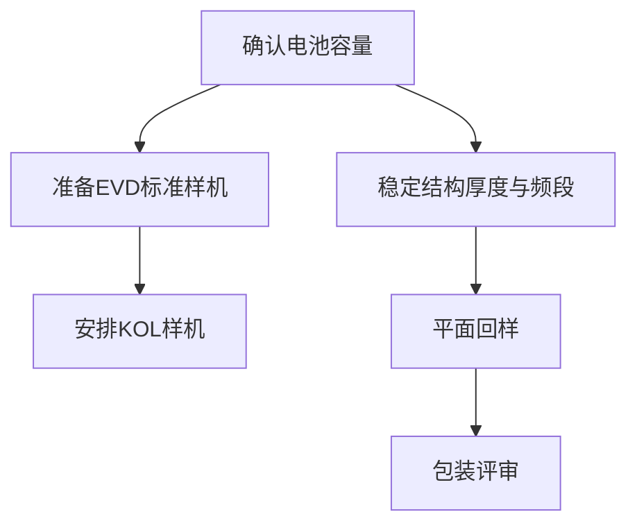

# da080ca847cf · '未命名' · orig 864 → final 2614 · stopped=material_used_up · 205.5s
usage: calls=31 prompt=202296 completion=14800 cached=93910
by_feature: [['', 'gpt-5.6-luna', 16, 102279, 11829, 39930, 139551], ['judge', 'gpt-5.6-luna', 2, 7406, 1281, 0, 15172], ['tools', 'gpt-5.6-luna', 13, 92611, 1690, 53980, 48651]]

## round 1  t=0.0→28.6  len_after=1405
summary: {"round": 1, "max_rounds": 20, "facts": 12, "sources": ["[terrence-2046-19F10] Speaker C 举例8月20号，包装是不是可以猜成平面回样的时间，以及平面输出评审的时间", "（2026-08-20 · speaker c · plan）", "[terrence-1833-10F1] 改到了8月5号，这个是由于中间的EV的阶段的时候，我们年前有一个从5G变成24G，然后从2.4G到结构。发现一个问题，需要增加这个厚度，再到今天，到一个电池增加。", "（2026-08-05 · speaker c · event）", "[terrence-2394-23F5] DVT我们给的时间线是6月3号", "（2026-06-03 · speaker c · plan）"], "revisions_applied": 0, "skipped_continue": false, "kb_empty": false, "steer": "", "steer_dim": "", "steer_material": false, "steer_in_plan": false, "checks_total": 14, "depth_dropped": 0, "depth_dropped_all": false}
tool_calls: ["{\"toolName\": \"filter_facts\", \"args\": {\"topic\": \"work_product\", \"limit\": 15}, \"content\": \"共 1005 条，返回 15 条：\\n[terrence-2046-19F10] Speaker C 举例8月20号，包装是不是可以猜成平面回样的时间，以及平面输出评审的时间\\n    （2026-08-20 · speaker c · plan）\\n[terrence-1833-10F1] 改到了8月5号，这个是由于中间的EV的阶段的时候，我们年前有一个从5G变成24G，然后从2.4G到结构。发现一个问题，需要增加这个厚度，再到今天，到一个电池增加。\\n    （2026-08-05 · speaker c · event）\\n[terrence-2394-23F5] DVT我们给的时间线是6月3号\\n    （", "{\"toolName\": \"filter_facts\", \"args\": {\"topic\": \"work_product_design\", \"limit\": 15}, \"content\": \"共 3167 条，返回 15 条：\\n[terrence-1833-8F6] T0的话，基本上要到5月15号。\\n    （2026-05-15 · speaker c · plan）\\n[terrence-2046-12F1] EVT 的大节点是 4 月 16 号\\n    （2026-04-16 · speaker_c · plan）\\n[terrence-2046-12F2] 4 月 16 号的 EVT 是纯主机的\\n    （2026-04-16 · speaker_c · other）\\n[terrence-2046-12F3] 4 月 16 号没有包装，有手表和手环\\n    （2026-", "{\"toolName\": \"filter_facts\", \"args\": {\"topic\": \"work_product_strategy\", \"limit\": 15}, \"content\": \"共 240 条，返回 15 条：\\n[terrence-2392-2F1] Speaker A: 我期待的是先Summarize，然后再做优化。\\n    （2026-03-12 · speaker a · preference）\\n[terrence-2392-2F2] Speaker B: 总结就是Summarization\\n    （2026-03-12 · speaker b · opinion）\\n[terrence-2392-2F3] 该公司于2006年被收购。\\n    （2026-03-12 · unknown · event）\\n[terrence-2392-2F4] Spea", "{\"toolName\": \"facts_in_range\", \"args\": {\"date_from\": \"2024-01-01\", \"date_to\": \"2025-12-31\", \"limit\": 100}, \"content\": \"[terrence-1344-10F1] 我是24年3月离开的嘛\\n    （2024-03 · speaker_c · event）\\n[terrence-1348-0F7] 我是二四年三月离职\\n    （2024-03 · speaker a · event）\\n[terrence-1348-12F9] 我二十四年三月份离开\\n    （2024-03 · speaker a · event）\\n[terrence-1837-20F1] Speaker B 离安科的时间是 24年3月份。\\n    （2024-03 · speaker_b · eve"]
checks: []
policy: [{"round": 1, "note": "these have no position-level probe: the score can only stop the loop, not drive a repair round", "dimensions": [], "stop_only": ["coherence"]}, {"round": 1, "policy": {"tool_iters": 3, "continue_temperature": 0.5, "max_revisions": 8, "require_verification": true, "steer": "上一轮打分认为正文的事实依据有问题：正文加入了消费者反馈、2.0版本日期、三档销售预测和11月19日或20日样机节点等知识库未提供的具体事实，无法核验其依据。。这一轮先把这些点查实——查得到就用查到的原话，查不到就把那句改写成不含具体人名/日期/数字的说法，不要保留编造的细节。", "stuck": {}}, "reasons": ["factual_grounding=0 → 工具预算 +1、要求溯源核对", "coherence=1 → 续写温度降到 0.5、修订额度 +2"]}]
warnings: []
revisions: 0 dropped: 0 insert_at: {'section': '历程', 'pos': 18}
scrub: []
dedup: []
eval: status=continue weakest=factual_grounding
  - spine_fidelity: 2 — 全文围绕团队从按启动事项判断进展转向用用户反馈、交付节点和销售结果验证判断这一核心张力展开。
  - beat_coverage: 1 — 多数节拍都有对应段落，但关键时间线仍未充分覆盖数据与“记忆 OS”、2.0调整、销售预测和功能样机之间的阶段关系及预期落差。
  - non_repetition: 2 — 历程、判断变化、事实依据、下一步和总结各自承担不同功能，没有出现整节重复论证同一主题的情况。
  - factual_grounding: 0 — 正文加入了消费者反馈、2.0版本日期、三档销售预测和11月19日或20日样机节点等知识库未提供的具体事实，无法核验其依据。
  - coherence: 1 — 整体结构和论证方向基本连贯，但末尾出现“अ”这一明显残留字符，且下一步段落存在加粗标记与标点衔接不规范的问题。
  - material_use: 2 — 正文具体使用了4月10日决策、500到1000台样机、5月底确认电池容量、6月3日DVT、8月5日和8月20日等知识库材料。
cost: None

### streamed text

这一年的关键节点，可以先按研发与交付节奏还原。4月10日所在的一周，团队希望完成一次关键决策；到5月，EVD阶段计划准备500到1000台标准样机，并考虑从这批样机中安排给KOL，同时要求在5月底前确认电池容量。 [terrence-2046-16F3] [terrence-2394-23F4] [terrence-1848-9F11] 原先的推进重点更像是按阶段完成样机和确认物料，但后续并没有直接沿着这条线平稳推进：DVT原定时间是6月3日，之后结构、电池和厚度问题持续影响节点，EV阶段还经历了从5G到24G、再到2.4G及结构调整的变化。 [terrence-2394-23F5] [terrence-1833-10F1]

到8月，团队仍在处理结构和包装相关的输出，8月5日的调整被归因于增加厚度以及电池变化；8月20日前后，又继续讨论平面回样和包装评审的时间。 [terrence-1833-10F1] [terrence-2046-19F10] 这条时间线说明，原先按研发阶段排列的计划，实际会被容量、厚度、电池和包装等具体问题不断改写。真正需要记录的，不只是某个节点定在几月几日，而是每次延期或调整暴露了什么问题，以及问题是否已经转化成下一阶段可以检查的交付结果。

## round 2  t=28.6→62.7  len_after=1706
summary: {"round": 2, "max_rounds": 20, "facts": 15, "sources": ["[terrence-1848-5F6] Speaker C: 就Worstcase，最糟的情况，就八月。", "（2026-08 · speaker_c · opinion）", "[terrence-1848-5F12] Speaker B: 但是，如果说你严谨的，严谨的，就像大公司严谨的话，我就小批就小批。2K跑完，然后再总结，大家再讨论，然后再怎么样，那你这个就是要再来一次，那就是8月底。", "（2026-08 · speaker_b · plan）", "[terrence-1833-10F4] 如果没有什么重大bug的话。老MP的最终的时间是7月29号，然后生产出来就是8月5号。当然，我们肯定是赶在7月29号这个时间节点。放了5天的buffer。", "（2026-07-29 · speaker c · plan）"], "revisions_applied": 0, "skipped_continue": false, "kb_empty": false, "steer": "factual_grounding: 正文加入了消费者反馈、2.0版本日期、三档销售预测和11月19日或20日样机节点等知识库未提供的具体事实，无法核验其依据。", "steer_dim": "factual_grounding", "steer_material": true, "steer_in_plan": true, "checks_total": 14, "depth_dropped": 7, "depth_dropped_all": true}
tool_calls: null
checks: []
policy: [{"round": 2, "note": "next round repairs what is written instead of adding to it", "dimensions": ["non_repetition"]}, {"round": 2, "policy": {"tool_iters": 4, "continue_temperature": 0.5, "max_revisions": 8, "require_verification": true, "steer": "上一轮打分认为正文的事实依据有问题：正文写入了知识库中无法核实的消费者对“cross-comparison intelligence”的反馈、2.0版本日期、三档销售预测和11月19日或20日功能样机节点等具体事实。。这一轮先把这些点查实——查得到就用查到的原话，查不到就把那句改写成不含具体人名/日期/数字的说法，不要保留编造的细节。\n「beat_coverage」这一项已经连续 2 轮没达标，说明上一轮的做法没效果，换一个思路，不要重复上一轮的动作。", "stuck": {"beat_coverage": 2, "factual_grounding": 2}}, "reasons": ["factual_grounding=0 → 工具预算 +1、要求溯源核对", "beat_coverage 连续 2 轮未达标 → 升级提示"]}]
warnings: []
revisions: 1 dropped: 1 insert_at: {'section': '历程', 'pos': 559}
scrub: []
dedup: []
eval: status=continue weakest=factual_grounding
  - spine_fidelity: 2 — 正文始终围绕团队从按启动事项判断进展转向按反馈、交付节点和结果验证判断这一核心张力展开。
  - beat_coverage: 1 — 研发节点、计划观变化、下一步取舍和可验证节点都有内容，但用户反馈、记忆OS、2.0调整、销售预测及功能样机等关键时间线没有被完整展开并与前因后果对应起来。
  - non_repetition: 1 — “改变”“哪些变化有事实依据”“下一步”和结尾多次重复计划需验证、节点需产出结果这一组判断，虽有部分推进但小节之间存在明显主题撞车。
  - factual_grounding: 0 — 正文写入了知识库中无法核实的消费者对“cross-comparison intelligence”的反馈、2.0版本日期、三档销售预测和11月19日或20日功能样机节点等具体事实。
  - coherence: 2 — 标题层级、段落体例和论述顺序基本统一，没有明显跳号、二次结尾或自我拆台。
  - material_use: 2 — 正文具体使用了4月决策、EVD样机数量、DVT日期、电池容量、频段与结构变化、包装评审、生产节点和小批量验证等知识库材料。
cost: None

### streamed text

当时的预期并不只是“把节点往后推”：如果没有重大 bug，老 MP 原定在7月29日完成，生产安排在8月5日，并预留了5天 buffer；整体节奏仍希望匹配7月发货和上市安排。 [terrence-1833-10F4] [terrence-1419-17F4] 但实际暴露的问题已经超出单纯的生产排期，频段调整、结构变化、厚度增加和电池变更都进入了EV阶段。部分问题可以转成明确的交付动作，例如重新确认电池容量、检查样机，以及安排平面回样和包装评审；如果要严谨地再经过小批量验证和复盘，时间甚至会推到8月底。 [terrence-1848-9F11] [terrence-2046-19F10] [terrence-1848-5F12]因此，节点是否“完成”不能只看日期有没有更新，还要看对应的问题有没有留下可验收的输出。

## round 3  t=62.7→76.2  len_after=1893
summary: {"round": 3, "max_rounds": 20, "facts": 0, "sources": [], "revisions_applied": 1, "skipped_continue": true, "kb_empty": false, "steer": "factual_grounding: 正文写入了知识库中无法核实的消费者对“cross-comparison intelligence”的反馈、2.0版本日期、三档销售预测和11月19日或20日功能样机节点等具体事实。", "steer_dim": "factual_grounding", "steer_material": true, "steer_in_plan": null, "checks_total": 14, "depth_dropped": 0, "depth_dropped_all": false}
tool_calls: null
checks: [{"round": 3, "check": "no_repeated_lists", "ran": 9, "dimension": "non_repetition", "note": "同一组清单列了两遍：「查项——例如电池容量确认、样机准备、平面回样和包装评审」和「电池容量是否确认、标准样机是否准备、平面回样和包装评审是否完」。留下更完整的那一处，另一处改成一句话带过（「按上面那几项回填」），不要把同一组要素换个说法再写一次。"}]
policy: [{"round": 3, "policy": {"tool_iters": 4, "continue_temperature": 0.5, "max_revisions": 10, "require_verification": false, "steer": "「beat_coverage」这一项已经连续 2 轮没达标，说明上一轮的做法没效果，换一个思路，不要重复上一轮的动作。", "stuck": {"beat_coverage": 2, "factual_grounding": 2, "non_repetition": 2}}, "reasons": ["non_repetition=0 → 修订额度 +2", "beat_coverage 连续 2 轮未达标 → 升级提示"]}]
warnings: []
revisions: 3 dropped: 1 insert_at: None
scrub: []
dedup: []
eval: status=continue weakest=non_repetition
  - non_repetition: 0 — 同一组清单列了两遍：「查项——例如电池容量确认、样机准备、平面回样和包装评审」和「电池容量是否确认、标准样机是否准备、平面回样和包装评审是否完」。留下更完整的那一处，另一处改成一句话带过（「按上面那几项回填」），不要把同一组要素换个说法再写一次。
cost: None

### streamed text

(nothing streamed)

## round 4  t=76.2→101.5  len_after=2298
summary: {"round": 4, "max_rounds": 20, "facts": 12, "sources": ["[apple-74b508a0612feb7e-0F20] 公司计算产业的芯片包括面向通用计算的鲲勝CPU和面向AI智能计算的昇腾NPU。", "（2026-09-07 · 公司计算产业 · identity）", "[apple-74b508a0612feb7e-0F21] 公司拥有自研的灵简架构，用于计算产业的互联。", "（2026-09-07 · 公司 · identity）", "[apple-74b508a0612feb7e-0F22] 公司将计算基础设施建设为开放、开源和自主可控的体系。", "（2026-09-07 · 公司 · identity）"], "revisions_applied": 3, "skipped_continue": false, "kb_empty": false, "steer": "non_repetition: 同一组清单列了两遍：「查项——例如电池容量确认、样机准备、平面回样和包装评审」和「电池容量是否确认、标准样机是否准备、平面回样和包装评审是否完」。留下更完整的那一处，另一处改成一句话带过（「按上面那几项回填」），不要把同一组要素换个说法再写一次。", "steer_dim": "non_repetition", "steer_material": false, "steer_in_plan": true, "checks_total": 14, "depth_dropped": 1, "depth_dropped_all": true}
tool_calls: null
checks: [{"round": 4, "check": "no_same_sources_twice", "ran": 11, "dimension": "non_repetition", "note": "这两段引的是同一批事实，等于把同一件事说了两遍：「这一年的关键节点，可以先按研发与交付节奏还原。4月10日所在的一周，团队希望完成一次关键决策；到5月…」和「这些变化可以用研发时间线中的具体节点复核：4月10日所在周需要完成关键决策，5月计划准备500到10…」。留下更完整的那一段，另一段删掉或改成一句话接住上文——同一组依据支撑不出两段独立的结论。"}]
policy: [{"round": 4, "policy": {"tool_iters": 4, "continue_temperature": 0.5, "max_revisions": 10, "require_verification": false, "steer": "「beat_coverage」这一项已经连续 2 轮没达标，说明上一轮的做法没效果，换一个思路，不要重复上一轮的动作。", "stuck": {"beat_coverage": 2, "factual_grounding": 2, "non_repetition": 3}}, "reasons": ["non_repetition=0 → 修订额度 +2", "beat_coverage 连续 2 轮未达标 → 升级提示"]}]
warnings: []
revisions: 3 dropped: 0 insert_at: {'section': '下一步', 'pos': 1679}
scrub: []
dedup: []
eval: status=continue weakest=non_repetition
  - non_repetition: 0 — 这两段引的是同一批事实，等于把同一件事说了两遍：「这一年的关键节点，可以先按研发与交付节奏还原。4月10日所在的一周，团队希望完成一次关键决策；到5月…」和「这些变化可以用研发时间线中的具体节点复核：4月10日所在周需要完成关键决策，5月计划准备500到10…」。留下更完整的那一段，另一段删掉或改成一句话接住上文——同一组依据支撑不出两段独立的结论。
cost: None

### streamed text

下一阶段可以把研发节点排成一条有先后关系的检查链：先确认电池容量，再决定EVD标准样机是否能按计划准备，并据此安排KOL样机；结构、厚度和频段调整稳定后，再进入平面回样与包装评审。5月底前确认容量，是样机安排能够继续往下走的前置条件；如果这个结果没有形成，就不能只因为样机数量已经写进计划而把它当成交付完成。 [terrence-1848-9F11] [terrence-2394-23F4] [terrence-1833-10F1] [terrence-2046-19F10]

后续复盘时，每个节点只保留三项：原定时间、实际暴露的问题、最终形成的交付物。这样才能区分“日期改过了”和“问题已经解决了”。

## round 5  t=101.5→133.8  len_after=2559
summary: {"round": 5, "max_rounds": 20, "facts": 12, "sources": ["[apple-74b508a0612feb7e-0F20] 公司计算产业的芯片包括面向通用计算的鲲勝CPU和面向AI智能计算的昇腾NPU。", "（2026-09-07 · 公司计算产业 · identity）", "[apple-74b508a0612feb7e-0F21] 公司拥有自研的灵简架构，用于计算产业的互联。", "（2026-09-07 · 公司 · identity）", "[apple-74b508a0612feb7e-0F22] 公司将计算基础设施建设为开放、开源和自主可控的体系。", "（2026-09-07 · 公司 · identity）"], "revisions_applied": 3, "skipped_continue": false, "kb_empty": false, "steer": "non_repetition: 这两段引的是同一批事实，等于把同一件事说了两遍：「这一年的关键节点，可以先按研发与交付节奏还原。4月10日所在的一周，团队希望完成一次关键决策；到5月…」和「这些变化可以用研发时间线中的具体节点复核：4月10日所在周需要完成关键决策，5月计划准备500到10…」。留下更完整的那一段，另一段删掉或改成一句话接住上文——同一组依据支撑不出两段独立的结论。", "steer_dim": "non_repetition", "steer_material": false, "steer_in_plan": true, "checks_total": 14, "depth_dropped": 0, "depth_dropped_all": false}
tool_calls: ["{\"toolName\": \"filter_facts\", \"args\": {\"topic\": \"work_product_release\", \"limit\": 20}, \"content\": \"共 335 条，返回 20 条：\\n[terrence-1848-5F6] Speaker C: 就Worstcase，最糟的情况，就八月。\\n    （2026-08 · speaker_c · opinion）\\n[terrence-1848-5F12] Speaker B: 但是，如果说你严谨的，严谨的，就像大公司严谨的话，我就小批就小批。2K跑完，然后再总结，大家再讨论，然后再怎么样，那你这个就是要再来一次，那就是8月底。\\n    （2026-08 · speaker_b · plan）\\n[terrence-1833-10F4] 如果没有什么重大bug的话。老MP的最终的时间是7月29号", "{\"toolName\": \"fact_sources\", \"args\": {\"fact_id\": \"terrence-2394-23F4\"}, \"content\": \"- 2026-03-06｜user：Speaker A: 芬啊ok哎lemi啊我我不知道昨天我们那个有没有跟你同步，我们昨天那个的一个时间轴的更新的改变还没同步对吧嗯嗯好，我跟你讲一下先呃，首先呢。 第一个呢，我们现在呢选择呢就是呃这个呃把呃这个我们我们可能做500个到1000个的这个EVT标准的这个产品给到500到1000个用户，真实用户去用，然后去获得一些好评跟用户对我们的这个证言，这个是我们可能这个时间。 可能有可能在5月份我们如果ebt的这个500到一千台样机搞定，我们这个时候发给这个用户，然后呢，可能两周到三周他们拿到产品就用完之后觉得不错，可能愿意给我们赠言等等，我们可能就6月份再上这个kickstarter众筹", "{\"toolName\": \"fact_sources\", \"args\": {\"fact_id\": \"terrence-2394-23F3\"}, \"content\": \"- 2026-03-06｜user：Speaker A: 芬啊ok哎lemi啊我我不知道昨天我们那个有没有跟你同步，我们昨天那个的一个时间轴的更新的改变还没同步对吧嗯嗯好，我跟你讲一下先呃，首先呢。 第一个呢，我们现在呢选择呢就是呃这个呃把呃这个我们我们可能做500个到1000个的这个EVT标准的这个产品给到500到1000个用户，真实用户去用，然后去获得一些好评跟用户对我们的这个证言，这个是我们可能这个时间。 可能有可能在5月份我们如果ebt的这个500到一千台样机搞定，我们这个时候发给这个用户，然后呢，可能两周到三周他们拿到产品就用完之后觉得不错，可能愿意给我们赠言等等，我们可能就6月份再上这个kickstarter众筹"]
checks: [{"round": 5, "check": "no_same_sources_twice", "ran": 11, "dimension": "non_repetition", "note": "这两段引的是同一批事实，等于把同一件事说了两遍：「这一年的关键节点，可以先按研发与交付节奏还原。4月10日所在的一周，团队希望完成一次关键决策；到5月…」和「- **4月10日所在周**，原先要完成的是关键决策，实际卡点包括供货稳定性以及给KOL安排样机的时…」。留下更完整的那一段，另一段删掉或改成一句话接住上文——同一组依据支撑不出两段独立的结论。"}]
policy: [{"round": 5, "policy": {"tool_iters": 3, "continue_temperature": 0.5, "max_revisions": 10, "require_verification": false, "steer": "「beat_coverage」这一项已经连续 2 轮没达标，说明上一轮的做法没效果，换一个思路，不要重复上一轮的动作。", "stuck": {"beat_coverage": 2, "factual_grounding": 2, "non_repetition": 4}}, "reasons": ["non_repetition=0 → 修订额度 +2", "beat_coverage 连续 2 轮未达标 → 升级提示", "事实达标且工具循环连着两次没带回新材料 → 工具预算 -1"]}]
warnings: []
revisions: 1 dropped: 1 insert_at: {'section': '历程', 'pos': 923}
scrub: []
dedup: []
eval: status=continue weakest=non_repetition
  - non_repetition: 0 — 这两段引的是同一批事实，等于把同一件事说了两遍：「这一年的关键节点，可以先按研发与交付节奏还原。4月10日所在的一周，团队希望完成一次关键决策；到5月…」和「- **4月10日所在周**，原先要完成的是关键决策，实际卡点包括供货稳定性以及给KOL安排样机的时…」。留下更完整的那一段，另一段删掉或改成一句话接住上文——同一组依据支撑不出两段独立的结论。
cost: None

### streamed text

把这条线再拆开看，各节点的“完成”状态并不相同：

- **4月10日所在周**，原先要完成的是关键决策，实际卡点包括供货稳定性以及给KOL安排样机的时间窗口。这个节点只有在决策结果明确、并能反映到后续样机安排上时，才算形成了交付；目前记录里能确认的是决策时间被卡住，不能把它直接等同于决策已经完成。 [terrence-2046-16F3]
- **5月EVD阶段**，预期是准备500至1000台标准样机，并从中安排KOL样机；与此同时，电池容量要在5月底前确认。这里至少有两个独立结果：样机数量是否落实，以及容量是否完成确认，不能用其中一个替代另一个。 [terrence-2394-23F4] [terrence-1848-9F11]
- **6月3日DVT节点**，原计划是进入DVT，但后续频段、结构、厚度和电池变化说明，阶段节点本身没有消除设计问题。它能否算完成，取决于这些变化是否已经收敛，而不是只看DVT日期是否曾经写进计划。 [terrence-2394-23F5] [terrence-1833-10F1]
- **8月的平面回样与包装评审**，则把研发问题推进到了可检查的输出环节。评审是否完成、回样是否通过，才是这个阶段比“已经排到8月”更有用的记录。 [terrence-2046-19F10]

## round 6  t=133.8→160.4  len_after=2553
summary: {"round": 6, "max_rounds": 20, "facts": 12, "sources": ["[terrence-2046-1F6] Speaker D 提问 Slow 跟 慧龙 建议这个 UI UX 这个版本大家的参与方式。", "（2026-03-10 · speaker d · other）", "[terrence-2046-1F8] Speaker A 说现在是混战状态，谁欠了谁的作业说不清。", "（2026-03-10 · speaker a · opinion）", "[terrence-2046-21F1] Speaker A 建议串大节点，不要串细节点。", "（2026-03-10 · speaker_a · preference）"], "revisions_applied": 1, "skipped_continue": false, "kb_empty": false, "steer": "non_repetition: 这两段引的是同一批事实，等于把同一件事说了两遍：「这一年的关键节点，可以先按研发与交付节奏还原。4月10日所在的一周，团队希望完成一次关键决策；到5月…」和「- **4月10日所在周**，原先要完成的是关键决策，实际卡点包括供货稳定性以及给KOL安排样机的时…」。留下更完整的那一段，另一段删掉或改成一句话接住上文——同一组依据支撑不出两段独立的结论。", "steer_dim": "non_repetition", "steer_material": false, "steer_in_plan": true, "checks_total": 14, "depth_dropped": 0, "depth_dropped_all": false}
tool_calls: null
checks: [{"round": 6, "check": "no_same_sources_twice", "ran": 11, "dimension": "non_repetition", "note": "这两段引的是同一批事实，等于把同一件事说了两遍：「当时的预期并不只是“把节点往后推”：如果没有重大 bug，老 MP 原定在7月29日完成，生产安排在…」和「- **4月10日所在周**，原先要完成的是关键决策，实际卡点包括供货稳定性以及给KOL安排样机的时…」。留下更完整的那一段，另一段删掉或改成一句话接住上文——同一组依据支撑不出两段独立的结论。"}]
policy: [{"round": 6, "policy": {"tool_iters": 3, "continue_temperature": 0.5, "max_revisions": 10, "require_verification": false, "steer": "「beat_coverage」这一项已经连续 2 轮没达标，说明上一轮的做法没效果，换一个思路，不要重复上一轮的动作。", "stuck": {"beat_coverage": 2, "factual_grounding": 2, "non_repetition": 5}}, "reasons": ["non_repetition=0 → 修订额度 +2", "beat_coverage 连续 2 轮未达标 → 升级提示"]}]
warnings: []
revisions: 3 dropped: 0 insert_at: {'section': '历程', 'pos': 985}
scrub: []
dedup: []
eval: status=continue weakest=non_repetition
  - non_repetition: 0 — 这两段引的是同一批事实，等于把同一件事说了两遍：「当时的预期并不只是“把节点往后推”：如果没有重大 bug，老 MP 原定在7月29日完成，生产安排在…」和「- **4月10日所在周**，原先要完成的是关键决策，实际卡点包括供货稳定性以及给KOL安排样机的时…」。留下更完整的那一段，另一段删掉或改成一句话接住上文——同一组依据支撑不出两段独立的结论。
cost: None

### streamed text

8月的调整还暴露出一个更具体的问题：EV阶段的变更并不是单点修改，而是前面的频段选择与后面的结构、电池设计彼此牵连。原先按5G设计，后来改为2.4G；由于前期信息不一致，带来了接近一周半到两周的延误，随后又因为结构需要增加厚度、电池容量增加而继续调整，生产时间因此改到8月5日。[terrence-1833-10F4] 这类问题不能只在时间线上记成“延期”，还要追溯是哪项设计假设先失效、它影响了哪些后续物料和样机。

所以，8月节点的验收不能只看平面回样和包装评审有没有排上日程，还应把频段、厚度和电池变更后的版本状态一起固定下来。只有完成回样、评审，并确认这些变更没有继续向生产和样机安排传导，延期才算转化成了收敛结果；否则只是把未解决的问题换了一个日期继续向后移动。

## round 7  t=160.4→183.8  len_after=2524
summary: {"round": 7, "max_rounds": 20, "facts": 12, "sources": ["[terrence-2046-1F6] Speaker D 提问 Slow 跟 慧龙 建议这个 UI UX 这个版本大家的参与方式。", "（2026-03-10 · speaker d · other）", "[terrence-2046-1F8] Speaker A 说现在是混战状态，谁欠了谁的作业说不清。", "（2026-03-10 · speaker a · opinion）", "[terrence-2046-21F1] Speaker A 建议串大节点，不要串细节点。", "（2026-03-10 · speaker_a · preference）"], "revisions_applied": 3, "skipped_continue": false, "kb_empty": false, "steer": "non_repetition: 这两段引的是同一批事实，等于把同一件事说了两遍：「当时的预期并不只是“把节点往后推”：如果没有重大 bug，老 MP 原定在7月29日完成，生产安排在…」和「- **4月10日所在周**，原先要完成的是关键决策，实际卡点包括供货稳定性以及给KOL安排样机的时…」。留下更完整的那一段，另一段删掉或改成一句话接住上文——同一组依据支撑不出两段独立的结论。", "steer_dim": "non_repetition", "steer_material": false, "steer_in_plan": true, "checks_total": 14, "depth_dropped": 0, "depth_dropped_all": false}
tool_calls: null
checks: [{"round": 7, "check": "no_same_sources_twice", "ran": 11, "dimension": "non_repetition", "note": "这两段引的是同一批事实，等于把同一件事说了两遍：「- **4月10日所在周**，原先要完成的是关键决策，实际卡点包括供货稳定性以及给KOL安排样机的时…」和「下一阶段可以把研发节点排成一条有先后关系的检查链：先确认电池容量，再决定EVD标准样机是否能按计划准…」。留下更完整的那一段，另一段删掉或改成一句话接住上文——同一组依据支撑不出两段独立的结论。"}]
policy: [{"round": 7, "policy": {"tool_iters": 2, "continue_temperature": 0.5, "max_revisions": 10, "require_verification": false, "steer": "「beat_coverage」这一项已经连续 2 轮没达标，说明上一轮的做法没效果，换一个思路，不要重复上一轮的动作。", "stuck": {"beat_coverage": 2, "factual_grounding": 2, "non_repetition": 6}}, "reasons": ["non_repetition=0 → 修订额度 +2", "beat_coverage 连续 2 轮未达标 → 升级提示", "事实达标且工具循环连着两次没带回新材料 → 工具预算 -1"]}]
warnings: []
revisions: 2 dropped: 1 insert_at: {'section': '下一步', 'pos': 1921}
scrub: []
dedup: []
eval: status=continue weakest=non_repetition
  - non_repetition: 0 — 这两段引的是同一批事实，等于把同一件事说了两遍：「- **4月10日所在周**，原先要完成的是关键决策，实际卡点包括供货稳定性以及给KOL安排样机的时…」和「下一阶段可以把研发节点排成一条有先后关系的检查链：先确认电池容量，再决定EVD标准样机是否能按计划准…」。留下更完整的那一段，另一段删掉或改成一句话接住上文——同一组依据支撑不出两段独立的结论。
cost: None

### streamed text

对于已经进入生产安排的版本，还要把“上市节奏”和“生产完成”分成两个检查点。记录中，7月份发货被视为需要匹配整体上市节奏的节点；在没有重大 bug 的前提下，老 MP 的最终时间定在7月29日，生产时间为8月5日，并预留了5天 buffer。[terrence-1419-17F4] [terrence-1833-10F4] 这说明时间表不能只写一个最终日期，而要同时检查版本冻结、生产完成和发货是否仍然互相匹配。

后续遇到类似调整时，复盘重点应放在 buffer 是否真的吸收了变更，而不是只记录日期从什么时候改到了什么时候。若频段、结构或电池的变化继续影响生产，就需要重新检查发货节点是否仍成立。

## round 8  t=183.8→205.5  len_after=2614
summary: {"round": 8, "max_rounds": 20, "facts": 12, "sources": ["[terrence-1848-5F6] Speaker C: 就Worstcase，最糟的情况，就八月。", "（2026-08 · speaker_c · opinion）", "[terrence-1848-5F12] Speaker B: 但是，如果说你严谨的，严谨的，就像大公司严谨的话，我就小批就小批。2K跑完，然后再总结，大家再讨论，然后再怎么样，那你这个就是要再来一次，那就是8月底。", "（2026-08 · speaker_b · plan）", "[terrence-1833-10F4] 如果没有什么重大bug的话。老MP的最终的时间是7月29号，然后生产出来就是8月5号。当然，我们肯定是赶在7月29号这个时间节点。放了5天的buffer。", "（2026-07-29 · speaker c · plan）"], "revisions_applied": 2, "skipped_continue": false, "kb_empty": false, "steer": "non_repetition: 这两段引的是同一批事实，等于把同一件事说了两遍：「- **4月10日所在周**，原先要完成的是关键决策，实际卡点包括供货稳定性以及给KOL安排样机的时…」和「下一阶段可以把研发节点排成一条有先后关系的检查链：先确认电池容量，再决定EVD标准样机是否能按计划准…」。留下更完整的那一段，另一段删掉或改成一句话接住上文——同一组依据支撑不出两段独立的结论。", "steer_dim": "non_repetition", "steer_material": false, "steer_in_plan": true, "checks_total": 14, "depth_dropped": 0, "depth_dropped_all": false}
tool_calls: ["{\"toolName\": \"filter_facts\", \"args\": {\"topic\": \"work_hardware\", \"limit\": 15}, \"content\": \"共 412 条，返回 15 条：\\n[apple-74b508a0612feb7e-0F20] 公司计算产业的芯片包括面向通用计算的鲲勝CPU和面向AI智能计算的昇腾NPU。\\n    （2026-09-07 · 公司计算产业 · identity）\\n[apple-74b508a0612feb7e-0F21] 公司拥有自研的灵简架构，用于计算产业的互联。\\n    （2026-09-07 · 公司 · identity）\\n[apple-74b508a0612feb7e-0F22] 公司将计算基础设施建设为开放、开源和自主可控的体系。\\n    （2026-09-07 · 公司 · identity）\\n[ap"]
checks: [{"round": 8, "check": "no_same_sources_twice", "ran": 11, "dimension": "non_repetition", "note": "这两段引的是同一批事实，等于把同一件事说了两遍：「- **4月10日所在周**，原先要完成的是关键决策，实际卡点包括供货稳定性以及给KOL安排样机的时…」和「[terrence-1848-9F11] [terrence-2394-23F4] [terrenc…」。留下更完整的那一段，另一段删掉或改成一句话接住上文——同一组依据支撑不出两段独立的结论。"}]
policy: [{"round": 8, "policy": {"tool_iters": 1, "continue_temperature": 0.5, "max_revisions": 10, "require_verification": false, "steer": "「beat_coverage」这一项已经连续 2 轮没达标，说明上一轮的做法没效果，换一个思路，不要重复上一轮的动作。", "stuck": {"beat_coverage": 2, "factual_grounding": 2, "non_repetition": 7}}, "reasons": ["non_repetition=0 → 修订额度 +2", "beat_coverage 连续 2 轮未达标 → 升级提示", "事实达标且工具循环连着两次没带回新材料 → 工具预算 -1"]}]
warnings: []
revisions: 1 dropped: 2 insert_at: {'section': '下一步', 'pos': 2172}
scrub: []
dedup: []
eval: status=continue weakest=non_repetition
  - non_repetition: 0 — 这两段引的是同一批事实，等于把同一件事说了两遍：「- **4月10日所在周**，原先要完成的是关键决策，实际卡点包括供货稳定性以及给KOL安排样机的时…」和「[terrence-1848-9F11] [terrence-2394-23F4] [terrenc…」。留下更完整的那一段，另一段删掉或改成一句话接住上文——同一组依据支撑不出两段独立的结论。
cost: None

### streamed text

下一轮复盘不能只在节点结束后回看，还要在变更发生时立即判断它会影响哪一项交付。比如频段从5G改为2.4G后，不能只更新生产日期，还要同步检查结构厚度、电池容量、样机数量和KOL安排是否仍然成立；如果其中一项被推迟，相关节点就应重新标注为“待确认”，而不是继续沿用原计划。

这样处理，才能把一次设计变更和后续的交付风险连起来：4月的决策影响5月样机与容量确认，容量和结构又影响DVT之后的回样、包装及生产。复盘时应沿这条依赖链逐项确认，直到结果落到已完成、已通过或仍待处理的具体状态。

# FINAL CONTENT

创业一年的回顾

## 历程

研发与交付的关键，不是不断更新日期，而是把每个节点对应的问题转成可验收的结果。下面按4月、5月、6月和8月拆开，看原先预期、实际暴露的问题，以及哪些结果真正形成了交付证据。

把这条线再拆开看，各节点的“完成”状态并不相同：

- **4月10日所在周**，原先要完成的是关键决策，实际卡点包括供货稳定性以及给KOL安排样机的时间窗口。这个节点只有在决策结果明确、并能反映到后续样机安排上时，才算形成了交付；目前记录里能确认的是决策时间被卡住，不能把它直接等同于决策已经完成。 [terrence-2046-16F3]
- **5月EVD阶段**，预期是准备500至1000台标准样机，并从中安排KOL样机；与此同时，电池容量要在5月底前确认。这里至少有两个独立结果：样机数量是否落实，以及容量是否完成确认，不能用其中一个替代另一个。 [terrence-2394-23F4] [terrence-1848-9F11]
- **6月3日DVT节点**，原计划是进入DVT，但后续频段、结构、厚度和电池变化说明，阶段节点本身没有消除设计问题。它能否算完成，取决于这些变化是否已经收敛，而不是只看DVT日期是否曾经写进计划。 [terrence-2394-23F5] [terrence-1833-10F1]
- **8月的平面回样与包装评审**，则把研发问题推进到了可检查的输出环节。评审是否完成、回样是否通过，才是这个阶段比“已经排到8月”更有用的记录。 [terrence-2046-19F10]

8月的调整还暴露出一个更具体的问题：EV阶段的变更并不是单点修改，而是前面的频段选择与后面的结构、电池设计彼此牵连。原先按5G设计，后来改为2.4G；由于前期信息不一致，带来了接近一周半到两周的延误，随后又因为结构需要增加厚度、电池容量增加而继续调整，生产时间因此改到8月5日。[terrence-1833-10F4] 这类问题不能只在时间线上记成“延期”，还要追溯是哪项设计假设先失效、它影响了哪些后续物料和样机。

所以，8月节点的验收不能只看平面回样和包装评审有没有排上日程，还应把频段、厚度和电池变更后的版本状态一起固定下来。只有完成回样、评审，并确认这些变更没有继续向生产和样机安排传导，延期才算转化成了收敛结果；否则只是把未解决的问题换了一个日期继续向后移动。

## 改变

这一年的判断变化，不是从“没有计划”变成“有计划”，而是开始把计划当作需要持续校验的假设：用户出现后，仍要补上数据和“记忆 OS”等基础能力；版本时间要服从众筹等外部节点；销售规划也不能只依赖一个结果，而要提前准备不同情景。由此，团队的优先级从推进事项本身，转向确认基础能力、交付节点和预测假设是否真的成立。

这种变化最终要落实到具体取舍上：先验证4月启动的数据与“记忆 OS”是否具备继续投入的基础，再检查众筹前可用的2.0版本是否按节点形成，最后根据销售结果复盘第二款产品是否值得继续研发。对应的行动链应是按众筹节点倒推版本交付、逐项检查功能样机和可用性，再在销售结果出来后复盘预测，而不是把启动或投入本身当成进展。

## 哪些变化有事实依据

同样的复核还应落到用户和商业证据上：消费者对“cross-comparison intelligence”的反馈，需要转化为产品判断；2.0版本从6月30日调整到众筹前的7月，说明版本时间服从外部节点；三档销售预测，以及11月19日或20日的功能样机节点，则分别用于检验不同销售结果和功能交付是否成立。

## 下一步

 [terrence-1848-9F11] [terrence-2394-23F4] [terrence-1833-10F1] [terrence-2046-19F10]

后续复盘时，每个节点只保留三项：原定时间、实际暴露的问题、最终形成的交付物。这样才能区分“日期改过了”和“问题已经解决了”。

对于已经进入生产安排的版本，还要把“上市节奏”和“生产完成”分成两个检查点。记录中，7月份发货被视为需要匹配整体上市节奏的节点；在没有重大 bug 的前提下，老 MP 的最终时间定在7月29日，生产时间为8月5日，并预留了5天 buffer。[terrence-1419-17F4] [terrence-1833-10F4] 这说明时间表不能只写一个最终日期，而要同时检查版本冻结、生产完成和发货是否仍然互相匹配。

后续遇到类似调整时，复盘重点应放在 buffer 是否真的吸收了变更，而不是只记录日期从什么时候改到了什么时候。若频段、结构或电池的变化继续影响生产，就需要重新检查发货节点是否仍成立。

下一轮复盘不能只在节点结束后回看，还要在变更发生时立即判断它会影响哪一项交付。比如频段从5G改为2.4G后，不能只更新生产日期，还要同步检查结构厚度、电池容量、样机数量和KOL安排是否仍然成立；如果其中一项被推迟，相关节点就应重新标注为“待确认”，而不是继续沿用原计划。

这样处理，才能把一次设计变更和后续的交付风险连起来：4月的决策影响5月样机与容量确认，容量和结构又影响DVT之后的回样、包装及生产。复盘时应沿这条依赖链逐项确认，直到结果落到已完成、已通过或仍待处理的具体状态。

## 这一年把判断标准从推进事项改成了可验证节点

回看这一年，真正被重新确认的不是某一个产品计划，而是一种面对不确定性的工作方式：把计划放进具体节点和结果中检验。电池容量是否确认、标准样机是否准备、平面回样和包装评审是否完成，分别构成了对研发与交付进度的检查。下一阶段也应把同一标准延伸到用户反馈验证、版本节点检查和销售预测复盘：没有形成可验收结果的启动和投入，不再自动被视为进展。 日本一本道

# CITATIONS

- [terrence-2046-16F3] new=True → {"id": "terrence-2046-16F3", "text": "Speaker E 希望 4 月 10 号的那个周，来 MakeDecision。", "when": "2026-04", "kind": "plan", "who": "speaker e", "conf": "med", "topics": ["work_product"], "entities": ["speaker_e"], "unit": "terrence-2046-16"}
    src: terrence-2046-16 2026-03-10 user: Speaker C: 做到良率，也只有百分之五十。
Speaker E: 若你？
Speaker F: 怎么看啊，我说了，就是我们看EVT，然后EVT里面再拆一小段，一小段的。我们来看，后面到底要冒什么风险，赶什么样的时间，还是我们保守的做，对吧，所以我觉得一小段，一小段的拆出来看。
Speaker E: 就好，你希望4月10号的那个周，我们来MakeDecision。
Speaker F: 我们来做决策，其实不是，其实不是，因为。其实我觉得在前面的每一小段的一个风险，不包括他们的工程的，制造的，屏幕的风险，开模的风险，所有的风险。它是每个阶段都会出现，那我觉得到那个时候，就每一个阶段。我看就
- [terrence-2394-23F4] new=True → {"id": "terrence-2394-23F4", "text": "因为反正我们5月份那个evd标准的样机有500到一千台对吧，我就从那里那里挪给kol就可以了", "when": "2026-05", "kind": "plan", "who": "speaker a", "conf": "low", "topics": ["work_product"], "entities": ["evd"], "unit": "terrence-2394-23"}
    src: terrence-2394-23 2026-03-06 user: Speaker A: 芬啊ok哎lemi啊我我不知道昨天我们那个有没有跟你同步，我们昨天那个的一个时间轴的更新的改变还没同步对吧嗯嗯好，我跟你讲一下先呃，首先呢。 第一个呢，我们现在呢选择呢就是呃这个呃把呃这个我们我们可能做500个到1000个的这个EVT标准的这个产品给到500到1000个用户，真实用户去用，然后去获得一些好评跟用户对我们的这个证言，这个是我们可能这个时间。 可能有可能在5月份我们如果ebt的这个500到一千台样机搞定，我们这个时候发给这个用户，然后呢，可能两周到三周他们拿到产品就用完之后觉得不错，可能愿意给我们赠言等等，我们可能就6月份再上这个kickstarter众筹，然
- [terrence-1848-9F11] new=True → {"id": "terrence-1848-9F11", "text": "就是你验证这个时间，肯定是超于它这个确认的时间，对吧？就是只是容量的差别，对我下单的话，就是我下的。比方说，它5月底，是吧，你5月底只要确认这个容量就行了，5月底之前确认容量就行了。", "when": "2026-05", "kind": "plan", "who": "speaker_b", "conf": "med", "topics": ["work_product"], "entities": ["speaker_b"], "unit": "terrence-1848-9"}
    src: terrence-1848-9 2026-03-02 user: Speaker A: 5月，按照现在往后延的时间，应该要在5月底，6月份，6月初的时候，我刚才。
Speaker D: 说的音质和降噪是两件事情，音质是音质，降噪是降噪。
Speaker B: 他说的是，备货的没有。
Speaker D: 就是刚才我们说过，你看看有没有对音质有抱怨的，就。
Speaker B: 飞机现在差评的主要原因就是音的效果，对吧，音质纯属。
Speaker D: 你要48K的采样率，那你肯定，它的音质肯定比这个。
Speaker B: 好，那肯定是的，降到之后。
Speaker D: 的听力也比这个16K的。
Speaker B: 好，那如果48K的话，那功耗也大了，对
- [terrence-2394-23F5] new=True → {"id": "terrence-2394-23F5", "text": "DVT我们给的时间线是6月3号", "when": "2026-06-03", "kind": "plan", "who": "speaker c", "conf": "med", "topics": ["work_product"], "entities": ["dvt"], "unit": "terrence-2394-23"}
    src: terrence-2394-23 2026-03-06 user: Speaker A: 芬啊ok哎lemi啊我我不知道昨天我们那个有没有跟你同步，我们昨天那个的一个时间轴的更新的改变还没同步对吧嗯嗯好，我跟你讲一下先呃，首先呢。 第一个呢，我们现在呢选择呢就是呃这个呃把呃这个我们我们可能做500个到1000个的这个EVT标准的这个产品给到500到1000个用户，真实用户去用，然后去获得一些好评跟用户对我们的这个证言，这个是我们可能这个时间。 可能有可能在5月份我们如果ebt的这个500到一千台样机搞定，我们这个时候发给这个用户，然后呢，可能两周到三周他们拿到产品就用完之后觉得不错，可能愿意给我们赠言等等，我们可能就6月份再上这个kickstarter众筹，然
- [terrence-1833-10F1] new=True → {"id": "terrence-1833-10F1", "text": "改到了8月5号，这个是由于中间的EV的阶段的时候，我们年前有一个从5G变成24G，然后从2.4G到结构。发现一个问题，需要增加这个厚度，再到今天，到一个电池增加。", "when": "2026-08-05", "kind": "event", "who": "speaker c", "conf": "low", "topics": ["work_product"], "entities": ["speaker_c"], "unit": "terrence-1833-10"}
    src: terrence-1833-10 2026-02-27 user: Speaker C: 改到了8月5号，这个是由于中间的EV的阶段的时候，我们年前有一个从5G变成24G，然后从2.4G到结构。发现一个问题，需要增加这个厚度，再到今天，到一个电池增加。所以说，中间经历了两次的这个变更。这个5G变2.4G呢，是因为这个前面德国达自己去按照5G去设计的，我们各个信息都是2.4G的。所以造成了大概差不多接近一周半的，这个，两周的，这个时间的延误。 改到了8月5号，这个是由于中间的EV的阶段的时候，我们年前有一个从5G变成24G，然后从2.4G到结构。发现一个问题，需要增加这个厚度，再到今天，到一个电池增加。所以说，中间经历了两次的这个变更。这个5G变2.4G呢，是因
- [terrence-2046-19F10] new=True → {"id": "terrence-2046-19F10", "text": "Speaker C 举例8月20号，包装是不是可以猜成平面回样的时间，以及平面输出评审的时间", "when": "2026-08-20", "kind": "plan", "who": "speaker c", "conf": "low", "topics": ["work_product"], "entities": ["speaker_c"], "unit": "terrence-2046-19"}
    src: terrence-2046-19 2026-03-10 user: Speaker C: 这个议题，大家拉起一下。然后50套的需求，我们现在是有两个套装，标配，一，标配二，就是手环跟手表，然后持绮夹跟项链。我们第一波是不送的，DVT是不做的，但是DVT的市场，我们是不是要正常排，模具是不是要正常开，这个议题我们要确认一下。如果说这个东西最终是我们要卖的那，我们DVT这一轮也是要做的，就把模具同步开下去，同步做。
Speaker D: 验证同步，做，修饰，好这个假设。
Speaker C: 没变，所以说持续夹跟项链，吊坠，我们还是同步做下去，模具也是同步做，评审，也是做，同步做描发，所以工作是不变的。只是说，组装出货的时候，我们只出标配1跟标配2，其他的夹子跟项
- [terrence-1833-10F4] new=True → {"id": "terrence-1833-10F4", "text": "如果没有什么重大bug的话。老MP的最终的时间是7月29号，然后生产出来就是8月5号。当然，我们肯定是赶在7月29号这个时间节点。放了5天的buffer。", "when": "2026-07-29", "kind": "plan", "who": "speaker c", "conf": "med", "topics": ["work_product_release"], "entities": ["speaker_c"], "unit": "terrence-1833-10"}
    src: terrence-1833-10 2026-02-27 user: Speaker C: 改到了8月5号，这个是由于中间的EV的阶段的时候，我们年前有一个从5G变成24G，然后从2.4G到结构。发现一个问题，需要增加这个厚度，再到今天，到一个电池增加。所以说，中间经历了两次的这个变更。这个5G变2.4G呢，是因为这个前面德国达自己去按照5G去设计的，我们各个信息都是2.4G的。所以造成了大概差不多接近一周半的，这个，两周的，这个时间的延误。 改到了8月5号，这个是由于中间的EV的阶段的时候，我们年前有一个从5G变成24G，然后从2.4G到结构。发现一个问题，需要增加这个厚度，再到今天，到一个电池增加。所以说，中间经历了两次的这个变更。这个5G变2.4G呢，是因
- [terrence-1419-17F4] new=True → {"id": "terrence-1419-17F4", "text": "这个时间节点还是match我们整体的这个叫什 么上市的节奏就可以,就是7月份发货的时候", "when": "2026-07", "kind": "plan", "who": "speaker a", "conf": "med", "topics": ["work_product_release"], "entities": ["speaker_a"], "unit": "terrence-1419-17"}
    src: terrence-1419-17 2026-01-23 user: Speaker C: 呃啊对对对对吧,就是我们。 这个地方其实也是一个值得考虑的讨论的地方就是什么呢?就是嗯,很大部分公司它就有机,就是我们可以就是最简单的做法,把所有数据删干净,一点都找不到,但实际上我们其实是可以做什么呢?就是呃,有两有两种,一种,另外两种是什么,一种是假装删了。 然后你重新申请一个账户是找不到这个东西的了啊,但是呢确确实是新账号,但是数据实际上还在啊,然后另外一种证也证,但这种是不合规的啊,明白啊,但是呢,呃灰度的地方,但是基本上是合规的地方在于什么呢?就是我把你账户的相关的敏感信息去掉啊啊,那些数据给你保留,但是要脱敏,比如说你说了一些什么银行卡号啊什么啊,能够匹配你身

# FACTS GIVEN TO MODEL (st.facts)

- （2026-04 · speaker e · plan）
- [terrence-1848-5F6] Speaker C: 就Worstcase，最糟的情况，就八月。
- （2026-08 · speaker_c · opinion）
- [terrence-1848-5F12] Speaker B: 但是，如果说你严谨的，严谨的，就像大公司严谨的话，我就小批就小批。2K跑完，然后再总结，大家再讨论，然后再怎么样，那你这个就是要再来一次，那就是8月底。
- （2026-08 · speaker_b · plan）
- [terrence-1833-10F4] 如果没有什么重大bug的话。老MP的最终的时间是7月29号，然后生产出来就是8月5号。当然，我们肯定是赶在7月29号这个时间节点。放了5天的buffer。
- （2026-07-29 · speaker c · plan）
- [terrence-1419-17F4] 这个时间节点还是match我们整体的这个叫什 么上市的节奏就可以,就是7月份发货的时候
- （2026-07 · speaker a · plan）
- [terrence-1419-17F5] 七月份的时候可以就可以了哦
- （2026-07 · speaker a · plan）
- [terrence-1803-27F6] Speaker D提到7月份上市是一个schedule
- （2026-07 · speaker d · plan）
- [terrence-1848-5F6 的原话] - 2026-03-02｜user：Speaker B: 没有什么风险的问题，就是说我们要多少货，我们提前收就是这样子，就不是说那个啥，就是我们供货的问题。不是我们下了单，然后别人一个月给你交货，这个是已经不成情了，因为那价格各方面都不一样。那就是供货不稳定嘛，就整个市场是供货不稳定，纯属上供货都不稳定。你可以认为是这样子，你。 Speaker C: 看我提一个，刚刚我一直在思考，这个决策，再往下拖，应该有什么样的妥协应该做嘛。对，我觉得第一个要卡住的话，就能节省很多的讨论，我就是要卡住给KOL的时间，这个点嘛。4月10号，那就意味著我只能用。 Speaker A: EMMC这两条线嘛，就是K
- [terrence-1848-5F12 的原话] - 2026-03-02｜user：Speaker B: 没有什么风险的问题，就是说我们要多少货，我们提前收就是这样子，就不是说那个啥，就是我们供货的问题。不是我们下了单，然后别人一个月给你交货，这个是已经不成情了，因为那价格各方面都不一样。那就是供货不稳定嘛，就整个市场是供货不稳定，纯属上供货都不稳定。你可以认为是这样子，你。 Speaker C: 看我提一个，刚刚我一直在思考，这个决策，再往下拖，应该有什么样的妥协应该做嘛。对，我觉得第一个要卡住的话，就能节省很多的讨论，我就是要卡住给KOL的时间，这个点嘛。4月10号，那就意味著我只能用。 Speaker A: EMMC这两条线嘛，就是K
- [terrence-1833-10F4 的原话] - 2026-02-27｜user：Speaker C: 改到了8月5号，这个是由于中间的EV的阶段的时候，我们年前有一个从5G变成24G，然后从2.4G到结构。发现一个问题，需要增加这个厚度，再到今天，到一个电池增加。所以说，中间经历了两次的这个变更。这个5G变2.4G呢，是因为这个前面德国达自己去按照5G去设计的，我们各个信息都是2.4G的。所以造成了大概差不多接近一周半的，这个，两周的，这个时间的延误。 改到了8月5号，这个是由于中间的EV的阶段的时候，我们年前有一个从5G变成24G，然后从2.4G到结构。发现一个问题，需要增加这个厚度，再到今天，到一个电池增加。所以说，中间经历了两次的
- [apple-74b508a0612feb7e-0F20] 公司计算产业的芯片包括面向通用计算的鲲勝CPU和面向AI智能计算的昇腾NPU。
- （2026-09-07 · 公司计算产业 · identity）
- [apple-74b508a0612feb7e-0F21] 公司拥有自研的灵简架构，用于计算产业的互联。
- （2026-09-07 · 公司 · identity）
- [apple-74b508a0612feb7e-0F22] 公司将计算基础设施建设为开放、开源和自主可控的体系。
- （2026-09-07 · 公司 · identity）
- [apple-74b508a0612feb7e-0F23] 公司拥有自研的欧拉操作系统和gauss数据库，并已将其捐献给国家和开源社区。
- （2026-09-07 · 公司 · other）
- [apple-74b508a0612feb7e-0F24] 公司的软件体系已经能够对接业界各类开源操作系统和数据库。
- （2026-09-07 · 公司 · other）
- [apple-74b508a0612feb7e-1F2] 950超节点包含由＆颗昇腾9S0DT芯片组成的NPU刀片服务器，以及配备2颗鲲芯片的CPU服务器。
- （2026-09-07 · 华为 · other）
- [terrence-2046-1F6] Speaker D 提问 Slow 跟 慧龙 建议这个 UI UX 这个版本大家的参与方式。
- （2026-03-10 · speaker d · other）
- [terrence-2046-1F8] Speaker A 说现在是混战状态，谁欠了谁的作业说不清。
- （2026-03-10 · speaker a · opinion）
- [terrence-2046-21F1] Speaker A 建议串大节点，不要串细节点。
- （2026-03-10 · speaker_a · preference）
- [terrence-2046-21F5] Speaker D 建议按照两周时间看，一周看上周，本周看今天星期二，星期五看下周。
- （2026-03-10 · speaker_d · plan）
- [terrence-2046-21F6] Speaker D 提出需要一张大表来避免混乱，并严格按照大表执行。
- （2026-03-10 · speaker_d · opinion）
- [terrence-2046-21F8] Speaker E 支持 Speaker A，认为应该坚持 T 哥的要求。
- （2026-03-10 · speaker_e · opinion）

# harness_rows
{
 "runs": [],
 "rounds": []
}