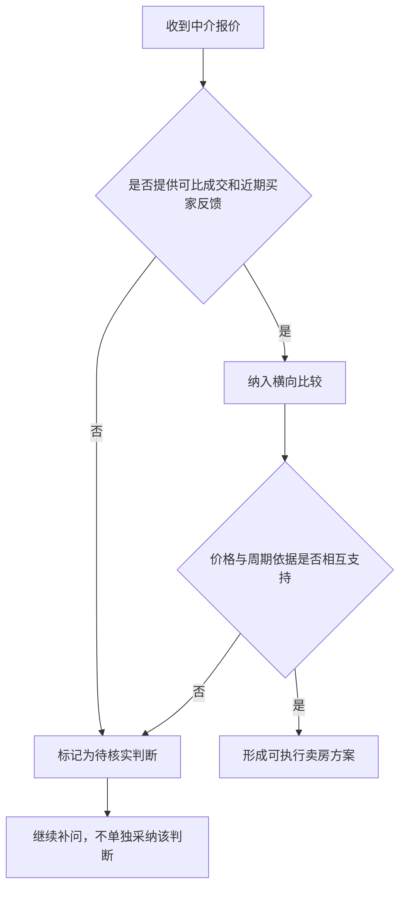

# 603dca25403a · '未命名' · orig 810 → final 1363 · stopped=complete · 20.5s
usage: calls=4 prompt=19214 completion=1299 cached=4601
by_feature: [['', 'gpt-5.6-luna', 1, 5571, 571, 0, 6559], ['judge', 'gpt-5.6-luna', 1, 3626, 699, 0, 7920], ['tools', 'gpt-5.6-luna', 2, 10017, 29, 4601, 5123]]

## round 1  t=0.0→20.5  len_after=1363
summary: {"round": 1, "max_rounds": 8, "facts": 12, "sources": ["[terrence-1815-2F16] Terence is trying to sell an apartment or the school or whatever it is.", "（2026-02-25 · speaker b · other）", "[terrence-1744-4F1] 我在龙林上路那间学位房上个月可以放卖，我买回来是310元，跟住呢，放了265元，但现在开价最高开235元，环价那些客人都蚀了七十多元。", "（2026-02-11 · speaker_a · other）", "[terrence-1744-4F2] 我疫情前租三千三一个月，一到疫情之后，就跌到两千五，过一阵解封之后升回到两千七。", "（2026-02-11 · speaker_a · event）"], "revisions_applied": 0, "skipped_continue": false, "kb_empty": false, "steer": "", "steer_dim": "", "steer_material": false, "steer_in_plan": false, "checks_total": 14, "depth_dropped": 0, "depth_dropped_all": false}
tool_calls: ["{\"toolName\": \"filter_facts\", \"args\": {\"topic\": \"personal_real_estate_sale\", \"limit\": 15}, \"content\": \"共 103 条，返回 15 条：\\n[terrence-1815-2F16] Terence is trying to sell an apartment or the school or whatever it is.\\n    （2026-02-25 · speaker b · other）\\n[terrence-1744-4F1] 我在龙林上路那间学位房上个月可以放卖，我买回来是310元，跟住呢，放了265元，但现在开价最高开235元，环价那些客人都蚀了七十多元。\\n    （2026-02-11 · speaker_a · other）\\n[terrence-1744-4F2] 我"]
checks: []
policy: []
warnings: []
revisions: 0 dropped: 0 insert_at: None
scrub: []
dedup: []
eval: status=complete weakest=None
  - spine_fidelity: 2 — 正文始终围绕把中介分歧转化为可追溯、可比较并能指导卖房行动的决策材料展开。
  - beat_coverage: 2 — 各结构节拍均有对应内容，包括统一比较、证据分层、追问依据和形成后续核实行动。
  - non_repetition: 2 — 后半部分不是重复前文结论，而是将抽象的核实要求推进为具体顺序、条件和流程。
  - factual_grounding: 2 — 新写内容使用的价格变化与亏损信息有对应知识库出处，其他内容主要是核实要求和决策规则，没有明显虚构事实。
  - coherence: 2 — 文章结构、标题层级、论证顺序和流程图彼此一致，没有出现自我矛盾或重复结尾。
  - material_use: 2 — 正文具体写入了龙林上路学位房的310元、265元、235元及亏损七十多元等材料，而非停留在通用方法描述。
cost: None

### streamed text

## 把报价分歧变成一轮有顺序的核实

已记录的一组价格变化，不能直接被写成“市场只能卖到某个价”：买入价为 310 元，曾放盘 265 元，目前最高开价 235 元，相关客人被描述为已经亏了七十多元 [terrence-1744-4F1]。这组信息至少需要拆成三件事分别追问：

- 向给出 235 元附近判断的中介要同类房源的近期成交价，并说明面积、楼层、朝向和成交时间是否相近。
- 向仍支持较高报价的中介要出对应案例，同时说明这是实际成交价、挂牌价，还是仅有买家口头意向。
- 要求每位中介把“买家接受度”和“预计多久成交”绑定到具体反馈：有多少组买家看过、提出过什么价格、最近一次反馈发生在什么时候。

只有当报价、买家反馈和周期依据能够互相对应时，才把它列为可执行方案；否则保留为一个待核实意见，不让它单独决定挂牌价或出售节奏。

# FINAL CONTENT

我这个月干了不少和卖房有关的沟通：不同中介给了不同的报价，也各自解释了他们对行情、买家和成交周期的判断。普通总结能把这些聊天和电话压缩成几段话，会议纪要也能列出“谁说了什么”，但这还不够。真正有用的结果，应该把分散在不同对话里的报价和理由放在一起，指出它们之间的差异，再告诉我下一步该继续问谁、补什么信息、哪些判断需要拿出来比较。

所以，产出不应只是“这几位中介分别说了什么”，而应进一步变成：当前有哪些方案、每个方案依据是什么、分歧在哪里，以及我今天能据此做什么决定。**总结只是把内容变短，判断结果则要让我少做一次整理、比对和重新回忆。

落地时，至少要把各中介的具体方案放在同一张表里比较，不能只写“有人看高、有人看低”：

| 中介 | 报价 | 对行情的判断 | 目标买家 | 预计成交周期 | 判断依据 | 仍需核实 |
|---|---:|---|---|---|---|---|
| A | 填写具体金额 | 填写原话或明确判断 | 填写买家类型 | 填写时间范围 | 可比成交、带看反馈或其他材料 | 填写待核实内容 |
| B | 填写具体金额 | 填写原话或明确判断 | 填写买家类型 | 填写时间范围 | 可比成交、带看反馈或其他材料 | 填写待核实内容 |
表中要把内容分成三类：已经发生、可以核实的事实；中介基于经验作出的推测；以及彼此直接冲突的比如，报价不同本身不是结论，关键是要继续追问：这个价格对应哪些可比成交案例，买家判断来自真实看房反馈还是一般性经验，成交周期又是否有近期同类房源的数据支持。

这样整理后，下一步才会明确：要求报价偏高或偏低的中介补充可比案例，向对买家判断最具体的人核实近期带看和反馈，要求给出成交周期依据；在关键依据尚未补齐前，暂缓接受任何一个单独的报价或周期判断。最终产出的不是一份更短的聊天**记录，而是一套能追溯依据、看清分歧并支持下一步行动的决策材料。

## 把报价分歧变成一轮有顺序的核实

已记录的一组价格变化，不能直接被写成“市场只能卖到某个价”：买入价为 310 元，曾放盘 265 元，目前最高开价 235 元，相关客人被描述为已经亏了七十多元 [terrence-1744-4F1]。这组信息至少需要拆成三件事分别追问：

- 向给出 235 元附近判断的中介要同类房源的近期成交价，并说明面积、楼层、朝向和成交时间是否相近。
- 向仍支持较高报价的中介要出对应案例，同时说明这是实际成交价、挂牌价，还是仅有买家口头意向。
- 要求每位中介把“买家接受度”和“预计多久成交”绑定到具体反馈：有多少组买家看过、提出过什么价格、最近一次反馈发生在什么时候。

只有当报价、买家反馈和周期依据能够互相对应时，才把它列为可执行方案；否则保留为一个待核实意见，不让它单独决定挂牌价或出售节奏。

# CITATIONS

- [terrence-1744-4F1] new=True → {"id": "terrence-1744-4F1", "text": "我在龙林上路那间学位房上个月可以放卖，我买回来是310元，跟住呢，放了265元，但现在开价最高开235元，环价那些客人都蚀了七十多元。", "when": "2026-02-11", "kind": "other", "who": "speaker_a", "conf": "low", "topics": ["personal_real_estate_sale"], "entities": ["龙林上路"], "unit": "terrence-1744-4"}
    src: terrence-1744-4 2026-02-11 user: Speaker A: 上年人加多， 十几家，基本上是十几家。 你和阿爷打电话给他，如果不来就去七个。七小福 8.8星宝起，9.9就9.9，9.9就9.9，9.9就9.9，9.9就9.9，9.9就9.9，9.9就9.9，9.9就9.9，9.9就9.9，9.9就9.9，9.9就9.9，9.9就9.9，9.9就9.9，9.9就9.9，9.9就9.9，9.9就9.9，9.9就9.9，9.9就9.9，9.9就9.9，9.9就9.9，9.9就9.9，9.9就9.9，9.9就9.9，9.9就9.9，9 这句子是普通话的句子。 请不吝点赞订阅转发打赏支持明镜与点点栏目 这句话是普通话的句子。 好生意呀，生意都

# FACTS GIVEN TO MODEL (st.facts)

- [terrence-1815-2F16] Terence is trying to sell an apartment or the school or whatever it is.
- （2026-02-25 · speaker b · other）
- [terrence-1744-4F1] 我在龙林上路那间学位房上个月可以放卖，我买回来是310元，跟住呢，放了265元，但现在开价最高开235元，环价那些客人都蚀了七十多元。
- （2026-02-11 · speaker_a · other）
- [terrence-1744-4F2] 我疫情前租三千三一个月，一到疫情之后，就跌到两千五，过一阵解封之后升回到两千七。
- （2026-02-11 · speaker_a · event）
- [terrence-1744-6F6] T-HIGH几HIGH贵呀，三千蚊张差唔过两千几蚊大福城。
- （2026-02-11 · speaker a · opinion）
- [terrence-1604-18F4] 我的房子想要卖,我跟不同的中介聊天打电话,然后呢,我就想说我也没有那么多时间天天关注我这个房子附近的房价,我也直接让他比较一下到底我这个价格合不合理
- （2026-02-02 · speaker b · plan）
- [terrence-1604-28F2] Speaker B 将买卖房子列为低频高价值的场景
- （2026-02-02 · speaker_b · opinion）

# harness_rows
{
 "runs": [],
 "rounds": []
}