# 写作 Harness 架构

> MEMOKET_NOTE 技术报告 · 2026-09-07
> 后端 12,706 行 · 345 passed · 单篇 6 个评分维度 + 块生成 23 个 · 5 个终止状态 · 质量 bench 6+4

> **2026-09-09 更新：循环已经合并成一份。** 这篇文档描述的是三条 harness
> 各写一份循环的形态——它准确记录了每个机制**为什么**长这样、是被哪一次真实
> 产出逼出来的，那部分仍然有效。但代码结构已经变了：循环、middleware、Mode、
> check 都进了 `app/harness/`，三条 router 只剩「装 State、翻事件」。
> 结构以 `docs/harness-framework.md` 为准（第 23 节是落地记录），下面提到
> 「note_harness 里的 XX」时，实际位置对照：
>
> | 这篇文档里说的 | 现在在哪 |
> |---|---|
> | 三条 router 各自的轮循环 | `app/harness/loop.py`（一份） |
> | `_run_edit_pass` | `middleware/revise.py` |
> | `_evaluate_round` / `_evaluate_section` | `loop._score` + `Mode.dims` |
> | `runtime_policy` 的接线 | `middleware/runtime.py` |
> | `replan` 的接线 | `middleware/replan.py` |
> | `compose_block.MODES` | `harness/modes.py` 的 8 个 `Mode` |
> | 确定性检查的调用点 | `harness/checks/` + `middleware/checks.py` |
> | SSE 事件名 | AG-UI 标准名 + `events.legacy_frames()` 翻回旧名 |

写作没有编译器。这套系统用一组可插拔的评分维度替代执行 oracle，驱动「自动修订 →
自动续写 → 打分 → 三态判定」的闭环，直到一篇笔记被判为写完。

---

## 系统总览

三条链路：**写作**（编辑器 → harness 闭环 → 回写正文）、**摄入**（录音/导入/上传
→ 抽取 → 知识库）、**知识库**（浏览、主题地图、时间线）。写作那条是这篇文档的
主题，另外两条是它的燃料。

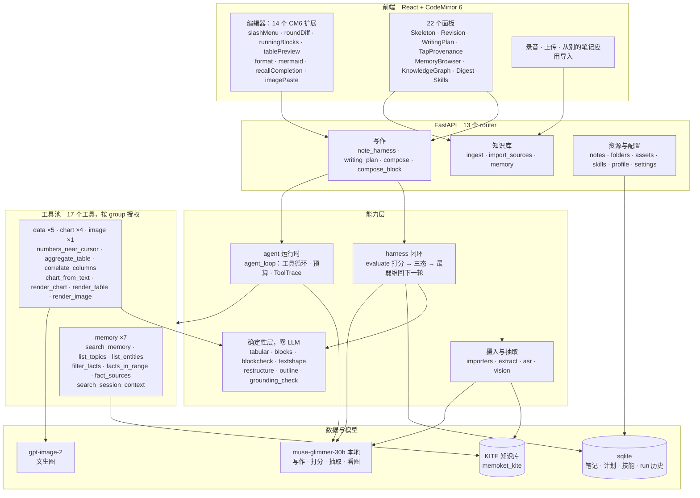

看这张图要抓住的三件事：

- **`PURE` 那一格没有任何出边。** 九个模块两千行，只 import 标准库。数字由它算、
  mermaid 由它拼、缺陷由它判——凡是规则判得准的，都不经过模型。
- **模型只有两个，且写作/打分/抽取/看图共用同一个本地模型。** 打分器和被打分的
  是同一个模型，这是这套系统最大的先天弱点，也是 `PURE` 那一格必须一直变厚的原因。
- **工具按 `group` 授权**：写整篇只开 `memory`，编辑器里画图才开 `data`/`chart`。
  加一个工具 = 写一个带装饰器的函数，不用动调度代码。

---

## 1. 问题：为什么写作 harness 比 coding harness 难

coding harness 有客观 oracle：代码跑不跑得起来、测试过不过，是外部世界给的答案，
模型骗不了它。写作没有这个东西。判断「这篇写完了没有」只能靠模型自己看，而模型对
自己的产出天然乐观。

这套系统在改造之前，「完不完整」的判断靠三样东西拼凑：模型自报一个完成标记（实测
命中率约三分之二）、对 beats 做二元核对、以及轮数上限兜底。三样都不是在评判质量，
只是在猜什么时候该停。

现在的做法是把「一组原则打分、驱动继续/完成/卡住」抽成机制本身，评分维度作为配置
从外部传入。这一步换来的不只是判断更准，更重要的是**缺陷有了名字**——「重复」
「连贯性」「事实贴合」各自是一个可以单独打分、单独归因、单独回归的东西。

---

## 2. 分层：边界按「能不能独立开源」划

全景：**一条闭环，四个入口，判据分两半。**

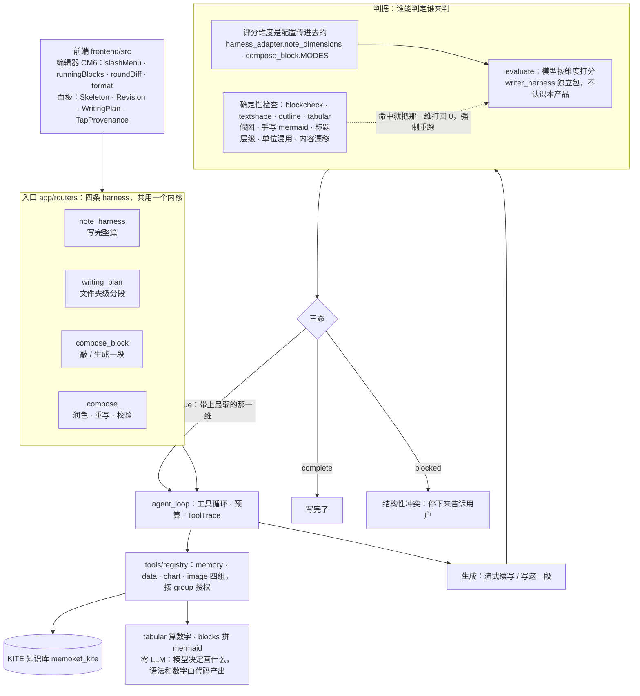

图里有三处是这套设计的要害，其余都是常规分层：

1. **判据分两半。** 能用代码判定的不交给打分器——实测打分器给一份通篇假图的
   产出打了 `has_charts=2`，因为它看见「柱状图：…」就以为有图。确定性检查跑在
   打分之后，命中就强制把对应维度打回 0 并重跑一轮，模型没有商量余地。
2. **数字和图表语法由代码产出，不经模型。** 让模型自己算均值它会编，让它自己写
   mermaid 会写出渲染不出来的语法。模型只决定算什么、画什么。
3. **维度是配置，不是包的一部分。** 换一套维度就是换一个领域的写作 harness，
   闭环本身不用动。

### 2.1 模块依赖

下面这张是**实扫 54 个模块的 import 得到的**，不是设计意图图。箭头方向就是
依赖方向，没有反向边——`writer_harness` 里没有一行 import 指向 `app`，
纯函数层没有一行 import 指向任何业务模块。

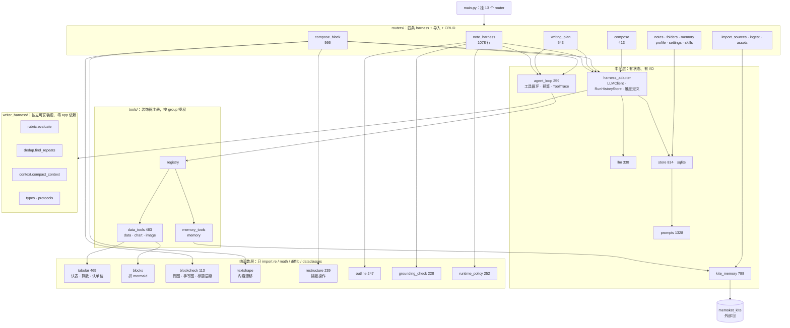

两件事只能从这张图上看出来，从代码里一个文件一个文件读是看不出来的：

- **纯函数层是叶子，没有任何出边。** 九个模块加起来两千行，全部只依赖标准库。
  这不是巧合——判据要是依赖了 store 或 llm，就没法在单测里构造一个输入直接断言，
  也就不可能有现在这批「拿真实产出当用例」的回归测试。
- **`writer_harness` 和 `app` 之间只有一条边，方向是 `harness_adapter` → 包。**
  这条边就是可开源性的全部代价：搬走这个目录，只需要在新家实现一遍
  `LLMClient` 和 `RunHistoryStore` 两个 Protocol。

`backend/writer_harness/` 是独立可安装的包，自带 `pyproject.toml` 和自己的
`tests/`，能脱离这个 app 独立跑 pytest。它不依赖 FastAPI、不认识 `spine`/`beats`
这类领域词汇、不做任何网络 I/O——搬成独立仓库只是把目录挪走，不用再解耦一遍。

| 层 | 位置 | 内容 |
|---|---|---|
| **独立包** | `backend/writer_harness/` | `evaluate()` 打分引擎（`rubric.py`，163 行，一次 LLM 调用 + 固定 JSON 契约 + 少量程序化后处理）· `find_repeats()` difflib 机械查重，纯函数无 LLM · `compact_context()` 渐进式压缩，不额外打模型 · `check_citations()` 已实现有测试、**尚未接入** · Protocol `LLMClient` / `RunHistoryStore`，不含任何具体实现 |
| **适配层** | `app/harness_adapter.py`（145 行） | `AppLLMClient` 包一层 `app.llm.complete()` · `SqliteRunHistoryStore` 落 `harness_runs` 表 · `note_dimensions()` / `section_dimensions()`：本产品具体的评分维度定义，是**配置**不是包的一部分 |
| **应用层** | `app/routers/` | `note_harness.py` 单篇闭环（394 行）· `writing_plan.py` 文件夹级多分段（428 行）· `compose.py` 检索与单点写作动作（319 行）· `app/prompts.py` 全部 system prompt（960 行，本轮改动集中在这里） |
| **工具池** | `app/tools/` | `registry.py` 注册表——加一个工具 = 写一个带装饰器的函数，按 `group` 授权 · `memory_tools.py` 七个 KITE 工具。见第 6 节 |
| **检索 profile** | `app/kite_profile.py` | 写作场景专用的 KITE 查询编译 prompt。profile 是这个库官方留的定制点，库自带那份是通用兜底。见 6.6 |
| **策略控制器** | `app/runtime_policy.py` | 把每轮反馈变成下一轮的运行参数——工具预算、续写温度、修订额度、检索方向。纯函数、可单测、每次调整都带原因。见第 8 节 |
| **Tool loop** | `app/agent_loop.py` | 执行工具循环、按预算截断、产出可溯源的 `ToolTrace`。刻意放在 app 层而不是包里——工具执行是 I/O，包不做 I/O |
| **前端** | `frontend/src/` | `SkeletonPanel` 骨架 · `RevisionPanel` 逐条接受修订（跟后端共用一套锚点语义）· `WritingPlanPanel` 分段计划 · `TapProvenance` 展示这一轮用了知识库哪几条事实 |

**为什么维度要做成配置而不是硬编码**：包只提供「给一组维度就能打分驱动闭环」的
机制。别的项目可以定义完全不同的原则——论证严密度、SEO 覆盖度——复用的是闭环本身，
不用被迫接受我们这套写作理论。

---

## 3. 流程：单篇笔记的一轮做什么

开跑前先做一次骨架：`SKELETON_SYSTEM` 读标题和正文，产出
`{spine 核心张力, beats 结构节拍}`。失败不中断，退回空骨架继续跑。
**这一步是整套系统里最脆弱也最关键的地方**——本轮所有下游失败最后都归因到了它，
详见第 9 节。

### 3.1 总流程

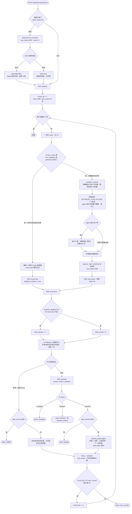

所有 `done` 分支收尾都会把本次 run 写入 `harness_runs`：轮数、终态、各维度终分、
未达标维度。

> **② 这个分叉是实测逼出来的。** 原来只判断「最弱项是不是 `non_repetition`」，
> 采样里跑出清晰的震荡：清理轮把重复修到达标后，最弱项变成 `beat_coverage`，
> 于是下一轮又去续写，续写又把重复和连贯性一起弄坏，来回拉锯五轮撞 `max_rounds`，
> 正文里堆了三个收束板块。

### 3.2 修订 pass 内部

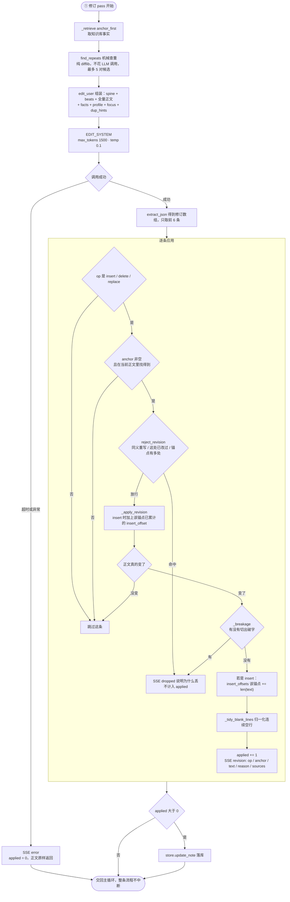

三处细节都是踩过坑之后加的：

- **`insert_offset`**：`_apply_revision` 的 insert 语义是「紧贴锚点末尾插入」。
  同一锚点上的第二条 insert 会插回锚点正后方，把第一条顶到后面去——模型顺序没错，
  是应用机制把顺序颠倒了。任何「在同一处连续补两段」都会中招。
- **修订调用的 try/except**：本地模型持续高负载下偶尔单次调用超过 300s，之前异常
  直接从 SSE generator 里冒出去，客户端看到的是连接被硬中断，不是一个正常的错误事件。
- **`sources` 字段**：`EDIT_SYSTEM` 的 JSON 约定一直要求模型自报依据的事实原文，
  `/api/edit` 那条路径读了，这条 harness 专用路径漏了——不是没有这个信号，是模型
  给了、这里没读。

后来又加了四道**丢弃**防线（`reject_revision()` + `_breakage()` + `structure_intact()`，
两条 harness 共用）。它们走 **`dropped` 事件而不是 `error`**——丢一条修订是防线
正常起作用，不是出错，一轮能丢好几条；用 `error` 报的话前端会渲染成一片红色。
共同点是：它们要拦的都是「别重复改」「别切坏」这类元指令，而整晚反复验证过，这类
指令写进提示词不管用，只有在应用阶段硬拦有效。

- **同义重写**：真实产出里同一个锚 ``因此，`ask memory` 进入本版。`` 被 replace 了
  三次，每次只加几个定语（三个版本两两相似度 0.78~0.91，真正改出东西的修订都在
  0.5 以下，阈值取 0.62）。第 2 轮甚至先 delete 掉第 1 轮刚 insert 的 300 字，再
  replace 同一处——**编辑 pass 在跟自己打架**。
- **这处已改过**：run 级 `edited_spans` 记锚点前 40 字。允许改第二次，它就会在同一段
  上来回打磨措辞，把轮次全耗在原地。
- **锚点有多处 / 切出破字**：用户要求锚点「用少的字符数去 match」之后锚变短了，而
  `content.find(anchor)` 找的是第一次出现，正文里同样的开头出现两次就切错位置。抓到的
  破字：「不要把未计算的节点写成已确定日期**：、**设计稿确认、页面开发……」——前半句被
  换掉、后半截留在原地。标点连缀是确定性可查的，比让模型自己检查靠谱。

### 3.3 SSE 事件时序

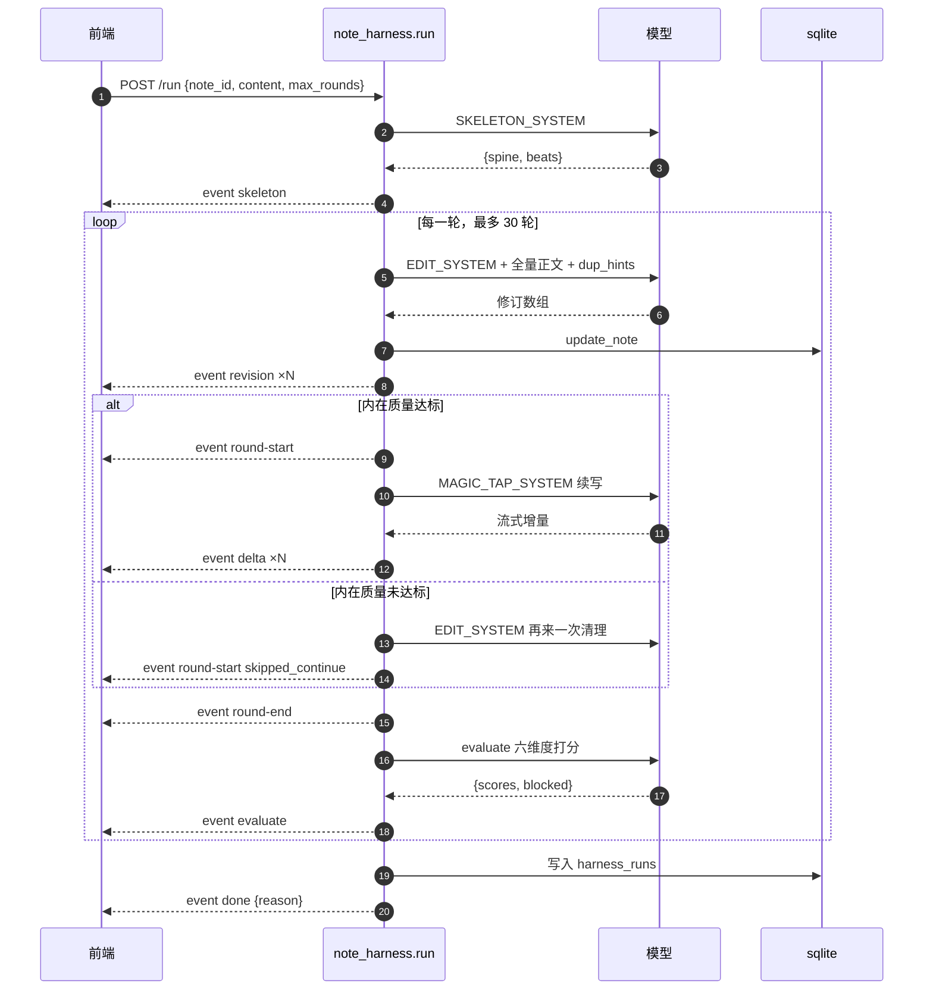

任何一步的异常都走 `error` 事件，不中断整个 session。

**安全网常量**：`MAX_ROUNDS_CAP=30` · `STALL_ROUNDS_CAP=2` ·
`CONTEXT_KEEP_LAST_CHARS=6000` · `SECTION_ROUND_CAP=4` · `PLAN_SAFETY_CAP=300`。
这些跟语义完成判断是分开的两套机制。

### 3.4 文件夹级 writing_plan

同一套模式套在多分段上。分段写作走 `MAGIC_TAP_SYSTEM`、编辑走 `EDIT_SYSTEM`，
所以写作/编辑规则两条 harness 都吃得到；差别在于没有 spine/beats，贴合度维度换成
`topic_fidelity`，而且多了一层「还缺不缺分段」的外循环。

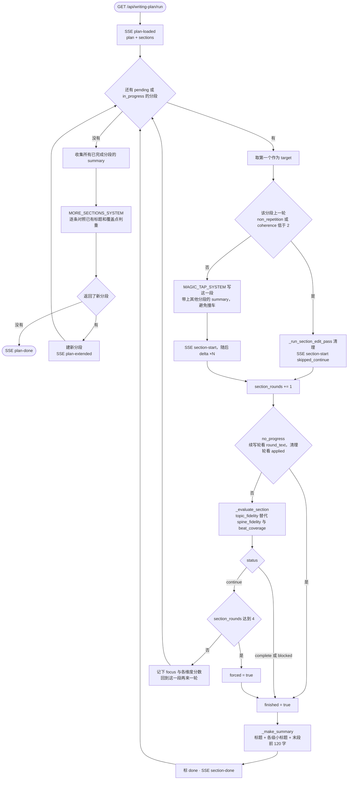

外循环由 `PLAN_SAFETY_CAP=300` 兜底。`_make_summary()` 之所以要把各级小标题也写进
摘要，是因为 `MORE_SECTIONS_SYSTEM` 判重只看得到 summary——它原来只保留最后一段，
判重时看不见这一段究竟覆盖了什么，于是追加了两个内容雷同的新分段。

### 3.5 一次真实 run 的状态流转

下面是质量采样里的一次真实五轮 run（`harness_quality_samples/0903-104252-长-已有结构.md`），
种子是一篇已有结构的定价决策笔记。这一份记录的是 `_INNER_QUALITY_DIMS`
修复**之前**的行为，正好把震荡完整地暴露出来：

| 轮 | 做了什么 | 打分结果 | 判定 |
|---|---|---|---|
| 1 | 修订 1 处 + 续写 | `non_repetition: 1` — 现金流可预测与成本覆盖在理由段和防守段以不同表述重复 | continue，weakest = non_repetition |
| 2 | **跳过续写**，清理 7 处 | `non_repetition: 2` 修好了，但 `beat_coverage: 1` — 订阅派价值论证的独立阐述不足 | continue，weakest 换成 beat_coverage |
| 3 | 修订 1 处 + 续写 | `non_repetition: 1` 又坏了，`coherence: 1` — 出现两个收束板块「下一步验证清单」与「决策框架」 | continue |
| 4 | **跳过续写**，清理 5 处 | `non_repetition: 2` 又修好，`beat_coverage: 1` 又不足 | continue |
| 5 | 修订 2 处 + 续写 | `coherence: 1` | continue → **max_rounds** |

第 2 轮和第 4 轮做了正确的事（跳过续写去清理），但第 3、5 轮又把它推回去了：
**清理成功之后最弱项必然换成一个「覆盖度」维度，旧逻辑只看最弱项的名字，于是判定
「该续写了」，续写又把刚清理好的重复和连贯性弄坏。**这份 trace 就是把
`skip_continue` 的判断依据从「最弱项是不是某一个」改成「内在质量这两项里有没有任何
一项没达标」的直接证据。

### 3.6 跨轮携带的状态

| 状态 | 生命周期 | 作用 |
|---|---|---|
| `content` | 全程，每轮被修订和续写改写后落库 | 唯一的真实产出 |
| `spine` / `beats` | **只在开跑前算一次，全程不变** | 骨架一旦把缺陷编码进去，此后每一轮都在服务这个伪目标，而且理由充分、无法自我纠正——第 9 节里标「根因」的头两条缺陷都出在这里 |
| `focus` | 上一轮的 weakest，喂给下一轮的 `edit_user` | 「这一轮优先检查这一项，其余原则仍适用但不用逐条重新过」 |
| `last_scores` | 上一轮全部维度分数 | 决定下一轮走续写还是清理 |
| `stall_rounds` | 连续无改动计数，有改动即清零 | 撞到 2 就以 `stalled` 收尾 |
| `revisions_applied` | 本轮计数，跳过续写那轮把两次 edit pass 相加 | 参与 stall 判断 |
| `insert_offsets` | **每次 edit pass 内部重置，不跨轮** | 只需要保证同一批修订内部的插入顺序，跨轮的锚点位置已经变了 |

---

## 4. Agent 运行时

上面所有 prompt 最终都落到同一个 OpenAI 兼容客户端 `app/llm.py`（205 行）。这一层
不做任何写作决策，只负责「把一次调用可靠地打出去、把结果可靠地解析回来」——但它
承担的模型特性适配比看上去多。

### 4.1 端点与供应商切换

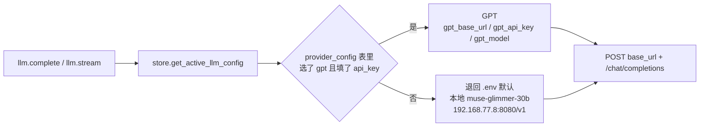

**为什么查表而不是读配置对象**：`Settings` 走 pydantic-settings + `@lru_cache`，
进程启动时读一次 env 就定死，改设置页不会实时生效——也不该为了这个改成运行时可变。
「部署环境切换」改 `.env` 重启，「用户在设置页切供应商」查 `provider_config` 表，
这是两件事。`llm.py` 和 `kite_memory.py` 都从 `get_active_llm_config()` 取。

### 4.2 三个模型特性的适配

这三条都是真实调用 + 读报错原文得出的，不是按文档猜的：

| 特性 | 现象 | 适配 |
|---|---|---|
| **思考内容关不掉**（本地模型） | 该模型总会先输出 `reasoning_content`。`reasoning_budget=0`、`thinking_budget=0`、`chat_template_kwargs` 都压不住，最好的一档仍有 467 字符思考 | 调用方传的是**想要的正文长度**，`REASONING_RESERVE = 600` 由客户端补上思考开销。不预留的话正文会被截断甚至为空 |
| **推理强度影响很大**（本地模型） | `reasoning_effort=low` 比 `high` 快 3 倍，单次调用约 10s vs 30s | 交互路径一律 `low` |
| **GPT 推理档参数不同** | 不认 `max_tokens` 只认 `max_completion_tokens`；`temperature` 只认默认值 1，传别的直接 400 `unsupported_value` | 统一用 `max_completion_tokens`（本地 llama.cpp 两个都认，实测能正确截断）；temperature **不是一开始就不发**，而是撞到这个特定 400 才剥掉重试 |

temperature 那条尤其要注意：本地模型的 temperature 调参是真实调过、有效果差异的
（修订用 0.1 追求确定性、续写用 0.7 要有变化），不能为了兼容 GPT 推理档就整体去掉。
所以兜底做成「先按原样发，只有撞上这一个特定错误码才降级重试」——非推理档模型的
调参完全不受影响。

流式路径实现这个兜底要多绕一步：流式响应不会自动缓冲 body，必须先 `aread()` 把
错误体读出来判断，而且得在真正开始消费 SSE 流**之前**判断好，不能像普通响应那样
拿到完整结果再决定要不要重试。

### 4.3 两个调用形态

| | `complete()` | `complete_raw()` | `stream()` |
|---|---|---|---|
| 用途 | 需要拿到完整 JSON 的场景 | 带 `tools` 的调用 | 正文续写 |
| 超时 | 300s | 300s | 600s |
| 默认 temperature | 0.3 | 0.3 | 0.7 |
| 返回 | 正文字符串 | **整个 assistant 消息** | 逐块正文 |
| `reasoning_content` | 不取，只读 `message.content` | 剥掉，不回传 | 丢弃，不进正文 |

`complete_raw()` 必须返回整条消息而不是正文字符串：模型决定调工具时 `content`
通常是空的，只取 `content` 会把 `tool_calls` 整个丢掉。返回值规整成只保留
`role`/`content`/`tool_calls` 三个键——`reasoning_content` 之类的私有字段回传给
某些端点会 400。

### 4.4 各调用点的实际参数

| 调用点 | prompt | 形态 | max_tokens | temperature |
|---|---|---|---|---|
| 骨架 | `SKELETON_SYSTEM` | complete | 800 | 0.4 |
| 修订 pass | `EDIT_SYSTEM` | complete | 1500 | 0.1 |
| 检索规划 | `RETRIEVAL_PLAN_SYSTEM` + tools | complete_raw | 700 | 0.3 |
| 续写 | `MAGIC_TAP_SYSTEM` | stream | 900 | 0.7 |
| 打分 | `writer_harness` 内置 | complete | 600 | 0.1 |
| 分段计划 | `PLAN_SYSTEM` | complete | 600 | 0.4 |
| 判断还有更多分段 | `MORE_SECTIONS_SYSTEM` | complete | 400 | 0.4 |
| 阶段回顾 | `DIGEST_SYSTEM` | complete | 1200 | 0.3 |
| 选中重写 / 润色 | `REWRITE` / `POLISH` | complete | 500 | 0.5 |
| 选中校验 | `VERIFY_SYSTEM` | complete | 800 | 0.1 |

`max_tokens` 是**正文长度**，客户端会再加 600 的思考预留发出去。

### 4.5 JSON 解析容错

骨架、修订、打分、分段计划全都靠模型返回结构化 JSON，所以 `extract_json()` 是
运行时里最容易被静默拖垮的一环。三处都是踩过坑才有的：

- **先看哪个定界符先出现**，不是固定先试 `{`。修订建议返回的是数组，固定试 `{`
  会把整个数组截成它的第一个元素。
- **用括号栈而不是单一 depth 计数器**。修订建议是「数组套对象」，栈顶随时在 `]`
  和 `}` 之间切换；单一计数器在断尾修复时会漏掉内层对象——实测数组只补了外层 `]`，
  内层 `{` 没人管，`json.loads` 直接炸。
- **断尾修复**：模型输出被截断是真实发生的，而且不只在撞 `max_tokens` 时。先补上
  未闭合的字符串引号，再按栈序由内向外补齐所有括号，重试一次。

### 4.6 技能叠加

每个调用点取一次 `store.enabled_skills_for_scope(user, scope)`，用
`prompts.compose_system()` 把用户启用的写作技能按顺序追加在基础 system prompt 之后，
措辞是「在不违反上面规则的前提下按顺序叠加生效」——技能只能加约束，不能推翻基础规则。

11 个 scope：`skeleton` · `edit` · `magic_tap` · `section_write` · `plan_generate` ·
`more_sections` · `verify` · `rewrite` · `polish` · `expand` · `digest`。

### 4.7 失败边界

运行时对失败的处理分三档，取决于这一步是不是关键路径：

| 失败点 | 处理 | 理由 |
|---|---|---|
| 骨架生成 | `error` 事件 + 退回空骨架继续 | 没有 spine/beats，`evaluate()` 仍能跑，判断依据变弱但不是不能判 |
| 修订调用 | `error` 事件 + 本轮 `applied = 0` | 修订本来就是「这一轮尽量改一点」，不是关键路径；之前没有 try/except 时异常直接从 SSE generator 冒出去，客户端看到的是连接被硬中断而不是错误事件 |
| 打分调用 | 返回 `None`，**不吞成某个正常结果** | 调用方必须能区分「真判成 continue」和「这轮压根没判成」，后者走 stall 计数 |
| 续写调用 | `error` 事件 + `break` 出轮循环 | 这一轮确实没产出内容，继续下去没有意义 |

---

## 5. 上下文的组织

每次调用的 user prompt 都是由若干个 `【】` 标记的块按固定顺序拼起来的，空块直接
省略。顺序是有意的：**约束在前、材料在中、正文在后、指令收尾**——正文放在最后，
模型读到指令时正文还在最近的位置。

### 5.1 块的组成

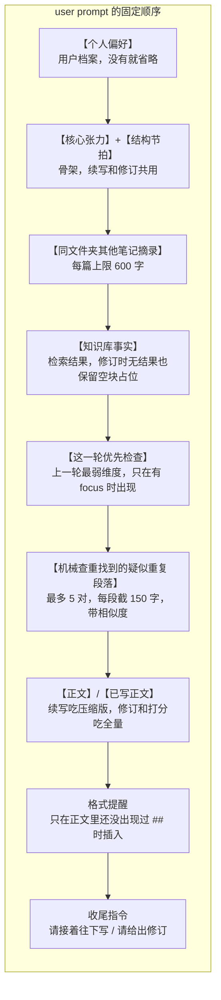

### 5.2 每个调用点拿到哪些块

| 块 | 骨架 | 修订 | 续写 | 打分 | 分段写作 |
|---|:--:|:--:|:--:|:--:|:--:|
| 个人偏好 | ✓ | ✓ | ✓ | ✓ | ✓ |
| 核心张力 / 结构节拍 | — | ✓ | ✓ | ✓ | — |
| 分段主题 / 计划总目标 | — | — | — | ✓ | ✓ |
| 其他分段小结 | — | — | — | ✓ | ✓ |
| 同文件夹笔记摘录 | — | — | ✓ | — | ✓ |
| 知识库事实 | — | ✓ | ✓ | ✓ | ✓ |
| 这一轮优先检查（focus） | — | ✓ | — | — | ✓ |
| 机械查重候选 | — | ✓ | — | ✓ | ✓ |
| 正文 | 全量 | 全量 | **压缩** | 全量 | 全量 |

打分那一列的块由 `harness_adapter` 组装成 `context` 字典传进包里，`evaluate()`
原样渲染成 `[核心张力]` `[结构节拍]` `[知识库事实]` 这样的段——**包本身不认识这些
key 叫什么**，这是它不用认识领域词汇的关键设计。

### 5.3 全量还是压缩

只有续写吃压缩过的正文，其余三处都吃全量：

| 调用点 | 正文 | 理由 |
|---|---|---|
| 续写 | `compact_context()`，保留最近 6000 字 | 长会话里 prompt 成本不能随轮数线性增长 |
| 修订 | 全量 | 核心工作就是抓跨文档的重复和偏题，压缩了正好漏掉要抓的东西 |
| 打分 | 全量 | 同上，而且 `non_repetition` / `coherence` 本来就要通读全篇小节 |
| 骨架 | 全量 | 只跑一次 |

`compact_context()` 是纯函数、不打模型：超过阈值时保留最近 6000 字原文，更早的按
`##` 切小节，每节折叠成「首行 … 末句」一行摘要。三个细节：

- **不在小节中间切**——回退到最近的小节边界，保留的尾部必须从一个完整小节开始，
  不能是半压半原的碎片。
- **摘要带前缀声明**「以下是更早内容的摘要，仅供参考，不是原文措辞」，避免模型把
  摘要当原文引用。
- **压完变长就退回原文**。小节很短时，折叠后的长度可能接近原长，加上固定前缀反而
  更大——一个把输出变大的「压缩」是自相矛盾的。

### 5.4 检索策略

harness 内部的检索走 `anchor_first`：query 用**标题 + 核心张力 + 最后三条节拍**
领头，再接正文末尾 300 字。用户手动触发的 magic tap 保持原策略（正文末尾 600 字 +
hint），因为那里用户的意图就是「接着这里往下写」。

这个改动是被一次失败的修复逼出来的：第一版方案是往 query 里补正文开头 300 字，
五路对照实测跟原始版本表现**完全一致**，等于没修。换成锚点领头之后才真正改变了
召回内容。

> 曾经接过 KITE 的 `compile_plan()` 做语义查询计划，指望比拼接正文尾部更懂语义。
> 真实对照测试的结果是既慢又不准：两次查询返回的全是不相关事实（其中一次扯到完全
> 不同领域的内容），而老办法两次都准确命中，且快 15–30 倍（亚毫秒 vs 10 秒以上）。
> 已退回。

### 5.5 长度上限一览

| 项 | 上限 | 在哪 |
|---|---|---|
| 续写正文保留原文 | 6000 字 | `CONTEXT_KEEP_LAST_CHARS` |
| harness 检索 query 的正文尾部 | 300 字 | `TAIL_CHARS_FOR_HARNESS` |
| magic tap 检索 query 的正文尾部 | 600 字 | `TAIL_CHARS` |
| 同文件夹笔记摘录 | 每篇 600 字 | `_FOLDER_NOTE_EXCERPT_CHARS` |
| 选中扩展时展示的相邻正文 | 150 字 | `_EXPAND_NEIGHBOR_CHARS` |
| 机械查重候选对 | 5 对，每段 150 字 | `find_repeats` + `edit_user` |
| 每轮采纳的修订条数 | 前 6 条 | `_run_edit_pass` |
| beats 条数 | 6 条 | 骨架解析时截断 |
| 检索事实条数 | 修订与打分 8 条 · 续写 6 条 | `_retrieve(limit=...)` |

### 5.6 一条容易忽略的格式约束

三处续写型 prompt 共用一条提醒，只在正文里**还没出现过 `##`** 时才插入：
`MAGIC_TAP_SYSTEM` 的格式指令是「延续已有格式风格」，但一篇还没有任何标题的笔记
没有风格可延续。实测这会让模型要么整段写成不分点的散文，要么用 `**加粗**` 短语
冒充小节标题——于是同一篇笔记里一节是 `**标题**`、另一节是 `## 标题`，读起来不像
统一体例写出来的。已经有标题的轮次不插这条，交给「延续已有风格」自然管。

### 5.7 哪些是预装配的，哪些交给 agent 自己决定

三个环节里只有**续写**是 agent 自主检索的，修订和打分继续预装配：

| 环节 | 谁决定查什么 | 为什么 |
|---|---|---|
| 修订 | 代码，`_retrieve` anchor_first | 修订要通读全篇找毛病，需要的是"这篇周边有哪些事实"这种背景，不是针对性查询；而且加一次工具往返就多一次模型调用 |
| **续写** | **agent 自己** | 要写到用户过往记录时，"该查什么"只有正在写的模型知道；见第 6 节 |
| 打分 | 复用本轮实际用过的事实 | 打分要审的就是正文用了这些事实用得对不对，不该另外检索一批 |

其余部分每次调用前都重新装配，没有跨轮复用：

| 内容 | 频率 | 说明 |
|---|---|---|
| 修订的知识库检索 | 每轮 1–2 次 | 清理轮跑两次修订 pass |
| 机械查重 `find_repeats()` | 每轮 2–3 次 | 修订和打分各算一次，纯 difflib 不花 LLM 调用 |
| 正文压缩 `compact_context()` | 每次续写 | 正文变了就重算 |
| 个人偏好 `_profile()` | 每次调用 | 直接查 sqlite |
| 启用的写作技能 | 每次调用 | `enabled_skills_for_scope(user, scope)` 现查现拼进 system prompt |

**不动态的只有两处**：`spine`/`beats` 开跑前算一次全程不变（见 3.6）；以及
`UserMemory._index()` 按文件 mtime 缓存 codebook XML 的**解析结果**——缓存的是
索引不是检索结果，`recall()` 本身每次真跑，零 LLM、亚毫秒。

---

## 6. 工具池：让 agent 自己决定查什么

### 6.1 为什么续写这一步值得付这个代价

预装配检索只有一条路径：把标题、核心张力、末三条节拍和正文尾部拼成一个 query，
丢给 `recall()` 取 top-N。但 KITE 本身的能力面宽得多——主题树、实体、结构化过滤、
时间范围、以及**把一条事实回溯到原始对话行**。这些能力此前只有前端用得到，写作
agent 一条都碰不到。

更根本的是：**「该查什么」只有正在写的那个模型知道**。正文写到某个人名要展开，
该查的是这个人；写到某次决定的来龙去脉，该查的是那段时间的记录——这些拼一个固定
query 拼不出来。

代价是每轮多一次模型调用（本地 20–90 秒）。所以只在续写这一步付，修订和打分继续
预装配（理由见 5.7）。

### 6.2 注册表

加一个工具 = 写一个带装饰器的函数，不用改 harness、不用改 `llm.py`、不用改任何
调度代码：

```python
@register(
    name="search_memory",
    description="按关键词检索用户的个人知识库……",
    params={"query": {"type": "string"}, "limit": {"type": "integer"}},
    required=["query"],
    group="memory",
)
def search_memory(ctx: ToolContext, query: str, limit: int = 8) -> str:
    ...
```

三条设计约定：

- **工具返回字符串，不返回结构化对象**。结果最终要作为 `role=tool` 消息给模型读，
  让每个工具自己决定怎么渲染得便于理解，比统一 `json.dumps` 贴合语义——而且
  `json.dumps` 出来的中文会变成 `\uXXXX`，白白浪费 token。
- **`group` 就是授权边界**。以后接 web browsing、代码执行这类有外部副作用的能力，
  给它们各自的 group，harness 用 `specs(groups=[...])` 决定暴露哪些，注册表机制
  不用改。
- **`dispatch()` 永不抛异常**。工具名不存在、参数不是合法 JSON、缺必填参数、执行
  炸了——每一种都转成给模型看的文本。模型看到「参数不对」是能自己纠正的信息，
  抛出去只会让整轮 harness 中断。

### 6.3 七个 KITE 工具

| 工具 | 能力 | 关键词召回做不到的地方 |
|---|---|---|
| `search_memory` | 关键词检索，返回带 id 的事实 | —— 这条就是原来的预装配路径 |
| `list_topics` | 主题树 + 各自事实条数 | 先看知识库里实际有什么，再决定往哪查 |
| `list_entities` | 人 / 组织 / 产品 + 事实条数 | 查清楚用户自己怎么称呼某个人或产品 |
| `filter_facts` | 按主题 / 实体 / 类型精确过滤，主题含子主题闭包 | 精确、不漏，不受关键词串味影响 |
| `facts_in_range` | 日期区间内全部事实，时间正序 | 写复盘、周报这类跟时间强相关的内容 |
| `fact_sources` | **把一条事实回溯到原始对话行** | 事实是压缩过的转述，原话往往有更多上下文 |
| `search_session_context` | **多跳**：先按内容定位到某次会话，再取那次会话里的其他内容 | 词法检索**结构上做不到**——见 6.6 |

前六个零 LLM、毫秒级，可以放心让模型多调几次；第七个要花一次查询编译（约 10-13 秒），所以 `max_calls_per_round=1`，描述里也明说了它的代价，让 agent 自己判断值不值。唯一的成本是 tool call
的往返，所以工具粒度要够粗：宁可一次返回一屏，也不要让模型分五次问同一件事。

### 6.4 两段式，以及第一版为什么失败

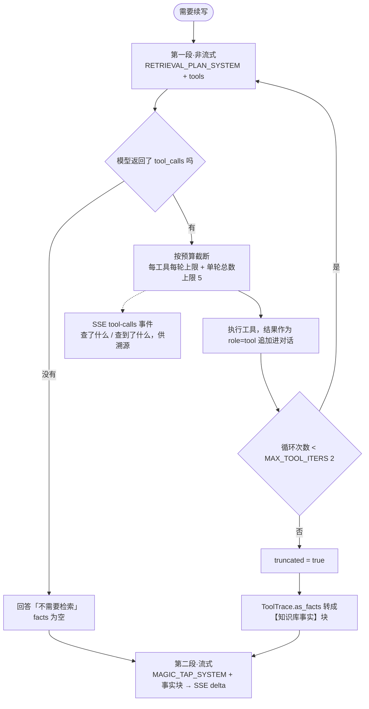

**第一版是把工具直接挂在续写调用上，实测模型一次都不查。** 4300 字的续写
system prompt 通篇在讲「接着往下写」，工具说明缀在最后说「你自己判断」，模型就
解析成「我不用查」——然后编了一整段知识库里根本没有的内容（「散热与功耗收敛」
「结构件公差」）。

把检索决策单独拎出来成为一次调用之后，模型才真的会去查：实测它会先 `list_topics`
看知识库有什么，再针对性 `search_memory`。**决策权依然在它手上**——它可以回答
「不需要检索」，那条路径完全无损；变的只是我们在什么语境下问它这个问题。

两个实现细节：

- **工具阶段必须非流式**。续写是流式的、增量直接推给前端当 `delta`；把工具调用
  混进流式，前端会先收到一堆工具参数碎片。所以工具结果转成续写 prompt 本来就
  认识的【知识库事实】块，第二段是一次干净的流式调用，完全不涉及工具协议。
- **每轮有预算**。模型会一次并行发好几个同义查询（实测本地模型对一个问题一口气
  发了三个 `recall`，query 只是换了语序）。全放行只是浪费往返，按工具名截断。

### 6.5 失败与降级

工具阶段整体失败（端点超时之类）就退回「没查」，续写照常进行——跟修订调用失败
是同一个原则：不是关键路径就不许炸掉主流程。单个工具失败则变成一条给模型看的
文本，模型可以据此改参数重试。

### 6.6 多跳检索：为什么需要它，以及怎么让它真的能用

**词法检索结构上做不到多跳。** 「在讨论 X 的那次会议里，除了 X 还提到了什么」
这种意图，一个词袋根本表达不了——第一跳要按内容定位到 session，第二跳要在那个
session 范围里展开。KITE 的 plan 代数支持这个：

```json
{"stages": [
  {"name": "anchor", "where": {"grep": "装不上", "topics": ["work_product"]}, "head": 3},
  {"name": "rest",   "where": {"units": "$anchor.units"}, "head": 12}]}
```

引用解析（`$anchor.units`）是**确定性的，LLM 只写模板**。同一个问题的实测对照：

| | 返回 |
|---|---|
| `search_memory`（词法） | 知识库里《秘密花园》的英文段落——完全不相关 |
| `search_session_context`（多跳） | 手机端打开测试 / 多机型加载 / 图片适配 / 飞书群预览链接反馈——**全部来自同一次会议（2026-02-01）** |

**但库自带的 profile 让这个能力完全用不出来。** `compile_plan()` 的 prompt 全部
来自 `profile.COMPILE_PROMPT`——profile 就是官方留的定制点，而默认那份只有 13 行，
是通用兜底。三个实测问题：

| 问题 | 表现 | 定制后 |
|---|---|---|
| **schema 里根本没有 `stages`** | 模型不知道多跳存在，永远编不出多跳计划 | 补上后立刻编出 `stages` |
| **只说了一句 "distinctive word stems"** | 模型照样写整句 `"APP 安装不上"`，而 `grep` 是对事实文本的**字面正则硬过滤**，这个短语在 20361 条事实里命中 0 条，整条 query 报废 | 明确要求 2-4 字词干 → `装不上`、`样机` |
| **`{units}` 塞进 2427 个 session 的 id=date** | 占 73,080 字符里的 68,510（**93.8%**），是 compile 要 20-38 秒的主因 | 换成月度直方图，**68,510 → 137 字符** |

`str.format` 忽略模板没引用的键，所以模板不写 `{units}` 那 68K 就不会进 prompt，
**不需要改库里任何代码**。而且它存在的理由（让模型挑出具体 session id）正是
`stages` 让它不必要的事——第一跳去找，第二跳绑定。这两个缺陷本来就是连着的。

顺带修掉的第四个问题：**实体清单是按字母序截断的**。库里做法是
`sorted(vocab.entities)[:120]`，在这个知识库的 1203 个实体上切在 `canberra`——
引用次数最高的 20 个里 **16 个根本没进 prompt**（包括用户自己的产品名 `memo_cat`、
他本人 `terrence`、`kickstarter`、`google`），而进去的 120 个里 40 个是纯数字
垃圾码（`110`/`210`/`3085`/`8g`/`18号拍摄`），还包括《秘密花园》的人物。模型只能
在这份任意前缀里挑，所以编出来的 plan 老是 `entities:["app"]`——**它没得选**。
改成按引用次数排序、剔掉说话人标签和垃圾码之后，`kickstarter` 立刻被用上了。

汇总：

| | 库默认 | 写作 profile |
|---|---|---|
| prompt 长度 | 73,080 字符 | **5,741** |
| compile 耗时 | 20-38s | **10-13s** |
| 多跳 | 不可能 | 可用 |
| 实体清单 | 字母序前 120，含 40 个垃圾码 | 引用次数前 80，无垃圾码/说话人标签 |

### 6.7 为什么是七个独立工具，而不是一个融合检索

试过三种「替 agent 做选择」的做法，**每一种都在某类问题上更差，而且失败场景互不重叠**：

| 做法 | 强在哪 | 结构性缺陷 |
|---|---|---|
| 纯词法 | 快（2s）、直接命中好 | 跨会话串味；不会多跳 |
| 多跳 `stages` | 「那次会里还有什么」精准 | 慢；单跳时不如词法 |
| 官方融合通道（`_fuse_retrieval_channels`） | 有时更好 | 用 KITE 内部分数重排（行数 + 有没有用结构过滤），**会把精准的多跳结果稀释掉**——实测多跳答案被 date 通道的月度总结挤掉 |
| 按笔记上下文重排 | 异域噪声（英文学习材料）好用 | **偏向重复笔记里已有的内容**，对「还有什么」类问题有害：实测把多跳查到的新内容全排掉，选出跟正文字面重合的 |

最后一条尤其要记：它衡量的是「像不像已经写过的」，不是「有没有用」。一次早期
测量显示它去噪 +93%，但那是个容易样本（噪声是完全异域的英文材料）；换成同领域
噪声就失效了。

所以不在代码里替 agent 选，**保持通道独立、让它按问题类型挑工具**。混合发生在
「agent 一轮里调多个工具」这一层，而不是一次检索内部把通道搅在一起——实测它会
先 `list_topics` 看知识库有什么，再 `filter_facts` 按主题精确取，再补几次
`search_memory`。

---

## 7. 评分：六个维度，两组语义

打分档位：`0 不足` / `1 部分` / `2 达标`。

**维度是按模式装配的，不是固定六条。** 打磨模式（`mode=polish`，只修不写）会摘掉
`beat_coverage` 和 `material_use`——这两条衡量的都是「写了多少」，而打磨被明确禁止
写。实测代价：一篇有重复标题的短笔记跑打磨，`beat_coverage` 判 0（节拍确实没写），
于是永远到不了 complete，跑满三轮撞 `max_rounds`，每轮还被「最弱是节拍覆盖」这条
诊断推着去写它不许写的东西。**拿一个它无权改善的维度去打分，闭环就不可能收敛。**

**打分看的是整次 run 累积的事实，不是本轮检索的那批**（`run_facts`）——见 9 里
「打分拿本轮材料审判整篇」那条。

| 维度 | 类别 | 说明 |
|---|---|---|
| `spine_fidelity` | 覆盖类 | 正文是否紧扣核心张力展开，还是散成流水账。分段场景换成 `topic_fidelity`：是否紧扣本分段主题、有没有写到该由别的分段覆盖的内容 |
| `beat_coverage` | 覆盖类 | 每条结构节拍是否有对应内容实质存在。不要求写到极致，只要求这个功能真的在正文里起作用 |
| `non_repetition` | **内在质量** | 跨段落、跨轮次的重复论点。**重点看小节之间有没有主题撞车**——两节标题不同、措辞也完全不同，讲的却是同一件事，机械查重查不出来，只能靠通读小节标题判断 |
| `coherence` | **内在质量** | 五项清单：多个结尾、标题层级不一致、编号断裂、体例不统一、自我拆台。本轮新增，加进去之前这些缺陷对评分系统完全隐形 |
| `factual_grounding` | 覆盖类 | 只看「用到的地方对不对」，不看「用了多少」。明确写死：检索到的事实没有被全部用上**不算不足** |
| `style_fit` | 条件启用 | 仅在该用户填了个人偏好档案时加入维度列表 |

标「内在质量」的两项决定第 3 节 ② 的分叉。

> **`factual_grounding` 曾经在惩罚正确行为。** 它给「未使用 XX 事实……事实覆盖
> 不全」打 1 分，跟续写侧「不相关的事实可以跳过」的规则直接冲突，而且诱发编造——
> 采样里出现过「引入大量未在知识库中出现的具体日期与人物」。改成只判「用错」不判
> 「用得少」之后，同一份材料从 3 轮收敛到 2 轮。

---

## 8. 反馈闭环：让 runtime 跟着结果调整

### 8.1 此前哪些信号被产生然后丢掉

接策略控制器之前，整个 runtime 是开环的。由反馈驱动的行为**只有两条**：
`evaluation.weakest` 变成下一轮修订 prompt 里的一行标签，`last_scores` 里那两个
内在质量维度决定要不要跳过续写。其余全部丢掉：

| 信号 | 每轮都在产生 | 此前去向 |
|---|---|---|
| 每个维度的 `note` | 打分模型写的自然语言诊断，例如「使用了知识库中未出现的具体日期和人物」 | **完全没用**——只有 `level` 被读，`note` 从没进过任何 prompt |
| `ToolTrace` | 查了几次、结果是不是空的、有没有被截断 | 只发给前端展示，不影响下一轮 |
| `blocked_reason` | 打分模型判定卡住的原因 | 只发给前端 |
| `RunHistoryStore.recent()` | 这篇笔记过去几次 run 的终态和未达标维度 | **一次都没被调用过**，跨 run 学习是死代码 |

而这些参数从头到尾是常数：工具预算 2、暴露哪些工具、续写 temperature 0.7、每轮
采纳修订 6 条、检索策略。**上一轮 `factual_grounding` 拿 0 分，下一轮的检索预算和
策略跟拿 2 分时一模一样**——等于让它拿着同样的信息再赌一次。

### 8.2 控制器是确定性代码，不是再叫一次模型

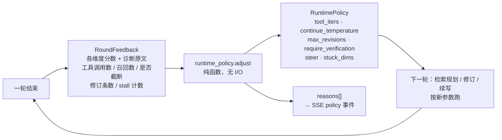

整个项目反复验证的结论就是**模型的自我判断不可靠**——它会把编号错乱读成刻意修辞、
会在该查的时候不查、会给「没用完检索结果」扣分。控制器要是也交给模型，出问题时
既不可复现也无法归因。所以 `adjust()` 是纯函数：不读全局状态、不做 I/O、同样输入
永远同样输出，13 个单测毫秒级跑完，每条规则对应一个真实观测到的失败。

### 8.3 规则表

每条规则都注明是被哪个真实失败逼出来的。**没有观测支撑的规则不加**——凭空调参数
只会让行为更难解释。

| 观测 | 调整 | 被哪个失败逼出来的 |
|---|---|---|
| `factual_grounding < 2` | 工具预算 +1、要求 `fact_sources` 溯源核对、**把打分的诊断原文喂回检索规划** | 正文写出「4月10号硬件就位」「Speaker E 5月1号测 APP」，打分判「查无此事」，而下一轮策略一点没变 |
| 工具查了但零召回 | 换路径：`list_topics → filter_facts`，不再换措辞重试 `search_memory` | `search_memory("Speaker E 5月1号 APP体验")` 召回了知识库里的英语学习材料——关键词召回长查询会串味 |
| `coherence < 2` | 续写温度 −0.2、修订额度 +2 | 同一小节标题出现两次、两个收束板块。这类问题靠「再写一段」好不了 |
| `non_repetition == 0` | 修订额度 +2 | 清理需要额度，不是需要更多内容 |
| 同一维度连续 ≥2 轮不达标 | 升级提示：明确说「上一轮的做法没效果，换思路」 | 清理↔续写震荡五轮撞 `max_rounds`——单轮分数看不出震荡，只有连续计数看得出 |
| 事实达标且上一轮没用工具 | 工具预算 −1 | 工具每多跑一轮 = 一次本地模型调用 20–90 秒，没必要就别付 |

所有旋钮都有边界（`tool_iters` 0–4、`max_revisions` 4–10、温度 0.3–0.8），连续多轮
不达标时参数不会无限膨胀把单轮时间拖爆。

**最有价值的一条是把 `note` 喂回去。** 打分模型每轮都在写自然语言诊断，此前只有
分数被用。现在那句话原封不动进下一轮的检索规划——它比我们更清楚哪里不对，我们
只决定「要不要提、往哪个方向提」。

### 8.4 跨 run

开跑前先读 `SqliteRunHistoryStore.recent(note_id, limit=3)`。同一篇笔记如果多数
次都栽在同一个维度上，第一轮就带着对应策略开跑，不用每次重新踩一遍。只认「多数
次都不达标」的维度——偶尔一次是噪声不是经验。历史推出的策略不带 `stuck` 计数，
那是本次运行内部的计数，让它自己重新数。

### 8.5 可观测

每次调整都通过 SSE `policy` 事件把 `RuntimePolicy.snapshot()` 和 `reasons` 发给
前端。跟 `tool-calls` 事件是同一个诉求：**runtime 的决策不能是黑箱**，用户要能看到
「这一轮为什么这么跑」。

### 8.6 还没纳入闭环的

说清楚边界：**策略目前只调续写侧**。修订 pass 拿到的仍是固定的 `anchor_first`
检索，打分的维度集合也不随反馈变。这两处要不要纳入闭环还没有实测支撑，所以没做——
在没有观测的地方加规则，就是 8.3 那句「没有观测支撑的规则不加」要避免的东西。

---

## 9. 缺陷账本：二十八个问题修在哪

每一条都有同材料的修复前／修复后对比，不是推测。标 **【根因】** 的两条是最深的
一层：它们解释了此前多数看起来互不相关的失败。

| 缺陷 | 表现 | 根因 | 修在哪 |
|---|---|---|---|
| **编号被当成修辞【根因】** | 编号 1、2、4、3 的笔记，修订先把编号改对，下一条修订又改了回去，理由是「结构节拍要求以 1-2-4-3 的编号错位呈现」 | 骨架从有缺陷的正文生成，把缺陷编码进了 beats，缺陷变成了此后每一轮都要服务的目标 | `SKELETON_SYSTEM` |
| **矛盾被当成张力【根因】** | 通篇批判「唯速度论」、结尾却写「唯一重要的就是速度」，系统新增一整节替这句矛盾辩解 | 同上。骨架把这句读成了「用自相矛盾制造自我拆台的反转张力」 | `SKELETON_SYSTEM` |
| 缺陷当写作素材 | 续写围绕「编号错乱会让读者怀疑清单可信度」写了两大段分析，原错误一字未动 | 续写侧没有「正文里的毛病不是话题」这条约束 | `MAGIC_TAP_SYSTEM` |
| 另起一节写正确版 | 编辑不换编号，而是新增《统一排序与重编号》重写一遍正确列表，错误还在、正文臃肿一倍 | 编辑侧缺少「机械错误必须就地改」的明确指令 | `EDIT_SYSTEM` |
| 中段收束语 | 结构上补了真正的收尾节，但正文中段那句「综上所述」原样留着，读者读到中间以为文章完了 | 机械缺陷清单里没列这一类 | `EDIT_SYSTEM` |
| 脚手架标题 | 末节标题写成 `## 收束`，同一篇连续三轮复现 | 结构节拍的功能名直接被当成了正文标题；只在写作侧加规则拦不住 | `MAGIC_TAP` + `EDIT` 双侧 |
| 小节主题撞车 | 已有《订阅制的具体设计》，续写又起《订阅分层与用量计费的落地细节》，把同样四点重说一遍 | 只有句子级去重规则，没有小节级；措辞不同，difflib 抓不到 | `MAGIC_TAP` + `non_repetition` |
| 凭空数字当事实 | 种子里一个数字没有，续写写出「A10 GPU 0.0003 美元/秒」「基础版 $9/月」并据此讨论落地规则 | 没有任何约束区分「推演用的假设数」和「已确定的数」 | `MAGIC_TAP_SYSTEM` |
| 提示词示例泄漏 | 写在规则里的示例标题被原样抄进正文，读起来完全合理 | 举的例子恰好和笔记主题同域，模型把「规则的示例」当成了「要写的内容」 | 示例改抽象 + 新增自动检查 |
| insert 顺序颠倒 | 同一锚点上的两条 insert 应用后顺序反了，四项列表变成 1、2、4、3 | `_apply_revision()` 每条都从锚点末尾插入，后插的把先插的顶到后面 | `insert_offset`，两条 harness |
| 清理↔续写震荡 | 五轮拉锯撞 `max_rounds`，正文堆了三个收束板块 | `skip_continue` 只看最弱维度的名字，清理成功后最弱项一换就又去续写 | `_INNER_QUALITY_DIMS` |
| **事实的时间信息从未进过 prompt【根因】** | 正文大量在写「硬件 4 月 10 号出来」这类带时间的内容，而打分判 `factual_grounding` 时根本看不到事实的日期，没法核对 | 两处：`search_memory` 读 `r.get("when")` 而 `recall()` 行的日期键是 `date`（每条都显示「无日期」）；`_retrieve()` 只返回 `r["text"]`，日期、说话人、来源全丢 | 两条路径都补上日期，事实进 prompt 时带 `[2026-04-10]` 前缀 |
| **三个环节各查各的【根因】** | 正文写的是修订那批检索到的事实，打分环节手里是自己另外检索的第三批，于是判「知识库中查无此事」，`factual_grounding` 给 0 | 修订、续写、打分各自独立 `_retrieve()`，事实集互不相同——打分拿一个它没见过的事实集去审判正文 | 打分改为复用本轮实际用过的事实，顺带省掉一次检索 |
| 挂了工具但模型不查 | 把工具直接挂在续写调用上，模型一次都不调，还编了整段知识库里没有的内容 | 4300 字的续写 system prompt 通篇在讲「接着往下写」，工具说明缀在最后说「你自己判断」，模型解析成「我不用查」 | 检索决策独立成一次调用（`RETRIEVAL_PLAN_SYSTEM`），见 6.4 |
| **打分拿本轮材料审判整篇【根因】** | `factual_grounding` 从 2 掉到 0，判词说「"6月中下旬交付""7月初到达消费者"等具体节点未被知识库明确支持」，而第 1 轮的检索结果里明明写着「第一批货预计在2026年6月中下旬交付，消费者最快可能在2026年7月初收到货」 | `round_facts` 每轮重置，正文却是累积的——第 3 轮的打分拿第 3 轮的材料去审判包含第 1 轮内容的整篇。是「三个环节各查各的」的跨轮残留形态（当时只修了同一轮内的一致性）。**产出越长误判越多，所以它是随写作质量变好才暴露的** | `run_facts` 累积整次 run 的事实，打分/`material_use` 兜底/材料耗尽判定/replan 四处都改用它 |
| 编辑 pass 跟自己打架 | delta 为 0 的轮次字数照涨、`non_repetition` 永远停在 1、用户说「感觉啥也没改」 | 编辑 pass 每轮独立跑，没有任何东西告诉它上轮改过哪儿，于是反复同义重写同一段 | `reject_revision()` 的前两条，见 3.2 |
| 短锚点切坏正文 | 正文里出现「已确定日期：、设计稿确认、」这类破字 | 短锚点契约 + `find()` 取第一次出现，锚在正文里有多处时切错位置 | `reject_revision()` 第三条 + `_breakage()` |
| **检索不知道这一轮写哪一节【根因】** | `non_repetition` 是全局最弱的一维（20 轮实测 0.9~1.7），大纲组 50 次撞 `max_rounds` 而 `beat_coverage` 已经 1.9~2.0——卡住的正是重复 | `outline_target` 在检索**之后**才算，检索永远不知道目标小节，每轮拿回同一批事实。模型手握众筹的材料被要求写「团队」那一节，只能把同一批内容换个标题再说一遍 | 定小节提到检索之前（且在 `AGENT_TOOLS` 分叉之上，否则关工具那条分支用陈旧值），小节名进 `retrieval_plan_user(section=…)` |
| 清理分支的防线是关的 | 三层大纲的标题层级 **20/20 全被压平**（两层 95%、深层 90% 正常） | 「只清理不续写」那条 `_run_edit_pass` 调用既没传 `outline_note` 也没传 `edited`，`structure_intact` 和跨轮去重在这条路径上全失效——而清理正是「空壳标题要删掉」规则火力最猛的地方 | 两个参数都补上；加测试遍历**所有**调用点 |
| 占位符禁而不止 | 续写规则三明令禁止，20 轮里照样出 21 处，单个种子最多 10 处 | 规则在 system prompt 里泛泛地说，没有指到具体位置 | `placeholder_lines()` 确定性扫出来，作为【这几行留了占位符】喂给修订——跟 `dup_hints` 同一个套路 |
| **打磨的种子被误判成大纲【根因】** | 打磨模式下重复标题永远删不掉，`non_repetition` 连着 20 次判 0、`coherence` 掉到 0.5 | 打磨的种子是短笔记、每节只有一句话，正好命中 `is_outline()` 的判据（≥3 个标题、≥60% 标题下正文不足 40 字），结构被冻死——**每一条想删重复标题的修订都被 `structure_intact` 拦掉**。而打磨的全部意义就是修结构缺陷，大纲保护的全部意义是冻结结构，两者语义直接冲突 | 打磨模式不启用大纲保护；`is_outline()` 再加一条：出现同名标题就不是大纲（搭骨架的人不会给两节起一样的名字，重名恰恰是要修的缺陷） |
| 整节被重写导致逐字重复 | 大纲模式 `non_repetition` 判 0，众筹整节写了两遍、第二遍是第一遍的超集；团队末句连着出现两次 | 每轮把新写的插到目标小节标题之后，而模型这一轮把整节重写了，于是新旧并存。机械查重本该抓到，但要改就得发 replace，而两段开头一模一样、锚点有歧义，绕一圈还是修不掉 | `drop_already_written()`：插入**之前**就把正文里已有的段落剔掉（阈值 0.72，实测重复段相似度 0.83、真正不同的段落 <0.4） |
| 打分器指责用户自己写的大纲 | 连续三轮 `coherence` 判词都是「产品和众筹使用三级标题而其他使用二级，层级不统一」 | 那是用户给的结构，而且系统还有一道硬防线专门保证它不被改动。**既扣分又不许改，闭环只能空转** | 打分上下文加【标题结构】块，声明标题是用户的写作意图、不参与评价 |
| 歧义锚点一刀拦掉了去重 | 「删掉重复的那一节」= 重复的锚 + 结尾标记，正是被拦的形态；实测 `non_repetition` 全 20 次 0 分 | 第一版规则是「锚点多处就丢弃」，而去重恰恰要求锚点重复 | `_locate()` 最小跨度消歧：锚点重复时取跨度最小的那一组 (anchor, 其后最近的 anchor_end)，正是要删的那一节 |
| **打分判据在罚正常写法【根因】** | `non_repetition` 九批 2160 次稳在 1.3 下不来，判词永远是同一句「X 的结论在多个段落中反复出现」 | 原判据写的是「同一个结论被换一种说法讲了不止一次 = 不足」，把**结尾重申核心结论**这种正常写法也当缺陷。同一批产出里段落两两最高相似度只有 0.29——一处字面重复都没有 | 判据拆成两件事：小节主题撞车保留；开头点题/结尾收束重申一次算达标；标准改成「这一段有没有推进」。三批复现 write 1.28→1.65、polish 1.67→1.90、outline 1.38→1.78，而**证伪指标（段落最高相似度）没跟着涨** |
| 最后一轮写的内容不过修订 | 文件夹级两次跑两次把「知识库」写进用户笔记 | 两条 harness 的循环都是「修订→续写→打分」，最后一次续写之后直接收尾，确定性检测那条线够不到它 | 落盘处再加一道 `scrub_mechanism_leak()`：提到工作机制的句子直接删（纯噪声）；审计腔不删，里面还有真信息，交给修订改写 |
| 轮内重复没人管 | 重复大量出现在同一次续写的输出内部 | `drop_already_written()` 只比「新写的 vs 已有正文」；而且正文很短时直接早退，恰恰跳过了重复最多的第一轮 | 同时跟这一轮自己已留下的段落比；去掉两个早退 |
| 分段重复 | 文件夹级计划追加了两个跟已有分段内容雷同的新分段 | `_make_summary()` 只保留最后一段，判重时看不见已有分段覆盖了什么 | `writing_plan.py` |

---

## 10. 实测：两个 bench，加上给判定函数本身的测试

收敛率是自评指标，说明不了质量。所以测量分两套：

- **editing bench**（`scripts/editing_quality_bench.py`）给一段带**已知缺陷**的
  文本，看编辑能不能修掉
- **writing bench**（`scripts/writing_quality_bench.py`）给一段**干净**的开头，
  看续写会不会自己造出缺陷

两者缺一不可——实测出现过六项 editing 全过、续写产出却在小节层面把同一主题讲两遍
的情况。

**最近一次完整跑**：

| editing bench（6 例已知缺陷） | 结果 |
|---|---|
| 语法断裂 | ✅ 已消除 |
| 重复段落 | ✅ 0 次 |
| 编号错乱 | ✅ 顺序正确 |
| 多重结尾 | ✅ 单一收束 |
| 空壳标题 | ✅ 无 |
| 自我拆台 | ✅ 已消除 |

| writing bench（4 种子 × 8 检查） | 结果 |
|---|---|
| 定价 | ✅ 8/8 |
| 招聘 | ✅ 8/8 |
| 复盘 | ❌ 7/8 · 模板标题 |
| 取舍 | ✅ 8/8 |

writing bench 的八项检查全部来自人工阅读真实产出时读出来的问题，不是设想的：
主题撞车、模板标题、空行堆积、中段收束、空壳标题、元评论、数字无据、示例泄漏。

### 判定函数自己坏过三次

判定函数一旦失效，所有测量结果都是假的，而且看起来一切正常。已经栽过三次，每次都是
靠人工读产出发现的：

1. `_single_ending` 用「收束标记之后还剩多少字符」配 400 字阈值，对中文太宽——
   原始缺陷文本只有 176 字，被判成没问题。
2. `_numbering_in_order` 在编号被整个改写掉时拿到空列表，`[] == sorted([])` 判成
   「正确」，**什么都没量到却报了通过**。
3. `_no_topic_collision` 把《买断制的适用边界》与《订阅制的适用边界》这种对照结构
   误判成重复——两节讲的是两个不同方案，是好写法。

现在 `tests/test_quality_bench_checks.py` 用 10 个用例把每个真阳性和每个历史误报
都固定住。测量工具本身要先有测试。

---

## 11. 块生成：同一套闭环搬进编辑器

第 3 到 10 节讲的是「写完一整篇」。这一节讲的是另一个入口——用户在编辑器里敲 `/`，
在光标处生成**一段**内容：一张图、一张表、一段数据可视化、一段按提示词写的正文。

复用的是同一套东西（`evaluate()` 打分 → 三态判定 → 带着 weakest 维度重跑），换掉的
只有三样：任务说明、允许用哪些工具、以及验收维度。`app/routers/compose_block.py`
（560 行）里的 `MODES` 就是这三样的表，一个模式一行配置，加模式不用动调度代码。

| 模式 | 工具组 | 验收看什么 |
|---|---|---|
| 智能插图 | data · chart · image · memory | 图是不是工具产的、数字有没有出处、该画数据图还是文生图 |
| 智能表格 | data · chart · memory | 列数对不对得上、格子有没有出处 |
| 数据可视化 | data · chart · memory | 主体是不是图、每张图有没有信息量、样本量说没说、跟上下文合不合 |
| 智能数据分析 | data · chart · memory | 正面回答了没有、数字来自工具没有、边界条件说了没有 |
| 按提示词写 / 改这段 | memory | 做的是不是提示词要求的事、能不能直接替换选区 |

### 11.1 分界线：模型决定画什么，代码产出画什么的语法

`app/tabular.py`（297 行）从笔记正文里认表（markdown 表格 + ```csv/```tsv 代码块），
算描述统计、分组聚合、相关系数、直方图分箱；`app/blocks.py`（110 行）把结果拼成
mermaid。两个模块都是零 LLM 的纯函数。模型只做一件事：决定算哪一列、画哪一组。

这条线不是洁癖。让模型自己算均值它会编，让它自己写 mermaid 会写出渲染不出来的语法——
两样都实测到了，见 11.4。

### 11.2 拒绝画没信息量的图

第一版数据可视化产出 1342 字统计量、一张图没有；加了图之后又反过来一次画 7 张，
其中 6 张没有信息量（六个点分两根柱的直方图、`2:2:2` 的占比图）。

修法不是在 prompt 里写「少画点」，是让**工具自己拒绝**：

```python
MIN_POINTS_FOR_HISTOGRAM = 10
if n < MIN_POINTS_FOR_HISTOGRAM:
    return f"（{column} 只有 {n} 个数据点，画直方图看不出分布，不值得画。…）"
freqs = set(counts.values())
if len(freqs) == 1:
    return f"（{column} 的 {len(counts)} 个取值各出现 {only} 次，占比图没有信息量…）"
```

拒绝理由回给模型，它会换个画法。「该不该画」在有明确判据时是规则问题，交给打分器
去感觉只会得到一个随机结果。

### 11.3 就近原则

用户在某个位置敲 `/`，要分析的是他跟前那张表。`list_tables` 按到光标的距离排序并
标出最近的一张；没有表格时不停下——光标附近的正文里往往写着数字（「昇腾 38%
（浪潮 22.4%、中科光 14.1%…）」），`chart_from_text` 把整组读出来画，**包括句子的
主角**：那句话讲的是昇腾，昇腾自己必须在图里。

光标和正文挂在 `ToolContext` 上，不是模块级全局字典。前端允许同一篇笔记里几个 `/`
同时跑，按 note_id 存全局的话后开始的会把先开始的光标覆盖掉，先跑的那个就分析到
别处的表去了。

### 11.4 确定性检查：打分器看不出来的三件事

`app/blockcheck.py`（113 行）在打分之后跑，命中就**强制把对应维度打回 0 并重跑一轮**。
三条判据都是从真实产出里量出来的，共同点是打分器全都放过了：

| 检查 | 抓什么 | 打分器当时给的分 |
|---|---|---|
| `fake_charts` | 用文字描述的图：`[柱状图：各渠道点击量 Kickstarter：12700…]`、`[散点图：曝光与下单，r=0.9902]`（mermaid 根本没有散点图） | `has_charts = 2` |
| `unauthorized_charts` | 照着工具结果**自己手写**的 mermaid——数字甚至是对的，但 `y-axis "曝光" 0 --> 260000` 带范围，而 `render_chart` 从不写范围，写错了整张图变成一段报错 | `chart_validity` 达标 |
| `heading_gap` | 上文最近是 `##`，插入块里塞了 8 个 `###` 外加自带的「接下来值得看什么」收尾，而后文本来就有 `## 下一步计划` | `fits_context` 达标 |

第二条是这套设计的底线，判据只能是**跟工具返回的字符串一模一样**——「看起来像不像」
挡不住一个把数字改了一位的手写图。

### 11.5 画图要单独给一轮

工具循环 `max_iters=3` 是探索和画图共享的，而探索天然排在画图前面。实测：模型三次
迭代全花在 `list_tables` / `aggregate_table` / `correlate_columns` 上，数据查全了、
一张图没画，然后在正文里写「图表代码未从工具结果中返回」。

所以对「主体是图」的模式，探索轮结束后**再开一轮只有 chart 组的循环**，带上已经
查到的东西让它专心画。这一轮不跟探索抢预算，也就不存在被挤掉的问题。

判断「这一轮画过了没有」的判据踩过一次坑：先写成「调没调画图工具」，结果
`chart_column` 连调三次全被 11.2 的规则拒了，按「调过了」算就跳过补画那一轮，
最后一张图都没有。**判据要看产物不看行为**——工具结果里有没有 mermaid 代码块。

### 11.6 工具结果跨轮累积

第 3 轮的规划没再调 `chart_from_text`，模型手里就没有图表代码了，而它被要求「重写
一遍」——于是写出「当前无法调用 chart_from_text，因此无法生成图表」。前两轮明明
画出了图。

跟第 9 节里「打分拿本轮材料审判整篇」是同一类 bug：**产出是累积的，材料却每轮清零。**
`seen_facts` 和 `seen_charts` 都改成跨轮累积。

### 11.7 维度之间会互相拉扯

`covers_the_data` 要求「每一组可比数据都画全」，`fits_context` 要求「克制」。一张表
能按渠道切、按月份切、按人均切，前者永远能找到「还有一个切法没画」，后者永远嫌图多——
实测两维互相拉扯了整整三轮，`complete` 一次都到不了。

改的是维度描述本身：`covers_the_data` 明确只查**漏项**不查**穷尽**（选定的切法各自
画全就算达标），`fits_context` 明确只管**标题和体例**、不管图的张数（这个模式主体
本来就是图，图该不该画归 `has_charts`）。写维度的时候要检查它跟别的维度会不会打架。

### 11.8 智能排版：只让模型输出要改的格式，不输出原文

「一键排版」如果让模型重写整篇，它会顺手改字。所以 `app/restructure.py`（239 行）
让模型只输出**操作**（`heading` / `list` / `ordered` / `quote` / `insert_heading` /
`split`），原文由代码搬。

配套的守卫都是从真实笔记上量出来的：26714 字的公司汇报里，94 字和 49 字的段落被判成
标题，于是有了 `MAX_HEADING_LINE` 和 `looks_like_sentence()`；`app/textshape.py` 的
`content_drift()` 抓过我自己「为了好看」删掉的「比如」——**好看不是删字的理由**。

### 11.9 这一节涉及的其它模块

| 模块 | 行数 | 做什么 |
|---|---|---|
| `app/tools/data_tools.py` | 349 | data / chart / image 三组工具 |
| `app/routers/import_sources.py` | 335 | Apple Notes · Notion · Evernote · Obsidian 导入 |
| `app/importers.py` | 243 | 四种来源的解析 |
| `app/vision.py` | 61 | 图片转表格，走本地 muse 多模态；图片以 data URI 内联，**不出内网** |
| `app/imagegen.py` | 75 | 文生图 |
| `app/assets.py`（router） | 75 | 只收 image/audio，**不做通用文件托管** |
| `frontend/src/editor/slashMenu.ts` | 189 | `/` 菜单。触发检测放在 StateField 自己的 `update` 里，不是 `updateListener` |
| `frontend/src/editor/runningBlocks.ts` | 174 | 光标处的运行占位符，支持并发 |
| `frontend/src/editor/roundDiff.ts` | 385 | 逐处接受/撤回。用 tooltip 而不是相邻选择器——CM6 的 `cm-widgetBuffer` 会插在中间 |
| `frontend/src/editor/format.ts` | 219 | 确定性格式化，按块类型补空行 |
| `frontend/src/editor/tablePreview.ts` | 114 | GFM 表格实时预览 |

---

## 12. 已知限制与未决项

**风险**

- 打分仍然是模型自评，不是独立 oracle。`evaluate()` 换来的是「缺陷有名字、可归因、
  可回归」，不是「有了客观真值」。所有维度分数都应当配合人工阅读看，不能单独作为
  质量证据。
- 此前有一个压力测试脚本损坏过三篇真实笔记：它每轮把「当前状态」当作原始文本做备份，
  一次早期失败就永久污染了基线，而完整性检查照样报告一切正常。该脚本已停用，现在
  所有 bench 一律跑在隔离测试用户上，结束即删。

**缺口**

- `check_citations()` 模块和测试都有，尚未接入 `evaluate()` 或任何一条 harness。
- 工具池现在有 `memory` / `data` / `chart` / `image` 四组（见第 11 节）。web browsing
  和代码执行仍是刻意没加的——机制已经就位，加能力时不用动调度代码。
- 修订和打分两步仍是开环的，策略控制器只调续写侧（见 8.6）。
- 修订这一步仍是预装配检索。它要通读全篇找毛病，需要的是背景而不是针对性查询，
  但这个判断没有实测支撑，只是"加一次工具往返就多一次模型调用"的成本考量。
- KITE 关键词召回在长查询上会串味：实测 `search_memory("Speaker E 5月1号 APP体验")`
  召回了知识库里的英语学习材料。`list_topics` → `filter_facts` 这条精确路径就是
  绕开它用的，但 agent 目前更爱用 `search_memory`。
- writing bench 目前只覆盖单篇 harness。文件夹级 `writing_plan` 的分段写作走同一套
  prompt，但没有专门的分段质量 bench。
- 本地模型每次调用 20–90 秒，跑完两个 bench 约 20 分钟，限制了单位时间内能做的
  自查轮数。
- 大纲模式的标题层级压平**曾经是 20/20 必现**（不是我先前记的「概率性 1/3」——
  n=3 的观察不足以区分必现和偶发），根因见 9 里「清理分支的防线是关的」。修完待复测。
- `non_repetition` 是所有维度里最弱的一维（100 轮实测 0.9~1.8），也是最主要的
  不收敛原因。挖到第三层才看清它是什么：**段落两两相似度最高只有 0.29——字面上
  完全不重复**，机械查重和 `drop_already_written()` 都抓不到；重复的是**结论**
  （「ask memory 优先、integration 顺延」换三种措辞说三遍）。而 `material_use`
  一直是 2.0：它确实在用材料，用了三遍。

  根因不在写作在材料：写作 harness 跑的 `terrence-rewrite` 只有 1398 条事实，
  而原始 `terrence` 有 20361 条——**7%**。一个主题就那么几条，写三轮只能重说。
  扩大重抽的 session 数是当前正在做的事，也是这一维的直接解法。

  两次假设都没击中，记在这里：① 「检索不知道写哪一节」——修完 `non_repetition`
  没动；② 「材料榨干了」——加了连续两轮零新事实就停，20 轮只触发 1 次，说明每轮
  确实都在带回新事实，材料没榨干，是**同一批语义内容的不同事实条目**。
- 「顾问腔」是新加的确定性指标：写「这件事应该怎么安排」而不是这件事本身。旧代码
  产出的真实笔记基线是 4~11%，超过 25% 就是跑偏。它跟审计腔是近亲但不同——审计腔
  说的是证据够不够，顾问腔说的是接下来该干嘛。目前只测量、还没接进评分闭环。
- 顾问腔是个比例，短文本上分母太小会剧烈跳动（打磨的种子只有一两百字，两句「应该」
  就 35%），所以 soak 只在 600 字以上的产出上统计。
- **四次从聚合指标读出错误结论**，全靠翻原始数据才纠正，记在这里当反面教材：
  ① 「顾问腔 >25% 算缺陷」是拍的阈值，240 次实测相关系数只有 −0.20/−0.04；
  ② 「跑到第 3 轮才重复」相关系数 −0.66 看着很硬，针对性实验 0/7 证明是**选择
  偏差**（是分低才继续跑，不是继续跑才分低）；③ 「3 篇段落相似度 >0.5」连追三次，
  把原文抓出来一看全是**两张 mermaid 图共享语法骨架**的假阳性——而我已经据此把
  去重阈值从 0.72 降到 0.55，那会误删用户正文里第二张合理的图表，**按测量伪影
  改真实机制比不改更糟**；④ 「tap1 用上率掉了」翻七批数据发现它一直是 1.8~2.5，
  掉的是我引用的基线（知识库翻倍前的数字）。
  **规矩：按聚合指标改机制之前，先把命中的原文抓出来看一眼。**
- 「顾问腔」这个指标**被数据否掉了**：20 轮 240 次量下来，它跟 `coherence`
  的相关系数 −0.20、跟 `non_repetition` −0.04，几乎无关。原因是对「众筹节奏怎么定」
  这种本来就在做规划的种子，写「应该」就是内容本身。那个 25% 阈值是按回顾类旧产出
  的基线拍的，不成立，已从报警降级为纯观察项。**这是拍脑袋定阈值的代价，记在这里
  提醒下次先测相关性再定判据。**

**下一步**

- 「复盘」种子上的 `## 收束` 已加编辑侧兜底（写作侧规则连续三轮拦不住），正在重跑验证。
