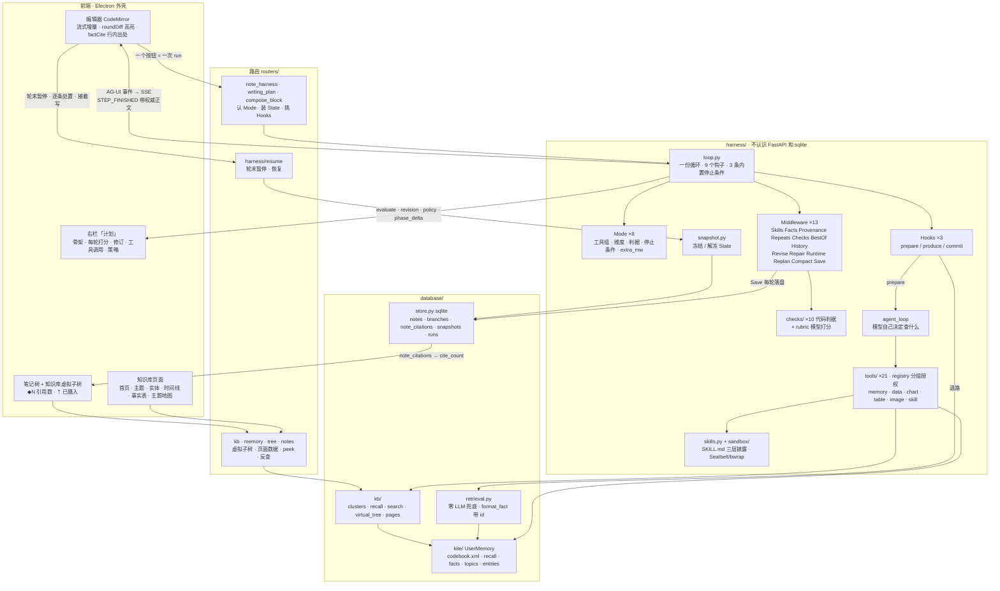

# MEMOKET_NOTE Harness 框架

> 这份文档描述**重构完成后**的架构（2026-09-11）。之前那版是「改造方案」——
> 方案里写的东西现在全部在代码里，所以这版按代码写，不再区分「现在 / 之后」。
> 结构性的数字（几个 Mode、几个工具、几条 check、几条 middleware）有
> `backend/tests/test_doc_counts.py` 盯着，跟代码对不上测试会红。
> 逐批改动和踩过的坑在 `docs/TRACELOG-trilium.md`。

---

## 0. 一页纸

**一句话**：一份写死的循环（`loop.py`），每一轮「取材料 → 写 → 判 → 决定继不继续」；
8 个功能的差别全部表达成配置（`Mode`）+ 三个回调（`Hooks`）+ 可插拔的能力
（`Middleware`），循环本身谁都不碰。

```
用户 ──点一个按钮──▶ 路由（note_harness / writing_plan / compose_block）
                          │ 认 Mode、装 State、挑 Hooks
                          ▼
              ┌──────────────── loop.run(st, hooks) ────────────────┐
              │  for round in 1..max_rounds:                         │
              │    before_round ──▶ hooks.prepare()   ← 取材料（agent 工具循环）
              │    after_prepare ─▶ hooks.produce()   ← 流式写（TEXT_MESSAGE_*）
              │    after_produce ─▶ Checks（代码判据，零成本）
              │    before_judge  ─▶ rubric.evaluate（模型打分，可被 Checks 短路）
              │    after_judge   ─▶ BestOf / Repair / Runtime / Replan
              │    after_round   ─▶ Save（落盘）· STEP_FINISHED（带权威正文）
              │    _stop(st)     ─▶ 内置 3 条 OR Mode.stop_when                 │
              │  hooks.commit()  ─▶ RUN_FINISHED（带最终正文、run_id）          │
              └──────────────────────────────────────────────────────┘
                          │ AG-UI 事件 → SSE
                          ▼
              前端：编辑器（流式增量 · 轮末对齐服务端正文 · roundDiff 高亮）
                    右栏「计划」（骨架 · 每轮打分 · 修订 · 工具调用 · 策略）
                    状态栏（第 N 轮在干什么）
```

### 架构图



读法：一个按钮触发一次 run；`loop.py` 是唯一的循环，`Mode` 说这次跑什么、`Hooks` 说
三件不同的事怎么做、`Middleware` 是默认全开的能力；材料从工具循环进来（带事实 id），
判据先代码后模型；每轮结束把**服务端正文**随事件送回编辑器；引用落成
`note_citations`，树上就能看到每篇引用了几条。

三个词的位置：

| 词 | 是什么 | 在哪 |
|---|---|---|
| **Mode** | 一个功能的全部配置：工具组、维度、判据、停止条件、额外 middleware、轮数 | `harness/modes.py`，8 个 |
| **Hooks** | 三条 harness 真正不同的三件事：怎么取材料、怎么写、怎么收尾 | `harness/hooks/{note,section,block}.py` |
| **Middleware** | 一项能力，挂在循环的 9 个钩子上，自带状态字段；默认全开 | `harness/middleware/`，13 个 |

### 六条核心判断

| # | 判断 | 依据 |
|---|---|---|
| 1 | **循环写死，一份** | 调研的 12 个框架无一例外。重构前是三份手抄的（555 + 245 + 156 行），现在 `loop.py` 一份 |
| 2 | **判据分两类，代码判得准的不交给模型** | 打分器和被打分的是同一个模型——它的盲区和写作时的盲区是同一个（R2） |
| 3 | **判据尽量往早了放**：工具层 → 检查层 → 打分层 | 越早越省。工具拒绝的根本到不了打分器，成本为零（R8） |
| 4 | **能力做成 middleware，默认全开** | 「一条 harness 有、另一条没有」重构前发生过四次，全是遗漏不是决定 |
| 5 | **不自造标准**：事件用 AG-UI，skill 用 SKILL.md | 自造的代价是两头不通——第三方装不进来，我们的也拿不出去 |
| 6 | **用户配「要什么」，系统配「用什么能力」** | 用户不知道 `filter_facts` 和 `search_memory` 的区别，配错了坏得很隐蔽 |

**第七条是这次实战里加的**：**服务端的正文是唯一权威**。客户端靠 anchor 在本地重放
修订来追平，anchor 一有歧义正文就被改烂（实拍：引用 `[terrence-1848-5F6]` 变成
`-1848-5F6]`）。轮末事件直接带正文，客户端只负责对齐（第 12 节）。

---

## 1. memoket-note 需要什么

架构从需求推，不从现有代码倒推。十三条，每条都能在产品行为里找到出处；最右一列
是现在怎么落地的。

| # | 需求 | 从哪来 | 落地 |
|---|---|---|---|
| **R1** | 没有 oracle，合格与否靠一组可插拔的判据 | 写作没有编译器和测试 | `Dimension`（模型打分）+ `Check`（代码判定），都是 Mode 的配置 |
| **R2** | 判据不能只靠模型：打分器和被打分的是同一个模型 | 实测打分器给通篇假图打过 `has_charts=2` | 10 条 check 在打分之前跑，命中就不花模型调用 |
| **R3** | 多种任务形态：整篇 / 分段 / 生成一段 / 改选区 | 8 个功能共用一套闭环 | 8 个 Mode，三组 Hooks |
| **R4** | 流式：一次调用几十秒，产出必须边生成边看 | 本地模型的实测延迟 | `TEXT_MESSAGE_CONTENT` 逐段流；子步骤用 `phase_delta` 也流 |
| **R5** | 可追溯 + 可处置：修订逐条 accept/reject，能看到依据 | `roundDiff.ts` · 右栏「计划」 | 轮末暂停（snapshot）+ `/resume`；`revision` / `dropped` 事件带原因和依据 |
| **R6** | 内容必须来自知识库，不能编 | KITE 是这个产品的立身之本 | 材料带事实 id，正文照抄 `[id]`；`citations_exist` 判据；`note_citations` 表 |
| **R7** | 数字和图表语法由代码产出，模型只决定算什么画什么 | 模型自己写 mermaid 会写出渲染不了的语法 | `chart` / `data` / `table` 工具组；`charts_from_tools` 逐字比对 |
| **R8** | 省调用：能在工具层拦的不留给检查层，能检查的不留给打分器 | 一次打分几十秒 | 工具白名单 → Checks 短路 → 才打分 |
| **R9** | 并发：同一篇笔记多个 `/` 同时跑，状态不能串 | `runningBlocks.ts` | 状态全在 `State` 上，没有模块级全局 |
| **R10** | 一步失败不能炸掉整个 run，且已有产出必须落盘 | 高负载下单次调用超 300s | 三级错误（第 17 节）；`Save` 每轮落盘；`warning` 事件 |
| **R11** | 用户随时可以关掉页面，取消要干净 | 每条 harness 各有一处 `is_disconnected()` | 循环里一处；`BestOf` 兜底保最好的一轮 |
| **R12** | skill 是按需加载上下文的机制 | `SkillsPanel` | SKILL.md 三层渐进披露：菜单 → `load_skill` → `read_skill_ref` |
| **R13** | 第三方 skill 的脚本要能跑，但不能在我们的进程里跑 | 生成 .pptx、按模板渲染 | `sandbox/`：Seatbelt / bubblewrap，资源上限，网络一律不给 |

## 2. 每条需求借鉴谁

调研了 14 个框架（完整笔记见 `_research/harness-survey.md`）。

| 需求 | 借鉴 | 具体是什么 |
|---|---|---|
| R1 | DSPy `Refine` · smolagents `final_answer_checks` | 判据是配置传进去的；`best_reward` 全程跟踪 → `BestOf` |
| R2 | LLM-as-judge 的公认实践 | 「把复杂 rubric 拆成离散检查」→ `checks/` |
| R3 | LangChain 1.0 `AgentMiddleware` | 循环写死，差异表达成 middleware + 配置 |
| R4 | AG-UI 协议 | `TEXT_MESSAGE_CONTENT` 逐 token 流 |
| R5 | AG-UI `CUSTOM` · LangGraph `interrupt` | 领域事件走 CUSTOM；interrupt + checkpointer = 轮末暂停 |
| R6 | RAG 的 citation/attribution | 起草 → 逐条对照来源验证 → 修补或删除 |
| R7 | 无先例 | 工具产出 mermaid，检查比对字符串是否原样 |
| R8 | PydanticAI 两阶段验证 | 语法（零成本）先跑，语义（要 I/O）后跑 |
| R10 | DSPy `fail_count` · OpenHands Controller | 失败有预算；管约束的跟做决策的分层 |
| R11 | LangGraph checkpointer | 每个 super-step 存快照，中断能恢复 → `snapshot.py` |
| R12 | Claude Agent Skills | 三层渐进披露 |
| R13 | Claude Code 的沙箱 | 内核级强制、白名单 |

十条横向结论（12 个框架无一例外）：循环写死 · 观察型和干预型扩展点分开 · 能力打包
成 middleware 自带状态 · 停止条件可组合 · best-of · 便宜的判据先跑 · 管约束和做决策
分层 · 必需能力由框架拒绝移除（`rails_off` 只对非必需项生效）· 每步前可改配置
（`Runtime`）· 失败要有退路。

---

## 3. 目录

```
backend/app/
  harness/                 agent 运行。不认识 FastAPI，不认识 sqlite
    loop.py                  一份循环 + 3 条内置停止条件
    types.py                 Mode · Hooks · Middleware · Check · Verdict · StopCondition · Dimension
    state.py                 State：一次 run 的全部状态，middleware 的 bag 也在这
    modes.py                 8 个 Mode + 各自的停止条件 + for_run()（按 profile / polish 塑形维度）
    events.py                AG-UI 事件 + 11 个 CUSTOM 名字 + to_sse()
    hooks/                   三组回调
      note · section · block
    middleware/              13 个能力 + _order.py（顺序依赖，verify() 起跑时校验）
      skills · facts · history · compact · best_of · checks · provenance
      · revise · repeats · replan · repair · runtime · save · _order
    checks/                  10 条代码判据 + rubric.py（模型打分）+ pick.py（打翻哪一维）
      citations · grounding · grounding_rules · structure · charts · blockcheck · rubric · pick
    tools/                   21 个工具 + registry（分组授权）
      memory_tools · data_tools · tabular · blocks · imagegen · sandbox_tools · skill_tools · registry
    prompts/                 提示词
      writing · note · plan · block · selection · skills · fragments
    skills.py                SKILL.md 目录 + DB 里的配置
    sandbox/                 policy（三档）· limits（资源上限）· runner（Seatbelt / bwrap）
    agent_loop.py            取材料的工具循环（模型自己决定查什么）
    policy.py                Runtime 策略控制器：上一轮反馈 → 下一轮参数
    replan_rules.py          骨架重规划的约束
    revision.py              定位 / 应用修订：纯函数
    snapshot.py              轮末暂停：冻结 / 解冻 State
    params.py                长文 harness 共用的参数
    adapter.py               LLMClient / RunHistoryStore 两个协议接到 util/llm 和 store
  database/
    store.py                 sqlite：notes · branches（树）· note_citations · note_revisions（历史版本）· skills · snapshots · runs
    retrieval.py             零 LLM 关键词检索（工具循环失败时的退路）；format_fact() 给材料带 id
    kite/                    KITE codebook 适配：UserMemory（recall / facts / topics / entities / fact_by_id）
    kb/                      知识库在 KITE 之上的那层：clusters · recall（簇粒度）· search（排序）
                             · virtual_tree（树上的虚拟子树）· pages（各节点的页面数据）
                             · extract_check / extract_judge / reextract（摄入质量）
    ingest/                  摄入：asr · chunking · extract · importers
    assets.py                资产目录（粘贴的图 / 录音落在哪；assets 路由和整库导出共用）
    backup.py                启动时一天一份笔记库备份（sqlite 在线备份；留 7 日 + 3 月）
  editor/                    既不是 agent 也不是知识库：outline · restructure · textshape · vision · profile
  routers/                   和前端对接：认 Mode、装 State、翻事件
    note_harness.py            POST /api/note-harness/run（单篇：写 / 打磨）
    writing_plan.py            分段写作（一棵子树一篇篇写）
    compose_block.py           `/` 块生成
    harness.py                 GET /paused · POST /{run_id}/resume
    compose.py                 单点动作：skeleton · magic-tap · rewrite · expand · verify · digest
    tree.py · notes.py         笔记树（branches / 克隆 / 重排 / 路径）· 笔记 CRUD
    kb.py · memory.py          知识库虚拟子树、各节点页面、检索、事实 peek / 反查
    ingest.py · import_sources.py · skills.py · settings.py · profile.py · assets.py · export.py
    client_log.py              前端错误报进后端日志（打包版没有 DevTools）
  util/                      config · llm（stream / stream_events / complete_json / extract_json）· parent_watch
```

前端与桌面壳（不是 Python，单独一张）：

```
frontend/src/
  App.tsx                    外壳 + 所有 harness 事件处理（noteHarnessHandlers）
  api.ts                     类型 + fetch + SSE 解析（runNoteHarness / resumeHarness / watchJob）
  editor/                    CodeMirror 扩展：roundDiff（轮次高亮）· revisions · factCite（行内出处）
                             · recallCompletion（@ 引用）· mermaid · runningBlocks（并发块）…
  components/                外壳（TabBar · NoteTree · Ribbon · RightPane · ContextMenu · CommandPalette …）
                             harness 面板（AgentActivity · SkeletonPanel · RevisionPanel · TapProvenance）
                             知识库（KbNoteView · kb/* 各页面 · KnowledgeGraph · MemoryBrowser）
  util/displayTitle.ts       树 / 标签 / 面包屑共用的显示名

desktop/src/                 Electron：main.ts（窗口 · 菜单 · --probe / --shot 探针）· backend.ts（拉起后端）
```

---

## 4. 一轮里发生什么

`loop.run(st, hooks, mw)`：

```
chain = BASE + Mode.extra_mw − Mode.rails_off      # verify(chain) 校验顺序依赖
RUN_STARTED
before_run
for round:
    STEP_STARTED(round, mode.label)
    before_round                                      # Compact / Facts 修剪 / Revise（改已有正文）
    facts, trace = hooks.prepare(st)                  # agent 工具循环：模型自己决定查什么
    after_prepare                                     # Facts 累积 · Provenance（工具真的返回了什么）· Skills
    TEXT_MESSAGE_START
    for piece in hooks.produce(st): TEXT_MESSAGE_CONTENT   # 正文已有目录时先发 CUSTOM insert_at（定向续写，见 §4.1）
    TEXT_MESSAGE_END
    after_produce                                     # Repeats（机械查重）→ Checks（代码判据，命中则 skip_judge）
    before_judge / evaluate / after_judge             # rubric.evaluate（可被 skip_judge 短路）· BestOf · Repair · Runtime · Replan
    after_round                                       # Save · History
    STEP_FINISHED(round, content)                     # ← 权威正文
    reason = _stop(st)                                # 内置：complete / blocked / no_progress；再 OR Mode.stop_when
    if reason: break
hooks.commit(st)
after_run
RUN_FINISHED(content, reason, run_id?)
```

**顺序有讲究**，两条（`middleware/_order.py` 起跑时校验）：
① 同一个钩子上，先跑产出材料的，最后跑可能短路的——`Repeats` 产出 `dup_hints`
给打分用，`Checks` 可能判定不合格直接跳过打分。② `Revise` 在 `before_round` 改已有
正文，必须在 `Compact` 压缩之前。

**判据的三层**（R8）：工具层拒绝（模型调不到没授权的工具）→ 检查层（10 条 check，
纯函数，命中就不打分，能自动修的当场修）→ 打分层（`rubric.evaluate`，一次几十秒）。

---

### 4.1 定向续写：这一轮写到哪一节

正文已经有目录、各节都有内容之后，「接着往下写」只会把所有新内容堆在最后一节底下
（实拍：讲硬件延期的段落离「硬件」隔了两千字）。现在 `produce()` 在提示词末尾附一张
现有小节清单，要求模型**第一行**只写 `【放到：标题原文】`（或 `【放到：文末】`）；
`hooks/note.py` 攒到第一个换行解析这一行，位置由 `editor/outline.section_end()` 算
（下一个层级不深于它的标题之前），写进 `st.bag["insert_at"]`；`loop.py` 在第一个
delta 之前发 `CUSTOM insert_at {section, pos}`，前端按自己的正文重算落点、把 delta
插在那里（`util/sectionEnd.ts` 同一条规则）；轮末 `insert_into()` 落到那一节末尾。
大纲模式下还有空节时走原来的 `next_gap()` 定向，不用这条。没写指令行就照旧追加。

修订环节的两条硬上限也在这轮加上：单条修订最多删正文 35%、一轮累计 50%
（`revise.too_destructive()`——骨架被另一篇顶掉时模型按「离题」把 4493 字删到 754）；
`revision.breakage()` 除了破字还认「半截链接」（从 `[x](note://…)` 中间切开）。

## 5. 类型

```python
# harness/types.py
@dataclass(frozen=True)
class Mode:
    key: str; label: str; task: str
    groups: tuple[str, ...]        # 授权的工具组
    focus_groups / exclude         # 组为主，工具为辅
    dims: tuple[Dimension, ...]    # 模型打分的维度（note / section 由 for_run 按 profile、polish 塑形）
    checks: tuple[Check, ...]      # 代码判据
    skill_scope: str               # 哪些 skill 进上下文
    stop_when: tuple[StopCondition, ...]
    extra_mw: tuple[Middleware, ...]
    rails_off: tuple[str, ...]     # 关掉哪些非必需 middleware
    max_rounds: int

class Hooks(Protocol):             # 三条 harness 真正不同的三件事
    async def prepare(st) -> (facts, ToolTrace)      # 取材料
    def produce(st) -> AsyncIterator[str]            # 流式写，并更新 st.content
    async def commit(st) -> None                     # 收尾（不是每轮落盘，那是 Save 的事）

class Middleware(Protocol):        # 9 个钩子，都是可选的
    before_run / after_run / before_round / after_prepare / before_produce /
    after_produce / before_judge / after_judge / after_round

Check = Callable[[State], Verdict | None]        # 纯函数，只读
Verdict(dimension, message, fix: Callable[[str], str] | None)   # fix = linter 的 --fix
StopCondition = Callable[[State], str | None]   # 返回停止原因；可组合，OR
Dimension(name, guidance)                         # guidance 直接渲染进打分 prompt
```

```python
# harness/state.py —— 一次 run 的全部状态；middleware 的临时数据放 bag
State: mode · ctx(user/note/cursor) · request · round
       before / after / content / fresh          # 光标前后 / 当前正文 / 这一轮写的
       facts / facts_new / charts / trace        # 材料 · 工具真的画出来的图 · 工具轨迹
       skill_bodies / skill_menu
       ev / skip_judge / best / steer            # 打分 · 判据命中 · 最好的一轮 · 下一轮的引导
       stopped · bag
```

---

## 6. 8 个 Mode

| key | label | 工具组 | extra_mw | stop_when | 轮数 | 维度 |
|---|---|---|---|---|---|---|
| `note` | 续写整篇 | memory · skill | Revise Repair Runtime Replan Compact Save | material_used_up · stalled · nothing_left_to_fix · pause_for_review | 8 | spine_fidelity · beat_coverage · non_repetition · factual_grounding · coherence · material_use · style_fit |
| `section` | 分段写作 | memory · skill | Revise Repair Compact Save | material_used_up · pause_for_review | 4 | topic_fidelity · non_repetition · factual_grounding · material_use · coherence · style_fit |
| `eda` | 数据可视化 | data · chart · memory · skill | — | — | 3 | numbers_from_tools · honest_caveats · has_charts · no_duplicate_charts · covers_the_data · fits_context · actionable |
| `chart` | 智能插图 | data · chart · image · memory · skill | — | — | 3 | chart_validity · data_grounding · right_kind · fits_context |
| `table` | 生成表格 | data · table · memory · skill | — | — | 3 | table_validity · data_grounding · fits_context |
| `analysis` | 数据分析 | data · chart · memory · skill | — | — | 3 | answers_the_question · numbers_from_tools · states_limits · chart_validity · fits_context |
| `prompt` | 按指令生成 | memory · skill | — | — | 3 | follows_prompt · fits_context · no_fabrication |
| `custom` | 改写选区 | memory · skill | — | — | 3 | follows_prompt · replaces_cleanly · no_fabrication |

- `note` / `section` 的维度由 `for_run(mode, has_profile, polish)` 塑形：有个人偏好才
  加 `style_fit`；打磨模式（只修不写）去掉覆盖类维度。
- Mode 的停止条件（`modes.py`）：`material_used_up`（材料用完就停，不然覆盖维度会
  逼它编）· `stalled`（连续几轮没变化）· `nothing_left_to_fix`（打磨模式一轮零修订）·
  `pause_for_review`（每轮停下等用户）。内置三条在 `loop.py`：`complete` / `blocked` /
  `no_progress`。
- 加一个功能 = `modes.py` 加一个实例；路由不动。

---

## 7. 13 个 middleware

`BASE`（默认全开，顺序即执行顺序）：

| 名字 | 钩子 | 做什么 |
|---|---|---|
| **Skills** | after_prepare | 把「有哪些 skill」放进上下文（菜单一行一条；命中才 `load_skill`） |
| **Facts** | after_prepare / before_round | 跨轮累积材料并修剪——只做一半各出过一个 bug |
| **Provenance** | after_prepare | 把工具真的返回了什么给用户看（`round_summary`），依据不能靠模型自报 |
| **Repeats** | after_produce | 机械近重复检测（difflib），结果作为打分的证据 |
| **Checks** | after_produce | 跑 Mode 的代码判据；命中就 `skip_judge`，能自动修的当场修，发 `check_hit` |
| **BestOf** | after_judge | 记住最好的一轮；跑满轮数时交付最好的，不是最后的 |
| **History** | after_run | 记录这次 run 怎么跑的（跨 run 学习的原料） |

Mode 按需追加的：

| 名字 | 谁用 | 做什么 |
|---|---|---|
| **Revise** | note · section | 写新的之前先改已有正文（修订 pass，`max_tokens=4000`，截断时报 `dropped`） |
| **Repair** | note · section | 把这一轮的打分读成下一轮的计划（弱在覆盖 → 多写；弱在质量 → 多改） |
| **Runtime** | note | 策略控制器（`policy.py`）：上一轮反馈 → 下一轮的工具预算 / 温度 / 修订额度 / 是否要求溯源 |
| **Replan** | note | 骨架中途重规划（`replan_rules.py` 约束：能更新，不能把目标改到不收敛） |
| **Compact** | note · section | 正文长了压缩喂给续写的那份（修订和打分仍读全文） |
| **Save** | note · section | 每轮落盘（块生成不落盘） |

每个 middleware 一个文件、不认识循环、能拿假 State 单测。

---

## 8. 10 条 check（代码判据）

| check | 打翻哪一维（按 Mode 挑） | 可自动修 | 抓什么 |
|---|---|---|---|
| `no_placeholder` | factual_grounding / no_fabrication / data_grounding | | 「待补充」这类占位句 |
| `no_audit_voice` | style_fit / coherence / fits_context | | 「现有材料不足以说明…」这种谈证据不谈事情的句子 |
| `citations_hold` | factual_grounding … | | 模型自报的引用跟材料模糊对不上 |
| `citations_exist` | factual_grounding … | ✔ 摘掉编造的 `[id]` | 正文里的 `[事实 id]` 既不在材料里也查不到知识库 |
| `material_used` | material_use / factual_grounding | | 查到了材料一条都没用（大纲模式下关闭） |
| `outline_intact` | fits_context / coherence | | 这篇是大纲，标题层级被压平了 |
| `heading_fits` | fits_context / coherence | ✔ 标题整体下沉 | 插入块的标题跟周围平级而不是下级 |
| `tail_clashes` | fits_context / coherence | ✔ 去掉收尾小节 | 插入块自己写了「总结」而下文已有 |
| `no_fake_charts` | has_charts / chart_validity / coherence | | 用文字描述的图（`[柱状图：…]`） |
| `charts_from_tools` | has_charts / chart_validity / coherence | | 手写的 mermaid——不是工具原样返回的 |

- `pick_dimension(st, *candidates)`：一条 check 被多个 Mode 共用，打翻的维度按当前
  Mode 实际有的挑；`tests/test_harness_modes.py` 断言每条 check 在一段「踩满所有毛病
  的正文」上至少触发一次、且打的维度这个 Mode 真的有。
- 两半判据是同一种东西的两种实现：`Check` 是零成本的 `Dimension`。模型打分在
  `checks/rubric.py`（`evaluate(llm, content, dimensions, context, dup_hints)` → 三态
  `continue / complete / blocked` + 最弱维度）。

---

## 9. 21 个工具

注册表 `tools/registry.py`；授权粒度**组为主，工具为辅**（`Mode.groups` − `exclude`）。

| 组 | 工具 | 说明 |
|---|---|---|
| memory | `search_memory` `filter_facts` `facts_in_range` `gather_subject` `list_topics` `list_entities` `fact_sources` `search_session_context` | 知识库检索；结果带事实 id（`[terrence-2046-2F3] 正文…`） |
| data | `list_tables` `describe_table` `aggregate_table` `correlate_columns` `numbers_near_cursor` | 数字由代码算 |
| chart | `chart_column` `chart_from_text` `render_chart` | mermaid 由代码产出，`charts_from_tools` 逐字比对 |
| table | `render_table` | |
| image | `render_image` | 智能插图 |
| skill | `load_skill` `read_skill_ref` | SKILL.md 的第二、三层 |
| skill_script | `run_skill_script` | 沙箱里跑第三方 skill 的脚本 |

`agent_loop.py`：取材料的工具循环放在 app 层不在 harness 包里——包的 `LLMClient`
只有 `complete()`，工具执行是 I/O，属于宿主。实测两条：模型从来不会自己走到
`fact_sources` 这第二级，所以「回溯原话」由代码在需要时直接调；限定到某次会议的
问题（「那次」「除了 X」）prompt 让它选 `search_session_context` 没用，代码识别后
直接调。

---

## 10. Skill 与沙箱

- 格式就是 Agent Skills 的 `SKILL.md`，frontmatter 只有 `name` / `description`，一个字段
  都不加；我们的配置（启停、顺序、scope、沙箱授权）在 DB 的 `skill_config` 里。
- 三层渐进披露：菜单常驻（每条一行）→ 模型要用才 `load_skill`（body）→ 引用文件
  `read_skill_ref` 不读不花。`Mode.skill_scope` 决定谁进菜单。
- 第三方 skill 直接装目录；脚本走 `run_skill_script` → `sandbox/`：三档
  `SandboxLevel`，Seatbelt（macOS）/ bubblewrap（Linux）内核级强制，`limits.py` 写死
  CPU 10s / 墙钟 30s / 输出 20MB / 每次 run 最多 3 次；**网络一律不给**。macOS 上
  `RLIMIT_AS` 设不上，`runner.enforced_limits()` 如实报告，不假装一致。
- prompt injection：skill 正文进的是 system 之后的一段，工具授权仍由 Mode 决定，
  skill 不能给自己加工具。

---

## 11. 事件：AG-UI

`events.py`，标准事件直接用 AG-UI 的名字，领域事件走 `CUSTOM {name, value}`：

| 标准事件 | 载荷 |
|---|---|
| `RUN_STARTED` / `RUN_FINISHED` | 后者带 `content`（最终正文）· `reason` · 暂停时带 `run_id` |
| `STEP_STARTED` / `STEP_FINISHED` | 后者带 `content`——**这一轮结束时的权威正文** |
| `TEXT_MESSAGE_START/CONTENT/END` | 一轮一个 message，严格配对（AG-UI 有状态机校验） |
| `TOOL_CALL_RESULT` | 工具名、参数、结果 |
| `ACTIVITY_SNAPSHOT` | 「在看要用哪些材料…」「在写…」「在核对…」 |
| `RUN_ERROR` | 可恢复的降级，**前端不能 throw** |

| CUSTOM 名 | 什么时候 |
|---|---|
| `skeleton` | 自动生成 / 读回的骨架 |
| `round_summary` | 这一轮取到了什么（Provenance） |
| `revision` | 应用了一条修订（op / anchor / reason / sources） |
| `dropped` | 一条修订被防线丢了（不是错误：同义重写、锚点歧义、切出破字、动到用户标题、输出被截断） |
| `check_hit` | 代码判据命中，这一轮不打分 |
| `evaluate` | 打分：各维度 level + note、status、最弱维度 |
| `policy` | Runtime 调了下一轮参数、原因 |
| `replan` | 骨架中途变了 |
| `phase_delta` | 子步骤（retrieval / edit / write / evaluate）的实时输出，`kind` 分 thinking / output |
| `warning` | 某个 middleware 失败，run 继续 |
| `insert_at` | 定向续写：这一轮的正文要插进某一节末尾（`section` · `pos`），在第一个 delta 之前发；没有它就是追加到文末 |

`to_sse()` 把事件翻成 SSE 帧；前端 `api.ts` 一处解析、分发给 `NoteHarnessHandlers`。

---

## 12. 前端：编辑器怎么跟 harness 对上

`App.tsx` 的 `noteHarnessHandlers(noteId, mode)`——**开跑和「接着写」共用同一份**，
两条路径各写一份的话恢复之后总会少几个 handler。

| handler | 做什么 |
|---|---|
| `onSkeleton` | 骨架进右栏「计划」，并落库（不落库下次又得生成） |
| `onRoundStart` | 状态行「第 N 轮：修订 M 处，续写中…」；本地正文先补分隔（跟后端 `join_round_text` 一致） |
| `onRevision` | 本地 `applyRevision` 先让用户看到；状态行说一句（不弹 toast，一轮四处会叠四张） |
| `onInsertAt(section, pos)` | 定向续写：按本地正文重算落点（`util/sectionEnd.ts`），之后的 delta 插在那里，视口滚过去 |
| `onDelta` | 增量进编辑器（从 `liveContentRef` 算，不走 updater），同时流进「计划」面板的「本轮写出的正文」 |
| `onRoundEnd(round, content)` | **用服务端正文对齐**；差异记 `client-log` `harness-sync`；重算 roundDiff 高亮 |
| `onEvaluate` / `onPhase` / `onPhaseDelta` / `onToolCalls` / `onPolicy` / `onDropped` | 右栏「计划」的每轮卡片 |
| `onDone(reason, blocked, runId, content)` | 对齐正文；`awaiting_review` 时进「等你处置」态；结果行常驻（原因 · 轮数 · 字数） |

所有 handler 由 `noteHarnessHandlers()` 统一包一层：run 属于哪篇笔记，用户切走之后它的每个事件都不碰当前这篇（onDone 只提示「已保存在那篇里」）。编辑器接外部正文用最小 diff（`editor/minimalChange.ts`），不整篇替换，光标和视口不被拽走。

编辑器侧（`editor/`）：
- `roundDiff.ts`：整次 run 起点 vs 当前的词级 diff，新增标绿、删掉的以 widget 补出
  （超过 40 字折成「已删 N 字」小标签）；hunk 可逐处接受 / 撤回。位置**先夹到文档
  长度再 `mapPos`**——超出就是 RangeError，React 卸整棵树（白屏根因之一）。
- `factCite.ts`：`[user-n-hex]` 标成行内出处，悬停 peek（`GET /api/memory/facts/{id}`，
  找不到 404 → 浮层说「找不到」，不藏）。
- `recallCompletion.ts`：`@` 补全，插的是 `原文 [id]`——跟「相关记忆」「⌘K」三条路径
  同一种东西，否则只有一条会算成引用。

右栏「计划」（`AgentActivity` + `SkeletonPanel`）：骨架 · 每轮卡片（修订数 / 工具调用 /
六维打分 / 最弱维度 / 策略调整 / 各阶段的思考与输出 / 丢弃的修订及原因）。harness 跑
起来右栏自动切到它——判据 3「计划要看得见」。渲染一律兜底（`?? []`）：事件到达顺序
不定，一张卡片字段没到齐就 `undefined.length`，那是白屏根因之二。

`ErrorBoundary` + `window.error` / `unhandledrejection` → `POST /api/client-log` →
Electron 日志。打包版没有 DevTools，白屏时这是唯一的线索。

---

## 13. 轮末暂停与恢复

`pause_for_review` 停止条件 + `snapshot.py`：一轮结束时把 State 冻结进
`snapshots` 表，`RUN_FINISHED(reason=awaiting_review, run_id)`。用户在编辑器里逐条
接受 / 撤回，点「接着写」→ `POST /api/harness/{run_id}/resume {content}`：**正文的最终
形态由编辑器说了算**，服务端用它覆盖 `st.content`，从 `round + 1` 继续，Mode 从代码
重新取（换过判据的 run 恢复后用新判据），快照消费即删（不能恢复两次，会分叉写同一篇）。
`GET /api/harness/paused` 找回断了流的暂停 run（关标签页、后端重启之后 run_id 只在那
条断掉的流里）。

---

## 14. 引用链路：AI 写的每一句都有据可依

```
retrieval.format_fact / memory_tools._fmt_facts   →  "[terrence-1872-5F8] [2026-06] 正文…"
prompts.fragments.facts_block                      →  材料带 id 时加一条引用规则：「句末原样照抄 [编号]」
模型产出                                            →  "…定在 6 月 30 日 [terrence-1872-5F8]"
checks.citations_exist                             →  不在材料里、知识库也查不到的 [id] 摘掉（fix）
store.update_note → sync_citations                 →  note_citations 表随每次保存重建
tree()                                              →  cite_count / ingested_at → 树上 ◆N / ⇡
factCite.ts                                         →  行内 peek
GET /api/memory/facts/{id}/citing                  →  反向链接：这条事实活在哪几篇里
```

正则 `\[([A-Za-z][A-Za-z0-9_-]*-\d+-[0-9A-Fa-f]+)\]` 在**五处同步**：`store._CITE` ·
`checks/citations` · `prompts/fragments` · `editor/factCite.ts` · `App.tsx citedIds`，各有
测试。用户名段以字母开头——否则 `[2026-01-01]` 也算引用（`01` 是合法十六进制）。

真跑验证（TRACELOG [15]）：对 terrence 的库调一次 magic tap，6 条材料带 id，产出三处
引用全是真的；智能续写十轮连拍，引用完整。

---

## 15. 知识库与笔记树（简述）

harness 的材料来自这里；设计在 `docs/kb-architecture.md` 与 `docs/kb-fusion-design.md`。

- 笔记树照 Trilium：`notes` 没有父子，边在 `branches`（多条 = 克隆），没有文件夹。
- 知识库是树底部的**虚拟子树**（`kb/virtual_tree.py`，`GET /api/kb/tree`）：主题 / 实体 /
  时间线 / 最近摄入 / 事实表 / 主题地图 / 定期回顾；展开分类时才取事实。
- 每个节点打开是一页（`kb/pages.py`：首页 / 主题页 / 实体页 / 会议页 / 时间线 / 某一天），
  一条事实是一篇只读笔记（原话 · 被哪些笔记引用 · 相关事实）。
- 检索三条路：`kb/recall.py`（簇粒度，给写作）· `kb/search.py`（零 LLM 排序）·
  `memory/trace`（来龙去脉：问题由后端拼，用户不写 prompt）。

---

## 16. 桌面外壳（简述）

`desktop/`：Electron 拉起 PyInstaller 打包的后端（`backend.ts`：找空闲端口、等健康检查、
父进程看门狗），数据落在系统用户数据目录（不在 .app 里）。`--user=<id>` 固定用户，
`--probe=<name>` 把界面驱动到某个状态（`harness:<noteId>` 对一篇笔记跑智能续写、
`open:<虚拟节点>`、`graph-zoom` …），`--shot=path --shot-delay=a,b,c` 用
`capturePage` 连拍——比 `screencapture` 可靠，不依赖前台和辅助功能权限。每批改动
都靠它截图核对（`docs/TRACELOG-trilium.md`）。

---

## 17. 错误与取消

三级错误，各归各的层：

| 级 | 例子 | 处理 |
|---|---|---|
| 工具 | 查不到、参数错 | 结果字符串以「（」开头，agent 循环跳过，不当材料 |
| middleware | 修订调用超时、打分解析失败 | `warning` / `dropped` 事件，这一轮少一项能力，run 继续 |
| 循环 | 异常冒到 `loop.run` | `RUN_ERROR` + `hooks.commit`（已有产出落盘），流正常结束 |

取消：循环里一处 `request.is_disconnected()`；`Save` 每轮落盘所以关页面不丢；
`BestOf` 保证交付的是最好的一轮。前端点「停止」**同时**复位状态，不指望 fetch 的
`finally`——后端重启切断 SSE 后 `reader.read()` 永远不返回。

流式重试的约束：一轮一个 message，`START / CONTENT* / END` 严格配对；重试只能在
`START` 之前，一旦流出了 `CONTENT` 就不能重开。

---

## 18. 怎么测

| 层 | 测试 | 测什么 |
|---|---|---|
| 循环 | `test_harness_loop.py` · `test_harness_parity.py` | 假 Hooks + 假 LLM，毫秒级确定性：钩子顺序、停止条件、BestOf |
| Mode | `test_harness_modes.py` | 每条 check 打的维度这个 Mode 真的有；每条 check 在踩满毛病的正文上至少触发一次 |
| 判据 | `test_grounding_check.py` · `test_check_fixes.py` · `test_citation_ids.py` | 真实失败产出做素材；自动修的结果 |
| 引用 | `test_citation_ids.py` · `test_kb_fusion.py` | 五处正则一致；日期不算引用；材料带 id；反查 |
| 快照 | `test_harness_resume.py` | 冻结 / 解冻 / 只能恢复一次 |
| 沙箱 | `test_sandbox.py` | 资源上限、路径白名单、平台差异如实报告 |
| 文档 | `test_doc_counts.py` · `test_api_contract.py` | 这份文档里的数字；README 里的端点；前端没有死导出 |
| 笔记 | `test_note_links.py` · `test_note_revisions.py` · `test_delete_cleanup.py` | 内链 / 反链；历史版本间隔、可逆恢复；删笔记不留孤儿行 |
| 导入导出 | `test_export.py` · `test_export_roundtrip.py` | 层级 / 克隆 / 孤儿 / 资产；导出再导入树长回原样 |
| 出口 | `test_llm_sanitize.py` · `test_bold_punct.py` · `test_kite_ask.py` | 提示词不带 base64；粗体标点；KITE Answer 字段漂移 |
| 前端 | `vitest` + 11 条检查脚本 | roundDiff · factCite · 树扁平化 · SSE 解析 · mermaid 回退 · minimalChange · sectionEnd · friendlyError · runWritingPlan 事件映射 |
| 真跑 | `--probe=<name>` 连拍（`scratchpad/shot.sh`） | harness / tap / plan-run / sel:* / ingest / delete / draft / imgdrop … 每个探针一张图 + 一份后端日志（client-log 和 traceback 都在里面） |

**反向验证**：新断言先注入违规看它变不变红，再落。**日志优于猜**：主题地图「放大了
缩回去」猜了三轮，一条 client-log（`new simulation` 每 1.5s 一次）一轮定位。

---

## 19. 明确不做的

- 不做 Trilium 的属性系统 / 加密 / 分享 / hoist / 横版布局（`trilium-ui-gap.md` §10）。
- 不给 skill 网络。要联网的能力走系统工具池。
- 不让用户配工具。用户配「要什么」（Mode · skill · 偏好），系统配「用什么能力」。
- 不在客户端重放修订当权威。服务端正文是唯一权威（第 0 节第七条）。
- 分屏第二栏只读：编辑器状态是单实例的，做成可编辑要重构一半的 App.tsx。

---

## 20. 变更记录

落地记录——按批的改动、实拍抓到的 bug、每条根因，全在 `docs/TRACELOG-trilium.md`（[0]–[25]）。
进度台账 `docs/PROGRESS.md`。这份文档只记「现在是什么」，不记「怎么变过来的」。
