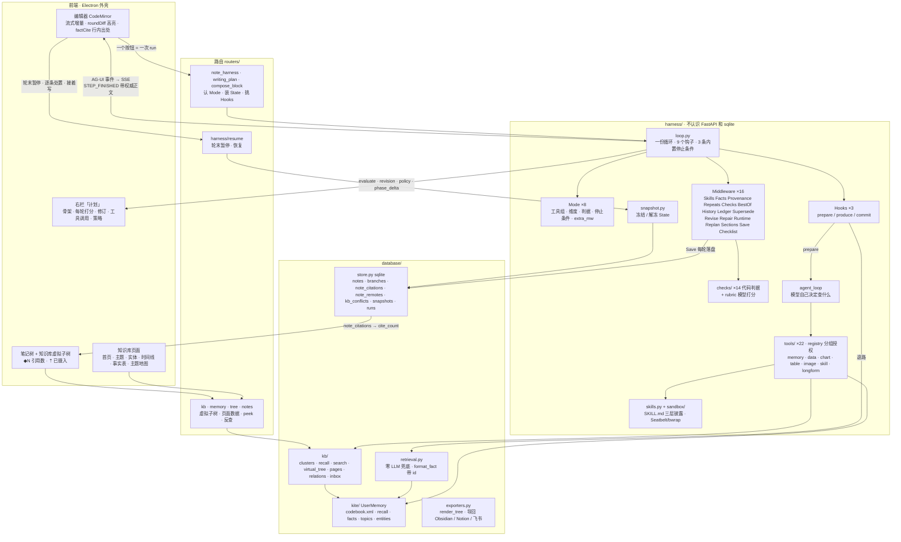

# MEMOKET_NOTE Harness 框架

> 这份文档描述**重构完成后**的架构（2026-09-11）。之前那版是「改造方案」——
> 方案里写的东西现在全部在代码里，所以这版按代码写，不再区分「现在 / 之后」。
> 结构性的数字（几个 Mode、几个工具、几条 check、几条 middleware）有
> `backend/tests/test_doc_counts.py` 盯着，跟代码对不上测试会红。
> 逐批改动和踩过的坑在 `docs/TRACELOG-trilium.md`。

---

## 0. 一页纸

**一句话**：一份写死的循环（`loop.py`），每一轮「取材料 → 写 → 判 → 决定继不继续」；
8 个功能的差别全部表达成配置（`Mode`）+ 三个回调（`Hooks`）+ 可插拔的能力
（`Middleware`），循环本身谁都不碰。

```
用户 ──点一个按钮──▶ 路由（note_harness / writing_plan / compose_block）
                          │ 认 Mode、装 State、挑 Hooks
                          ▼
              ┌──────────────── loop.run(st, hooks) ────────────────┐
              │  for round in 1..max_rounds:                         │
              │    before_round ──▶ hooks.prepare()   ← 取材料（agent 工具循环）
              │    after_prepare ─▶ hooks.produce()   ← 流式写（TEXT_MESSAGE_*）
              │    after_produce ─▶ Checks（代码判据，零成本）
              │    before_judge  ─▶ rubric.evaluate（模型打分，可被 Checks 短路）
              │    after_judge   ─▶ BestOf / Repair / Runtime / Replan
              │    after_round   ─▶ Save（落盘）· STEP_FINISHED（带权威正文）
              │    _stop(st)     ─▶ 内置 4 条 OR Mode.stop_when                 │
              │  hooks.commit()  ─▶ RUN_FINISHED（带最终正文、run_id）          │
              └──────────────────────────────────────────────────────┘
                          │ AG-UI 事件 → SSE
                          ▼
              前端：编辑器（流式增量 · 轮末对齐服务端正文 · roundDiff 高亮）
                    右栏「计划」（骨架 · 每轮打分 · 修订 · 工具调用 · 策略）
                    状态栏（第 N 轮在干什么）
```

### 架构图



读法：一个按钮触发一次 run；`loop.py` 是唯一的循环，`Mode` 说这次跑什么、`Hooks` 说
三件不同的事怎么做、`Middleware` 是默认全开的能力；材料从工具循环进来（带事实 id），
判据先代码后模型；每轮结束把**服务端正文**随事件送回编辑器；引用落成
`note_citations`，树上就能看到每篇引用了几条。

三个词的位置：

| 词 | 是什么 | 在哪 |
|---|---|---|
| **Mode** | 一个功能的全部配置：工具组、维度、判据、停止条件、额外 middleware、轮数 | `harness/modes.py`，8 个 |
| **Hooks** | 三条 harness 真正不同的三件事：怎么取材料、怎么写、怎么收尾 | `harness/hooks/{note,section,block}.py` |
| **Middleware** | 一项能力，挂在循环的 9 个钩子上，自带状态字段；默认全开 | `harness/middleware/`，16 个 |

### 六条核心判断

| # | 判断 | 依据 |
|---|---|---|
| 1 | **循环写死，一份** | 调研的 12 个框架无一例外。重构前是三份手抄的（555 + 245 + 156 行），现在 `loop.py` 一份 |
| 2 | **判据分两类，代码判得准的不交给模型** | 打分器和被打分的是同一个模型——它的盲区和写作时的盲区是同一个（R2） |
| 3 | **判据尽量往早了放**：工具层 → 检查层 → 打分层 | 越早越省。工具拒绝的根本到不了打分器，成本为零（R8） |
| 4 | **能力做成 middleware，默认全开** | 「一条 harness 有、另一条没有」重构前发生过四次，全是遗漏不是决定 |
| 5 | **不自造标准**：事件用 AG-UI，skill 用 SKILL.md | 自造的代价是两头不通——第三方装不进来，我们的也拿不出去 |
| 6 | **用户配「要什么」，系统配「用什么能力」** | 用户不知道 `filter_facts` 和 `search_memory` 的区别，配错了坏得很隐蔽 |

**第七条是这次实战里加的**：**服务端的正文是唯一权威**。客户端靠 anchor 在本地重放
修订来追平，anchor 一有歧义正文就被改烂（实拍：引用 `[terrence-1848-5F6]` 变成
`-1848-5F6]`）。轮末事件直接带正文，客户端只负责对齐（第 12 节）。

---

## 1. memoket-note 需要什么

架构从需求推，不从现有代码倒推。十三条，每条都能在产品行为里找到出处；最右一列
是现在怎么落地的。

| # | 需求 | 从哪来 | 落地 |
|---|---|---|---|
| **R1** | 没有 oracle，合格与否靠一组可插拔的判据 | 写作没有编译器和测试 | `Dimension`（模型打分）+ `Check`（代码判定），都是 Mode 的配置 |
| **R2** | 判据不能只靠模型：打分器和被打分的是同一个模型 | 实测打分器给通篇假图打过 `has_charts=2` | 21 条 check 在打分之前跑，命中就不花模型调用 |
| **R3** | 多种任务形态：整篇 / 分段 / 生成一段 / 改选区 | 8 个功能共用一套闭环 | 8 个 Mode，三组 Hooks |
| **R4** | 流式：一次调用几十秒，产出必须边生成边看 | 本地模型的实测延迟 | `TEXT_MESSAGE_CONTENT` 逐段流；子步骤用 `phase_delta` 也流 |
| **R5** | 可追溯 + 可处置：修订逐条 accept/reject，能看到依据；**改动按层（每次动作一层）整层接受 / 撤回** | `roundDiff.ts`（`addLayer` / `acceptLayer` / `dropLayer`）· 右栏「改动」「计划」 | 轮末暂停（snapshot）+ `/resume`；`revision` / `dropped` 事件带原因和依据 |
| **R6** | 内容必须来自知识库，不能编 | KITE 是这个产品的立身之本 | 材料带事实 id，正文照抄 `[id]`；`citations_exist` 判据；`note_citations` 表 |
| **R7** | 数字和图表语法由代码产出，模型只决定算什么画什么 | 模型自己写 mermaid 会写出渲染不了的语法 | `chart` / `data` / `table` 工具组；`charts_from_tools` 逐字比对 |
| **R8** | 省调用：能在工具层拦的不留给检查层，能检查的不留给打分器 | 一次打分几十秒 | 工具白名单 → Checks 短路 → 才打分 |
| **R9** | 并发：同一篇笔记多个 `/` 同时跑，状态不能串 | `runningBlocks.ts` | 状态全在 `State` 上，没有模块级全局 |
| **R10** | 一步失败不能炸掉整个 run，且已有产出必须落盘 | 高负载下单次调用超 300s | 三级错误（第 17 节）；`Save` 每轮落盘；`warning` 事件 |
| **R11** | 用户随时可以关掉页面，取消要干净 | 每条 harness 各有一处 `is_disconnected()` | 循环里一处；`BestOf` 兜底保最好的一轮 |
| **R12** | skill 是按需加载上下文的机制 | `SkillsPanel` | SKILL.md 三层渐进披露：菜单 → `load_skill` → `read_skill_ref` |
| **R13** | 第三方 skill 的脚本要能跑，但不能在我们的进程里跑 | 生成 .pptx、按模板渲染 | `sandbox/`：Seatbelt / bubblewrap，资源上限，网络一律不给 |

## 2. 每条需求借鉴谁

调研了 14 个框架（完整笔记见 `_research/harness-survey.md`）。

| 需求 | 借鉴 | 具体是什么 |
|---|---|---|
| R1 | DSPy `Refine` · smolagents `final_answer_checks` | 判据是配置传进去的；`best_reward` 全程跟踪 → `BestOf` |
| R2 | LLM-as-judge 的公认实践 | 「把复杂 rubric 拆成离散检查」→ `checks/` |
| R3 | LangChain 1.0 `AgentMiddleware` | 循环写死，差异表达成 middleware + 配置 |
| R4 | AG-UI 协议 | `TEXT_MESSAGE_CONTENT` 逐 token 流 |
| R5 | AG-UI `CUSTOM` · LangGraph `interrupt` | 领域事件走 CUSTOM；interrupt + checkpointer = 轮末暂停 |
| R6 | RAG 的 citation/attribution | 起草 → 逐条对照来源验证 → 修补或删除 |
| R7 | 无先例 | 工具产出 mermaid，检查比对字符串是否原样 |
| R8 | PydanticAI 两阶段验证 | 语法（零成本）先跑，语义（要 I/O）后跑 |
| R10 | DSPy `fail_count` · OpenHands Controller | 失败有预算；管约束的跟做决策的分层 |
| R11 | LangGraph checkpointer | 每个 super-step 存快照，中断能恢复 → `snapshot.py` |
| R12 | Claude Agent Skills | 三层渐进披露 |
| R13 | Claude Code 的沙箱 | 内核级强制、白名单 |

十条横向结论（12 个框架无一例外）：循环写死 · 观察型和干预型扩展点分开 · 能力打包
成 middleware 自带状态 · 停止条件可组合 · best-of · 便宜的判据先跑 · 管约束和做决策
分层 · 必需能力由框架拒绝移除（`rails_off` 只对非必需项生效）· 每步前可改配置
（`Runtime`）· 失败要有退路。

---

## 3. 目录

```
backend/app/
  harness/                 agent 运行。不认识 FastAPI，不认识 sqlite
    loop.py                  一份循环 + 3 条内置停止条件
    types.py                 Mode · Hooks · Middleware · Check · Verdict · StopCondition · Dimension
    state.py                 State：一次 run 的全部状态，middleware 的 bag 也在这
    tailing.py               撞 token 上限后：要不要续尾 / 续回来的像不像半句
    modes.py                 8 个 Mode + 各自的停止条件 + for_run()（按 profile / polish 塑形维度）
    events.py                AG-UI 事件 + 12 个 CUSTOM 名字 + to_sse()
    score_context.py         打分器除了正文还能看到什么：block 的前后文 / 指令 / 选区（for_block）
                             ＋这次跑累积的材料（with_material，loop 每轮现拼。
                             批 16 起材料排在 `[Content]` **之后**，拆分由这个模块说了算）
    hooks/                   三组回调 + 客户端镜像用的两个记录函数
      note · section · block · mirror
    middleware/              16 个挂在模式上的能力 + compact.py（只剩「智能续写」那条路在用）
                             + _order.py（顺序依赖，verify() 起跑时校验）
      skills · facts · history · ledger · supersede · compact · sections · best_of · checks
      · checklist · provenance · revise · repeats · replan · repair · runtime · save · _order
      （sections 批 15 顶替了 compact 在两条长文 harness 上的位置；compact.py 本身还在，
        「智能续写」那条一次性路径仍然用它——那条路没有工具循环，给指针取不回来）
    checks/                  21 条代码判据 + rubric.py（模型打分）+ pick.py（打翻哪一维）
      citations · grounding · grounding_rules · structure · charts · numbers · instructions · claims
      · blockcheck · rubric · pick
        （instructions 是批 17 / 阶段 6.2：用户那条指令里**能用代码判准**的那几类约束
         ——字数 / 段数 / 「必须提到 X」/ 「用表格」。它挂在 Mode 上的方式跟别的判据不同，
         由 `middleware/checklist` 在开跑时按这一次的指令装，所以不算进上面那个 19）
        （numbers 是批 16 / 阶段 5 新加的：图 · 表 · 正文里的数跟工具返回逐个 diff——
         三条判词原话都是「每个数字都能追到源」，那是一次比对不是一次判断）
      · slides（幻灯片那几条：每页有没有依据 / 数字有没有在总结的路上被改掉 / 有没有整节漏掉。
        不进闭环——幻灯片是一次成型的重构，判据结果跟着产物一起显示）
      · skeleton（骨架那五条：节拍太少 / 两条节拍撞车 / spine 只剩一个话题名 /
        一条节拍都不带锚点 / 把正文的毛病写成了写作意图。批 19 / 阶段 4.3，形态照
        slides：**判了不拦着落库**——`skeleton` 是整条闭环最上游、也是唯一没有闭环
        的一步，而 `spine_fidelity` 实测 1.88–1.96 封顶，那不是扣题扣得好，是
        「对着一个从没被验过的计划打分，太容易满足」。五条的阈值都在 20 份真实骨架
        上量过，那 20 份上开火 0）
    tools/                   22 个工具 + registry（分组授权）
      memory_tools · data_tools · tabular · blocks · imagegen · sandbox_tools · skill_tools
      · longform_tools（read_section：把自己这篇笔记的某一节原文读回来，只给两条长文 harness）
      · registry
    prompts/                 提示词
      writing · note · plan · block · selection · slides · skills · fragments
    skills.py                SKILL.md 目录 + DB 里的配置
    sandbox/                 policy（三档）· limits（资源上限）· runner（Seatbelt / bwrap）
    agent_loop.py            取材料的工具循环（模型自己决定查什么）
    query_cache.py           查询级短路：一次跑里参数完全相同的知识库查询只真查一次
                             （同一轮内的重复连上下文都不再塞第二遍；跨轮的原样返回全文）
    policy.py                Runtime 策略控制器：上一轮反馈 → 下一轮参数
    replan_rules.py          骨架重规划的约束
    revision.py              定位 / 应用修订：纯函数
    checklist.py             从用户那条指令现场生成 instruction-specific checklist
                             （二元条目 → 维度；批 17 / 阶段 6.1，[IND] §4 的 TICK / RaR）
    snapshot.py              轮末暂停：冻结 / 解冻 State
    params.py                长文 harness 共用的参数
    adapter.py               LLMClient / RunHistoryStore 两个协议接到 util/llm 和 store
    conflict_confirm.py      摄入时那批冲突候选进收件箱前让模型确认一遍；
                             由 routers 注入给 database/kb/inbox（层次只能从上往下递）
  database/
    store.py                 sqlite：notes · branches（树）· note_citations · note_revisions（历史版本）· note_remotes（导回副本）· kb_conflicts（冲突收件箱）· note_trash（最近删除）· llm_usage（模型用量）· ingest_jobs / ingest_items · skills · snapshots · runs
                             启动清理：sweep_orphan_jobs / sweep_orphan_plans / sweep_stale_snapshots（7 天）/ sweep_old_rows（用量 90 天、跑完的任务 30 天、非活跃计划 30 天）/ prune_job_payloads
                             轻量列表 list_notes_brief（⌘K / `[[` 补全用：不带全文，正文命中带片段 + first_body）；搜索的 LIKE 通配符已转义
    retrieval.py             零 LLM 关键词检索（工具循环失败时的退路）；format_fact() 给材料带 id
    kite/                    KITE codebook 适配：UserMemory（recall / facts / topics / entities / fact_by_id）
    kb/                      知识库在 KITE 之上的那层：clusters · recall（簇粒度）· search（排序）
                             · virtual_tree（树上的虚拟子树）· pages（各节点的页面数据）
                             · extract_check / extract_judge / reextract（摄入质量）
                             · relations（六种关系，纯代码）· inbox（摄入时检冲突进收件箱）· units（长材料切成的段：part_labels 带 k/n · materials() 按材料归组 · parts_of() 分段导航）· scope（记忆范围：按 session 前缀分 笔记 / 会议记录 / 导入）· who（说话人写法归一：speaker a / speaker_a / Speaker A 算一个人）· entities（实体去重规则版：大小写 / 分隔符 / 别名归组，只在展示与查询层，代表 = 事实最多的码）
    ingest/                  摄入：asr · chunking · extract · importers · feishu（块 → markdown + 最小客户端）
    exporters.py             导回：render_tree（zip 导出 / Obsidian 目录共用）· markdown → Notion / 飞书块 · 最小写客户端
    assets.py                资产目录（粘贴的图 / 录音落在哪；assets 路由和整库导出共用）
    backup.py                启动时一天一份笔记库备份（sqlite 在线备份；留 7 日 + 3 月）
  editor/                    既不是 agent 也不是知识库：outline · restructure · textshape · vision · profile
  journey/                   屏幕活动里**不用模型也能算准**的那一半：stats（时长 / 连续专注的块 / 反复来回的地方）
                             · prompt（日报提示词）。纯函数、零 I/O——日报的「时间去哪了」由代码写死，
                             模型只写「推进了什么 / 卡在哪 / 计划外的」（模型数时长会数错，而它数错的时候
                             读起来跟数对了一模一样）
  routers/                   和前端对接：认 Mode、装 State、翻事件
    note_harness.py            POST /api/note-harness/run（单篇：写 / 打磨）
    writing_plan.py            分段写作（一棵子树一篇篇写）
    compose_block.py           `/` 块生成
    harness.py                 GET /paused · POST /{run_id}/resume
    compose.py                 单点动作：skeleton · magic-tap · rewrite · expand · verify · digest
    tree.py · notes.py         笔记树（branches / 克隆 / 重排 / 路径；克隆 / 移动都判环，目标父节点要存在）· 笔记 CRUD（标题压成一行 ≤200 字）· POST /{id}/icon 笔记图标（boxicons 类名，Trilium 的 NoteIcon）· GET /{id}/graph 这篇周围有什么（引用 + 贡献的事实 → 主题 / 实体局部图）· /links 带 dangling（链到已删笔记的）——前端「清掉这些引用」「改成纯文本」都只改正文里的记号（`util/wordCount.citationRanges / noteLinkRanges`，走 CM changes 可撤销）· GET /brief 轻量列表 · 最近删除（note_trash，30 天可恢复；空的未命名不进；恢复时父链也在回收站的先一起回来）· 启动时空页 ≥1MB 且 ≥25% 就 VACUUM（sqlite 删行不缩文件）· 启动时删掉没有任何笔记 / 历史版本 / 最近删除引用且超过 7 天的图（`sweep_orphan_assets`）· 今天的日记（日记/年/月/日）
    kb.py · memory.py          知识库虚拟子树、各节点页面、检索、事实 peek / 反查
    ingest.py · import_sources.py · skills.py · settings.py · profile.py · assets.py · export.py
    journey.py                 屏幕活动：GET /day · POST /catch-up（看图 → 一句话 → 进知识库）· POST /report（日报）· DELETE /day（连事实一起删）
    client_log.py              前端错误报进后端日志（打包版没有 DevTools）；error / warn / info 三档，info 是纯观测（首屏耗时、大树计时、harness 开跑），扫 warn 找问题时别被它淹
  util/                      config · llm（stream / stream_events / complete_json / extract_json · 用量记账 llm_usage）· parent_watch
```

前端与桌面壳（不是 Python，单独一张）：

```
frontend/src/
  App.tsx                    外壳 + 所有 harness 事件处理（noteHarnessHandlers）
  api.ts                     类型 + fetch + SSE 解析（runNoteHarness / resumeHarness / watchJob）
  editor/                    CodeMirror 扩展：roundDiff（轮次高亮）· revisions · factCite（行内出处）
                             · recallCompletion（@ 引用）· mermaid · runningBlocks（并发块）…
  components/                外壳（TabBar · NoteTree · Ribbon · RightPane · ContextMenu · CommandPalette · SplitEditor（分屏第二栏，自己持正文 + util/autosave 防抖保存）…）
                             harness 面板（AgentActivity · SkeletonPanel · RevisionPanel · TapProvenance）
                             知识库（KbNoteView · kb/* 各页面 · KnowledgeGraph · MemoryBrowser）
  util/displayTitle.ts       树 / 标签 / 面包屑共用的显示名

desktop/src/                 Electron：main.ts（窗口 · 菜单 · --probe / --shot 探针）· backend.ts（拉起后端）
```

---

## 4. 一轮里发生什么

`loop.run(st, hooks, mw)`：

```
chain = BASE + Mode.extra_mw − Mode.rails_off      # verify(chain) 校验顺序依赖
RUN_STARTED
before_run
for round:
    STEP_STARTED(round, mode.label)
    before_round                                      # Sections（发布分节给 read_section）/ Revise（改已有正文）
    facts, trace = hooks.prepare(st)                  # agent 工具循环：模型自己决定查什么
    after_prepare                                     # Facts 累积 · Provenance（工具真的返回了什么）· Skills
    TEXT_MESSAGE_START
    for piece in hooks.produce(st): TEXT_MESSAGE_CONTENT   # 正文已有目录时先发 CUSTOM insert_at（定向续写，见 §4.1）
    TEXT_MESSAGE_END
    after_produce                                     # Repeats（机械查重）→ Checks（代码判据，命中则 skip_judge）
    before_judge / evaluate / after_judge             # rubric.evaluate（可被 skip_judge 短路）· BestOf · Repair · Runtime · Replan
    after_round                                       # Save · History
    STEP_FINISHED(round, content)                     # ← 权威正文
    reason = _stop(st)                                # 内置：complete / blocked / no_progress / regressed；再 OR Mode.stop_when
    if reason: break
hooks.commit(st)
after_run
RUN_FINISHED(content, reason, run_id?)
```

**顺序有讲究**，两条（`middleware/_order.py` 起跑时校验）：
① 同一个钩子上，先跑产出材料的，最后跑可能短路的——`Repeats` 产出 `dup_hints`
给打分用，`Checks` 可能判定不合格直接跳过打分。② `Revise` 在 `before_produce` 改已有
正文，必须在 `Sections` 拼「小节索引 + 当前小节逐字」之前——否则续写 prompt 拿到的
是**修订前**的正文（这条依赖是从 `Compact` 原样继承的，它当年就是为这件事写的）。

**判据的三层**（R8）：工具层拒绝（模型调不到没授权的工具）→ 检查层（21 条 check，
纯函数，命中就不打分，能自动修的当场修）→ 打分层（`rubric.evaluate`，一次几十秒）。

**打分器能看见什么**（批 8 改过一轮，改之前这里是一笔空账）：
`loop._evaluate` 给的是正文、这个 Mode 的维度判词、机械查重的 `dup_hints`，
外加一份 context——context 由 `harness/score_context.py` 拼，两段：

1. 这次跑的 `st.bag["score_context"]`：长文两条是 spine/beats 或分段主题（router 装），
   **六个 block 模式是 `score_context.for_block` 装的前后文 / 用户那条指令 / 选中的原文**；
2. **这次跑累积的材料 `st.facts`**（`score_context.material`，所有模式一视同仁，
   排在 context 最后一项紧挨着正文）。

**批 8 之前，1 的 block 那一半和 2 整个都不存在**：六个 block 模式一个 `score_context`
都没有，事实块一条都没传，而好几条维度的判词明确写着要对着这些东西判
（`material_use` 说「只在【知识库事实】块里确实给了材料时才判，**没给材料就算达标**」、
`numbers_from_tools` 说「每个统计量都能追到工具结果」、`fits_context` 说「读起来要像
本来就在这篇笔记里、标题比上方最近的标题低一级」、`follows_prompt` 说「有没有照指令做」）。
**那几维的满分因此说明不了任何事**——不是「做得好」，是「无从判断，默认给过」。
`routers/note_harness._score_context` 的 docstring 当时还写着「the loop hands evaluate
the run's accumulated material directly」，那句话是假的（仓里第二处文档与实现不符），
批 8 把实现补上它才成立。

**仍然不传的**：个人偏好档案（`style_fit`）。**这是有依据的**：批 7 实测补了偏好的
那一臂只掉 0.17（n=2，p=1.0），没有证据说明传了有用——判据宁可窄一点。

灵敏度实测（批 5 量、批 6 驳回、批 7 在**只留真实用户语料**上重算，
**批 9 在批 8 那条新接线上重跑了全部 396 格**；n / p 见台账批 9）：

* `numbers_from_tools` 批 7 干净版**恒为 0 分**（3 篇 18 次没有一次例外）——
  判词要的证据打分器根本拿不到。**批 8 接上工具返回值之后翻转**：
  干净 1.11 / 植入 0.0，掉 1.11（n=3 篇 18 次，p=0.006），**抓住**。
  这是整批里最干净的一次「空账 → 灵敏」。
* `follows_prompt` 批 7 补了指令那一臂掉 0.0（n=3，p=1.0），看上去像「接了线也没用」。
  **批 9 推翻了它**：真接进生产之后干净 1.44 / 植入 0.33，掉 1.11
  （n=3 篇 18 次，p=0.0005），**抓住**。批 7 那条「没抓住」是坏测量，不是判据的毛病
  ——那一臂其实没拿到指令。
* `material_use` **不是废了**：批 9 as-deployed 干净 2.0 / 植入 1.33，掉 0.67
  （n=4 篇 24 次，p=0.027）。**按「材料块到底空不空」拆开看才是真相**——
  材料块非空的 3 篇掉 0.89（18 次，p=0.025，**抓住**），材料块为空的那 1 篇掉 0.00
  （6 次，p=1.0）。后者是判词规定的正确行为（「没给材料就算达标」），
  它被平均进来才把整行压到线下。**「条件没出现」不该跟「判据废了」算同一个均值。**
* `fits_context` 接线补上之后**基线抬起来了**（干净 0.56 → 1.22），但掉分只有 0.44
  （n=3 篇 18 次，p=0.10，**不显著**），没到批 7 预测的 0.78。
  已知限制：这 3 篇的「这一块后面的正文」全是空占位符（取材器挑的密数段正好都在文末），
  等于只给了一半上下文。
* `data_grounding` 批 7 干净版恒 0（无从判断），批 9 干净 2.0 / 植入 0.0，掉 2.0
  （`--repeats 5`，n=**1 篇** 10 次，p=0.006）。**n=1 篇，只说明这一篇上不是噪声，
  不能外推。**
* `right_kind` 批 7 把工具画的 mermaid 换成不存在的图片引用后从 0.33 **涨**到 2.0；
  批 9 同一格是 2.0 → 1.8（掉 0.2，n=1 篇 10 次，p=1.0）。两批方向都不稳，
  **只有 1 篇真实语料带图，这一维至今没有可用结论。**
* `factual_grounding` 对占位符**两批都没抓住**（批 7 掉 0.07、批 9 掉 −0.07，
  n=5 篇 30 次，p=1.0）。这一维靠别的 probe 过关，占位符这条是稳定的失败。

> **图表那一组（`chart_validity` / `right_kind` / `has_charts` / `no_duplicate_charts` /
> `covers_the_data` / `table_validity` / `data_grounding`）全部 n=1 篇**——
> 5 篇真实用户语料里只有 1 篇带 mermaid、1 篇带 markdown 表。批 9 把这一组加到
> `--repeats 5` 拿到了篇内显著性，但**跨篇一概不下结论**。要量准它得先有真实语料。

> **批 12 之后，`chart-block` 那几行连"结论"都不剩了**（台账批 12 ⑤）：那唯一一篇
> 带 mermaid 的笔记里，图前面那一段是**一个游离的围栏收尾符**，取材器把它当引子交给
> 了打分器（整段奇数个围栏）。所以 `chart_validity`「干净版恒 0 / 无从判断」
> **是取材缺陷，不是"这篇没图"**。取材修好之后那 60 格自动作废。

> **批 13 重跑了这一组，结论是：6 条 probe 里只有 3 条跑得起来。**
> `has_charts`（掉 1.4，p=0.0445，抓住）、`right_kind`（掉 0.6，p=0.399，只动了一点）、
> `chart_validity`·break_mermaid_fence（1.2→1.2，**没抓住**）。另外 3 条在唯一那篇
> 带图语料上**结构性跑不起来**，不是预算不够：`handwrite_mermaid` 干净版本身就带这个
> 缺陷、`shift_dates` / `duplicate_chart` 植入器不适用，而 `covers_the_data` 依赖的
> `chart-block-narrated` 在批 12 把引子收紧成「不含围栏的正文段」之后**一段都挑不到**。
> 取材修好换来的是：`chart_validity` 的干净版基线从 0 抬到 1.2（原来那个 0 确实是取材
> 缺陷），但**这一维仍然判不出被打断的围栏**。全组仍然 n=1 篇，**跨篇一概不下结论**。

---

### 4.1 定向续写：这一轮写到哪一节

正文已经有目录、各节都有内容之后，「接着往下写」只会把所有新内容堆在最后一节底下
（实拍：讲硬件延期的段落离「硬件」隔了两千字）。现在 `produce()` 在提示词末尾附一张
现有小节清单，要求模型**第一行**只写 `【放到：标题原文】`（或 `【放到：文末】`）；
`hooks/note.py` 攒到第一个换行解析这一行，位置由 `editor/outline.section_end()` 算
（下一个层级不深于它的标题之前），写进 `st.bag["insert_at"]`；`loop.py` 在第一个
delta 之前发 `CUSTOM insert_at {section, pos}`，前端按自己的正文重算落点、把 delta
插在那里（`util/sectionEnd.ts` 同一条规则）；轮末 `insert_into()` 落到那一节末尾。
大纲模式下还有空节时走原来的 `next_gap()` 定向，不用这条。没写指令行就照旧追加。

修订环节的两条硬上限也在这轮加上：单条修订最多删正文 35%、一轮累计 50%
（`revise.too_destructive()`——骨架被另一篇顶掉时模型按「离题」把 4493 字删到 754）；
`revision.breakage()` 除了破字还认「半截链接」（从 `[x](note://…)` 中间切开）。

## 5. 类型

```python
# harness/types.py
@dataclass(frozen=True)
class Mode:
    key: str; label: str; task: str; verb: str = "在写"   # 活动条动词：画图类是「在画」
    groups: tuple[str, ...]        # 授权的工具组
    focus_groups / exclude         # 组为主，工具为辅
    dims: tuple[Dimension, ...]    # 模型打分的维度（note / section 由 for_run 按 profile、polish 塑形）
    checks: tuple[Check, ...]      # 代码判据
    skill_scope: str               # 哪些 skill 进上下文
    stop_when: tuple[StopCondition, ...]
    precheck: Callable[[State], str | None] | None   # 跑之前的确定性门槛：返回一句原因就直接 blocked，一次模型调用不花（EDA：光标附近没数字没表）
    extra_mw: tuple[Middleware, ...]
    rails_off: tuple[str, ...]     # 关掉哪些非必需 middleware
    max_rounds: int

class Hooks(Protocol):             # 三条 harness 真正不同的三件事
    async def prepare(st) -> (facts, ToolTrace)      # 取材料
    def produce(st) -> AsyncIterator[str]            # 流式写，并更新 st.content
    async def commit(st) -> None                     # 收尾（不是每轮落盘，那是 Save 的事）

class Middleware(Protocol):        # 9 个钩子，都是可选的
    before_run / after_run / before_round / after_prepare / before_produce /
    after_produce / before_judge / after_judge / after_round

Check = Callable[[State], Verdict | None]        # 纯函数，只读
Verdict(dimension, message, fix: Callable[[str], str] | None)   # fix = linter 的 --fix
StopCondition = Callable[[State], str | None]   # 返回停止原因；可组合，OR
Dimension(name, guidance)                         # guidance 直接渲染进打分 prompt
```

```python
# harness/state.py —— 一次 run 的全部状态；middleware 的临时数据放 bag
State: mode · ctx(user/note/cursor) · request · round
       before / after / content / fresh          # 光标前后 / 当前正文 / 这一轮写的
       facts / facts_new / charts / trace        # 材料 · 工具真的画出来的图 · 工具轨迹
       skill_bodies / skill_menu
       ev / skip_judge / best / steer            # 打分 · 判据命中 · 最好的一轮 · 下一轮的引导
       stopped · bag
```

---

## 6. 8 个 Mode

| key | label | 工具组 | extra_mw | stop_when | 轮数 | 维度 |
|---|---|---|---|---|---|---|
| `note` | 续写整篇 | memory · skill · chart · longform | Revise Repair Runtime Replan Sections Save | material_used_up · stalled · nothing_left_to_fix · pause_for_review | 8 | spine_fidelity · beat_coverage · non_repetition · factual_grounding · coherence · material_use · style_fit |
| `section` | 分段写作 | memory · skill · chart · longform | Revise Repair Sections Save | material_used_up · pause_for_review | 4 | topic_fidelity · non_repetition · factual_grounding · material_use · coherence · style_fit |
| `eda` | 数据可视化 | data · chart · memory · skill | — | — | 3 | numbers_from_tools · honest_caveats · has_charts · no_duplicate_charts · covers_the_data · fits_context · actionable |
| `chart` | 智能插图 | data · chart · image · memory · skill | — | — | 3 | chart_validity · data_grounding · right_kind · fits_context |
| `table` | 生成表格 | data · table · memory · skill | — | — | 3 | table_validity · data_grounding · fits_context |
| `analysis` | 数据分析 | data · chart · memory · skill | — | — | 3 | answers_the_question · numbers_from_tools · states_limits · chart_validity · fits_context |
| `prompt` | 按指令生成 | memory · skill | — | — | 3 | follows_prompt · fits_context · no_fabrication |
| `custom` | 改写选区 | memory · skill | — | — | 3 | follows_prompt · replaces_cleanly · no_fabrication |

- `note` / `section` 的维度由 `for_run(mode, has_profile, polish)` 塑形：有个人偏好才
  加 `style_fit`；打磨模式（只修不写）去掉覆盖类维度。
- Mode 的停止条件（`modes.py`）：`material_used_up`（材料用完就停，不然覆盖维度会
  逼它编）· `stalled`（连续几轮没变化）· `nothing_left_to_fix`（打磨模式一轮零修订）·
  `pause_for_review`（每轮停下等用户）。内置三条在 `loop.py`：`complete` / `blocked` /
  `no_progress`。**`regressed`**：最好的一轮只差一个维度没达标、这一轮排名反而更低——别再跑了，
  best_of 交最好的那轮（实拍生成表格：第 1 轮好表，第 2、3 轮「[tool call needed]」没表，白花两次调用）。
  它对**没判过的一轮**一律返回 None——判据短路（`skip_judge`）和打分调用失败
  （`st.ev is None`）都算，两种都不是「变差了」。武装条件正是「最好那轮只差一个维度」，
  而那也正是最不该因为一次接口抖动收工的时刻。
- 加一个功能 = `modes.py` 加一个实例；路由不动。

---

## 7. 16 个 middleware

`BASE`（默认全开，顺序即执行顺序）：

| 名字 | 钩子 | 做什么 |
|---|---|---|
| **Skills** | after_prepare | 把「有哪些 skill」放进上下文（菜单一行一条；命中才 `load_skill`） |
| **Facts** | after_prepare / before_round | 跨轮累积材料并修剪——只做一半各出过一个 bug |
| **Provenance** | after_prepare | 把工具真的返回了什么给用户看（`round_summary`），依据不能靠模型自报 |
| **Repeats** | after_produce | 机械近重复检测（difflib），结果作为打分的证据 |
| **Checks** | after_produce | 跑 Mode 的代码判据；命中就 `skip_judge`，能自动修的当场修，发 `check_hit`；同一条原样卡满 `STUCK_ROUNDS` 轮就只发事件不再短路（改不动的老正文不该把剩余轮数烧掉） |
| **Ledger** | before_round / after_prepare / after_judge | **材料账本**：把这一轮的工具轨迹折进一份跨轮的状态（查过什么、查到过什么、每条事实的日期、各轴共 N 条取了 M 条），并把这一轮写进 `harness_rounds`（含短路省掉了几次查询）。`before_round` 给 `query_cache` 报轮次——跨轮的重复必须原样返回全文。**账本本身只记不改**——接进 prompt 是单独一步，因为「把已经有什么摆给模型看」有实测证据会缩小它的搜索空间 |
| **Supersede** | after_prepare | 取材之后把「这条已经被取代了」补上：账本里的事实对一遍 `superseded_by`（人已裁决）和 `kb_conflicts`（未裁决的候选），被取代的**把取代它的那条一起带回来**，未裁决的只挂一句「两条都别当定论」。知识库一直知道 6/3 被 8/5 取代，而写作侧从来不问。写出来的每一行都带 `score_context.NOTICE_MARK`——**打分那一侧的 6000 字截断按记号优先保留它们**，否则被更正的那条留在材料里、说它过时的那行反倒被切掉（批 11 H2） |
| **BestOf** | after_judge | 记住最好的一轮；跑满轮数时交付最好的，不是最后的 |
| **History** | after_run | 记录这次 run 怎么跑的（跨 run 学习的原料） |

Mode 按需追加的：

| 名字 | 谁用 | 做什么 |
|---|---|---|
| **Revise** | note · section | 写新的之前先改已有正文（修订 pass，`max_tokens=4000`，截断时报 `dropped`） |
| **Repair** | note · section | 把这一轮的打分读成下一轮的计划（弱在覆盖 → 多写；弱在质量 → 多改）。内在质量 = `non_repetition` · `coherence` · `topic_fidelity`（**跑题是已写文字的缺陷，后面补几段切题的不会让它不跑题**——所以跟重复同一族，排「只修不写」）；覆盖度 = `beat_coverage` · `section_coverage` · `material_use`。两族必须互不重叠、且长文维度不能一族都不落（孤儿的分数只能停机、驱动不了修复），`tests/test_check_stuck.py` 有两条断言钉着 |
| **Runtime** | note | 策略控制器（`policy.py`）：上一轮反馈 → 下一轮的工具预算 / 温度 / 修订额度 / 是否要求溯源 |
| **Replan** | note | 骨架中途重规划（`replan_rules.py` 约束：能更新，不能把目标改到不收敛） |
| **Sections** | note · section | 续写 prompt 里的正文：**小节索引（每节一行）+ 按需读回的小节 + 当前小节逐字**，配 `read_section(n)` 工具（修订和打分仍读全文）。批 15 顶替了 `Compact`：摘要是**有损的替换**，索引是**无损的指针**（[CE] §7）。`compact_context` 那个函数还在，「智能续写」那条一次性路径仍然用它——**那条路没有工具循环，给指针取不回来**。开关 `params.SECTION_INDEX` 能整条退回 |
| **Save** | note · section | 每轮落盘（块生成不落盘） |
| **Checklist** | prompt · custom | **跑之前把用户那条指令变成这一次专属的判据**（批 17 / 阶段 6）：能用代码判准的那几类（字数 / 段数 / 必须提到 X / 用表格）抽成约束挂一条 `Check`；判不准的花一次调用生成 instruction-specific checklist，每条一个**二元**维度接在原来那三条后面。依据是 RaR（ICLR 2026）的消融——**对所有 prompt 用同一份通用 rubric 明显更差**，而我们八个功能全是那一档。三道闸兜底：条目的依据要能在指令里逐字找到、程序已经判了的不许重复、生成不出来就退回原来那三条维度。开关 `params.PROMPT_CHECKLIST` |

每个 middleware 一个文件、不认识循环、能拿假 State 单测。

---

## 8. 21 条 check（代码判据）

| check | 打翻哪一维（按 Mode 挑） | 可自动修 | 抓什么 |
|---|---|---|---|
| `no_placeholder` | factual_grounding / no_fabrication / data_grounding | | 「待补充」这类占位句 |
| `no_audit_voice` | style_fit / fits_context / **mechanics** | | 「现有材料不足以说明…」这种谈证据不谈事情的句子 |
| `citations_hold` | factual_grounding … | | 模型自报的引用跟材料模糊对不上 |
| `citations_exist` | factual_grounding … | ✔ 摘掉编造的 `[id]` | 正文里的 `[事实 id]` 既不在材料里也查不到知识库 |
| `citations_present` | factual_grounding / material_use / no_fabrication | | 这一轮写了 ≥300 字、手上有材料，却一个 `[事实编号]` 都没有（第 593 轮真跑：1066 字零引用，写的还是另一个项目的内容，整条判据链都放行了）|
| `material_used` | material_use / factual_grounding | | 查到了材料一条都没用（大纲模式下关闭） |
| `material_thin` | factual_grounding / material_use / no_fabrication | | **这一节压根没有材料，正文却照样写满了**（批 18 / 阶段 7.2，[LED] §10③ 的 `Sufficient Context`：材料不够时强模型不会弃答而是直接答错，RAG 系统在材料不足时仍有 35–62% 给出答案）。两个触发条件都窄：①「这次跑查过，而手上一条材料都没有」；②「问过的方向库里一条都没有 + 这一轮零新材料 + 这一轮零引用」。**看的只有分母，从不看用掉的比例**——[LED] §4 那条边界写死了「覆盖率是诊断不是指标」，报出来的话里一个「你还有 N 条没用」都不许出现。触发时给的是**弃答的正确形态**（「这里需要补上 XX 的实际记录」，`grounding_rules.abstention_lines` 认得出来，照做了就不再拦）。开关 `params.SUFFICIENT_CONTEXT` |
| `outline_intact` | fits_context / coherence | | 这篇是大纲，标题层级被压平了 |
| `heading_fits` | fits_context / coherence | ✔ 标题整体下沉 | 插入块的标题跟周围平级而不是下级 |
| `tail_clashes` | fits_context / coherence | ✔ 去掉收尾小节 | 插入块自己写了「总结」而下文已有 |
| `no_repeated_lists` | non_repetition / coherence / style_fit | | 同一组清单换个说法列了两遍（段落级查重稀释到 0.4 看不见，第 596 轮读产出发现） |
| `no_restated_paragraph` | non_repetition / coherence / style_fit | | **同一段里把一件事逐句说了两遍**——模型把整节重写了一遍，新旧并排落在同一自然段内部，连空行都没有。段落级的三条（`find_repeats` 按 `\n\n`、`drop_already_written` 按段、`repeated_lists` 按清单块）一条都够不到它。实测一篇 42.9% 的正文是段内重复；阈值 0.62 / 3% 在 18 篇真产出上量过（相似度分布双峰，P75 只有 0.20、P90 就到 0.63；按比例 15 篇精确等于 0），表格行和围栏代码不参与（它们按设计就该长得一样） |
| `no_same_sources_twice` | non_repetition / coherence / style_fit | | 两段引的是同一批事实编号，把同一件事说了两遍（整段相似度只有 0.39，段落级和清单级查重都看不见；第 608 轮读产出发现，阈值在 30 份 harness 产出 / 548 段上量过，零误报） |
| `no_fake_charts` | has_charts / chart_validity / coherence | | 用文字描述的图（`[柱状图：…]`），以及把一条流程写成箭头链（`A → B → C → D`，第 592 轮） |
| `charts_from_tools` | has_charts / chart_validity / coherence | | 手写的 mermaid——不是工具原样返回的 |
| `table_present` | table_validity / coherence | | 生成表格那条路的产出里没有 markdown 表（模型写「[tool call needed]」交卷） |
| `table_columns_match` | table_validity / coherence | | 表头和数据行列数对不上。`table_validity` 的达标线原话就是「header and rows have matching column counts」——**一句纯粹能用代码判准的话**，而批 16 之前仓里没有一处在数列（`table_present` 只查有没有表、`blockcheck.has_table` 只查有没有分隔行）。实现是从 bench 侧搬进来的，bench 反过来 import 它 |
| `chart_numbers_grounded` | data_grounding / numbers_from_tools / coherence | | **图和表的数值位**上的数在工具返回和笔记原文里都找不到出处。只取数值位（mermaid 的 `bar [...]` / pie 的 `"标签" : 值`、整格就是一个数的表格子），标题 / 轴名 / x 轴标签 / 表头一个不取——位置即判据（批 16 / 阶段 5.1，[IND] §2–3） |
| `numbers_from_tools` | numbers_from_tools / data_grounding / coherence | | 正文里的**统计量**追不到工具结果（eda / analysis，这两个模式的 task 明写「所有数字都来自工具返回，不要自己算」）。判据窄成三道：先挖掉 `tabular._NOT_A_QUANTITY`（引用 id / 链接 / 日期 / 第 N / 型号）再挖掉五条正文专属的（「2026 年」、`## 2.1`、有序列表编号、版本号、`3:2`），最后只留带 % / 带小数 / ≥100 的——小整数一律不算（批 16 / 阶段 5.2） |
| `chart_readable` | has_charts / chart_validity / coherence | | VisEval 的 **readability 档**：y 轴没名字、多系列图的图例数不上、类目多到读不出、x 轴标签被 `safe_label` 截断（「三月Kickstarte…」）、流程图节点过多（批 16 / 阶段 5.3） |
| `unsupported_specifics` | factual_grounding / no_fabrication / material_use | | **decompose-then-verify**（批 18 / 阶段 7.1，[IND] §8① 的 FActScore / SAFE / VeriScore）：把这一轮写的正文拆成**句级**单元，抽出能机械核对的原子，逐条去对那份封闭的本地材料。原子只有两类——**完整日期**（年月日三字段齐全）和**署名里的那个拉丁名字**（`X 说 / 提到 / 确认…`），两类在 24 篇 `origin=user` 真实笔记上两个档都 0 开火。另外四类量完之后明确不取（两字段日期 21.7% 误伤 / 中文人名 4 个候选 3 个是错的 / 所有拉丁专名 45.4% / 正文统计量 47.3%，详见 `checks/claims.py` 模块文档）。SAFE 第三步「这条值不值得查」在这里是**结构性**的：整条流水线只有正文→源头一个方向，「检索到的事实没用完」产生不了任何裁决 |

- **第 22 条判据不在这张表里，因为它不在 `Mode.checks` 上**：
  `instruction_constraints`（批 17 / 阶段 6.2）判的是用户那条指令里可程序验证的约束，
  内容来自用户刚打的那句话，所以由 `middleware/checklist` 在 `before_run` 里
  `dataclasses.replace` 进这一次跑的 Mode。上面那个 19 是「写死在 Mode 上的判据」，
  `tests/test_doc_counts.py` 数的也是那一个。
- `pick_dimension(st, *candidates)`：一条 check 被多个 Mode 共用，打翻的维度按当前
  Mode 实际有的挑；`tests/test_harness_modes.py` 断言每条 check 在一段「踩满所有毛病
  的正文」上至少触发一次、且打的维度这个 Mode 真的有。
- 两半判据是同一种东西的两种实现：`Check` 是零成本的 `Dimension`。模型打分在
  `checks/rubric.py`（`evaluate(llm, content, dimensions, context, dup_hints)` → 三态
  `continue / complete / blocked` + 最弱维度）。
- **「这一轮没打上分」不是第四种状态，是 `st.ev is None`。** 打分调用超时/断连
  会抛异常，返回体解析不出任何一个维度的 level 会抛 `ScoreParseError`，两条都被
  `loop._score()` 接住变成 `None`。在那之前解析失败是条**静默**的路：每个维度
  落回 `level=0`，一份"全 0 分"的 `Evaluation` 照常流进下游，而它跟「模型真判
  每一项都远不达标」在 `Repair`（排 `cleanup_only`）、`BestOf`（`rank()` 给
  `(0, 0.0)`，比没判过的 `(-1, -1.0)` 还高）、`_regressed` 和 `kb/extract_judge`
  的汇总里**一个字节都分不出来**。判据窄一条：只有「一个维度都没解析出可用的
  level」才算没判上；模型明确回了 `blocked` 是例外（那是真裁决，而且当轮停机）。

---

## 9. 22 个工具

注册表 `tools/registry.py`；授权粒度**组为主，工具为辅**（`Mode.groups` − `exclude`）。

| 组 | 工具 | 说明 |
|---|---|---|
| memory | `search_memory` `filter_facts` `facts_in_range` `gather_subject` `list_topics` `list_entities` `fact_sources` `search_session_context` | 知识库检索；结果带事实 id（`[terrence-2046-2F3] 正文…`） |
| data | `list_tables` `describe_table` `aggregate_table` `correlate_columns` `numbers_near_cursor` | 数字由代码算 |
| chart | `chart_column` `chart_from_text` `render_chart` | mermaid 由代码产出，`charts_from_tools` 逐字比对 |
| table | `render_table` | |
| image | `render_image` | 智能插图 |
| skill | `load_skill` `read_skill_ref` | SKILL.md 的第二、三层 |
| skill_script | `run_skill_script` | 沙箱里跑第三方 skill 的脚本 |

`agent_loop.py`：取材料的工具循环放在 app 层不在 harness 包里——包的 `LLMClient`
只有 `complete()`，工具执行是 I/O，属于宿主。实测两条：模型从来不会自己走到
`fact_sources` 这第二级，所以「回溯原话」由代码在需要时直接调；限定到某次会议的
问题（「那次」「除了 X」）prompt 让它选 `search_session_context` 没用，代码识别后
直接调。

**什么时候停（批 13 / 计划 2.5）**：不只看 `policy.tool_iters` 那个上限了。
一轮工具循环里**连着两次调用一条新事实 id 都没带回来就停**（`BARREN_STOP = 2`），
确定性判断、不用模型。跨轮那份「已经有哪些 id」由**账本**喂进来（`known_ids`）——
`prepare` 每轮新建 `ToolTrace`，循环自己看到的永远是空的。只有 `FACT_TOOLS` 参与
计数：`list_topics` / `list_entities` 本来就不带事实 id，算进去会把「先看有什么 →
再精确取」这条两级路径在第一步判成走到头。`stopped_barren` 跟 `truncated`
**是反义的**（查到头 vs 还想查被拦住），策略器拿前者收预算——它换掉了
「上一轮没用工具就扣预算」那个脏信号（`policy.py` 自己的注释记着那个信号是脏的）。

**账本摘要进检索规划的 prompt（批 13 / 计划 2.4）**：`ledger.gap_summary()` 把账本
摘成一段话接在 `retrieval_plan_user` 最前面，**以「缺口」形式、不是「库存」形式**
（「定价：18 条，一条都没取」，而不是「已经取到 40 条」）——有实测研究说明注入的
上下文会把 agent 锚定到特定解法、缩小搜索空间，同一份数据两种写法效果相反。
三条硬边界：① **覆盖率是诊断不是指标**，摘要里一个「用了几条 / 还剩几条」都不许有
（`_FACTUAL_GROUNDING` 的 guidance 写着「检索到的事实没被全部用上不算不足」）；
② 缺口按库里条数排，最大的桶常常跟这一篇无关，所以末尾那句必须带相关性护栏；
③ 这是账本唯一会改 prompt 的一步，`params.LEDGER_IN_PROMPT` 能把它**单独**关掉。

---

## 10. Skill 与沙箱

- 格式就是 Agent Skills 的 `SKILL.md`，frontmatter 只有 `name` / `description`，一个字段
  都不加；我们的配置（启停、顺序、scope、沙箱授权）在 DB 的 `skill_config` 里。
- 三层渐进披露：菜单常驻（每条一行）→ 模型要用才 `load_skill`（body）→ 引用文件
  `read_skill_ref` 不读不花。`Mode.skill_scope` 决定谁进菜单。
- 第三方 skill 直接装目录；脚本走 `run_skill_script` → `sandbox/`：三档
  `SandboxLevel`，Seatbelt（macOS）/ bubblewrap（Linux）内核级强制，`limits.py` 写死
  CPU 10s / 墙钟 30s / 输出 20MB / 每次 run 最多 3 次；**网络一律不给**。macOS 上
  `RLIMIT_AS` 设不上，`runner.enforced_limits()` 如实报告，不假装一致。
- prompt injection：skill 正文进的是 system 之后的一段，工具授权仍由 Mode 决定，
  skill 不能给自己加工具。

---

## 11. 事件：AG-UI

`events.py`，标准事件直接用 AG-UI 的名字，领域事件走 `CUSTOM {name, value}`：

| 标准事件 | 载荷 |
|---|---|
| `RUN_STARTED` / `RUN_FINISHED` | 后者带 `content`（最终正文）· `reason` · 暂停时带 `run_id` |
| `STEP_STARTED` / `STEP_FINISHED` | 后者带 `content`——**这一轮结束时的权威正文** |
| `TEXT_MESSAGE_START/CONTENT/END` | 一轮一个 message，严格配对（AG-UI 有状态机校验） |
| `TOOL_CALL_RESULT` | 工具名、参数、结果 |
| `ACTIVITY_SNAPSHOT` | 「在看要用哪些材料…」「在写…」（画图类 Mode 是「在画…」，见 `Mode.verb`）「在核对…」 |
| `RUN_ERROR` | 可恢复的降级，**前端不能 throw** |

| CUSTOM 名 | 什么时候 |
|---|---|
| `skeleton` | 自动生成 / 读回的骨架 |
| `round_summary` | 这一轮取到了什么（Provenance） |
| `revision` | 应用了一条修订（op / anchor / reason / sources） |
| `dropped` | 一条修订被防线丢了（不是错误：同义重写、锚点歧义、切出破字、动到用户标题、输出被截断、整句插到一句话中间——第 570 轮用户实拍「…漏斗后半段：如果要把…；KOL 是否愿意…」） |
| `scrub` | 服务端在轮内整句删掉的元话语（`sentence` 全量 + `why`）：客户端在本地正文里删同一句。`revision` 的 `anchor` / `text` 也是全量——客户端拿它本地重放，截过就会插半句 / 定位失败（第 375–382 轮真跑抓到的） |
| `dedup` | 流给客户端之后服务端落进正文前又剥掉的段落 / 行（跟已有正文重复的段、模型自己写的标题、重写了一遍的小节标题；`paragraph` 全量）：客户端删同一段。`hooks/mirror._record_dropped` 按段和行两级找（单篇和分段两条 harness 都发）「流里有、留下的里没有」，loop 在 TEXT_MESSAGE_END 之后发（第 561 轮） |
| `check_hit` | 代码判据命中，这一轮不打分；带 `stuck_rounds` 时表示它已经卡满、这一轮放行照常打分 |
| `evaluate` | 打分：各维度 level + note、status、最弱维度 |
| `policy` | Runtime 调了下一轮参数、原因 |
| `replan` | 骨架中途变了 |
| `phase_delta` | 子步骤（retrieval / edit / write / evaluate）的实时输出，`kind` 分 thinking / output |
| `warning` | 某个 middleware 失败，run 继续 |
| `insert_at` | 定向续写：这一轮的正文要插进某一节末尾（`section` · `pos`），在第一个 delta 之前发；没有它就是追加到文末 |

客户端轮内正文怎么跟服务端保持一致（服务端正文是唯一权威，轮末 `round` 事件带全文对齐；轮内靠镜像）：`revision` 按同一套 `locate`（最小跨度那一对）本地重放，应用完 `tidyBlankLines`；`insert_at` 的落点客户端用 `util/sectionEnd` 拿自己的正文重算（服务端给的 pos 只在找不到标题时兜底；两边同一条规则，对拍在 check-stream-parity），再按服务端 `outline.insert_into` 的规则腾位置（`prepareInsert`：前后各收成一个空行、紧跟插入点的孤立标点去掉），`delta` 逐块拼进去，接缝处 `\n{3,}` 压成 `\n\n`（`editor/streamJoin.ts`；`scripts/check-stream-parity.mts` 拿样本跟 Python 的 `tidy_blank_lines` / `insert_into` 对拍）；`dedup` 删同一段（找不到记 `dedup miss`）；`scrub`（修订中间件和续写收尾两路都发——续写那一路是 `hooks/mirror._scrub_and_record` 记到 `st.bag["scrubbed"]`、loop 在 TEXT_MESSAGE_END 之后发，第 557 轮补的）照服务端 `scrub_meta_sentences_v` 同一套规则删（`editor/streamJoin.applyScrub`：命中的段按「。！？」切句、删那句、其余每句 strip 后无缝拼回、整篇 trim——只抠那句的话同段的「。 [id]」空格就对不上，第 492 轮真跑每轮差 1 字；`scripts/check-scrub-parity.mts` 拿样本跟 Python 对拍）；TEXT_MESSAGE_END 时客户端对整篇做一遍 `fixBoldPunct`（服务端续写收尾会做 `fix_bold_punct`，`editor/format.fixBoldPunct` 同一条规则、围栏里不动，check-scrub-parity 对拍）；轮末只差尾部空白不记 warn。都从 `liveContentRef` 算、不走 React updater（updater 晚一拍会把 ref 盖回去）。差异定位靠 `harness-sync` client-log：第一处不同的位置和前后 20 字。

面板数据的新鲜度（第 402–411 轮）：能从**本地正文**算的就本地算（引用 id、链出的笔记、坏链接——`citedIds` / `noteLinkRanges` / notes 列表），改一个字立刻对；必须由服务端从**落库正文**算的（链入、stale、局部图、历史版本）跟着这篇的 `updated_at`（自动保存落库后变）重查，**不要**跟着本地内容变化立刻重查——那一次拿到的是保存前的旧版，还会再等下一次变化才对。

`to_sse()` 把事件翻成 SSE 帧；前端 `api.ts` 一处解析、分发给 `NoteHarnessHandlers`。

---

## 12. 前端：编辑器怎么跟 harness 对上

`App.tsx` 的 `noteHarnessHandlers(noteId, mode)`——**开跑和「接着写」共用同一份**，
两条路径各写一份的话恢复之后总会少几个 handler。

| handler | 做什么 |
|---|---|
| `onSkeleton` | 骨架进右栏「计划」，并落库（不落库下次又得生成） |
| `onRoundStart` | 状态行「第 N 轮：修订 M 处，续写中…」；本地正文先补分隔（跟后端 `join_round_text` 一致） |
| `onRevision` | 本地 `applyRevision` 先让用户看到；状态行说一句（不弹 toast，一轮四处会叠四张） |
| `onInsertAt(section, pos)` | 定向续写：按本地正文重算落点（`util/sectionEnd.ts`），之后的 delta 插在那里，视口滚过去 |
| `onDelta` | 增量进编辑器（从 `liveContentRef` 算，不走 updater），同时流进「计划」面板的「本轮写出的正文」 |
| `onRoundEnd(round, content)` | **用服务端正文对齐**；差异记 `client-log` `harness-sync`；重算 roundDiff 高亮 |
| `onEvaluate` / `onPhase` / `onPhaseDelta` / `onToolCalls` / `onPolicy` / `onDropped` | 右栏「计划」的每轮卡片 |
| `onDone(reason, blocked, runId, content)` | 对齐正文；`awaiting_review` 时进「等你处置」态；结果行常驻（原因 · 轮数 · 字数） |

所有 handler 由 `noteHarnessHandlers()` 统一包一层：run 属于哪篇笔记，用户切走之后它的每个事件都不碰当前这篇（onDone 只提示「已保存在那篇里」）。编辑器接外部正文用最小 diff（`editor/minimalChange.ts`），不整篇替换，光标和视口不被拽走。

编辑器侧（`editor/`）：
- `roundDiff.ts`：整次 run 起点 vs 当前的词级 diff，新增标绿、删掉的以 widget 补出
  （超过 40 字折成「已删 N 字」小标签）；hunk 可逐处接受 / 撤回。位置**先夹到文档
  长度再 `mapPos`**——超出就是 RangeError，React 卸整棵树（白屏根因之一）。
- `factCite.ts`：`[user-n-hex]` 标成行内出处，悬停 peek（`GET /api/memory/facts/{id}`，
  找不到 404 → 浮层说「找不到」，不藏）。
- `recallCompletion.ts`：`@` 补全，插的是 `原文 [id]`——跟「相关记忆」「⌘K」三条路径
  同一种东西，否则只有一条会算成引用。

右栏「计划」（`AgentActivity` + `SkeletonPanel`）：骨架 · 每轮卡片（修订数 / 工具调用 /
六维打分 / 最弱维度 / 策略调整 / 各阶段的思考与输出 / 丢弃的修订及原因）。harness 跑
起来右栏自动切到它——判据 3「计划要看得见」。渲染一律兜底（`?? []`）：事件到达顺序
不定，一张卡片字段没到齐就 `undefined.length`，那是白屏根因之二。

`ErrorBoundary` + `window.error` / `unhandledrejection` → `POST /api/client-log` →
Electron 日志。打包版没有 DevTools，白屏时这是唯一的线索。主进程把每行同时追加到 `app.getPath('logs')/memoket-note.log`（macOS：~/Library/Logs/memoket-note-desktop/，dev 实例是 memoket-note-dev.log；2MB 滚一代），帮助菜单「打开日志文件夹」；崩溃对话框末尾带这个路径。

---

## 13. 轮末暂停与恢复

`pause_for_review` 停止条件 + `snapshot.py`：一轮结束时把 State 冻结进
`snapshots` 表，`RUN_FINISHED(reason=awaiting_review, run_id)`。用户在编辑器里逐条
接受 / 撤回，点「接着写」→ `POST /api/harness/{run_id}/resume {content}`：**正文的最终
形态由编辑器说了算**，服务端用它覆盖 `st.content`，从 `round + 1` 继续，Mode 从代码
重新取（换过判据的 run 恢复后用新判据），快照消费即删（不能恢复两次，会分叉写同一篇）。
`GET /api/harness/paused` 找回断了流的暂停 run（关标签页、后端重启之后 run_id 只在那
条断掉的流里）。

---

## 14. 引用链路：AI 写的每一句都有据可依

```
retrieval.format_fact / memory_tools._fmt_facts   →  "[terrence-1872-5F8] [2026-06] 正文…"
prompts.fragments.facts_block                      →  材料带 id 时加一条引用规则：「句末原样照抄 [编号]」
模型产出                                            →  "…定在 6 月 30 日 [terrence-1872-5F8]"
checks.citations_exist                             →  不在材料里、知识库也查不到的 [id] 摘掉（fix）
store.update_note → sync_citations                 →  note_citations 表随每次保存重建
tree()                                              →  cite_count / ingested_at → 树上 ◆N / ⇡
factCite.ts                                         →  行内 peek
GET /api/memory/facts/{id}/citing                  →  反向链接：这条事实活在哪几篇里
```

正则 `\[([A-Za-z][A-Za-z0-9_-]*-\d+-[0-9A-Fa-f]+)\]` 在**五处同步**：`store._CITE` ·
`checks/citations` · `prompts/fragments` · `editor/factCite.ts` · `App.tsx citedIds`，各有
测试。用户名段以字母开头——否则 `[2026-01-01]` 也算引用（`01` 是合法十六进制）。

真跑验证（TRACELOG [15]）：对 terrence 的库调一次 magic tap，6 条材料带 id，产出三处
引用全是真的；智能续写十轮连拍，引用完整。

---

## 15. 知识库与笔记树（简述）

harness 的材料来自这里；设计在 `docs/kb-architecture.md` 与 `docs/kb-fusion-design.md`。

- 笔记树照 Trilium：`notes` 没有父子，边在 `branches`（多条 = 克隆），没有文件夹。
- 知识库是树底部的**虚拟子树**（`kb/virtual_tree.py`，`GET /api/kb/tree`）：主题 / 实体 /
  时间线 / 最近摄入 / 事实表 / 主题地图 / 定期回顾；展开分类时才取事实。实体超过 200 个不随树下发
  （展开「实体」再取；说话人伪实体不进树）；最近摄入按**材料**列，多段材料是 `kb:material:<第一段 id>`，
  展开给「第 k/n 段」的 `kb:unit:` 行；主题计数三处（首页 / 树 / 主题页）都按不同事实数；实体按 `kb/entities.py` 的组只列代表行；闭包里一条事实都没有的主题不上树；一个主题 / 实体展开最多 300 条，之后尾巴给一行 `kb:facts?topic=…`「还有 N 条 · 去事实表看」（主题页 / 实体页的翻页器旁也有同样的出口）。
- 每个节点打开是一页（`kb/pages.py`：首页 / 主题页 / 实体页 / 会议页 / 时间线 / 某一天），
  一条事实是一篇只读笔记（原话 · 被哪些笔记引用 · 相关事实）。
- 检索三条路：`kb/recall.py`（簇粒度，给写作）· `kb/search.py`（查询先过 `clean_query` 剥掉引用标记 / 图片 / 链接地址——后端自己拿正文查的几条路都走它；零 LLM 排序：ASCII 词整词、不分大小写，
  数字 / 月日 / 量词也是查询词，英文虚词和「speaker b」这类说话人标签不当查询词也不占 grep 槽、说话人实体不进符号通道，同一个词出现不止一次每多一次 +1（最多 +2），词面前两名挂的主题回头给其它候选 +1（伪相关反馈），一个词都没命中的候选不返回；行级回退要同一行两个词命中；自召回复测 `backend/scripts/recall_selfcheck.py`）·
  `memory/trace`（来龙去脉：问题由后端拼，用户不写 prompt）。记忆范围 `scope` 贯穿召回 / 关系 / 续写 /
  扩写 / 校验 / 回顾 / 写作计划取材料；前端召回前先剥掉引用 id、图片、链接地址。

---

## 16. 桌面外壳（简述）

`desktop/`：Electron 拉起 PyInstaller 打包的后端（`backend.ts`：找空闲端口、等健康检查、
父进程看门狗），数据落在系统用户数据目录（不在 .app 里）。身份也落在那里的
`identity.json`（渲染进程定下身份就回报主进程，下次启动塞进 `?user=`）——只靠
localStorage 的话，它一丢用户就会拿到一个随机新身份、看到空库。`--user=<id>` 固定用户，
`--probe=<name>` 把界面驱动到某个状态（`harness:<noteId>` 对一篇笔记跑智能续写、
`open:<虚拟节点>`、`graph-zoom` …），`--shot=path --shot-delay=a,b,c` 用
`capturePage` 连拍——比 `screencapture` 可靠，不依赖前台和辅助功能权限。每批改动
都靠它截图核对（`docs/TRACELOG-trilium.md`）。

---

## 17. 错误与取消

三级错误，各归各的层：

| 级 | 例子 | 处理 |
|---|---|---|
| 工具 | 查不到、参数错 | 结果字符串以「（」开头，agent 循环跳过，不当材料 |
| middleware | 修订调用超时、修订被空改守卫丢掉 | `warning` / `dropped` 事件，这一轮少一项能力，run 继续 |
| 打分 | 调用超时/断连、返回体解析不出分数 | `st.ev = None`＝**这一轮没打上分**（不是 0 分），`evaluate` 事件报 `status=unknown`，计进 `no_change_rounds` 这张网；`rank()` 垫底、`Repair` 不排修复 |
| 循环 | 异常冒到 `loop.run` | `RUN_ERROR` + `hooks.commit`（已有产出落盘），流正常结束 |

取消：循环里一处 `request.is_disconnected()`；`Save` 每轮落盘所以关页面不丢；
`BestOf` 保证交付的是最好的一轮。前端点「停止」**同时**复位状态，不指望 fetch 的
`finally`——后端重启切断 SSE 后 `reader.read()` 永远不返回。

流式重试的约束：一轮一个 message，`START / CONTENT* / END` 严格配对；重试只能在
`START` 之前，一旦流出了 `CONTENT` 就不能重开。

---

## 18. 怎么测

| 层 | 测试 | 测什么 |
|---|---|---|
| 循环 | `test_harness_loop.py` · `test_harness_parity.py` | 假 Hooks + 假 LLM，毫秒级确定性：钩子顺序、停止条件、BestOf |
| Mode | `test_harness_modes.py` | 每条 check 打的维度这个 Mode 真的有；每条 check 在踩满毛病的正文上至少触发一次 |
| 判据 | `test_grounding_check.py` · `test_check_fixes.py` · `test_citation_ids.py` | 真实失败产出做素材；自动修的结果 |
| 引用 | `test_citation_ids.py` · `test_kb_fusion.py` | 五处正则一致；日期不算引用；材料带 id；反查 |
| 快照 | `test_harness_resume.py` | 冻结 / 解冻 / 只能恢复一次 |
| 沙箱 | `test_sandbox.py` | 资源上限、路径白名单、平台差异如实报告 |
| 文档 | `test_doc_counts.py` · `test_api_contract.py` | 这份文档里的数字；README 里的端点；前端没有死导出 |
| 笔记 | `test_note_links.py` · `test_note_revisions.py` · `test_delete_cleanup.py` | 内链 / 反链；历史版本间隔、可逆恢复；删笔记不留孤儿行 |
| 导入导出 | `test_export.py` · `test_export_roundtrip.py` · `test_export_back.py` | 层级 / 克隆 / 孤儿 / 资产；导出再导入树长回原样；导回按 id 覆盖、对方改过报冲突 |
| 出口 | `test_llm_sanitize.py` · `test_bold_punct.py` · `test_kite_ask.py` | 提示词不带 base64；粗体标点；KITE Answer 字段漂移 |
| 前端 | `vitest` + 11 条检查脚本 | roundDiff · factCite · 树扁平化 · SSE 解析 · mermaid 回退 · minimalChange · sectionEnd · friendlyError · runWritingPlan 事件映射 |
| 判据本身 | `scripts/dimension_sensitivity_bench.py` + `test_dimension_sensitivity_bench.py` | **往真实产出里机械植入已知缺陷，看对应那一维掉不掉分**（CriticGPT 的路子）。语料取 `harness_runs` 跑过的笔记、按血缘**只留 `user` 那一类**；植入只在内存副本上做；28 个植入器**每个都有自验闸**（单边 `gate` 或成对 `verify`，没闸的构造时直接抛）；格子的身份带正文指纹，改了植入器旧分数自动作废；**报告头记着这次跑的 `repeats`**（`repeats` 变了就是另一张表，两张表不能比「显著了没有」），日志里没进统计的行**分三类报**（`repeats` 排在外面 / probe 不在 `--only` 范围里 / 指纹真对不上，前两类数据仍然有效，只有第三类要重跑），材料那几维在报告里标着**是上界**（材料从干净正文摘，不是真实检索结果）；结果分「抓住 / 掉了但不显著 / 只动了一点 / 基线偏低 / 无从判断 / 没抓住 / 反着来了 / 未跑」八档，每行带 n 和 permutation p，「算抓住」那条线按实测噪声标定 |
| 语料血缘 | `scripts/corpus_lineage.py` + `test_corpus_lineage.py` | **所有测量脚本共用的一份判据**：把笔记分成 `user`（用户真在用的）/ `script`（soak / suite / bench 用**真实 user_id** 跑出来的）/ `fixture`（模板硬生成、没过模型）三类并说明理由。只按 user_id 和标题筛挡不住 `soak.py`，要靠 `writing_sections` → plan → parent 标题 `soak-*` 这条血缘 |
| 不许绕过血缘判据 | `test_corpus_lineage.py` 末尾那一节 | **建了判据不等于用了判据**（批 11 新规矩）。两侧规矩不同：**脚本**从笔记库取数就必须 import `corpus_lineage`；**产品代码**反过来——不许 import 它（那份知识只在开发机上成立），但也不许「拿本机库里的行当依据」，`app/harness/` 里每一句「库里 N 行」都要进白名单并注明这个数出自哪次真跑 |
| 真跑 | `--probe=<name>` 连拍（`scratchpad/shot.sh`） | harness / tap / plan-run / sel:* / ingest / delete / draft / imgdrop … 每个探针一张图 + 一份后端日志（client-log 和 traceback 都在里面） |

**反向验证**：新断言先注入违规看它变不变红，再落。**日志优于猜**：主题地图「放大了
缩回去」猜了三轮，一条 client-log（`new simulation` 每 1.5s 一次）一轮定位。

---

## 19. 明确不做的

- 不做 Trilium 的属性系统 / 加密 / 分享 / hoist / 横版布局（`trilium-ui-gap.md` §10）。
- 不给 skill 网络。要联网的能力走系统工具池。
- 不让用户配工具。用户配「要什么」（Mode · skill · 偏好），系统配「用什么能力」。
- 不在客户端重放修订当权威。服务端正文是唯一权威（第 0 节第七条）。
- 分屏第二栏不带 harness / 续写 / 提案层 / 引用高亮：它有自己的正文与自动保存（`SplitEditor` + `util/autosave`，第 309 轮起可编辑），但那些能力都长在主编辑器上，分屏的定位是「看着另一篇改几笔」。主栏正开着的那篇在分屏里只读，两边不互相盖。

---

## 20. 变更记录

落地记录——按批的改动、实拍抓到的 bug、每条根因，全在 `docs/TRACELOG-trilium.md`（[0]–[25] 是改造期，[26]+ 是巡检循环，到 2026-09-13 已到 [300]）。
进度台账 `docs/PROGRESS.md`。这份文档只记「现在是什么」，不记「怎么变过来的」。
