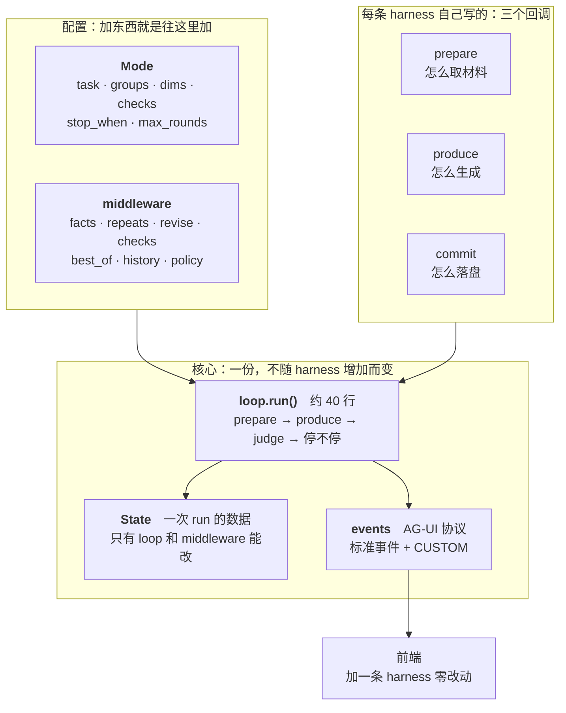
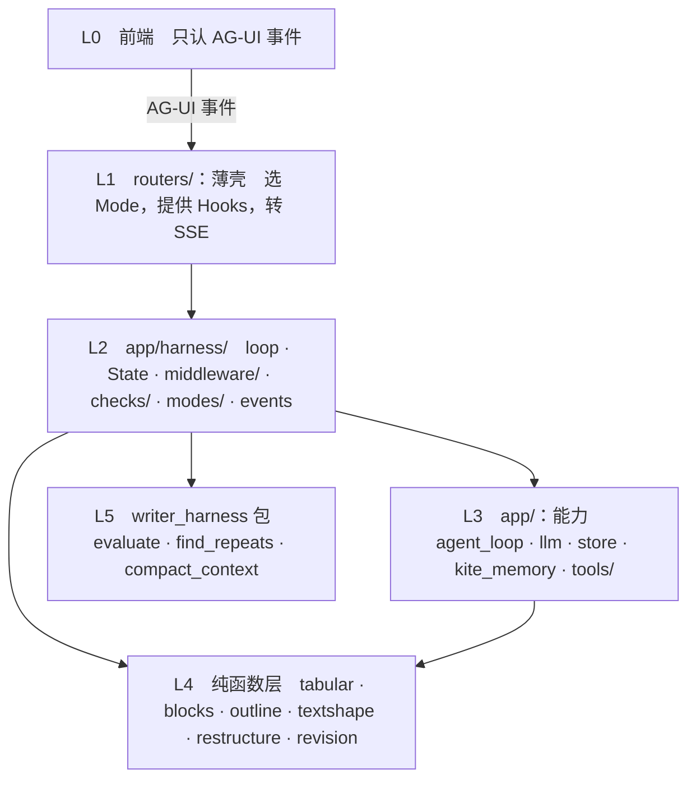

# MEMOKET_NOTE Harness 框架

> 目标架构。为什么这么设计、调研依据、数据支撑，见
> [refactor-harness-runtime.md](refactor-harness-runtime.md)。

---

**目录**：[0 一页纸](#0-一页纸) · [1 memoket-note 需要什么](#1-memoket-note-需要什么) · [2 每条需求借鉴谁](#2-每条需求借鉴谁) · [3 目录](#3-目录) · [4 什么东西谁能配](#4-什么东西谁能配) · [5 类型](#5-类型) · [6 循环](#6-循环) · [7 事件](#7-事件) · [8 工具](#8-工具) · [9 判据](#9-判据) · [10 Skill](#10-Skill) · [11 middleware](#11-middleware) · [12 错误与取消（R10 R11）](#12-错误与取消（R10-R11）) · [13 用户处置的回路（R5）](#13-用户处置的回路（R5）) · [14 8 个 Mode](#14-8-个-Mode) · [15 一条 harness 改造后](#15-一条-harness-改造后) · [16 现有代码搬到哪里去](#16-现有代码搬到哪里去) · [17 这个架构顺手解决的现有 bug](#17-这个架构顺手解决的现有-bug) · [18 分层与依赖规则](#18-分层与依赖规则) · [19 怎么测](#19-怎么测) · [20 架构原型](#20-架构原型) · [21 落地顺序](#21-落地顺序)

---

## 0. 一页纸

一条 harness = **一个 `Mode`（配置）+ 一套 `Hooks`（三个回调）**。
循环只有一份，写死。能力做成 middleware，默认全开。判据分两类：
代码判的 `Check`、模型判的 `Dimension`。事件走 **AG-UI 协议**。



---

## 1. memoket-note 需要什么

架构从需求推，不从现有代码倒推。九条，每条都能在产品行为里找到出处。

| # | 需求 | 从哪来 |
|---|---|---|
| **R1** | **没有 oracle**，合格与否要靠一组可插拔的判据 | 写作没有编译器和测试 |
| **R2** | **判据不能只靠模型**：打分器和被打分的是同一个本地模型 | 实测打分器给通篇假图打过 `has_charts=2`；LLM-as-judge 的公认建议是「别拿同一个模型家族既生成又评判」（self-preference bias） |
| **R3** | **多种任务形态**：写整篇 / 分段 / 生成一段 / 改选中的一段 | 8 个功能，共用一套闭环 |
| **R4** | **流式**：本地模型 20–90 秒一次调用，产出必须边生成边看 | `muse-glimmer-30b` 的实测延迟 |
| **R5** | **可追溯 + 可处置**：修订逐条 accept/reject，能看到某段依据哪条事实 | `roundDiff.ts`（385 行）· `TapProvenance` |
| **R6** | **内容必须来自知识库**，不能编用户的项目/数字/决定 | KITE 是这个产品的立身之本 |
| **R7** | **数字和图表语法由代码产出**，模型只决定算什么画什么 | 让模型自己算均值它会编，自己写 mermaid 会写出渲染不了的语法 |
| **R8** | **省调用**：能在工具层拦的不留给检查层，能检查的不留给打分器 | 一次打分几十秒 |
| **R9** | **并发**：同一篇笔记多个 `/` 同时跑，状态不能串 | `runningBlocks.ts` 就是这么设计的 |
| **R10** | **一步失败不能炸掉整个 run**，且已有产出必须落盘 | 本地模型高负载时单次调用超 300s 超时，异常从 SSE generator 冒出去 = 连接被硬中断 |
| **R11** | **用户随时可以关掉页面**，取消要干净 | 每条 harness 现在各有一处 `is_disconnected()` |
| **R12** | **用户能自己定写作规则**（skill），按场景生效 | `SkillsPanel` · 11 个 scope · `store.enabled_skills_for_scope()` |

## 2. 每条需求借鉴谁

调研了 14 个框架（完整笔记见 [`_research/harness-survey.md`](_research/harness-survey.md)）。

| 需求 | 借鉴 | 具体是什么 |
|---|---|---|
| R1 | **DSPy `Refine`** · **smolagents `final_answer_checks`** | 判据是配置传进去的；`Refine` 的 `best_reward` 全程跟踪 |
| R2 | **LLM-as-judge 的公认实践** | 「把复杂 rubric 拆成离散检查」是标准缓解手段；`writing-harness` 的 Sensors 是同一思路 |
| R3 | **LangChain 1.0 `AgentMiddleware`** | 循环写死，差异表达成 middleware + 配置，不是分支 |
| R4 | **AG-UI 协议** | `TEXT_MESSAGE_CONTENT` 逐 token 流 |
| R5 | **AG-UI `CUSTOM` 事件** · **LangGraph `interrupt`** | 领域事件走 CUSTOM 不污染标准事件；interrupt + checkpointer 是「暂停等人」的标准做法 |
| R6 | **RAG 的 citation/attribution** | 「起草 → 逐条对照来源验证 → 修补或删除」 |
| R7 | 无先例，我们自己的 | 工具产出 mermaid，检查比对字符串是否原样 |
| R8 | **PydanticAI 两阶段验证** | 语法（零成本）先跑，语义（要 I/O）后跑 |
| R9 | **全部框架** | 状态挂在 run 上下文里，不用模块级全局 |
| R10 | **DSPy `fail_count`** · **OpenHands Controller** | 失败有预算；「管约束的」跟「做决策的」分层 |
| R11 | **LangGraph checkpointer** | 状态在每个 super-step 存快照，中断能恢复 |
| R12 | **LangChain `middleware.tools`** · **Claude Code 的 skills** | 能力和它的配置打包在一起；用户写的规则按场景注入 system prompt |

十条横向结论（12 个框架无一例外的那些）：

1. 循环写死，不可配置
2. 观察型和干预型扩展点分开
3. 能力打包成 middleware，自带状态字段
4. 停止条件是可组合的一等公民
5. best-of：留最好的一次，不是最后一次
6. 便宜的判据先跑
7. 管约束的和做决策的分层
8. 必需能力由框架拒绝移除
9. 每步前可改配置（`prepareStep`）
10. 失败要有退路

---

## 3. 目录

```
backend/app/harness/
  types.py        Mode · Hooks · Middleware · Check · Verdict · StopCondition
  state.py        State —— 一次 run 的全部数据
  loop.py         run() —— 唯一的循环
  events.py       AG-UI 事件契约
  modes.py        8 个 Mode（现在散在 compose_block.MODES 和 harness_adapter）
  revision.py     修订的定位与应用（纯函数，从 note_harness 搬出来）
  middleware/
    facts.py        材料累积 + 压缩
    repeats.py      机械查重 → dup_hints
    revise.py       生成前先改一遍已有正文
    checks.py       跑 Mode.checks，auto-fix 或打回
    best_of.py      留最好的一轮
    history.py      记 run 历史
    policy.py       调下一轮参数        （不进 BASE）
    replan.py       骨架重规划          （不进 BASE）
  checks/
    charts.py       假图 · 手写 mermaid · 图的信息量
    structure.py    标题层级 · 收尾节撞车 · 大纲被压平
    grounding.py    占位符 · 审计腔 · 引用核对

backend/app/routers/     薄壳
  note_harness.py   1078 → 约 120
  writing_plan.py    543 → 约 100
  compose_block.py   566 → 约 60
```

不动的：`app/agent_loop.py`、纯函数层（`tabular` `blocks` `outline`
`textshape` `restructure` `runtime_policy` `replan`）、`writer_harness/`
（对 app 零依赖）。
`app/tools/` 的注册表机制不动，但**分组要调**（见第 8 节）。

---

## 4. 什么东西谁能配

架构里有三层配置，**主体不同**，混在一起想就会乱：

| 配什么 | 谁配 | 存哪 | 改了要发版吗 |
|---|---|---|---|
| `groups` / `exclude`　工具授权 | **开发者** | `modes.py` | 要 |
| `dims` / `checks`　判据 | **开发者** | `modes.py` + `checks/` | 要 |
| `skill_scope`　技能挂哪个作用域 | **开发者** | `modes.py` | 要 |
| `max_rounds` / `fact_budget` | **开发者** | `modes.py` | 要 |
| **具体启用哪些 skill** | **用户** | DB · `SkillsPanel` | 不要 |
| **个人偏好 profile** | **用户** | DB | 不要 |
| **用哪个模型**（local / gpt） | **用户** | DB · `SettingsPanel` | 不要 |

一句话：**工具只有开发者能配；skill 是两层——作用域开发者定，
具体规则用户写。**

### 为什么工具不给用户配

用户不知道 `filter_facts` 和 `search_memory` 的区别，配错了功能直接坏掉，
而且坏得很隐蔽（不报错，只是查不到东西）。**开发者配「这个功能需要什么能力」，
用户配「写出来要什么风格」——边界按「懂不懂语义」划。**

真要给用户开口子，只该是粗粒度的开关（比如「允许文生图」，因为它慢且花钱），
那是产品决策，走 `settings` 表，不走 `Mode`。

### skill 的匹配方向是反的

```python
class SkillIn:
    scopes: list[str]     # ← skill 声明**自己适用于哪些场景**
```

不是「场景声明用哪些 skill」。这跟 `Mode.skill_scope` 正好配对：
Mode 说「我是 `block_write`」，skill 说「我适用于 `block_write` 和
`magic_tap`」，匹配上就生效。用户新建一个 skill 时勾选它适用的场景——
这个方向对用户更自然，**不要为了架构整齐把它反过来**。

---

## 5. 类型

```python
# ── types.py ──────────────────────────────────────────────────────────
class Hooks(Protocol):
    """一条 harness 真正不同的只有这三件事。R3。"""

    async def prepare(self, st: State) -> tuple[list[str], ToolTrace]:
        """取材料。返回 (这一轮查到的事实, ToolTrace)。
        累积和压缩不归它管——那是 Facts middleware 的事。"""

    async def produce(self, st: State) -> AsyncIterator[str]:
        """生成，流式吐片段，**并且负责更新 `st.content`**。

        为什么更新 content 归它而不归循环：合法不同。
          · 块生成：`st.content = 这一轮的新块`（整块重写）
          · 整篇续写：`st.content = join_round_text(st.content, 新写的)`（追加）
        循环只把片段累积进 `st.fresh`（发事件、给 `_no_progress` 判据用），
        怎么合进正文是这条 harness 的事——放进循环就得写 `if mode.xxx`。
        """

    async def commit(self, st: State) -> None:
        """一次 run 收尾。**不是每轮落盘**——每轮落盘是 `Save` middleware
        的事（见第 10 节）。这里做的是收尾专属的动作，比如 writing_plan
        更新那篇进度追踪笔记。"""


class Middleware(Protocol):
    """能力包。钩子按需实现，不实现的不写。R3。

    钩子名对应**我们的**循环阶段，不是 LangChain 的 before_model——
    它的循环是 model-centric，我们的是 produce-judge。

    **钩子有两种形态，写哪种由它发不发事件决定**：
      · 要发事件的 → `async def hook(st) -> AsyncIterator[Event]`（用 yield）
      · 不发事件的 → `async def hook(st) -> None`（普通 async 函数）
    `_fire` 用 `inspect.isasyncgen` 区分。不这么做的话，不发事件的
    middleware 会被迫写 `return; yield` 这种为了"让它成为生成器"的怪写法。
    """
    name: str
    async def before_run(self, st) -> AsyncIterator[Event]: ...      # 一次 run 一次
    async def after_run(self, st) -> AsyncIterator[Event]: ...
    async def before_round(self, st) -> AsyncIterator[Event]: ...    # 每轮
    async def after_prepare(self, st) -> AsyncIterator[Event]: ...
    async def before_produce(self, st) -> AsyncIterator[Event]: ...
    async def after_produce(self, st) -> AsyncIterator[Event]: ...
    async def before_judge(self, st) -> AsyncIterator[Event]: ...
    async def after_judge(self, st) -> AsyncIterator[Event]: ...
    async def after_round(self, st) -> AsyncIterator[Event]: ...
    # 拦截型：可多次调 handler（重试）、跳过（短路）、改请求改响应
    async def wrap_prepare(self, st, handler) -> tuple[list[str], ToolTrace]: ...
    async def wrap_produce(self, st, handler) -> AsyncIterator[str]: ...


Check = Callable[["State"], "Verdict | None"]      # 代码判，纯函数只读。R2

@dataclass(frozen=True)
class Verdict:
    dimension: str                                  # 打回哪一维
    message: str                                    # 给模型看的话
    fix: Callable[[str], str] | None = None         # 能直接改就给个纯函数


StopCondition = Callable[["State"], "str | None"]   # 返回停止原因或 None


@dataclass(frozen=True)
class Mode:
    """一个功能的全部配置。加一个功能 = 加一个实例。"""
    key: str
    label: str
    task: str
    # 工具授权：`group` 是工具的分组，一组一个领域。
    #   memory(7) 查知识库 · data(5) 认表算数 · chart(4) 画图 · image(1) 文生图
    # groups=("memory",) 的功能只能查知识库，画不了图。见第 8 节。
    groups: tuple[str, ...] = ("memory",)
    exclude: tuple[str, ...] = ()                   # 排除个别工具（见第 8 节）
    skill_scope: str = ""                           # 用户技能挂哪个作用域（见第 10 节）
    dims: tuple[Dimension, ...] = ()                # 模型判的判据
    checks: tuple[Check, ...] = ()                  # 代码判的判据
    stop_when: tuple[StopCondition, ...] = ()       # 内置三条之外的
    extra_mw: tuple[Middleware, ...] = ()           # BASE 之外的
    max_rounds: int = 3
    fact_budget: int = 40
    max_tokens: int = 1400
```

```python
# ── state.py ──────────────────────────────────────────────────────────
@dataclass
class State:
    """一次 run 的全部数据。**只有 loop 和 middleware 能改，Check 只读。**

    R9：所有跨轮状态都在这个对象里，一次 run 一个实例。同一篇笔记几个 `/`
    同时跑，各自一个 State，不会串——「跨轮的东西和每轮的东西都是同一个
    函数里的局部变量、差别只在缩进」这个坑犯过四次，收进一个类就写不出来了。
    """
    mode: Mode
    ctx: ToolContext                # 用户 · 笔记 · 正文 · 光标
    request: Request                # R11：每轮查一次 is_disconnected()
    round: int = 0
    before: str = ""                # 光标前的正文（块生成）/ 全篇（写整篇）
    after: str = ""
    content: str = ""               # 当前产出
    fresh: str = ""                 # 这一轮新写的部分
    facts_new: list[str] = field(default_factory=list)  # 这一轮刚查到的（未累积）
    facts: list[str] = field(default_factory=list)      # 累积并压缩过
    charts: list[str] = field(default_factory=list)     # 工具产出过的 mermaid
    trace: ToolTrace | None = None
    ev: Evaluation | None = None
    best: tuple[tuple[int, float], str] | None = None
    skills: list[dict] = field(default_factory=list)     # 用户启用的技能（R12）
    steer: str = ""                 # 上一轮最弱那一维的诊断
    skip_judge: bool = False        # 检查已判定不合格，跳过这一轮的打分（R8）
    bag: dict = field(default_factory=dict)             # middleware 之间传东西

    def rank(self) -> tuple[int, float]:
        """把多维度折叠成可比较的标量。确定性，不再打模型。
        先比达标维度数，再比平均分。"""
        if not self.ev:
            return (-1, -1.0)
        lv = [s.level for s in self.ev.scores.values()]
        return (sum(1 for v in lv if v >= 2), sum(lv) / max(1, len(lv)))
```

---

## 6. 循环

```python
# ── loop.py ───────────────────────────────────────────────────────────
# **顺序有讲究**：同一个钩子上，先跑产出材料的，最后跑可能短路的。
# Repeats 产出 dup_hints 给打分用，Checks 可能判定不合格直接跳过打分——
# Checks 排在它后面，被拦下时 dup_hints 白算（零成本纯函数，无所谓），
# 反过来排的话 Checks 短路后 Repeats 根本不会跑，而它的结果下一轮还要用。
BASE: tuple[Middleware, ...] = (
    Facts(), Skills(), Repeats(), Checks(), BestOf(), History(),
)
# Revise 不在 BASE 里：它是「生成前先改一遍已有正文」，
# 只有长文续写用得上。块生成没有"已有正文"——它是整块重写，不是改。

async def run(st: State, hooks: Hooks) -> AsyncIterator[Event]:
    mw = BASE + st.mode.extra_mw
    reason, committed = "max_rounds", False
    yield Event.run_started(st)

    try:
        async for e in _fire(mw, "before_run", st): yield e

        for st.round in range(1, st.mode.max_rounds + 1):
            if await st.request.is_disconnected():          # R11
                raise asyncio.CancelledError
            yield Event.step_started(st.round)
            async for e in _fire(mw, "before_round", st): yield e

            # ① 取材料　R6
            st.facts_new, st.trace = await _wrap(mw, "wrap_prepare", hooks.prepare, st)
            async for e in _fire(mw, "after_prepare", st): yield e

            # ② 生成　R4 流式。一轮一个 message，START/CONTENT*/END 严格配对
            async for e in _fire(mw, "before_produce", st): yield e
            st.fresh, mid = "", f"r{st.round}"
            yield Event.text_start(mid)
            async for piece in _wrap_stream(mw, "wrap_produce", hooks.produce, st):
                st.fresh += piece
                yield Event.text_content(mid, piece)
            yield Event.text_end(mid)
            async for e in _fire(mw, "after_produce", st): yield e

            # ③ 判断　R2 R8：便宜的先跑
            async for e in _fire(mw, "before_judge", st): yield e   # Checks 排最后
            if not st.skip_judge:                                   # 检查没拦下才打分
                st.ev = await evaluate(llm, content=st.content, dimensions=st.mode.dims,
                                       dup_hints=st.bag.get("dup_hints", ()),
                                       context=_context(st))
            yield Event.custom("evaluate", _ev_payload(st))
            async for e in _fire(mw, "after_judge", st): yield e     # BestOf
            async for e in _fire(mw, "after_round", st): yield e     # Policy / Replan

            yield Event.step_finished(st.round)
            if hit := _stop(st):
                reason = hit
                break
            st.steer = _steer(st.ev)
            st.ev, st.skip_judge = None, False                       # 下一轮重新判
        else:
            st.content = st.best[1] if st.best else st.content        # 交付最好的一轮

        await hooks.commit(st)
        committed = True
        async for e in _fire(mw, "after_run", st): yield e
        yield Event.run_finished(st.content, reason)

    except asyncio.CancelledError:
        raise                       # 落盘交给 finally，异常照常往上抛
    except Exception as exc:        # noqa: BLE001
        yield Event.run_error(str(exc))
    finally:
        # R10：跑了 5 轮的正文因为第 6 轮出错就全丢，是最糟的失败模式。
        #
        # **陷阱**：CancelledError 之后 `await` 可能再次被取消，
        # finally 里的收尾就做不完。所以用 shield 把它护住。
        # （每轮的正文其实已经由 Save middleware 落过盘了，这里是双保险；
        # 块生成没有 Save，全靠这一手。）
        if not committed and st.content:
            with contextlib.suppress(Exception):
                await asyncio.shield(hooks.commit(st))


async def _fire(mw, hook: str, st: State) -> AsyncIterator[Event]:
    """跑一个钩子上的所有 middleware。**一个挂掉不炸掉别的**（R10），
    但要说出来，不能沉默。"""
    for m in mw:
        fn = getattr(m, hook, None)
        if fn is None:
            continue
        try:
            r = fn(st)
            if inspect.isasyncgen(r):
                async for e in r:
                    yield e
            else:
                await r
        except Exception as exc:                       # noqa: BLE001
            yield Event.custom("warning", {"middleware": m.name, "hook": hook,
                                           "error": str(exc)[:200]})


async def _wrap(mw, hook: str, handler, st: State):
    """洋葱：列表第一个包住其余。可多次调 handler（重试）、跳过（短路）、
    改请求改响应。**流式的那个（_wrap_stream）重试要在 text_start 之前决定**——
    已经发出去的 delta 收不回来，只能作废整条 message 重开一条。"""
    call = handler
    for m in reversed([x for x in mw if hasattr(x, hook)]):
        call = functools.partial(getattr(m, hook), handler=call)
    return await call(st)


# 内置三条 + Mode 追加的，OR 组合（AI SDK 的 stopWhen）
def _stop(st: State) -> str | None:
    for c in (_complete, _blocked, _no_progress, *st.mode.stop_when):
        if r := c(st):
            return r
    return None
```

**循环里没有任何一个 middleware 的名字，也没有一个 `if mode.xxx`。**

---

## 7. 事件：AG-UI 协议

不自己定一套。[AG-UI](https://docs.ag-ui.com) 是现成的开放协议，
5 大类事件，领域专属的走 `CUSTOM`。好处是前端将来能直接接
CopilotKit 这类现成 UI 库。

```python
# ── events.py ─────────────────────────────────────────────────────────
@dataclass(frozen=True)
class Event:
    """一个 SSE 事件。`type` 用 AG-UI 的名字，领域专属的走 CUSTOM。"""
    type: str
    data: dict

    # 构造器，循环和 middleware 只用这些，不手拼 dict
    @staticmethod
    def run_started(st) -> "Event": ...
    @staticmethod
    def run_finished(content: str, reason: str) -> "Event": ...
    @staticmethod
    def run_error(msg: str) -> "Event": ...
    @staticmethod
    def step_started(n: int) -> "Event": ...
    @staticmethod
    def step_finished(n: int) -> "Event": ...
    @staticmethod
    def text_start(mid: str) -> "Event": ...
    @staticmethod
    def text_content(mid: str, delta: str) -> "Event": ...
    @staticmethod
    def text_end(mid: str) -> "Event": ...
    @staticmethod
    def tool_call(name: str, args: dict, result: str) -> "Event": ...
    @staticmethod
    def activity(label: str) -> "Event": ...
    @staticmethod
    def custom(name: str, value: dict) -> "Event": ...


# 标准事件：直接用 AG-UI 的名字
RUN_STARTED · RUN_FINISHED · RUN_ERROR
STEP_STARTED · STEP_FINISHED                    # 一轮 / 一个 section
TEXT_MESSAGE_START · TEXT_MESSAGE_CONTENT · TEXT_MESSAGE_END   # R4 流式
TOOL_CALL_START · TOOL_CALL_ARGS · TOOL_CALL_RESULT
ACTIVITY_SNAPSHOT                               # 「在查资料…」「在画图…」
CUSTOM                                          # {name, value}
```

我们现在 23 个自造事件名的去向：

| 现在 | 之后 |
|---|---|
| `delta` | `TEXT_MESSAGE_CONTENT` |
| `tool-calls` | `TOOL_CALL_START` / `ARGS` / `RESULT` |
| `round-start` · `section-start` | `STEP_STARTED`（`stepName` 区分） |
| `round-end` | `STEP_FINISHED` |
| `done` · `plan-done` | `RUN_FINISHED` |
| `error` | `RUN_ERROR` |
| `phase` · `phase-delta` | `ACTIVITY_SNAPSHOT` |
| `evaluate` · `revision` · `dropped` · `policy` · `replan` · `skeleton` · `plan-loaded` · `plan-extended` · `section-done` | `CUSTOM`，`name` 区分 |

**前端只需要认 8 个标准事件 + 一个 CUSTOM 分支**，加一条 harness 零改动。
迁移期旧名留别名映射，前端一行不改。

---

## 8. 工具：注册表不动，分组要调

加一个工具 = 写一个带装饰器的函数，不改 harness、不改调度、不改授权。

```python
@register(name="numbers_near_cursor", group="data",
          description="看光标跟前的正文里写着哪些数字…",
          params={"radius": {"type": "integer", "description": "…"}})
def numbers_near_cursor(ctx: ToolContext, radius: int | None = None) -> str: ...
```

`ToolContext` 带 `content` / `cursor`（**R9**：挂在 ctx 上不是模块级全局，
否则同一篇笔记的并发 run 会互相覆盖光标）。

| group | 数量 | 干什么 |
|---|---|---|
| `memory` | 7 | KITE 知识库检索 —— **R6** |
| `data` | 5 | 认表 · 算统计 · 找光标附近的数字 —— **R7** |
| `chart` | 4 | 拼 mermaid · 拼表格 —— **R7** |
| `image` | 1 | 文生图 |

### 授权粒度：组为主，工具为辅

**授权在 `Mode` 上**，不在 middleware 里：工具是按领域分组的通用能力，
「哪个功能用哪几组」是功能的属性。

```python
groups: tuple[str, ...] = ("memory",)     # 粗粒度：按组给
exclude: tuple[str, ...] = ()             # 细粒度：排除个别
# 解析结果 = names(groups) - exclude
```

`exclude` 借鉴 deepagents 的 `excluded_tools`。**为什么需要它**——实测各模式
拿到的工具数：

| 模式 | 授权的组 | 拿到 | 真正要用的 | spec ≈token |
|---|---|---|---|---|
| 智能表格 | data·chart·memory | 16 | 约 10 | 3728 → 1896（**省 49%**） |
| 数据可视化 | data·chart·memory | 16 | 15 | 3728 → 3400 |
| 智能插图 | data·chart·image·memory | 17 | 约 12 | 3927 → 3000 |

这段 spec **每次工具循环调用都要带**，一轮最多 3 次迭代、一次 run 最多
3 轮——最多 9 次。除了 token，17 个选项里挑也让模型更容易选错。

### 但先修分组，别拿 exclude 打补丁

实测发现一处分组本身就是错的：

```
chart 组：chart_column · chart_from_text · render_chart · render_table
                                                          ↑ 这个是**做表**不是画图
```

于是所有画图的模式被迫拿到 `render_table`，做表的模式被迫拿到三个画图工具。
**这种情况该改分组，不是加 exclude。**

建议的分组（重构时一并调整）：

| group | 工具 | 谁用 |
|---|---|---|
| `memory` | 7 个 KITE 检索 | 全部（R6） |
| `data` | `list_tables` `numbers_near_cursor` `describe_table` `aggregate_table` `correlate_columns` | 要读数据的 |
| `chart` | `chart_column` `chart_from_text` `render_chart` | 画图的 |
| `table` | `render_table` | 做表的 |
| `image` | `render_image` | 文生图 |

**规则：一个组如果经常要 `exclude` 同一个工具，说明分组错了——
先改分组，`exclude` 是留给真正的例外的。** 加一条测试盯住它：

```python
def test_exclude_不该被当成常规手段():
    """同一个工具被两个以上 Mode 排除 = 它待错组了。"""
    c = Counter(tool for m in ALL_MODES for tool in m.exclude)
    bad = [t for t, n in c.items() if n >= 2]
    assert not bad, f"{bad} 被多个 Mode 排除，说明分组错了，去改 group 而不是加 exclude"
```

### spec 长度也是成本

各组的 spec 长度实测：

| group | 工具数 | 字符 | 平均 |
|---|---|---|---|
| `memory` | 7 | 2891 | 413 |
| `chart` | 4 | 2876 | **719** |
| `data` | 5 | 1689 | 337 |
| `image` | 1 | 398 | 398 |

`chart` 组平均 719 字符/工具最长——`chart_from_text` 的描述里塞了单位、
出处校验、拆图规则等一堆说明。**那些应该在拒绝理由里说（工具拒绝时返回的
文本），不是在 spec 里预先说**：spec 每次调用都带，拒绝理由只在真出错时出现一次。

**判据尽量往工具层放（R8）**——工具能拒绝的，不留给检查层：

| 工具已经在拒绝的 | 判据（确定性） |
|---|---|
| 混量纲的图 | 从原文取每个数字紧跟的单位，两种以上就拒 |
| 单值图 | 一个数画不出比较 |
| 没信息量的图 | 数据点 < 10 不画直方图；各取值次数相同不画占比图 |
| 编造的数 | 数值必须在光标附近以该单位出现过 |

---

## 9. 判据

### 9.1 两类，边界按「能不能用代码判定」划（R2）

| | 谁判 | 形态 | 成本 |
|---|---|---|---|
| `Check` | 代码 | `(State) -> Verdict \| None`，纯函数只读 | 零 |
| `Dimension` | 模型 | `Dimension(name, guidance)` | 一次 LLM 调用 |

**能写出确定性判据的一律归代码。** 不是洁癖——我们踩在一个公认的坑上：

> LLM-as-judge 的标准建议是 **never use the same model family as both
> generator and judge**（self-preference bias：judge 给自己家族的输出打分会虚高）。
> 我们正是这样：`muse-glimmer-30b` 既写又判，它的盲区和写作时的盲区是同一个。

三条缓解按成本排：

1. **把 rubric 拆成离散检查** —— 就是这一节说的 `Check`，被调研验证为标准手段
2. **换个模型打分** —— 我们有 `gpt-5.6-luna`，打分只占一次调用。
   **值得单独做一次 A/B**：同一批产出两边打分，分歧大就说明 bias 确实在起作用
3. **pairwise 双向比较**代替打分 —— best-of 的场景天然适合

第 1 条是这个架构在做的；第 2、3 条不改架构，随时可以试。

### 9.2 三档修复

```python
@dataclass(frozen=True)
class Verdict:
    dimension: str
    message: str
    fix: Callable[[str], str] | None = None
```

| 档 | 怎么修 | 成本 | 例子 |
|---|---|---|---|
| **auto-fix** | `Verdict.fix`，代码直接改 | 零 | 标题层级整体下沉；删掉跟后文撞车的收尾节 |
| **打回重来** | 压分 + 诊断进下一轮 prompt | 一轮 | 假图、手写 mermaid、跑题 |

**auto-fix 的边界是实测出来的**：修法唯一且不需要语义判断才行。
「标题层级过浅」✓（整体下沉，正文一字不动）；
「4 个小标题太碎」✗（删哪个是语义判断）。
**fix 之后要重跑这条 check**，而且**要在副本上修、通过了才采纳**——
一次没修好的 fix 如果留下副作用，下一轮就基于被改坏的内容继续。
（这条是写原型跑出来的，见第 20 节。）

### 9.3 现有的 checks

| 文件 | 检查 | 抓什么 |
|---|---|---|
| `charts.py` | `no_fake_charts` | `[柱状图：各渠道点击量…]` 这种文字描述的图 |
| | `charts_from_tools` | 手写的 mermaid（跟工具返回的字符串比对，**R7**） |
| `structure.py` | `heading_fits` | 标题层级跟上文章节平级（**带 fix**） |
| | `tail_clashes` | 自带收尾节跟后文已有章节撞车（**带 fix**） |
| | `outline_intact` | 大纲笔记的层级被压平 |
| `grounding.py` | `no_placeholder` | 「（此处待补充）」这类占位符 |
| | `no_audit_voice` | 审计腔：说证据够不够而不是说事 |
| | `citations_hold` | 引用的事实标记确实存在（**R6**，`check_citations` 终于接上） |

---

## 10. Skill：用户自己定的写作规则（R12）

`skill` 是用户在 `SkillsPanel` 里写的规则，按 **scope** 叠加到 system prompt
后面。跟 `Dimension`/`Check` 的区别：

| | 谁写 | 什么时候起作用 |
|---|---|---|
| `Dimension` | 我们 | 产出**之后**，打分 |
| `Check` | 我们 | 产出**之后**，代码判 |
| **`skill`** | **用户** | 产出**之前**，进 system prompt |

### 现状：18 处重复，而且 `/` 菜单一个都没有

```python
# 这一行在 compose.py / note_harness.py / writing_plan.py 里出现 18 次
system = prompts.compose_system(prompts.EDIT_SYSTEM,
                                store.enabled_skills_for_scope(user, "edit"))
```

11 个 scope：`magic_tap` `section_write` `plan_generate` `more_sections`
`verify` `rewrite` `polish` `expand` `edit` `skeleton` `digest`。

**`compose_block` 的 6 个模式一个 scope 都没有**——用户在编辑器里敲 `/`
做的智能插图、数据可视化、按提示词写，全都不受他自己写的技能影响。
这不是设计决定，是加功能时漏了——**跟「一条 harness 有另一条没有」是同一类**。

### 架构里怎么放

`Mode.skill_scope` 声明用哪个作用域，`Skills` middleware 在 `before_produce`
查出来放进 `State`，`produce` hook 组装 prompt 时用：

```python
class Skills:
    """把用户启用的技能查出来，放进 State。R12。

    做成 middleware 而不是让每个 hook 自己查，是因为它 18 处重复且逻辑相同；
    做成 middleware 之后，**加一个新功能只要给 Mode 填个 skill_scope
    就自动支持用户技能**，不用记得去调 compose_system。
    """
    name = "skills"
    async def before_produce(self, st) -> None:
        st.skills = (store.enabled_skills_for_scope(st.ctx.user, st.mode.skill_scope)
                     if st.mode.skill_scope else [])

# produce hook 里：
system = prompts.compose_system(BLOCK_SYSTEM, st.skills)
```

`Skills` 进 `BASE`——**默认全开，`skill_scope` 为空就自然是空列表**，
不需要每条 harness 记得接。

### scope 和 Mode 的关系

现在 scope 是按「动作」分的（rewrite / polish / expand），Mode 是按「功能」
分的，两套命名并存。重构时对齐：

| Mode | skill_scope | 备注 |
|---|---|---|
| `NOTE` | `magic_tap` | 沿用旧名，用户配好的技能不失效 |
| `SECTION` | `section_write` | |
| `EDA` `CHART` `TABLE` `ANALYSIS` | **新增** `block_write` | 现在没有——这是要补的功能缺口 |
| `PROMPT` `CUSTOM` | **新增** `block_prompt` | 同上 |

**不要为了整齐把旧 scope 改名**：scope 名字存在用户数据里，改名等于让所有
人已经配好的技能失效。新加的用新名字，旧的原样留着。

`compose.py` 那些单点动作（rewrite / polish / expand / verify / digest）
不走 harness 循环，它们保留各自的 scope，但可以共用一个
`system_for(scope, base)` 小函数，把那 18 处重复收成一处。

---

## 11. middleware

一个能力一个文件，**不认识循环，能脱离它单测**。

| middleware | 钩子 | 干什么 | 在 BASE 里 |
|---|---|---|---|
| `Skills` | `before_produce` | 查用户启用的技能进 `State`（R12） | ✓ |
| `Facts` | `after_prepare` | 材料累积 + 压缩，**绑死在一起** | ✓ |
| `Repeats` | `before_judge` | `find_repeats` → `bag["dup_hints"]` | ✓ |
| `Revise` | `before_produce` | 生成前先改一遍已有正文（R5 发 CUSTOM revision 事件） | ✗ note/section 专用 |
| `Checks` | `before_judge` | 跑 `Mode.checks`，auto-fix 或打回（R8 命中就跳过打分） | ✓ |
| `BestOf` | `after_judge` | 留 `rank()` 最高的一轮 | ✓ |
| `History` | `after_run` | 记 `RunRecord` | ✓ |
| `Save` | `after_produce` | 每轮落盘 —— 跑到一半关掉页面，已写的轮次要保住 | ✗ note/section 专用（块不落盘） |
| `Policy` | `after_round` | 上轮观测 → 下轮参数 | ✗ note 专用 |
| `Replan` | `after_round` | 有约束的骨架重规划 | ✗ note 专用 |

```python
class Facts:                      # 不发事件的 middleware：普通 async def
    """材料累积 + 压缩**绑死在一起**——不给调用方"只累积不压缩"的选项。
    三处无上限累积（seen_facts / seen_charts / run_facts）就是分开做的后果，
    而「材料每轮清零」那个 bug（见第 17 节）就是分开做的另一半后果。"""
    name = "facts"
    async def after_prepare(self, st) -> None:
        fresh = [f for f in st.facts_new if f not in st.facts]
        st.facts = compact_facts(st.facts + fresh, st.mode.fact_budget)
        st.charts += [c for c in mermaid_of(st.trace) if c not in st.charts]
        st.bag["dry_rounds"] = 0 if fresh else st.bag.get("dry_rounds", 0) + 1
        # 不发事件，所以是普通 async 函数——不用写 `return; yield`


class Checks:
    """R8：确定性检查排在打分前面。命中就跳过那次 LLM 调用（几十秒）。
    （PydanticAI 的两阶段验证同理：语法零成本先跑，语义要 I/O 后跑。）"""
    name = "checks"
    async def before_judge(self, st):
        for check in st.mode.checks:
            v = check(st)
            if not v:
                continue
            if v.fix:
                # **fix 必须原子**：在副本上修，通过了才采纳。
                # 不这样的话，一次没修好的 fix 已经改了 st.content——
                # 内容被改了但还是不合格，下一轮基于被改坏的继续，可能更糟。
                # （这条是写原型跑出来的，纸上推演三轮没发现。）
                probe = dataclasses.replace(st, content=v.fix(st.content))
                if not check(probe):
                    st.content = probe.content
                    continue
            st.ev = Evaluation(
                scores={v.dimension: DimensionScore(level=0, note=v.message)},
                status="continue", weakest=v.dimension)
            st.skip_judge = True           # 显式短路，不靠"st.ev 非空"这种副作用
            yield Event.custom("check_hit", {"dimension": v.dimension,
                                             "note": v.message})
            return
```

**「必需能力不会漏」靠 BASE 默认全开**，不靠人记得接——
`find_repeats` / `compact_context` / `record_harness_run` /「材料用完就停」
这四样都发生过「一条 harness 有、另一条没有」，全是遗漏不是决定。

---

## 12. 错误与取消（R10 R11）

现状：三条 harness 各有 4–5 处 `try/except`，策略各不相同（有的 `return`、
有的 `break`、有的退回 fallback），**没有一处 `finally`，没有一处
`CancelledError` 处理**。又一个「抄三遍」的后果。

### 三级错误，各归各的层

| 级别 | 例子 | 谁处理 | 后果 |
|---|---|---|---|
| **可降级** | 工具循环失败 → 退回关键词检索；打分超时 → 按现状收尾 | **Hooks 自己**——降级策略是这条 harness 特有的 | 发 `CUSTOM warning`，继续跑 |
| **可隔离** | 某个 middleware 抛异常（比如记历史失败） | **loop 统一捕获** | 发 `CUSTOM warning`，**跳过这个 middleware，继续跑** |
| **致命** | 模型完全不可用、State 损坏 | loop | `RUN_ERROR` + `finally` 保证落盘 |

**一个 middleware 挂掉不该炸掉整个 run**——这是把能力做成 middleware 换来的
隔离性，现在的写法（能力散在循环里）做不到。

`_fire` 和 `run` 的实现见第 5 节——`_fire` 把每个 middleware 的异常
就地转成 `CUSTOM warning` 事件，`run` 用 `finally` 保证已有产出落盘。

### 流式重试的约束

`wrap_produce` 能重试，但**已经发出去的 `TEXT_MESSAGE_CONTENT` 收不回来**。
AG-UI 的解法是 `TEXT_MESSAGE_START` / `END` 配对——重试就开一个新
`messageId`，前端替换掉上一条，而不是追加。

```python
# 一轮一个 message，START / CONTENT* / END 严格配对。
# AG-UI 对此有状态机校验（协议 issue #161：连发两个 START 直接报错）。
yield Event.text_start(mid := f"{st.round}")
async for piece in ...:
    yield Event.text_content(mid, piece)
yield Event.text_end(mid)
```

**所以 `wrap_produce` 的重试要在 `text_start` 之前决定**——已经开始流了就
只能作废整条 message 重开一条，不能"接着改"。

---

## 13. 用户处置的回路（R5）—— 现状有缺口

**这一节记的是一个已知缺口，不是已实现的设计。**

`roundDiff.ts`（385 行）做了逐条 accept / reject，但那全是**编辑器内的
StateEffect**（`acceptHunk` / `dropHunk` / `acceptAllHunks`），**不回传后端**。
后端 `note_harness.py:516` 只在 run 开始时 `store.get_note()` 读一次，
之后每轮自己 `store.update_note()` 写回。

**结果：harness 还在跑的时候，用户在编辑器里的处置会被下一轮覆盖。**
多轮 harness（note 最多 8 轮）跑完才让用户处置，那时已经改了 8 轮，
「逐条接受」的意义就小了——用户要的是**每轮**都能处置。

### 设计位置：轮末暂停

标准做法是 LangGraph 的 `interrupt()` + checkpointer + `Command(resume=...)`：
在某个点存快照、暂停、把控制权交回去，用户处置完带着结果恢复。

映射到这个框架，它是**一条停止条件加一个恢复入口**：

```python
def pause_for_review(st: State) -> str | None:
    """轮末暂停等用户处置。State 存快照，SSE 正常收尾，
    前端拿 run_id 调 /resume 带上用户接受了哪些改动。"""
    # review_each_round 是**这个功能实现时才加的 Mode 字段**，现在没有
    return "awaiting_review" if st.mode.review_each_round else None

# POST /api/harness/{run_id}/resume  {accepted: [hunk_id...], content: str}
#   → 用用户处置后的 content 覆盖 st.content，从 st.round + 1 继续
```

需要的东西：`State` 可序列化 + 一张 `harness_runs` 快照表（已有
`record_harness_run`，扩展它）+ 一个 resume 端点。

### 为什么不在这次重构里做

它不是重构，是**新功能**——现在的行为（连续跑完再处置）是能用的，
只是不够好。重构的目标是「结构变清楚、行为不变」，把新功能混进来会让
「改坏了没有」无从判断。

**但架构要留出位置**：`stop_when` 是可组合的，加这条不用动循环；
`State` 收敛成一个 dataclass 之后本来就接近可序列化。**这两件事让
将来实现它只是加一个 StopCondition 和一个端点，不是再改一次架构。**

---

## 14. 8 个 Mode

```python
# ── modes.py ──────────────────────────────────────────────────────────
NOTE = Mode(key="note", label="写完整篇", task=...,
            groups=("memory",), dims=note_dimensions(),
            checks=(no_placeholder, no_audit_voice, outline_intact, citations_hold),
            # ⚠️ material_used_up 的**现有判据实测触发率接近 0**
            #（要求「连着两轮零新事实」，而每轮都能检索回字面不同、
            # 语义相同的条目）。搬过来时要重新设计判据，不要照抄。
            stop_when=(material_used_up, stalled),
            extra_mw=(Revise(), Policy(), Replan()), max_rounds=8)

SECTION = Mode(key="section", label="文件夹级分段", ...,
               extra_mw=(Revise(),), stop_when=(material_used_up,), max_rounds=6)

EDA = Mode(key="eda", label="数据可视化", task=...,
           groups=("data", "chart", "memory"),
           dims=(numbers_from_tools, honest_caveats, has_charts,
                 no_duplicate_charts, covers_the_data, fits_context, actionable),
           checks=(no_fake_charts, charts_from_tools, heading_fits, tail_clashes),
           max_rounds=3)

CHART   = Mode(key="chart",   label="智能插图",     groups=("data","chart","image","memory"), ...)
TABLE   = Mode(key="table",   label="智能表格",     groups=("data","chart","memory"), ...)
ANALYSIS= Mode(key="analysis",label="智能数据分析", groups=("data","chart","memory"), ...)
PROMPT  = Mode(key="prompt",  label="按提示词写",   groups=("memory",), ...)
CUSTOM  = Mode(key="custom",  label="按提示词改这段", groups=("memory",), ...)
```

---

## 15. 一条 harness 改造后

```python
# ── routers/compose_block.py：566 → 约 60 行 ─────────────────────────
@router.post("/api/compose/block")
async def compose_block(body: ComposeBlockIn, user: str = Depends(current_user)):
    mode = modes.BLOCK[body.mode]
    st = State(mode=mode,
               ctx=tools.ToolContext(user=user, note_id=body.note_id,
                                     content=body.content, cursor=body.cursor))
    st.before, st.after = _split(body.content, body.cursor)

    class H:
        async def prepare(self, st):
            msgs = _plan_msgs(mode, st)
            _, trace = await agent_loop.gather_context(msgs, st.ctx, groups=mode.groups)
            if mode.key == "eda" and not _drew(trace):        # 画图补一轮
                _, t2 = await agent_loop.gather_context(
                    msgs + [CHART_PASS], st.ctx, groups=("chart",))
                trace.merge(t2)
            return trace.as_facts(), trace

        async def produce(self, st):
            async for p in llm.stream(_gen_msgs(mode, st), max_tokens=mode.max_tokens):
                yield p

        async def commit(self, st):
            pass                                    # 块不落盘，直接交前端

    return sse(harness.run(st, H()))
```

---

## 16. 现有代码搬到哪里去

### note_harness.py（1078 行）

| 现有 | 去向 |
|---|---|
| `run()` / `gen()` 的循环骨架（555 行） | `harness/loop.py`，三条合一 |
| `_run_edit_pass`（131） | `middleware/revise.py` |
| `_replan_beats`（22） | `middleware/replan.py` |
| `_evaluate_round`（53） | `loop.py` 的 judge 段 |
| `_locate` `_breakage` `_replaced_span` `_is_same_meaning_rewrite` `reject_revision` `_apply_revision` `_tidy_blank_lines` `_expand_sources` | `harness/revision.py`（纯函数） |
| `TOOL_GROUPS` `CONTINUE_MAX_TOKENS` `MAX_ROUNDS_CAP` `STALL_ROUNDS_CAP` `CONTEXT_KEEP_LAST_CHARS` | `modes.py` 的 `NOTE` 字段 |
| 剩下 | `routers/note_harness.py` ≈120 行 |

### writing_plan.py（543 行）

| 现有 | 去向 |
|---|---|
| `run_plan()` 的轮循环（299 行里的大部分） | `harness/loop.py` |
| **分段调度**（选下一个 section、扩展计划） | **留在 router**——那不是 harness 的事 |
| `_run_section_edit_pass`（83） | `middleware/revise.py`，跟 note 那份合并 |
| `_evaluate_section`（38） | `loop.py` 的 judge 段 |
| `_make_summary`（33） | 留在 router |
| `_sync_tracking_note`（10） | Hooks 的 `commit`（收尾，一次） |
| 每轮的 `store.update_note()` | `middleware/save.py`（每轮，不是收尾） |
| `SECTION_ROUND_CAP` | `modes.py` 的 `SECTION.max_rounds` |
| `PLAN_SAFETY_CAP` | **留在 router**——它管的是外层分段调度，不是一条 harness 的轮数 |
| 剩下 | `routers/writing_plan.py` ≈100 行 |

### compose_block.py（566 行）

| 现有 | 去向 |
|---|---|
| `MODES`（六个模式，170 行） | `modes.py` |
| 循环（207 行） | `harness/loop.py` |
| `forced` 那段 | `checks/charts.py` · `checks/structure.py` |
| `seen_facts` / `seen_charts` | `middleware/facts.py` |
| best-of | `middleware/best_of.py` |
| `_drew` · `_CHART_PASS` | Hooks 的 `prepare` |
| `table_from_image` · `restructure_note` | 原样留在 router（独立端点，不走 harness） |
| 剩下 | `routers/compose_block.py` ≈60 行 |

### 别处

| 现有 | 去向 |
|---|---|
| `harness_adapter.note_dimensions()` / `section_dimensions()` | `modes.py`，跟 `MODES` 合并到一处 |
| 18 处 `compose_system(X, enabled_skills_for_scope(user, scope))` | `middleware/skills.py` + `prompts.system_for(scope, base)` |
| `prompts.SKILL_SCOPES` | 留在 `prompts.py`，但加两个新 scope（`block_write` / `block_prompt`） |
| `harness_adapter.AppLLMClient` / `SqliteRunHistoryStore` | 原地不动（包的适配层） |
| `blockcheck.py` | `checks/charts.py` + `checks/structure.py` |
| `grounding_check.py` | `checks/grounding.py`；**三处静默改写改成带 `fix` 的 Check** |
| `runtime_policy.py` · `replan.py` · `outline.py` · `textshape.py` · `tabular.py` · `blocks.py` | **原地不动**（纯函数层） |
| `agent_loop.py` · `writer_harness/` | **原地不动** |
| `app/tools/registry.py` | 机制不动；**`render_table` 从 chart 组挪出来**（见第 8 节） |

---

## 17. 这个架构顺手解决的现有 bug

不是设计目标，是结构对了之后的副产品——**这几条是架构对不对的验证**：

| 现有 bug | 为什么在新结构里不存在 |
|---|---|
| **材料每轮清零**（犯过四次：note / compose_block / writing_plan / 一次没发现） | 累积在 `State` 上，`State` 在循环外创建。「跨轮的东西和每轮的东西都是同一个函数的局部变量、差别只在缩进」这个坑，语法上就写不出来了 |
| **`writing_plan` 的材料要按 section 分开** | 每个 section 一个 `State`，**天然分开**。不用专门写 `section_facts: dict[str, list]` |
| **`find_repeats` / `compact_context` / `record_harness_run` /「材料用完就停」一条 harness 有另一条没有**（四次） | 都在 `BASE` 里，默认全开 |
| **跨轮累积没有上限**（三处） | `Facts` middleware 把累积和压缩绑死，没有"只做一半"的写法 |
| **交付最后一轮而不是最好的一轮** | `BestOf` 在 `BASE` 里 |
| **`/` 菜单的 6 个功能不支持用户技能** | `Skills` 在 `BASE` 里，`Mode` 填个 `skill_scope` 就有 |
| **同一篇笔记并发 run 会串光标** | `ToolContext` 挂在 `State` 上，一次 run 一个 |
| **一个能力出错炸掉整条 SSE 流** | `_fire` 隔离每个 middleware 的异常 |
| **中途出错已写的内容全丢** | `finally` 保证 `commit` |

**如果一个重构方案不能让已知 bug 变得写不出来，那它只是把代码搬了个地方。**

---

## 18. 分层与依赖规则



四条规则写成 `tests/test_layering.py`，用 `ast` 扫 import：

1. **L4 只 import 标准库** —— 现在成立，焊死
2. **L5 不 import `app`** —— 现在成立，这是包能开源的全部条件
3. **L1 之间不互相 import** —— 现在**不成立**（`compose_block` → `compose._profile`、`note_harness._sse`）
4. **L3 不 import L1 / L2** —— 现在有一处反向（`store` → `prompts`）

**没有测试焊死，三个月后会全部漂回去**——现有四处违反就是这么来的。

---

## 19. 怎么测

| 测什么 | 怎么测 | 要模型吗 |
|---|---|---|
| `checks/` | 构造字符串断言，拿真实失败产出当用例 | 否 |
| `middleware/` | 构造 `State`，调一个钩子，断言状态变化 | 否 |
| `loop.py` | 假 `Hooks` + 假 `evaluate`，断言三态走向、best-of 选对、停止条件命中 | 否 |
| `modes.py` | 遍历 8 个 Mode，断言必需 middleware 都在、维度名不重复 | 否 |
| 分层规则 | `ast` 扫 import | 否 |
| 事件契约 | `events.py` 的集合 == 前端处理的集合 | 否 |
| 端到端质量 | soak，**先读两篇产出再看表** | 是 |

**前六层都不要模型**——现在验证一个循环改动要跑一次真实 harness
（分钟级、带随机性），之后是毫秒级确定性单测。

第 20 节那个原型就是「loop.py 怎么测」的现成模板：假 `Hooks` + 假
`evaluate`，11 个场景全在毫秒级跑完。

---

## 20. 架构原型：能跑的验证

`docs/_research/prototype/` 是这套类型和循环的**可执行版本**——零依赖、
假 LLM、假工具，约 180 行。

```bash
cd docs/_research/prototype && python3 test_harness_proto.py
# 11/11 通过
```

它不是实现，是**架构的验证**：如果这 11 个场景跑不通，说明架构在纸上说得通、
写起来不通。

| # | 场景 | 验证什么 |
|---|---|---|
| ① | 第 2 轮全达标就停 | `complete` 提前终止 |
| ② | 第 2 轮最好、第 3 轮变差 | **跑满轮数交付 best，不是最后一轮** |
| ③ | 检查连命三轮 | 命中就跳过打分（`evaluate` 一次没被调） |
| ④ | 标题层级过浅 | auto-fix 修好后不打回 |
| ④b | fix 修不好 | **修完仍不合格就回滚** ← 原型抓到的设计缺陷 |
| ⑤ | 一个 middleware 抛异常 | 隔离成 warning，run 照常完成 |
| ⑥ | 第 1 轮写完就断线 | 已有内容仍然落盘 |
| ⑦ | 跑 8 轮、budget=3 | 材料累积且有上限 |
| ⑧ | 前两次取材料查不到 | `wrap_prepare` 能重试 |
| ⑨ | 缓存命中 | `wrap_prepare` 能短路 |
| ⑩ | 两个 wrap | 洋葱：`A-in B-in B-out A-out` |

**④b 是写原型换来的**：原来的 fix 逻辑「修完再 check，还命中就打回」有副作用，
纸上推演三轮没发现，跑一次就出来了。**架构文档写完要写原型，这是最便宜的自查。**

---

## 21. 落地顺序

| 步 | 做什么 | 风险 | 老代码还能跑吗 |
|---|---|---|---|
| 1 | `events.py`：AG-UI 事件 + 旧名别名映射 | 低 | ✓ |
| 2 | `checks/`：`blockcheck` / `grounding_check` 搬过来统一签名 | 低 | ✓ |
| 3 | `harness/revision.py`：修订定位与应用搬出来 | 低 | ✓ |
| 4 | `middleware/`：一个个搬，**搬一个测一个** | 中 | ✓ |
| 5 | `types.py` + `state.py` + `loop.py`：假 Hooks 先测通 | 中 | ✓ |
| 6 | `modes.py`：8 个 Mode 定义到一处 | 低 | ✓ |
| 7 | router 迁移：`compose_block` → `writing_plan` → `note_harness` | 高 | 逐条切换 |

**前六步都是往旁边加东西，不动现有路径。** 第 7 步一条一条切，
每切一条跑一轮 soak 对比。
