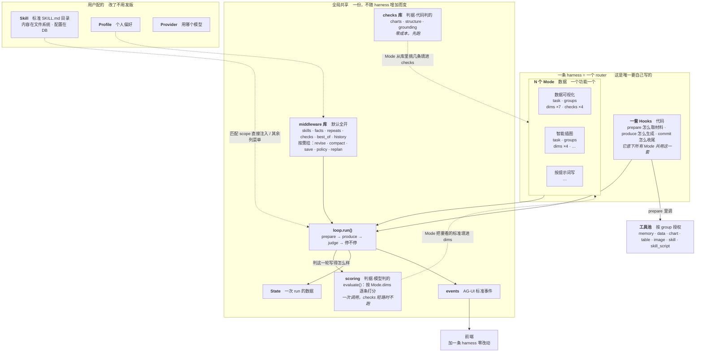
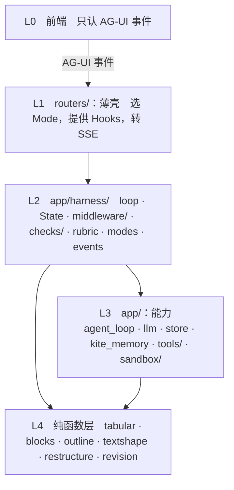

# MEMOKET_NOTE Harness 框架

> 目标架构。为什么这么设计、调研依据、数据支撑，见
> [_research/refactor-harness-runtime.md](_research/refactor-harness-runtime.md)。

---

**目录**：[0 一页纸](#0-一页纸) · [1 memoket-note 需要什么](#1-memoket-note-需要什么) · [2 每条需求借鉴谁](#2-每条需求借鉴谁) · [3 目录](#3-目录) · [4 什么东西谁能配](#4-什么东西谁能配) · [5 类型](#5-类型) · [6 循环](#6-循环) · [7 事件](#7-事件) · [8 工具](#8-工具) · [9 判据](#9-判据) · [10 Skill](#10-Skill) · [11 middleware](#11-middleware) · [12 错误与取消（R10 R11）](#12-错误与取消（R10-R11）) · [13 用户处置的回路（R5）](#13-用户处置的回路（R5）) · [14 Mode](#14-Mode) · [15 不走 harness 的东西](#15-不走-harness-的东西) · [16 一条 harness 改造后](#16-一条-harness-改造后) · [17 现有代码搬到哪里去](#17-现有代码搬到哪里去) · [18 这个架构顺手解决的现有 bug](#18-这个架构顺手解决的现有-bug) · [19 分层与依赖规则](#19-分层与依赖规则) · [20 怎么测](#20-怎么测) · [21 架构原型](#21-架构原型) · [22 落地顺序](#22-落地顺序) · [23 落地记录](#23-落地记录2026-09-09)

---

## 0. 一页纸

一条 harness = **一个 `Mode`（配置）+ 一套 `Hooks`（三个回调）**，其余全部共用。




**读法**：

- **最上面那个框是唯一要自己写的**——一条 harness = 一套 `Hooks`（代码）
  + N 个 `Mode`（数据）。`Hooks` 比 `Mode` 高一层：`compose_block` 一个 router、
  一套 hooks，底下挂 6 个功能，它们的差别全在 `Mode` 里，
  **取材料和生成的方式是同一套代码**。
- **中间是全局共享的**，一份，不随 harness 增加而变。`middleware` 和
  `checks` 是**库**：middleware 默认全开，checks 由 `Mode` 从库里挑几条填进去。
- **判据有两半，图上是并排的两个框**：`checks` 代码判、零成本、先跑；
  `scoring` 模型判、一次调用、`checks` 命中时直接短路不跑。两半的标准都由
  `Mode` 填——`Mode.checks` 挑代码判的，`Mode.dims` 写模型判的。
  **`scoring` 本身一条标准都没有**，所以换一组 `dims` 就能换个领域用
  （知识库那边就是这么复用它去判抽取质量的）。
- **下面是用户配的**，改了不用发版。

### 一轮里发生什么：三个概念的位置

概念之间的关系，看一轮的执行顺序最直观：

```
一轮开始
  │
  ├─ before_round        middleware
  ├─ prepare             ★ HOOK ── 契约公用，实现这条 harness 自己写
  ├─ after_prepare       middleware　Facts 累积材料并裁剪
  │
  ├─ before_produce      middleware　Skills 注入技能 → Revise 改旧文 → Compact 压缩
  ├─ produce             ★ HOOK ── 同上
  ├─ after_produce       middleware　Save 落盘
  │
  ├─ before_judge        middleware　Repeats 查重 → Checks 跑判据（可能短路）
  ├─ evaluate            ★ scoring ── 循环写死的，不可换
  │                        按 Mode.dims 逐条打分，代码数一遍决定「完没完」
  ├─ after_judge         middleware　BestOf 记住最好的一轮
  ├─ after_round         middleware　Policy / Replan
  │
  └─ 停不停？　complete / blocked / no_progress / Mode.stop_when，任一命中就停
```

**钩子名就是围绕 hook 命名的**——`before_produce` / `after_produce` 就是
`produce` 这个 hook 的前后。middleware 夹在 hook 之间。

| | `Mode` | `Hooks` | `middleware` |
|---|---|---|---|
| 是什么 | **参数**（数据） | **三个空位**（契约公用，实现各写） | **十个能力**（实现就是公用的） |
| 回答 | 这次要什么 | 怎么拿到 | 顺带都做了 |
| 有几个 | 8 个（一个功能一个） | 3 套实现（现在三条恰好各不相同） | 10 个（全局） |
| 不写会怎样 | 没这个功能 | **跑不起来**，循环缺一块 | 照常跑，少个能力 |
| 类比 | 参数表 | **填空题** | **赠品** |

一次运行 = **拿一个 `Mode` 的参数，跑一套 `Hooks` 的代码，中间夹着
`middleware` 自动做的事**。

**`Hooks` 跟 `middleware` 正好相反**：`Hooks` 公用的是**契约**（一个
Protocol，所有 harness 实现它），实现各写各的；`middleware` 公用的是
**实现**（一份 `Facts` 代码，所有 harness 跑同一个实例）。这也是为什么
middleware 能「默认全开」而 hook 不能——**middleware 是写好的实现，
hook 是空的契约**，空契约给不出默认值。

不过实现也**可以**共用：如果两条 harness 某个 hook 的做法一样，抽出来
就是库里的一个实现。`note_harness` 和 `writing_plan` 的 `prepare` 就很像
（都是「工具循环失败退回关键词检索」），迁移时若只有参数不同，
应该抽成共用基类而不是抄两遍。

同一段 `prepare` 代码，用户点「数据可视化」时 `mode.groups` 是
`("data","chart","memory")`，点「智能插图」时是
`("data","chart","image","memory")`——**代码一行没变，参数变了**。

`Mode` 的字段被三方读，各读各的：

| 谁读 | 读哪些 |
|---|---|
| `Hooks` | `task` · `groups` · `max_tokens` |
| 循环 | `max_rounds` · `stop_when` · `extra_mw` · `rails_off` |
| middleware | `checks` · `dims` · `fact_budget` · `context_keep_last` · `skill_scope` |

### 六条核心判断

只看这一节的话，带走这六条：

| # | 判断 | 依据 |
|---|---|---|
| 1 | **循环写死，一份** | 调研的 12 个框架无一例外。我们现在是三份手抄的（555 + 245 + 156 行） |
| 2 | **判据分两类，代码判得准的不交给模型** | 打分器和被打分的是同一个本地模型——它的盲区和写作时的盲区是同一个（R2） |
| 3 | **判据尽量往早了放**：工具层 → 检查层 → 打分层 | 越早越省。工具拒绝的根本到不了打分器，成本为零（R8） |
| 4 | **能力做成 middleware，默认全开** | 「一条 harness 有、另一条没有」发生过四次，全是遗漏不是决定 |
| 5 | **不自造标准**：事件用 AG-UI，skill 用 SKILL.md | 自造的代价是两头不通——第三方装不进来，我们的也拿不出去 |
| 6 | **用户配「要什么」，系统配「用什么能力」** | 边界按「懂不懂语义」划。用户不知道 `filter_facts` 和 `search_memory` 的区别，配错了坏得很隐蔽（第 4 节） |

### 改造前后

| | 现在 | 之后 |
|---|---|---|
| 循环 | 三份手抄 | 一份，约 60 行 |
| 加一条 harness | 抄循环、新起事件名、前端加解析、决定维度放哪、决定检查怎么接（**5 处**） | 一个 `Mode` + 三个 hook |
| 加一个功能 | 改 `MODES`，可能改循环 | `modes.py` 加个实例，**router 都不动** |
| 加一条能力 | 三条 harness 各接一遍，**实测漏了 4 次** | 一个 middleware 进 `BASE` |
| 测循环逻辑 | 跑真实 harness（分钟级、带随机性） | 假 Hooks，毫秒级确定性单测（第 21 节有可跑的原型） |

**这个架构还顺手让 8 个已知 bug 变得写不出来**（第 18 节）——
如果一个重构方案做不到这点，它只是把代码搬了个地方。

---

## 1. memoket-note 需要什么

架构从需求推，不从现有代码倒推。十三条，每条都能在产品行为里找到出处。

| # | 需求 | 从哪来 |
|---|---|---|
| **R1** | **没有 oracle**，合格与否要靠一组可插拔的判据 | 写作没有编译器和测试 |
| **R2** | **判据不能只靠模型**：打分器和被打分的是同一个本地模型 | 实测打分器给通篇假图打过 `has_charts=2`；LLM-as-judge 的公认建议是「别拿同一个模型家族既生成又评判」（self-preference bias） |
| **R3** | **多种任务形态**：写整篇 / 分段 / 生成一段 / 改选中的一段 | 8 个功能，共用一套闭环 |
| **R4** | **流式**：本地模型 20–90 秒一次调用，产出必须边生成边看 | `muse-glimmer-30b` 的实测延迟 |
| **R5** | **可追溯 + 可处置**：修订逐条 accept/reject，能看到某段依据哪条事实 | `roundDiff.ts`（385 行）· `TapProvenance` |
| **R6** | **内容必须来自知识库**，不能编用户的项目/数字/决定 | KITE 是这个产品的立身之本 |
| **R7** | **数字和图表语法由代码产出**，模型只决定算什么画什么 | 让模型自己算均值它会编，自己写 mermaid 会写出渲染不了的语法 |
| **R8** | **省调用**：能在工具层拦的不留给检查层，能检查的不留给打分器 | 一次打分几十秒 |
| **R9** | **并发**：同一篇笔记多个 `/` 同时跑，状态不能串 | `runningBlocks.ts` 就是这么设计的 |
| **R10** | **一步失败不能炸掉整个 run**，且已有产出必须落盘 | 本地模型高负载时单次调用超 300s 超时，异常从 SSE generator 冒出去 = 连接被硬中断 |
| **R11** | **用户随时可以关掉页面**，取消要干净 | 每条 harness 现在各有一处 `is_disconnected()` |
| **R12** | **skill 是按需加载上下文的机制**，不只是一段规则文本——要装得下「怎么写 PPT」这类一整套做法 | `SkillsPanel` · 11 个 scope；现状只做了三层里的中间层 |
| **R13** | **第三方 skill 的脚本要能跑，但不能在我们的进程里跑** | 有些事光靠 prompt 做不到（生成 .pptx、按模板渲染） |

## 2. 每条需求借鉴谁

调研了 14 个框架（完整笔记见 [`_research/harness-survey.md`](_research/harness-survey.md)）。

| 需求 | 借鉴 | 具体是什么 |
|---|---|---|
| R1 | **DSPy `Refine`** · **smolagents `final_answer_checks`** | 判据是配置传进去的；`Refine` 的 `best_reward` 全程跟踪 |
| R2 | **LLM-as-judge 的公认实践** | 「把复杂 rubric 拆成离散检查」是标准缓解手段；`writing-harness` 的 Sensors 是同一思路 |
| R3 | **LangChain 1.0 `AgentMiddleware`** | 循环写死，差异表达成 middleware + 配置，不是分支 |
| R4 | **AG-UI 协议** | `TEXT_MESSAGE_CONTENT` 逐 token 流 |
| R5 | **AG-UI `CUSTOM` 事件** · **LangGraph `interrupt`** | 领域事件走 CUSTOM 不污染标准事件；interrupt + checkpointer 是「暂停等人」的标准做法 |
| R6 | **RAG 的 citation/attribution** | 「起草 → 逐条对照来源验证 → 修补或删除」 |
| R7 | 无先例，我们自己的 | 工具产出 mermaid，检查比对字符串是否原样 |
| R8 | **PydanticAI 两阶段验证** | 语法（零成本）先跑，语义（要 I/O）后跑 |
| R9 | **全部框架** | 状态挂在 run 上下文里，不用模块级全局 |
| R10 | **DSPy `fail_count`** · **OpenHands Controller** | 失败有预算；「管约束的」跟「做决策的」分层 |
| R11 | **LangGraph checkpointer** | 状态在每个 super-step 存快照，中断能恢复 |
| R12 | **Claude Agent Skills** | 三层渐进披露：frontmatter 常驻（~100 token/skill）→ 命中才加载 body（<5k）→ 引用文件不读不花 |
| R13 | **Claude Code 的沙箱**（Seatbelt / bubblewrap） | 内核级强制、白名单、网络走代理 + 域名过滤 |

十条横向结论（12 个框架无一例外的那些）：

1. 循环写死，不可配置
2. 观察型和干预型扩展点分开
3. 能力打包成 middleware，自带状态字段
4. 停止条件是可组合的一等公民
5. best-of：留最好的一次，不是最后一次
6. 便宜的判据先跑
7. 管约束的和做决策的分层
8. 必需能力由框架拒绝移除
9. 每步前可改配置（`prepareStep`）
10. 失败要有退路

---

## 3. 目录

**这一节是地图**：每个文件属于哪一节、干什么，一行说清。
`tests/test_directory_map.py` 盯着它跟代码一致——图漂了测试会红。

```
backend/app/
  main.py                                入口

  harness/                 ① agent 运行：跟大模型有关的一切
    loop.py                  唯一的循环（第 6 节）
    state.py                 State —— 一次 run 的全部数据（第 5 节）
    types.py                 Mode · Hooks · Middleware · Check · Verdict
                             + Dimension · Evaluation · LLMClient（第 5、9 节）
    modes.py                 8 个内置 Mode + 停机条件 + for_run()（第 14 节）
    events.py                AG-UI 事件契约（第 7 节）
    params.py                跨 harness 的续写预算 + AGENT_TOOLS 开关
    agent_loop.py            工具循环：模型自己决定查什么，带预算和 ToolTrace
    adapter.py               app 和 harness 之间的接缝（LLMClient 等的实现）
    skills.py                SKILL.md 目录的读写（第 10 节）
    snapshot.py              State ⇄ JSON，轮末暂停用（第 13.1 节）
    prompts/                 全部写作 prompt，按主题分（不按调用方：有几条
                             是两条 harness 共用的，按调用方拆会交叉引用）
      fragments.py             提示词里反复出现的积木：画像 · 骨架 · 标题格式
      writing.py               写作本身：给骨架 · 改一遍 · 往下写
      selection.py             选中一段之后：改写 · 润色 · 展开 · 核查 · 回顾
      note.py                  单篇 harness：检索规划 · 改骨架 · 接着写
      plan.py                  续写计划：拆分段 · 写一段 · 要不要再加几段
      skills.py                skill 拼进 system prompt · 让模型写一个 skill
      block.py                 块生成（`/` 唤起）
    revision.py              修订的定位与应用 + 四道防线（纯函数）
    policy.py                把这一轮的观测算成下一轮的运行参数（纯函数）
    replan_rules.py          骨架重规划该不该做、改完合不合法（纯函数）
    hooks/                   每条 harness 自己写的三个回调：block · note · section
    middleware/              能力包，BASE 默认全开（第 11 节）
      _order.py                verify()：声明的先后依赖真的成立
      skills · facts · provenance · repeats · checks · best_of · history   ← BASE
      revise · compact · save · repair · runtime · replan   ← 按 Mode 挂
    checks/                  **判据，两半都在这儿**（第 9 节）
      charts · structure · grounding      代码判
      blockcheck · grounding_rules         上面那些判据的纯函数实现
      rubric.py                            **模型判**：evaluate()
      citations.py                         引用核对的实现
      pick.py                              pick_dimension()：按 Mode 实际
                                           有的维度挑一个来打翻
    tools/                   模型能按名字调的 21 个函数（第 8 节）
      registry · memory_tools · data_tools · skill_tools · sandbox_tools
      tabular · blocks · imagegen          工具背后干活的那几段
    sandbox/                 第三方 skill 脚本的笼子（第 10.8 节）
      runner（Seatbelt/bwrap 薄封装）· policy（三档权限）· limits（硬上限）

  database/                ② 知识库 + 数据库
    store.py                 sqlite：笔记 · 文件夹 · 计划 · skill 配置 · 快照
    retrieval.py             零 LLM 关键词检索（工具循环失败时的兜底）
    kite/                    跟 memoket-kite 那个外部包打交道的适配层
    kb/                      建在它上面的能力：主题簇 · 按簇检索 · 抽取判据
    ingest/                  外部东西 → 文本 → 块：asr · extract · importers · chunking

  editor/                  ③ 既不是 agent 也不是知识库的那部分
    outline · restructure · textshape      markdown 结构操作
    vision.py                              图片转表格
    profile.py                             用户的写作偏好

  routers/                 ④ 和前端对接：认 Mode、装 State、翻事件
    schemas.py               API 契约
    note_harness 98 · writing_plan 281 · compose_block 186 · harness（恢复）
    kb · memory · ingest · notes · folders · skills · profile · settings · assets

  util/                    ⑤ 公共
    config.py · llm.py

backend/skills/            13 个内置 SKILL.md，随版本发布（第 10.1.3 节）
backend/scripts/           bench / 摄入 / 诊断，不参与运行
backend/tests/             第 20 节
```

**`util/` 不是最底层。** `util/llm.py` 反过来要 `database.store` 拿「用户
当前选的是哪个供应商」——这条边是有意的，客户端不知道用户选了谁就没法
工作。但它是悄悄长出来的，而「公共 utilities」这个名字会让人以为它谁都
不依赖。`tests/test_layering.py` 把它钉成一条窄边：`util` 只许碰
`database.store`，`database` 只许碰 `util.config`，再宽一点就红。


**顶层从 31 个 .py 降到 3 个。** 分成五块的判据是**这块代码为谁服务**：
agent 运行（harness）、知识库和数据库（database）、前端对接（routers）、
既不属于前两者的编辑功能（editor）、谁都可能用的（util）。

分组之前实扫了「谁在用它」。**按感觉分过一次就分错了**：`imagegen`
（文生图）被归进「摄入」，而它的方向正好相反；`vision` 也不是摄入，是
编辑器里的图片转表格。

`app/harness/tools/` 的注册表机制不动，但**分组要调**（见第 8 节）。

---

## 4. 什么东西谁能配

架构里有三层配置，**主体不同**，混在一起想就会乱：

| 配什么 | 谁配 | 存哪 | 改了要发版吗 |
|---|---|---|---|
| `groups` / `exclude`　工具授权 | **开发者** | `modes.py` | 要 |
| `dims` / `checks`　判据 | **开发者** | `modes.py` + `checks/` | 要 |
| `skill_scope`　技能挂哪个作用域 | **开发者** | `modes.py` | 要 |
| `max_rounds` / `fact_budget` | **开发者** | `modes.py` | 要 |
| **装哪些 skill、开不开** | **用户** | 文件系统 + DB（见下） | 不要 |
| **skill 的沙箱权限** | **用户**，安装时授予 | DB | 不要 |
| **个人偏好 profile** | **用户** | DB | 不要 |
| **用哪个模型**（local / gpt） | **用户** | DB · `SettingsPanel` | 不要 |

一句话：**工具只有开发者能配；skill 是用户装的，而且大多数时候
由模型自己决定这次用不用（第 10 节）。**

**skill 内容存文件系统，我们的配置存 DB**（见 10.1.1）：

```
data/<user>/skills/<slug>/       ← 原样的标准目录，一个字不改
  SKILL.md · FORMS.md · scripts/

DB: skill_config                 ← 我们的配置，跟内容完全分离
  user · slug · enabled · scopes · sandbox_grant · source
```

这样第三方 skill 装进来是「把目录放进去」，拿出去也是「把目录拷走」——
**不往别人的文件里塞我们的字段**。

### 为什么工具不给用户配

用户不知道 `filter_facts` 和 `search_memory` 的区别，配错了功能直接坏掉，
而且坏得很隐蔽（不报错，只是查不到东西）。**开发者配「这个功能需要什么能力」，
用户配「写出来要什么风格」——边界按「懂不懂语义」划。**

真要给用户开口子，只该是粗粒度的开关（比如「允许文生图」，因为它慢且花钱），
那是产品决策，走 `settings` 表，不走 `Mode`。

### skill 的匹配方向是反的

```python
# DB 里的 skill_config，不在 SKILL.md 里
scopes = ["block_write", "magic_tap"]     # ← 用户勾的：这个 skill 在哪些场景生效
```

不是「场景声明用哪些 skill」。这跟 `Mode.skill_scope` 正好配对：
Mode 说「我是 `block_write`」，skill 说「我适用于 `block_write` 和
`magic_tap`」，匹配上就直接注入。用户装一个 skill 时勾选它适用的场景——
这个方向对用户更自然，**不要为了架构整齐把它反过来**。

而且 `scopes` 是**可选的**——没写的 skill 只把 name + description 列进菜单，
用不用由模型判断（10.4）。**这是主路径，scope 是快捷方式。**

---

## 5. 类型

```python
# ── types.py ──────────────────────────────────────────────────────────
class Hooks(Protocol):
    """一条 harness 真正不同的只有这三件事。R3。"""

    async def prepare(self, st: State) -> tuple[list[str], ToolTrace]:
        """取材料。返回 (这一轮查到的事实, ToolTrace)。
        累积和压缩不归它管——那是 Facts middleware 的事。"""

    async def produce(self, st: State) -> AsyncIterator[str]:
        """生成，流式吐片段，**并且负责更新 `st.content`**。

        为什么更新 content 归它而不归循环：合法不同。
          · 块生成：`st.content = 这一轮的新块`（整块重写）
          · 整篇续写：`st.content = join_round_text(st.content, 新写的)`（追加）
        循环只把片段累积进 `st.fresh`（发事件、给 `_no_progress` 判据用），
        怎么合进正文是这条 harness 的事——放进循环就得写 `if mode.xxx`。
        """

    async def commit(self, st: State) -> None:
        """一次 run 收尾。**不是每轮落盘**——每轮落盘是 `Save` middleware
        的事（见第 10 节）。这里做的是收尾专属的动作，比如 writing_plan
        更新那篇进度追踪笔记。"""


class Middleware(Protocol):
    """能力包。钩子按需实现，不实现的不写。R3。

    钩子名对应**我们的**循环阶段，不是 LangChain 的 before_model——
    它的循环是 model-centric，我们的是 produce-judge。

    **钩子有两种形态，写哪种由它发不发事件决定**：
      · 要发事件的 → `async def hook(st) -> AsyncIterator[Event]`（用 yield）
      · 不发事件的 → `async def hook(st) -> None`（普通 async 函数）
    `_fire` 用 `inspect.isasyncgen` 区分。不这么做的话，不发事件的
    middleware 会被迫写 `return; yield` 这种为了"让它成为生成器"的怪写法。
    """
    name: str
    async def before_run(self, st) -> AsyncIterator[Event]: ...      # 一次 run 一次
    async def after_run(self, st) -> AsyncIterator[Event]: ...
    async def before_round(self, st) -> AsyncIterator[Event]: ...    # 每轮
    async def after_prepare(self, st) -> AsyncIterator[Event]: ...
    async def before_produce(self, st) -> AsyncIterator[Event]: ...
    async def after_produce(self, st) -> AsyncIterator[Event]: ...
    async def before_judge(self, st) -> AsyncIterator[Event]: ...
    async def after_judge(self, st) -> AsyncIterator[Event]: ...
    async def after_round(self, st) -> AsyncIterator[Event]: ...
    # 拦截型：可多次调 handler（重试）、跳过（短路）、改请求改响应
    async def wrap_prepare(self, st, handler) -> tuple[list[str], ToolTrace]: ...
    async def wrap_produce(self, st, handler) -> AsyncIterator[str]: ...


Check = Callable[["State"], "Verdict | None"]      # 代码判，纯函数只读。R2

@dataclass(frozen=True)
class Verdict:
    dimension: str                                  # 打回哪一维
    message: str                                    # 给模型看的话
    fix: Callable[[str], str] | None = None         # 能直接改就给个纯函数


StopCondition = Callable[["State"], "str | None"]   # 返回停止原因或 None


@dataclass(frozen=True)
class Mode:
    """一个功能的全部配置。加一个功能 = 加一个实例。"""
    key: str
    label: str
    task: str
    # 工具授权：`group` 是工具的分组，一组一个领域。
    #   memory(7) 查知识库 · data(5) 认表算数 · chart(4) 画图 · image(1) 文生图
    # groups=("memory",) 的功能只能查知识库，画不了图。见第 8 节。
    groups: tuple[str, ...] = ("memory",)
    exclude: tuple[str, ...] = ()                   # 排除个别工具（见第 8 节）
    skill_scope: str = ""                           # 用户技能挂哪个作用域（见第 10 节）
    dims: tuple[Dimension, ...] = ()                # 模型判的判据
    checks: tuple[Check, ...] = ()                  # 代码判的判据
    stop_when: tuple[StopCondition, ...] = ()       # 内置三条之外的
    extra_mw: tuple[Middleware, ...] = ()           # BASE 之外的
    max_rounds: int = 3
    fact_budget: int = 40          # 累积多少条事实（Facts middleware 裁剪用）
    context_keep_last: int = 4000  # 续写时正文保留多少字全量（Compact 用）
    max_tokens: int = 1400
```

```python
# ── state.py ──────────────────────────────────────────────────────────
@dataclass
class State:
    """一次 run 的全部数据。**只有 loop 和 middleware 能改，Check 只读。**

    R9：所有跨轮状态都在这个对象里，一次 run 一个实例。同一篇笔记几个 `/`
    同时跑，各自一个 State，不会串——「跨轮的东西和每轮的东西都是同一个
    函数里的局部变量、差别只在缩进」这个坑犯过四次，收进一个类就写不出来了。
    """
    mode: Mode
    ctx: ToolContext                # 用户 · 笔记 · 正文 · 光标
    request: Request                # R11：每轮查一次 is_disconnected()
    round: int = 0
    before: str = ""                # 光标前的正文（块生成）/ 全篇（写整篇）
    after: str = ""
    content: str = ""               # 当前产出
    fresh: str = ""                 # 这一轮新写的部分
    facts_new: list[str] = field(default_factory=list)  # 这一轮刚查到的（未累积）
    facts: list[str] = field(default_factory=list)      # 累积并压缩过
    charts: list[str] = field(default_factory=list)     # 工具产出过的 mermaid
    trace: ToolTrace | None = None
    ev: Evaluation | None = None
    best: tuple[tuple[int, float], str] | None = None
    # 匹配 scope 直接注入的 + 模型 load_skill 加载的，**跨轮保留**
    skill_bodies: list[str] = field(default_factory=list)
    skill_menu: list[tuple[str, str]] = field(default_factory=list)   # (name, description)
    steer: str = ""                 # 上一轮最弱那一维的诊断
    skip_judge: bool = False        # 检查已判定不合格，跳过这一轮的打分（R8）
    bag: dict = field(default_factory=dict)             # middleware 之间传东西

    def rank(self) -> tuple[int, float]:
        """把多维度折叠成可比较的标量。确定性，不再打模型。
        先比达标维度数，再比平均分。"""
        if not self.ev:
            return (-1, -1.0)
        lv = [s.level for s in self.ev.scores.values()]
        return (sum(1 for v in lv if v >= 2), sum(lv) / max(1, len(lv)))
```

---

## 6. 循环

```python
# ── loop.py ───────────────────────────────────────────────────────────
# **顺序有讲究**，两条：
#
# ① 同一个钩子上，先跑产出材料的，最后跑可能短路的。
#    Repeats 产出 dup_hints 给打分用，Checks 可能判定不合格直接跳过打分——
#    Checks 排在它后面，被拦下时 dup_hints 白算（零成本纯函数，无所谓）；
#    反过来排的话 Checks 短路后 Repeats 根本不会跑，而它的结果下一轮还要用。

BASE: tuple[Middleware, ...] = (
    Skills(), Facts(), Repeats(), Checks(), BestOf(), History(),
)
# 不在 BASE 里的三个，由 Mode.extra_mw 显式挂：
#   Revise —— 「生成前先改一遍已有正文」，只有长文续写用得上；
#             块生成没有"已有正文"，它是整块重写，不是改。
#   Compact —— 压缩喂给续写的正文，只有长文会撞上下文上限。
#   Save   —— 每轮落盘，同理只有长文续写需要（块不落盘）。
#   Policy / Replan —— note 专用。

async def run(st: State, hooks: Hooks) -> AsyncIterator[Event]:
    mw = BASE + st.mode.extra_mw
    reason, committed = "max_rounds", False
    yield Event.run_started(st)

    try:
        async for e in _fire(mw, "before_run", st): yield e

        for st.round in range(1, st.mode.max_rounds + 1):
            if await st.request.is_disconnected():          # R11
                raise asyncio.CancelledError
            yield Event.step_started(st.round)
            async for e in _fire(mw, "before_round", st): yield e

            # ① 取材料　R6
            st.facts_new, st.trace = await _wrap(mw, "wrap_prepare", hooks.prepare, st)
            async for e in _fire(mw, "after_prepare", st): yield e

            # ② 生成　R4 流式。一轮一个 message，START/CONTENT*/END 严格配对
            async for e in _fire(mw, "before_produce", st): yield e
            st.fresh, mid = "", f"r{st.round}"
            yield Event.text_start(mid)
            async for piece in _wrap_stream(mw, "wrap_produce", hooks.produce, st):
                st.fresh += piece
                yield Event.text_content(mid, piece)
            yield Event.text_end(mid)
            async for e in _fire(mw, "after_produce", st): yield e

            # ③ 判断　R2 R8：便宜的先跑
            async for e in _fire(mw, "before_judge", st): yield e   # Checks 排最后
            if not st.skip_judge:                                   # 检查没拦下才打分
                st.ev = await evaluate(llm, content=st.content, dimensions=st.mode.dims,
                                       dup_hints=st.bag.get("dup_hints", ()),
                                       context=_context(st))
            yield Event.custom("evaluate", _ev_payload(st))
            async for e in _fire(mw, "after_judge", st): yield e     # BestOf
            async for e in _fire(mw, "after_round", st): yield e     # Policy / Replan

            yield Event.step_finished(st.round)
            if hit := _stop(st):
                reason = hit
                break
            st.steer = _steer(st.ev)
            st.ev, st.skip_judge = None, False                       # 下一轮重新判
        else:
            st.content = st.best[1] if st.best else st.content        # 交付最好的一轮

        await hooks.commit(st)
        committed = True
        async for e in _fire(mw, "after_run", st): yield e
        yield Event.run_finished(st.content, reason)

    except asyncio.CancelledError:
        raise                       # 落盘交给 finally，异常照常往上抛
    except Exception as exc:        # noqa: BLE001
        yield Event.run_error(str(exc))
    finally:
        # R10：跑了 5 轮的正文因为第 6 轮出错就全丢，是最糟的失败模式。
        #
        # **陷阱**：CancelledError 之后 `await` 可能再次被取消，
        # finally 里的收尾就做不完。所以用 shield 把它护住。
        # （每轮的正文其实已经由 Save middleware 落过盘了，这里是双保险；
        # 块生成没有 Save，全靠这一手。）
        if not committed and st.content:
            with contextlib.suppress(Exception):
                await asyncio.shield(hooks.commit(st))


async def _fire(mw, hook: str, st: State) -> AsyncIterator[Event]:
    """跑一个钩子上的所有 middleware。**一个挂掉不炸掉别的**（R10），
    但要说出来，不能沉默。"""
    for m in mw:
        fn = getattr(m, hook, None)
        if fn is None:
            continue
        try:
            r = fn(st)
            if inspect.isasyncgen(r):
                async for e in r:
                    yield e
            else:
                await r
        except Exception as exc:                       # noqa: BLE001
            yield Event.custom("warning", {"middleware": m.name, "hook": hook,
                                           "error": str(exc)[:200]})


async def _wrap(mw, hook: str, handler, st: State):
    """洋葱：列表第一个包住其余。可多次调 handler（重试）、跳过（短路）、
    改请求改响应。**流式的那个（_wrap_stream）重试要在 text_start 之前决定**——
    已经发出去的 delta 收不回来，只能作废整条 message 重开一条。"""
    call = handler
    for m in reversed([x for x in mw if hasattr(x, hook)]):
        call = functools.partial(getattr(m, hook), handler=call)
    return await call(st)


# 内置三条 + Mode 追加的，OR 组合（AI SDK 的 stopWhen）
def _stop(st: State) -> str | None:
    for c in (_complete, _blocked, _no_progress, *st.mode.stop_when):
        if r := c(st):
            return r
    return None
```

**循环里没有任何一个 middleware 的名字，也没有一个 `if mode.xxx`。**

---

## 7. 事件：AG-UI 协议

不自己定一套。[AG-UI](https://docs.ag-ui.com) 是现成的开放协议，
5 大类事件，领域专属的走 `CUSTOM`。好处是前端将来能直接接
CopilotKit 这类现成 UI 库。

```python
# ── events.py ─────────────────────────────────────────────────────────
@dataclass(frozen=True)
class Event:
    """一个 SSE 事件。`type` 用 AG-UI 的名字，领域专属的走 CUSTOM。"""
    type: str
    data: dict

    # 构造器，循环和 middleware 只用这些，不手拼 dict
    @staticmethod
    def run_started(st) -> "Event": ...
    @staticmethod
    def run_finished(content: str, reason: str) -> "Event": ...
    @staticmethod
    def run_error(msg: str) -> "Event": ...
    @staticmethod
    def step_started(n: int) -> "Event": ...
    @staticmethod
    def step_finished(n: int) -> "Event": ...
    @staticmethod
    def text_start(mid: str) -> "Event": ...
    @staticmethod
    def text_content(mid: str, delta: str) -> "Event": ...
    @staticmethod
    def text_end(mid: str) -> "Event": ...
    @staticmethod
    def tool_call(name: str, args: dict, result: str) -> "Event": ...
    @staticmethod
    def activity(label: str) -> "Event": ...
    @staticmethod
    def custom(name: str, value: dict) -> "Event": ...


# 标准事件：直接用 AG-UI 的名字
RUN_STARTED · RUN_FINISHED · RUN_ERROR
STEP_STARTED · STEP_FINISHED                    # 一轮 / 一个 section
TEXT_MESSAGE_START · TEXT_MESSAGE_CONTENT · TEXT_MESSAGE_END   # R4 流式
TOOL_CALL_START · TOOL_CALL_ARGS · TOOL_CALL_RESULT
ACTIVITY_SNAPSHOT                               # 「在查资料…」「在画图…」
CUSTOM                                          # {name, value}
```

我们现在 23 个自造事件名的去向：

| 现在 | 之后 |
|---|---|
| `delta` | `TEXT_MESSAGE_CONTENT` |
| `tool-calls` | `TOOL_CALL_START` / `ARGS` / `RESULT` |
| `round-start` · `section-start` | `STEP_STARTED`（`stepName` 区分） |
| `round-end` | `STEP_FINISHED` |
| `done` · `plan-done` | `RUN_FINISHED` |
| `error` | `RUN_ERROR` |
| `phase` · `phase-delta` | `ACTIVITY_SNAPSHOT` |
| `evaluate` · `revision` · `dropped` · `policy` · `replan` · `skeleton` · `plan-loaded` · `plan-extended` · `section-done` | `CUSTOM`，`name` 区分 |

**前端只需要认 8 个标准事件 + 一个 CUSTOM 分支**，加一条 harness 零改动。
迁移期旧名留别名映射，前端一行不改。

---

## 8. 工具：注册表不动，分组要调

加一个工具 = 写一个带装饰器的函数，不改 harness、不改调度、不改授权。

```python
@register(name="numbers_near_cursor", group="data",
          description="看光标跟前的正文里写着哪些数字…",
          params={"radius": {"type": "integer", "description": "…"}})
def numbers_near_cursor(ctx: ToolContext, radius: int | None = None) -> str: ...
```

`ToolContext` 带 `content` / `cursor`（**R9**：挂在 ctx 上不是模块级全局，
否则同一篇笔记的并发 run 会互相覆盖光标）。

| group | 数量 | 干什么 |
|---|---|---|
| `memory` | 7 | KITE 知识库检索 —— **R6** |
| `data` | 5 | 认表 · 算统计 · 找光标附近的数字 —— **R7** |
| `chart` | 4 | 拼 mermaid · 拼表格 —— **R7** |
| `image` | 1 | 文生图 |
| `skill` | 2（**待加**） | `load_skill` · `read_skill_ref`——渐进披露的第二、三层（10.2）。**默认给**：模型能看到有哪些技能却调不了没有意义 |
| `skill_script` | 1（**待加**） | `run_skill_script`——在沙箱里跑 skill 自带的脚本（10.7） |

### 授权粒度：组为主，工具为辅

**授权在 `Mode` 上**，不在 middleware 里：工具是按领域分组的通用能力，
「哪个功能用哪几组」是功能的属性。

```python
groups: tuple[str, ...] = ("memory",)     # 粗粒度：按组给
exclude: tuple[str, ...] = ()             # 细粒度：排除个别
# 解析结果 = names(groups) - exclude
```

`exclude` 借鉴 deepagents 的 `excluded_tools`。**为什么需要它**——实测各模式
拿到的工具数：

| 模式 | 授权的组 | 拿到 | 真正要用的 | spec ≈token |
|---|---|---|---|---|
| 智能表格 | data·chart·memory | 16 | 约 10 | 3728 → 1896（**省 49%**） |
| 数据可视化 | data·chart·memory | 16 | 15 | 3728 → 3400 |
| 智能插图 | data·chart·image·memory | 17 | 约 12 | 3927 → 3000 |

这段 spec **每次工具循环调用都要带**，一轮最多 3 次迭代、一次 run 最多
3 轮——最多 9 次。除了 token，17 个选项里挑也让模型更容易选错。

### 但先修分组，别拿 exclude 打补丁

实测发现一处分组本身就是错的：

```
chart 组：chart_column · chart_from_text · render_chart · render_table
                                                          ↑ 这个是**做表**不是画图
```

于是所有画图的模式被迫拿到 `render_table`，做表的模式被迫拿到三个画图工具。
**这种情况该改分组，不是加 exclude。**

建议的分组（重构时一并调整）：

| group | 工具 | 谁用 |
|---|---|---|
| `memory` | 7 个 KITE 检索 | 全部（R6） |
| `data` | `list_tables` `numbers_near_cursor` `describe_table` `aggregate_table` `correlate_columns` | 要读数据的 |
| `chart` | `chart_column` `chart_from_text` `render_chart` | 画图的 |
| `table` | `render_table` | 做表的 |
| `image` | `render_image` | 文生图 |

**规则：一个组如果经常要 `exclude` 同一个工具，说明分组错了——
先改分组，`exclude` 是留给真正的例外的。** 加一条测试盯住它：

```python
def test_exclude_不该被当成常规手段():
    """同一个工具被两个以上 Mode 排除 = 它待错组了。"""
    c = Counter(tool for m in ALL_MODES for tool in m.exclude)
    bad = [t for t, n in c.items() if n >= 2]
    assert not bad, f"{bad} 被多个 Mode 排除，说明分组错了，去改 group 而不是加 exclude"
```

### spec 长度也是成本

各组的 spec 长度实测：

| group | 工具数 | 字符 | 平均 |
|---|---|---|---|
| `memory` | 7 | 2891 | 413 |
| `chart` | 4 | 2876 | **719** |
| `data` | 5 | 1689 | 337 |
| `image` | 1 | 398 | 398 |

`chart` 组平均 719 字符/工具最长——`chart_from_text` 的描述里塞了单位、
出处校验、拆图规则等一堆说明。**那些应该在拒绝理由里说（工具拒绝时返回的
文本），不是在 spec 里预先说**：spec 每次调用都带，拒绝理由只在真出错时出现一次。

**判据尽量往工具层放（R8）**——工具能拒绝的，不留给检查层：

| 工具已经在拒绝的 | 判据（确定性） |
|---|---|
| 混量纲的图 | 从原文取每个数字紧跟的单位，两种以上就拒 |
| 单值图 | 一个数画不出比较 |
| 没信息量的图 | 数据点 < 10 不画直方图；各取值次数相同不画占比图 |
| 编造的数 | 数值必须在光标附近以该单位出现过 |

---

## 9. 判据

### 9.1 两类，边界按「能不能用代码判定」划（R2）

| | 谁判 | 形态 | 成本 |
|---|---|---|---|
| `Check` | 代码 | `(State) -> Verdict \| None`，纯函数只读 | 零 |
| `Dimension` | 模型 | `Dimension(name, guidance)` | 一次 LLM 调用 |

**能写出确定性判据的一律归代码。** 不是洁癖——我们踩在一个公认的坑上：

> LLM-as-judge 的标准建议是 **never use the same model family as both
> generator and judge**（self-preference bias：judge 给自己家族的输出打分会虚高）。
> 我们正是这样：`muse-glimmer-30b` 既写又判，它的盲区和写作时的盲区是同一个。

三条缓解按成本排：

1. **把 rubric 拆成离散检查** —— 就是这一节说的 `Check`，被调研验证为标准手段
2. **换个模型打分** —— 我们有 `gpt-5.6-luna`，打分只占一次调用。
   **值得单独做一次 A/B**：同一批产出两边打分，分歧大就说明 bias 确实在起作用
3. **pairwise 双向比较**代替打分 —— best-of 的场景天然适合

第 1 条是这个架构在做的；第 2、3 条不改架构，随时可以试。

### 9.2 三档修复

```python
@dataclass(frozen=True)
class Verdict:
    dimension: str
    message: str
    fix: Callable[[str], str] | None = None
```

| 档 | 怎么修 | 成本 | 例子 |
|---|---|---|---|
| **auto-fix** | `Verdict.fix`，代码直接改 | 零 | 标题层级整体下沉；删掉跟后文撞车的收尾节 |
| **打回重来** | 压分 + 诊断进下一轮 prompt | 一轮 | 假图、手写 mermaid、跑题 |

**auto-fix 的边界是实测出来的**：修法唯一且不需要语义判断才行。
「标题层级过浅」✓（整体下沉，正文一字不动）；
「4 个小标题太碎」✗（删哪个是语义判断）。
**fix 之后要重跑这条 check**，而且**要在副本上修、通过了才采纳**——
一次没修好的 fix 如果留下副作用，下一轮就基于被改坏的内容继续。
（这条是写原型跑出来的，见第 21 节。）

### 9.2.1 两半判据是同一种东西的两种实现

**产出类型完全一样。** `Check` 命中之后，`Checks` 中间件把它变成：

```python
st.ev = Evaluation(scores={verdict.dimension: DimensionScore(level=0, ...)})
```

跟 `rubric.evaluate()` 返回的是同一个 `Evaluation`。所以两半判据**共用
一套 dimension 词表**——差的只是谁来判、花多少钱。

| | `Check` | `Dimension` |
|---|---|---|
| 谁判 | 代码，纯函数 | 模型，一次调用 |
| 成本 | 零 | 几秒 + token |
| 能判什么 | 有没有 mermaid 代码块、标题深几级、数字在不在原文里 | 切不切题、自不自足、有没有说清约束 |
| 能自动修吗 | 能（`Verdict.fix`） | 不能 |
| 在哪 | `harness/checks/` | `harness/rubric.py` |

循环里的顺序是「先跑 `checks`，命中就 `skip_judge`，不跑 `evaluate`」——
所以代码判的那一半既是判据，也是省钱的闸。

#### 共用词表就要对齐：check 打的维度必须是这个 Mode 真有的

一条 check 被多个 Mode 共用，而它以前把维度名**写死**：`no_fake_charts`
写死打 `has_charts`，在数据可视化模式下对，在智能插图模式下打了个那个
模式根本没有的维度（它那一维叫 `chart_validity`）。24 个「check × mode」
组合里 **8 个是这样**。后果不大但很别扭：`Evaluation` 里冒出一个模型从来
不会打的维度名，喂回下一轮的诊断也顶着一个模型没见过的标签。

修法**不是统一命名**——`has_charts`（图有没有信息量）和 `chart_validity`
（图是不是工具产出的）是不同的轴。修法是 `checks.pick_dimension(st, …)`：
check 拿得到 `State`，就在候选里挑这个 Mode 认识的那个。

顺带发现 `analysis` 的 dims 漏了两条：它挂着图表检查和标题检查，却既没有
图表维度也没有贴合度维度——是 dims 不全，不是 check 挂错了，补上了。

`test_每条check打翻的维度这个mode真的有` 覆盖 8 个 Mode × 运行时变体，
反向验证过：把 `pick_dimension` 换回写死的名字，断言会红。

`rubric.py` 一条标准都没有，全部由调用方传 `dimensions`；这就是为什么
知识库那边能拿同一个 `evaluate()` 去判抽取质量（见 `kb-architecture.md`），
一行新机制都没加。它一度是 `backend/writer_harness/` 那个可独立安装的包，
为「将来开源」做的准备——因为只有这一个使用者、而那套包机制只换来一个
额外的概念，已经并进 `harness/`。

### 9.3 现有的 checks

| 文件 | 检查 | 抓什么 |
|---|---|---|
| `charts.py` | `no_fake_charts` | `[柱状图：各渠道点击量…]` 这种文字描述的图 |
| | `charts_from_tools` | 手写的 mermaid（跟工具返回的字符串比对，**R7**） |
| `structure.py` | `heading_fits` | 标题层级跟上文章节平级（**带 fix**） |
| | `tail_clashes` | 自带收尾节跟后文已有章节撞车（**带 fix**） |
| | `outline_intact` | 大纲笔记的层级被压平 |
| `grounding.py` | `no_placeholder` | 「（此处待补充）」这类占位符 |
| | `no_audit_voice` | 审计腔：说证据够不够而不是说事 |
| | `citations_hold` | 引用的事实标记确实存在（**R6**，`check_citations` 终于接上） |

---

## 10. Skill：模型按需调用的能力包

### 10.1 用标准格式，一个字段都不加

skill 的事实标准是 **Agent Skills 的 `SKILL.md`**。规格很严：

```
pdf-processing/
  SKILL.md          # YAML frontmatter + markdown body
  FORMS.md          # 参考文件平铺，不放子目录
  REFERENCE.md
  scripts/
    fill_form.py    # 可执行，跑在沙箱里（10.8）
```

```yaml
---
name: pdf-processing
description: Extract text and tables from PDF files, fill forms, merge documents.
  Use when working with PDF files or when the user mentions PDFs, forms,
  or document extraction.
---

# PDF Processing
…怎么做…
更详细的表单处理见 FORMS.md。
```

**必需字段只有两个**，而且有硬约束：

| 字段 | 约束 |
|---|---|
| `name` | ≤64 字符，**只能小写字母 / 数字 / 连字符**，不能含 XML 标签，不能含 "anthropic" / "claude" |
| `description` | 非空，≤1024 字符，不能含 XML 标签。**必须同时说清「做什么」和「什么时候用」**——它是模型判断要不要触发这个 skill 的唯一依据 |

**没有自定义字段这回事。** 官方规格里没有任何扩展机制，
往 frontmatter 里塞私有 key 就是在造方言。

### 10.1.1 现有 13 个内置 skill 的名字不合规

它们现在叫「结构化分段（受 doc-coauthoring 启发）」这种中文名，
而规格要求 `name` **只能小写字母、数字、连字符**。迁移时要改：

```yaml
---
name: structured-sections          # ← slug，合规
description: 生成分段列表时先想读者会追问什么…用于文件夹级写作计划
---

# 结构化分段                        # ← 中文名放这里，body 的一级标题
```

**`name` 是标识符，不是显示名**。UI 上展示什么由我们决定
（读 body 的一级标题、或直接展示 `description`），但存进 frontmatter 的
必须是合规 slug——否则这个 skill 拿到 Claude Code 里就用不了。

### 10.1.2 那我们的配置放哪

`scopes`（这个 skill 在哪些场景生效）和沙箱权限**不进 `SKILL.md`**。
理由不只是"标准不让"，更是它们**本来就不是 skill 的属性**：

| 东西 | 为什么不该由 skill 自己声明 |
|---|---|
| `scopes` | 是**我们的系统**怎么用它。同一个 skill，A 用户想让它写作时生效、B 用户想让它润色时生效——这是用户配置 |
| 沙箱权限 | 是**用户授予**的。手机 App 不能自己声明「我有相机权限」 |

按第 4 节那条原则「用户配的存 DB」，这两个都在我们这边：

```
data/<user>/skills/pdf-processing/     ← 原样的标准目录，一个字不改
  SKILL.md · FORMS.md · scripts/

DB: skill_config
  user · slug · enabled · scopes · sandbox_grant · source
      ↑ 我们的配置，跟 skill 内容完全分离
```

**好处是双向的**：从 Anthropic 官方库或社区下载的 skill 原样能装
（它们不可能有我们的私有字段）；我们的 skill 拷出去也能在 Claude Code
里直接用。**「装一个别人写的 skill」正是这个功能存在的理由之一，
方言会让它落空。**

### 10.1.3 一个 skill 的一生

| 阶段 | 内置的 13 个 | 用户自己写的 | 第三方装的 |
|---|---|---|---|
| **来源** | 仓库里的 `skills/`，随版本发布 | `SkillsPanel` 里写，或让模型草拟 | 上传 zip / 粘贴 `SKILL.md` |
| **落地** | 首次启动时 seed 到 `data/<user>/skills/` | 同左 | 同左，**目录原样保留** |
| **`source`** | `builtin` | `user` | `imported` |
| **`enabled` 默认** | ✓ 开 | ✓ 开（用户刚写的） | **✗ 关**——装进来先看，用户点开才生效 |
| **`scopes` 默认** | 随内置定义给（见迁移表） | 用户在表单里勾 | **空**——落到菜单，由模型判断 |
| **`sandbox_grant` 默认** | `NONE` | `NONE` | `NONE`，要单独授权 |

**三种来源走同一套机制**，只有默认值不同。内置的不搞特殊通道——
它们也是 `data/<user>/skills/` 下的标准目录，用户可以关掉、可以改。

第三方装进来**默认关闭**，这是跟官方安全建议一致的
（*"Use Skills only from trusted sources"*、*"Audit thoroughly"*）：
装 ≠ 启用，中间隔一次用户确认。

### 10.2 加载方式：模型按需调用

这是 skill 机制的实质——**不是我们替模型决定用哪个，是告诉它有哪些、让它自己挑**。

```
system prompt 常驻（官方口径 ~100 token/skill）：
    可用技能：
    - slide-deck: 把内容做成演示文稿。用户要做汇报材料、路演稿时用
    - de-ai-voice: 续写时避开排比收尾、"不仅…而且"这类套路
    - term-consistency: 分段写作时人名/项目名/缩写要跟其它分段一致
        ↓
模型判断「这次要用 slide-deck」→ 调工具
        ↓
    load_skill("slide-deck")   →  SKILL.md 的 body 进上下文
        ↓
body 里写着「更详细的见 FORMS.md」→ 模型再调
    read_skill_ref("pdf-processing", "FORMS.md")  →  那个文件进上下文
```

两个工具，`group="skill"`：

```python
@register(name="load_skill", group="skill",
          description="加载一个技能的完整说明。system prompt 里列了有哪些技能"
                      "和各自的适用场景，判断这次用得上就调它。")
def load_skill(ctx: ToolContext, name: str) -> str: ...

@register(name="read_skill_ref", group="skill",
          description="读技能自带的参考文件（模板、示例、清单）。"
                      "技能说明里提到某个文件时才调。")
def read_skill_ref(ctx: ToolContext, skill: str, path: str) -> str: ...
```

#### 三个运行时的细节

**① 直接注入的不进菜单。** 匹配 scope 的 skill 已经在 system prompt 里了，
再列进菜单会让模型重复 `load_skill` 一次——白花一次工具往返。
`for_scope()` 返回的两个列表是互斥的。

**② 加载过的跨轮保留。** `load_skill` 的结果写进 `State.skill_bodies`，
下一轮还在。**不这样的话模型每轮都得重新 load 一次**——多轮 harness
最多 8 轮，那就是 8 次白调用。

```python
def load_skill(ctx: ToolContext, name: str) -> str:
    body = skills.read_body(ctx.user, name)
    ctx.state.skill_bodies.append(body)      # ← 跨轮留着
    return body
```

**③ 加载有上限。** 模型可能一口气 load 五六个，把上下文占满。
`MAX_LOADED_SKILLS = 3`，超了拒绝并说明：

```
（这次已经加载了 3 个技能，够用了。要换一个的话，说清楚要用哪个。）
```

跟 `chart_column` 拒绝没信息量的图是同一个思路——**工具自己拒绝，
比让模型自觉克制可靠**（第 8 节）。

**三层渐进披露就是这么落地的**：

| 层 | 什么时候进上下文 | 谁决定 | 成本 |
|---|---|---|---|
| 1 · frontmatter | 常驻 | — | ~100 token/skill |
| 2 · body | 模型调 `load_skill` | **模型** | 几百 token |
| 3 · references | 模型调 `read_skill_ref` | **模型** | 按需 |

官方给的量级：Level 1 约 100 token/skill、Level 2 5k token 以内、Level 3 不读不花。
用不上的那些，body 永远不进上下文。

### 10.3 skill 加载之后影响什么

body 进上下文之后，它就是**这次对话里的一段说明**——跟工具返回的结果、
检索到的事实同一个性质。它影响模型接下来怎么写，**不改 `Mode`**。

| | 谁定 | 什么时候 |
|---|---|---|
| `Mode`（task · dims · checks · groups） | **系统**，`modes.py` | 请求进来时就定了 |
| skill 的 body | **模型按需拉进来** | 运行中，模型判断要用才加载 |

**判据完全不受 skill 影响**——`dims` 和 `checks` 在 `Mode` 里，skill 是
上下文不是配置。这条同时是第三方 skill 的安全底线（10.7）：
它再怎么在 body 里写「忽略上面的规则」，产出还得过 `Check` 和 `Dimension` 那一关。

（我一度设计成 skill 直接改 `Mode` 的字段——那是把动态机制
做成了静态配置，而且让判据可能被 skill 碰到。两个问题一起消失了。）

### 10.4 scope：谁进上下文，Mode 说了算

**`Mode` 决定「哪些 skill 进上下文」，loop 决定「怎么进」。**
`scopes` 是用户在我们这边配的（10.1.1），不在 `SKILL.md` 里。三条规则：

| 用户配的 `scopes` | 结果 |
|---|---|
| 配了，且匹配当前 `Mode.skill_scope` | **body 直接进 system prompt** |
| 配了，但不匹配 | **完全不出现**——连菜单都不进 |
| **没配**（默认，第三方装进来就是这样） | 进菜单（name + description），模型自己判断要不要 `load_skill` |

```python
def for_scope(user: str, scope: str) -> tuple[list[Skill], list[Skill]]:
    """返回 (直接注入的, 列进菜单的)。

    读法：**配了 scopes = 用户说「我知道它什么时候该用」**。
    内置那 13 个都声明了（「术语一致」只在 section_write），
    所以精确控制；`slide-deck` 这种不确定什么时候用的就不配，
    让模型看 description 判断。
    """
    enabled = [s for s in load_skills(user) if s.enabled]   # 内容来自文件，enabled/scopes 来自 DB
    matched = [s for s in enabled if s.scopes and scope in s.scopes]
    listed  = [s for s in enabled if not s.scopes]
    return matched, listed
```

#### 为什么不是「全部注入」也不是「全部白名单」

| 设计 | 问题 |
|---|---|
| 全部注入 loop | 「术语一致」只对分段写作有意义，出现在数据可视化里就是干扰 |
| 全部由 Mode 白名单 | 加一个功能要记得填 scope——**现有 `compose_block` 6 个模式一个都没填，就是这么漏的** |
| **scope 过滤 + 剩下的交给模型** | 不相关的不占上下文；漏填也不会让 skill 消失，它落到菜单里 |

第三种是**故障安全**的：`Mode.skill_scope` 忘了填，最坏结果是「配了
scopes 的 skill 都不匹配」，那些 skill 静默失效——所以加一条测试盯住：

```python
def test_每个_Mode_都有_skill_scope():
    """漏填 = 那个功能的用户技能全部失效，而且不报错。"""
    for m in ALL_MODES:
        assert m.skill_scope, f"{m.label} 没填 skill_scope"
```

#### 成本

没配 scopes 的 skill 全部常驻菜单，每个约 100 token。30 个就是 3000 token，
可接受；上百个就要再加一层（比如按 `description` 做粗筛）。
**现在不用做**——内置 13 个都配了 scopes，菜单是空的。

### 10.5 现状与缺口

```python
# 现状：18 处重复，只有 scope 一条路，而且是全量注入
system = prompts.compose_system(base, store.enabled_skills_for_scope(user, scope))
```

| 能力 | 现状 | 缺什么 |
|---|---|---|
| 标准 `SKILL.md` 格式 | 只在导入时解析一次，然后丢掉结构存成一个 `content` 字段 | **按目录存**，保住 references 和 scripts |
| frontmatter 常驻 | ✗ | 模型不知道有哪些 skill |
| `load_skill` / `read_skill_ref` | ✗ | 没有按需加载的路径 |
| scope 快捷方式 | ✓ | 够用，但它现在是唯一的路 |
| `compose_block` 的 6 个模式 | **一个 scope 都没有** | 补 `block_write` / `block_prompt` |

**不要给旧 scope 改名**——名字存在用户数据里，改名等于让所有人配好的技能失效。

### 10.6 架构里怎么放

```python
class Skills:
    """把「有哪些技能」放进上下文。R12。

    只做两件事：
      · 有 scopes 且匹配的 → body 直接进 system prompt（快捷方式）
      · 其余的 → 只把 name + description 列进去，等模型自己调 load_skill

    **不改 Mode**——skill 是上下文，不是配置（10.3）。
    """
    name = "skills"
    async def before_produce(self, st) -> None:
        if st.round > 1:
            return          # 第一轮算一次就够——skill_bodies 跨轮保留，
                            # 每轮重算会把模型 load_skill 加载的那几个冲掉
        matched, listed = skills.for_scope(st.ctx.user, st.mode.skill_scope)
        st.skill_bodies = [s.body for s in matched]
        st.skill_menu = [(s.name, s.description) for s in listed]
```

`produce` hook 拼 prompt 时把这两样放进去。`load_skill` / `read_skill_ref`
两个工具由 `Mode.groups` 里的 `skill` 组授权——**默认给**，因为
「模型能看到有哪些技能却调不了」没有意义。

### 10.7 第三方 skill：直接装目录

因为用的是标准格式（10.1），装第三方 skill 就是**把目录放进
`skills/` 下面**——不用转换、不用解析成我们的结构再存回去。

| 内容 | 怎么用 |
|---|---|
| frontmatter | 进菜单，模型能看见 |
| body | 模型调 `load_skill` 时加载 |
| 平铺的 `.md` 文件（`FORMS.md` 等） | 模型调 `read_skill_ref` 时读 |
| **`scripts/`** | **跑在沙箱里**（10.8），默认不给权限 |

导入时**必须预览**（现状已经是「先预览再保存」，保持住）——
用户没看过的内容不该进上下文。frontmatter 里标 `source: imported`，
UI 上要能看出来这是别人写的。

### 10.8 沙箱：脚本要跑，但跑在笼子里

#### 选型：本地 OS 级沙箱

| 方案 | 隔离 | 代表 |
|---|---|---|
| microVM | 独立内核，硬件级 | E2B（Firecracker） |
| gVisor | 用户态拦截系统调用 | Modal |
| WASM | Pyodide + Deno 权限模型 | LangChain Sandbox · PydanticAI |

**E2B / Modal 这类托管服务直接排除**——它们要把代码和数据传出去，
跟这个产品「图片不出内网」「知识库是本地 sqlite」的前提冲突。

**选 Seatbelt(macOS) / bubblewrap(Linux)**，跟 Claude Code 同一套，
内核级强制，不依赖应用层检查。

**为什么不选看起来更轻的 Pyodide/WASM**：查到两个真实逃逸事故
（Grist-Core 的 Pyodide 逃逸导致 RCE、n8n 的 CVE-2025-68668，9.9 Critical）。
根子在这类方案常是**黑名单式的**——假设防御方能枚举出所有危险能力，
而那枚举不完。

**但两个平台的强度不一样，这点实测出来了，不能含糊过去。**
Linux 的 `bwrap --unshare-all` 是真白名单：新建 mount namespace，
盘上其余部分根本不在里面。macOS 的 Seatbelt 理论上也支持
`(deny default)` 白名单，实际跑不起来——CPython 在 deny-default 下
启动即 SIGABRT（无任何诊断输出），要让它启动就得枚举解释器碰到的每一个
路径、mach service、sysctl，而那个枚举跟上面批评的黑名单一样开放。
退一步用 `(deny file-read-data)` + 允许清单也一样崩。

所以 macOS 落地的是 **allow-default + 按区域拒绝**：
断网、除 scratch 外禁写、禁读所有「本机数据所在的区域」
（`/Users` `/Volumes` `/private/tmp` `/private/var/folders` `/private/var/root`），
再把解释器安装目录和 skill 自己的目录挖回来。
结果是脚本仍能读 `/usr` `/System`，但读不到知识库、笔记、$HOME、
别的 skill 的文件。比 Linux 弱，够用，代码里
`_seatbelt_profile()` 的 docstring 记了同样的话。

#### 三档权限，没有第四档

```python
# DB 的 skill_config.sandbox_grant，**用户安装时授予**，不在 SKILL.md 里
NONE    = 0   # 不跑脚本（默认）
COMPUTE = 1   # 只读技能自己的目录 + 一个临时输出目录；无网络
FILES   = 2   # 上面 + 能写用户明确选定的输出路径；无网络
# 没有第三档：**网络一律不给**。要联网的能力走系统工具池，
# 那里有授权、有审计、有速率限制。
```

**权限由用户授予，不由 skill 声明**——跟手机装 App 授权同一个模型。
默认 `NONE`，UI 上要说清「这个技能想读写文件」。
（官方安全建议也是这个方向：*"Use Skills only from trusted sources"*、
*"Audit thoroughly: review all files bundled in the Skill"*。）

资源上限硬编码不给配：**CPU 10s · 内存 256MB · 产出 20MB · 单次 run 最多 3 次**。

#### 关键：脚本也是一个工具

```python
@register(name="run_skill_script", group="skill_script",
          description="跑技能自带的脚本。脚本在沙箱里执行，不能联网。")
def run_skill_script(ctx: ToolContext, skill: str, script: str, args: dict) -> str:
    granted = store.sandbox_grant(ctx.user, skill)      # 用户授予的，不是 skill 声明的
    if granted == SandboxLevel.NONE:
        return "（这个技能没有被授予运行脚本的权限。）"
    return sandbox.run(skill, script, args, level=granted)
```

**不给脚本单开执行路径**——那会绕过所有既有的授权和溯源。跟
`load_skill` / `read_skill_ref` 一样注册成工具之后，它自动继承整套机制：

| 机制 | 怎么继承的 |
|---|---|
| 授权 | `group="skill_script"`，要 `Mode.groups` 里有才给 |
| 溯源 | 结果进 `ToolTrace`，`TapProvenance` 能看到跑了什么 |
| 预算 | `max_calls_per_round` 管次数 |
| 判据 | 产出照样过 `Check` 和 `Dimension` |
| 错误隔离 | 脚本挂了就是一次工具失败，`_fire` 那套照常生效（第 12 节） |

**「skill 的一切都走工具」是这段设计的要点**：加载 body 是工具、读参考文件
是工具、跑脚本也是工具。沙箱只解决「跑得安不安全」，
「能不能跑、跑了什么、结果算不算数」由已有的工具池机制回答。

### 10.9 prompt injection

skill 的 body 会进上下文，第三方 skill 可以在里面写「忽略上面所有规则」——
**这是真实风险**。三道防线按硬度排：

| 防线 | 硬度 | 说明 |
|---|---|---|
| **判据不受 skill 影响**（10.3） | **硬** | `dims` 和 `checks` 在 `Mode` 里，skill 是上下文不是配置。产出还得过判据那一关 |
| **授权不受 skill 影响** | **硬** | `groups` 在 `Mode` 里。skill 说「我需要读知识库」不等于就能读 |
| 注入时声明边界 | 软 | 「以下是技能说明，在不违反上面规则的前提下生效」只是提示，**别指望它** |

**「判据独立」是这个架构在安全上最值钱的性质**，而它不是为安全设计的——
本来是为了解决「打分器和被打分的是同一个模型」（第 9 节）。同一个决定
同时挡住两件事：判据既不受模型自身盲区影响，也不受注入内容影响。

### 10.10 明确不做的

- **不自造 skill 格式**——用 `SKILL.md` 标准，扩展字段放 frontmatter
- **不给沙箱网络**——要联网的能力走系统工具池
- **不让 skill 自己决定沙箱权限**——frontmatter 里是「想要」，用户安装时授予
- **不让 skill 改 `Mode`**——它是上下文，不是配置（10.3）
- **不给旧 scope 改名**——名字在用户数据里
- **不做 marketplace**——那需要来源审核、版本、签名，是另一个量级的工程

---

## 11. middleware

一个能力一个文件，**不认识循环，能脱离它单测**。

| middleware | 钩子 | 干什么 | 在 BASE 里 |
|---|---|---|---|
**`BASE` 六个，默认全开**（顺序即执行顺序）：

| middleware | 钩子 | 干什么 |
|---|---|---|
| `Skills` | `before_produce` | 把「有哪些技能」放进上下文：匹配 scope 的直接注入 body，其余只列 name+description 等模型自己调（R12） |
| `Facts` | `after_prepare` | 材料累积 + 压缩，**绑死在一起** |
| `Repeats` | `before_judge` | `find_repeats` → `bag["dup_hints"]` |
| `Checks` | `before_judge` | 跑 `Mode.checks`，auto-fix 或打回（R8 命中就跳过打分） |
| `BestOf` | `after_judge` | 留 `rank()` 最高的一轮 |
| `History` | `after_run` | 记 `RunRecord` |

**四个由 `Mode.extra_mw` 显式挂**：

| middleware | 钩子 | 干什么 | 谁挂 |
|---|---|---|---|
| `Revise` | `before_produce` | 生成前先改一遍已有正文（R5 发 CUSTOM revision 事件） | note · section |
| `Compact` | `before_produce` | 压缩喂给续写的正文（**只压这一份**，edit pass 和打分吃全量） | note · section |
| `Save` | `after_produce` | 每轮落盘——跑到一半关掉页面，已写的轮次要保住 | note · section（块不落盘） |
| `Policy` | `after_round` | 上轮观测 → 下轮参数 | note |
| `Replan` | `after_round` | 有约束的骨架重规划 | note |

```python
class Facts:                      # 不发事件的 middleware：普通 async def
    """材料累积 + 裁剪**绑死在一起**——不给调用方"只累积不裁剪"的选项。
    三处无上限累积（seen_facts / seen_charts / run_facts）就是分开做的后果，
    而「材料每轮清零」那个 bug（见第 18 节）是分开做的另一半后果。

    **注意跟正文压缩不是一回事**（见 Compact）：这里裁的是**事实条目列表**
    （一条一句话，超预算就丢最早的），那边压的是**一整篇正文**
    （按 `##` 切小节、每节折叠成摘要）。用不了同一个函数。"""
    name = "facts"
    async def after_prepare(self, st) -> None:
        fresh = [f for f in st.facts_new if f not in st.facts]
        st.facts = (st.facts + fresh)[-st.mode.fact_budget:]      # 保最近的
        st.charts += [c for c in mermaid_of(st.trace) if c not in st.charts]
        st.bag["dry_rounds"] = 0 if fresh else st.bag.get("dry_rounds", 0) + 1
        # 不发事件，所以是普通 async 函数——不用写 `return; yield`


class Compact:
    """把喂给续写的正文压一压。`scoring.compact_context()`：
    最近 keep_last_chars 全量保留，更早的按 `##` 切小节、每节折叠成摘要。

    **只压给续写看的那一份，edit pass 和打分吃全量**——那两步要通读全篇
    抓跨段的偏题和重复，压了反而漏掉要抓的东西。所以它写进 bag 而不是
    改 st.content。

    不进 BASE：只有长文续写会撞上下文上限，块生成不会。"""
    name = "compact"
    async def before_produce(self, st) -> None:
        st.bag["content_for_continue"] = compact_context(
            st.content, keep_last_chars=st.mode.context_keep_last)


class Checks:
    """R8：确定性检查排在打分前面。命中就跳过那次 LLM 调用（几十秒）。
    （PydanticAI 的两阶段验证同理：语法零成本先跑，语义要 I/O 后跑。）"""
    name = "checks"
    async def before_judge(self, st):
        for check in st.mode.checks:
            v = check(st)
            if not v:
                continue
            if v.fix:
                # **fix 必须原子**：在副本上修，通过了才采纳。
                # 不这样的话，一次没修好的 fix 已经改了 st.content——
                # 内容被改了但还是不合格，下一轮基于被改坏的继续，可能更糟。
                # （这条是写原型跑出来的，纸上推演三轮没发现。）
                probe = dataclasses.replace(st, content=v.fix(st.content))
                if not check(probe):
                    st.content = probe.content
                    continue
            st.ev = Evaluation(
                scores={v.dimension: DimensionScore(level=0, note=v.message)},
                status="continue", weakest=v.dimension)
            st.skip_judge = True           # 显式短路，不靠"st.ev 非空"这种副作用
            yield Event.custom("check_hit", {"dimension": v.dimension,
                                             "note": v.message})
            return
```

**「必需能力不会漏」靠 BASE 默认全开**，不靠人记得接——
`find_repeats` / `compact_context` / `record_harness_run` /「材料用完就停」
这四样都发生过「一条 harness 有、另一条没有」，全是遗漏不是决定。

---

## 12. 错误与取消（R10 R11）

现状：三条 harness 各有 4–5 处 `try/except`，策略各不相同（有的 `return`、
有的 `break`、有的退回 fallback），**没有一处 `finally`，没有一处
`CancelledError` 处理**。又一个「抄三遍」的后果。

### 三级错误，各归各的层

| 级别 | 例子 | 谁处理 | 后果 |
|---|---|---|---|
| **可降级** | 工具循环失败 → 退回关键词检索；打分超时 → 按现状收尾 | **Hooks 自己**——降级策略是这条 harness 特有的 | 发 `CUSTOM warning`，继续跑 |
| **可隔离** | 某个 middleware 抛异常（比如记历史失败） | **loop 统一捕获** | 发 `CUSTOM warning`，**跳过这个 middleware，继续跑** |
| **致命** | 模型完全不可用、State 损坏 | loop | `RUN_ERROR` + `finally` 保证落盘 |

**一个 middleware 挂掉不该炸掉整个 run**——这是把能力做成 middleware 换来的
隔离性，现在的写法（能力散在循环里）做不到。

`_fire` 和 `run` 的实现见第 5 节——`_fire` 把每个 middleware 的异常
就地转成 `CUSTOM warning` 事件，`run` 用 `finally` 保证已有产出落盘。

### 流式重试的约束

`wrap_produce` 能重试，但**已经发出去的 `TEXT_MESSAGE_CONTENT` 收不回来**。
AG-UI 的解法是 `TEXT_MESSAGE_START` / `END` 配对——重试就开一个新
`messageId`，前端替换掉上一条，而不是追加。

```python
# 一轮一个 message，START / CONTENT* / END 严格配对。
# AG-UI 对此有状态机校验（协议 issue #161：连发两个 START 直接报错）。
yield Event.text_start(mid := f"{st.round}")
async for piece in ...:
    yield Event.text_content(mid, piece)
yield Event.text_end(mid)
```

**所以 `wrap_produce` 的重试要在 `text_start` 之前决定**——已经开始流了就
只能作废整条 message 重开一条，不能"接着改"。

---

## 13. 用户处置的回路（R5）—— 现状有缺口

**这一节记的是一个已知缺口，不是已实现的设计。**

`roundDiff.ts`（385 行）做了逐条 accept / reject，但那全是**编辑器内的
StateEffect**（`acceptHunk` / `dropHunk` / `acceptAllHunks`），**不回传后端**。
后端 `note_harness.py:516` 只在 run 开始时 `store.get_note()` 读一次，
之后每轮自己 `store.update_note()` 写回。

**结果：harness 还在跑的时候，用户在编辑器里的处置会被下一轮覆盖。**
多轮 harness（note 最多 8 轮）跑完才让用户处置，那时已经改了 8 轮，
「逐条接受」的意义就小了——用户要的是**每轮**都能处置。

### 设计位置：轮末暂停

标准做法是 LangGraph 的 `interrupt()` + checkpointer + `Command(resume=...)`：
在某个点存快照、暂停、把控制权交回去，用户处置完带着结果恢复。

映射到这个框架，它是**一条停止条件加一个恢复入口**：

```python
def pause_for_review(st: State) -> str | None:
    """轮末暂停等用户处置。State 存快照，SSE 正常收尾，
    前端拿 run_id 调 /resume 带上用户接受了哪些改动。"""
    # 实现这个功能时给 Mode 加一个 review_each_round 字段；现在还没有
    return "awaiting_review" if getattr(st.mode, "review_each_round", False) else None

# POST /api/harness/{run_id}/resume  {accepted: [hunk_id...], content: str}
#   → 用用户处置后的 content 覆盖 st.content，从 st.round + 1 继续
```

需要的东西：`State` 可序列化 + 一张 `harness_runs` 快照表（已有
`record_harness_run`，扩展它）+ 一个 resume 端点。

### 为什么不在这次重构里做

它不是重构，是**新功能**——现在的行为（连续跑完再处置）是能用的，
只是不够好。重构的目标是「结构变清楚、行为不变」，把新功能混进来会让
「改坏了没有」无从判断。

**但架构要留出位置**：`stop_when` 是可组合的，加这条不用动循环；
`State` 收敛成一个 dataclass 之后本来就接近可序列化。**这两件事让
将来实现它只是加一个 StopCondition 和一个端点，不是再改一次架构。**

### 13.1 已实现（2026-09-09）

上面那句话成立了：一个停止条件 + 一个端点，`loop.py` 里
**没有出现 `review_each_round` 这个词**（有一条测试盯着这件事）。

```
Mode.review_each_round        请求级开关，不是功能属性——同一个人在重要
                              文档上想要、在草稿上不想要
modes.pause_for_review        停止条件，返回 "awaiting_review"
harness/snapshot.py           State ⇄ JSON
DB harness_snapshots          一个 run 一份，恢复即消费
POST /api/harness/{id}/resume  带上用户处置后的正文，接着跑
GET  /api/harness/paused      SSE 流断了之后唯一能找回它们的地方
```

**`bag` 是序列化里唯一难的地方。** 它故意没有类型（middleware 想放什么放
什么），所以里面既有 `RuntimePolicy` 这个 dataclass、又有一个 `set`、还有
普通 JSON。做法是**打标签**而不是让 snapshot 认识每个 middleware——认识了
就等于把 `bag` 当初要避免的耦合又装回去。编不动的值**大声丢掉**：快照里记
着丢了哪些键，恢复之后少一个能力是看得见的，不是神秘的。

**正文由前端送回来，不是后端重算。** 用户的决定发生在编辑器里；让后端拿
一串 hunk id 再合并一遍等于同一个合并写两份实现，而用户真正看到的是浏览器
里那一份。

#### 真跑抓到的 bug：恢复之后轮数从 1 重新数

`for st.round in range(1, max_rounds + 1)`——恢复的 run 也从 1 开始，于是
每一条「第一轮不做」的护栏都重新生效：`Revise` 因为「还没写东西」跳过第
一轮，而恢复的 run 显然写过了；`material_used_up` 的 `round < 2` 同理。
改成 `range(st.round + 1, max_rounds + 1)`——`st.round` 的含义本来就是
「已经跑完几轮」。顺带地，轮数预算也不用在恢复时减掉已花的，它本来就是
整个 run 的预算（每恢复一次多送几轮的话，`max_rounds` 这条安全网等于没有）。

真跑验证：第 1 轮停下、拿到 run_id、在正文里手加一句标记、恢复 → 第 2 轮
接着写、标记句活着、再次暂停并给出新的 run_id。

---

## 14. Mode：8 个内置 + 用户定义的

**这 8 个是底座，不是全部**——运行时 skill 会叠加上来（第 10.1 节），
叠出来的还是一个 `Mode`。所以 `Mode` 必须是纯数据（`frozen dataclass`），
不能带任何只有代码能提供的东西，否则叠加就没法用 `replace()` 一行做完。

```python
# ── modes.py ──────────────────────────────────────────────────────────
NOTE = Mode(key="note", label="写完整篇", task=...,
            groups=("memory",), skill_scope="magic_tap", dims=note_dimensions(),
            checks=(no_placeholder, no_audit_voice, outline_intact, citations_hold),
            # ⚠️ material_used_up 的**现有判据实测触发率接近 0**
            #（要求「连着两轮零新事实」，而每轮都能检索回字面不同、
            # 语义相同的条目）。搬过来时要重新设计判据，不要照抄。
            stop_when=(material_used_up, stalled),
            extra_mw=(Revise(), Compact(), Save(), Policy(), Replan()), max_rounds=8)

SECTION = Mode(key="section", label="文件夹级分段", ..., skill_scope="section_write",
               extra_mw=(Revise(), Compact(), Save()),
               stop_when=(material_used_up,), max_rounds=6)

EDA = Mode(key="eda", label="数据可视化", task=...,
           groups=("data", "chart", "memory"), skill_scope="block_write",   # ← 新 scope
           dims=(numbers_from_tools, honest_caveats, has_charts,
                 no_duplicate_charts, covers_the_data, fits_context, actionable),
           checks=(no_fake_charts, charts_from_tools, heading_fits, tail_clashes),
           max_rounds=3)

# 注意 groups：render_table 从 chart 组挪到新的 table 组之后（第 8 节），
# 做表的不再被迫拿到三个画图工具、画图的也不再拿到 render_table。
CHART   = Mode(key="chart",   label="智能插图",  groups=("data","chart","image","memory"),
               skill_scope="block_write", ...)
TABLE   = Mode(key="table",   label="智能表格",  groups=("data","table","memory"),
               skill_scope="block_write", ...)
ANALYSIS= Mode(key="analysis",label="智能数据分析", groups=("data","chart","memory"),
               skill_scope="block_write", ...)
PROMPT  = Mode(key="prompt", label="按提示词写", groups=("memory",),
               skill_scope="block_prompt", ...)
CUSTOM  = Mode(key="custom", label="按提示词改这段", groups=("memory",),
               skill_scope="block_prompt", ...)
```

---

## 15. 不走 harness 的东西

这份文档讲的是写作闭环。系统里还有三块**不走这个循环**，为了不让人误以为
漏了，在这里交代清楚它们的位置和边界。

| 链路 | 是什么 | 为什么不走 harness |
|---|---|---|
| **摄入与抽取** | 录音/上传/导入 → `asr` · `extract` · `importers` → KITE 抽事实 | 它是**一次性转换**，不是「产出 → 判 → 改」的闭环。有自己的进度事件和幂等要求 |
| **知识库浏览** | `memory` router · `MemoryBrowser` · `KnowledgeGraph` · 时间线 | 纯读，没有产出可判 |
| **单点写作动作** | `compose.py` 的 rewrite / polish / expand / verify / digest / skeleton | **一次调用出结果**，用户当场接受或撤销。套上多轮闭环只会变慢 |

### 15.1 单点动作跟 harness 共用什么

它们不走循环，但共用下面这些——**不要因为「不走 harness」就让它们各写各的**：

| 共用 | 怎么共用 |
|---|---|
| **skill** | `prompts.system_for(scope, base)`，把现在 18 处重复收成一处（第 10 节） |
| **profile** | 同一个 `_profile(user)`，个人偏好对所有写作动作都生效 |
| **判据** | `verify` 就是一次性的判据调用；`Check` 里的纯函数它也能直接用 |
| **修订应用** | `harness/revision.py` 的锚点定位与守卫——rewrite/polish 产出的也是修订 |
| **事件** | 同一套 AG-UI 事件（第 7 节） |

**边界的判据：要不要多轮。** 需要「产出 → 判 → 不合格再来」的走 harness；
一次给结果、由用户当场处置的走单点动作。`compose_block` 的
「按提示词改这段」是个边界案例——它现在走 harness（因为要判「有没有照
提示词做」），这是对的。

### 15.2 profile：一直生效，不属于任何一层

`profile`（个人偏好，用户写的「我不喜欢排比句」「多用具体数字」）
跟 skill 的区别：

| | `profile` | `skill` |
|---|---|---|
| 范围 | **所有**写作动作 | 按 scope |
| 形态 | 一条条短句 | 一段说明，可能带引用文件 |
| 谁写 | 用户，也可以从历史笔记里自动提取 | 用户 / 第三方导入 |

架构里它跟 skill 走同一个 middleware（`Skills` 顺便把 profile 也放进
`State`），因为两者都是「产出之前进 prompt 的用户配置」，区别只在过滤条件。

---

## 16. 一条 harness 改造后

```python
# ── routers/compose_block.py：566 → 约 60 行 ─────────────────────────
@router.post("/api/compose/block")
async def compose_block(body: ComposeBlockIn, user: str = Depends(current_user)):
    mode = modes.BLOCK[body.mode]
    st = State(mode=mode,
               ctx=tools.ToolContext(user=user, note_id=body.note_id,
                                     content=body.content, cursor=body.cursor))
    st.before, st.after = _split(body.content, body.cursor)

    class H:
        async def prepare(self, st):
            msgs = _plan_msgs(mode, st)
            _, trace = await agent_loop.gather_context(msgs, st.ctx, groups=mode.groups)
            if mode.key == "eda" and not _drew(trace):        # 画图补一轮
                _, t2 = await agent_loop.gather_context(
                    msgs + [CHART_PASS], st.ctx, groups=("chart",))
                trace.merge(t2)
            return trace.as_facts(), trace

        async def produce(self, st):
            async for p in llm.stream(_gen_msgs(mode, st), max_tokens=mode.max_tokens):
                yield p

        async def commit(self, st):
            pass                                    # 块不落盘，直接交前端

    return sse(harness.run(st, H()))
```

---

## 17. 现有代码搬到哪里去

### note_harness.py（1078 行）

| 现有 | 去向 |
|---|---|
| `run()` / `gen()` 的循环骨架（555 行） | `harness/loop.py`，三条合一 |
| `_run_edit_pass`（131） | `middleware/revise.py` |
| `_replan_beats`（22） | `middleware/replan.py` |
| `_evaluate_round`（53） | `loop.py` 的 judge 段 |
| `_locate` `breakage` `_replaced_span` `_is_same_meaning_rewrite` `reject_revision` `apply_revision` `tidy_blank_lines` `expand_sources` | `harness/revision.py`（纯函数） |
| `TOOL_GROUPS` `CONTINUE_MAX_TOKENS` `MAX_ROUNDS_CAP` `STALL_ROUNDS_CAP` `CONTEXT_KEEP_LAST_CHARS` | `modes.py` 的 `NOTE` 字段 |
| 剩下 | `routers/note_harness.py` ≈120 行 |

### writing_plan.py（543 行）

| 现有 | 去向 |
|---|---|
| `run_plan()` 的轮循环（299 行里的大部分） | `harness/loop.py` |
| **分段调度**（选下一个 section、扩展计划） | **留在 router**——那不是 harness 的事 |
| `_run_section_edit_pass`（83） | `middleware/revise.py`，跟 note 那份合并 |
| `_evaluate_section`（38） | `loop.py` 的 judge 段 |
| `_make_summary`（33） | 留在 router |
| `_sync_tracking_note`（10） | Hooks 的 `commit`（收尾，一次） |
| 每轮的 `store.update_note()` | `middleware/save.py`（每轮，不是收尾） |
| `compact_context()`（`note_harness.py:703`） | `middleware/compact.py` |
| `CONTEXT_KEEP_LAST_CHARS` | `Mode.context_keep_last` |
| `SECTION_ROUND_CAP` | `modes.py` 的 `SECTION.max_rounds` |
| `PLAN_SAFETY_CAP` | **留在 router**——它管的是外层分段调度，不是一条 harness 的轮数 |
| 剩下 | `routers/writing_plan.py` ≈100 行 |

### compose_block.py（566 行）

| 现有 | 去向 |
|---|---|
| `MODES`（六个模式，170 行） | `modes.py` |
| 循环（207 行） | `harness/loop.py` |
| `forced` 那段 | `checks/charts.py` · `checks/structure.py` |
| `seen_facts` / `seen_charts` | `middleware/facts.py` |
| best-of | `middleware/best_of.py` |
| `_drew` · `_CHART_PASS` | Hooks 的 `prepare` |
| `table_from_image` · `restructure_note` | 原样留在 router（独立端点，不走 harness） |
| 剩下 | `routers/compose_block.py` ≈60 行 |

### 别处

| 现有 | 去向 |
|---|---|
| `harness_adapter.note_dimensions()` / `section_dimensions()` | `modes.py`，跟 `MODES` 合并到一处 |
| 18 处 `compose_system(X, enabled_skills_for_scope(user, scope))` | `middleware/skills.py`（匹配 scope 的注入 + 其余列菜单） |
| `Skill` 存 DB 的 `content` 字段 | **改存文件系统**：`data/<user>/skills/<slug>/SKILL.md`，DB 只留元数据 |
| `frontend/src/skillImport.ts` 解析后丢掉结构 | 保留整个目录原样，平铺的 `.md` 和 `scripts/` 都留着 |
| `prompts.SKILL_SCOPES` | 留在 `prompts.py`，但加两个新 scope（`block_write` / `block_prompt`） |
| `harness_adapter.AppLLMClient` / `SqliteRunHistoryStore` | 原地不动（包的适配层） |
| `blockcheck.py` | `checks/charts.py` + `checks/structure.py` |
| `grounding_check.py` | `checks/grounding.py`；**三处静默改写改成带 `fix` 的 Check** |
| `runtime_policy.py` · `replan.py` · `outline.py` · `textshape.py` · `tabular.py` · `blocks.py` | **原地不动**（纯函数层） |
| `agent_loop.py` · `app/scoring/` | **原地不动**（`scoring` 是原 `writer_harness` 包合回来的，见第 3 节） |
| `app/tools/registry.py` | 机制不动；**`render_table` 从 chart 组挪出来**（见第 8 节） |

---

## 18. 这个架构顺手解决的现有 bug

不是设计目标，是结构对了之后的副产品——**这几条是架构对不对的验证**：

| 现有 bug | 为什么在新结构里不存在 |
|---|---|
| **材料每轮清零**（犯过四次：note / compose_block / writing_plan / 一次没发现） | 累积在 `State` 上，`State` 在循环外创建。「跨轮的东西和每轮的东西都是同一个函数的局部变量、差别只在缩进」这个坑，语法上就写不出来了 |
| **`writing_plan` 的材料要按 section 分开** | 每个 section 一个 `State`，**天然分开**。不用专门写 `section_facts: dict[str, list]` |
| **`find_repeats` / `compact_context` / `record_harness_run` /「材料用完就停」一条 harness 有另一条没有**（四次） | 都在 `BASE` 里，默认全开 |
| **跨轮累积没有上限**（三处） | `Facts` middleware 把累积和压缩绑死，没有"只做一半"的写法 |
| **交付最后一轮而不是最好的一轮** | `BestOf` 在 `BASE` 里 |
| **`/` 菜单的 6 个功能不支持用户技能** | `Skills` 在 `BASE` 里，`Mode` 填个 `skill_scope` 就有 |
| **同一篇笔记并发 run 会串光标** | `ToolContext` 挂在 `State` 上，一次 run 一个 |
| **一个能力出错炸掉整条 SSE 流** | `_fire` 隔离每个 middleware 的异常 |
| **中途出错已写的内容全丢** | `finally` 保证 `commit` |

**如果一个重构方案不能让已知 bug 变得写不出来，那它只是把代码搬了个地方。**

---

## 19. 分层与依赖规则



四条规则写成 `tests/test_layering.py`，用 `ast` 扫 import：

1. **L4 只 import 标准库** —— 现在成立，焊死
2. **L5 不 import `app`** —— 现在成立，这是包能开源的全部条件
3. **L1 之间不互相 import** —— 现在**不成立**（`compose_block` → `compose._profile`、`note_harness._sse`）
4. **L3 不 import L1 / L2** —— 现在有一处反向（`store` → `prompts`）

**没有测试焊死，三个月后会全部漂回去**——现有四处违反就是这么来的。

---

## 20. 怎么测

| 测什么 | 怎么测 | 要模型吗 |
|---|---|---|
| `checks/` | 构造字符串断言，拿真实失败产出当用例 | 否 |
| `middleware/` | 构造 `State`，调一个钩子，断言状态变化 | 否 |
| `loop.py` | 假 `Hooks` + 假 `evaluate`，断言三态走向、best-of 选对、停止条件命中 | 否 |
| `modes.py` | 遍历 8 个 Mode，断言必需 middleware 都在、维度名不重复 | 否 |
| 分层规则 | `ast` 扫 import | 否 |
| 事件契约 | `events.py` 的集合 == 前端处理的集合 | 否 |
| 沙箱 | 跑一批**故意越界**的脚本，断言全部被拦（读 /etc、连网络、超时、超内存） | 否 |
| 端到端质量 | soak，**先读两篇产出再看表** | 是 |

**前六层都不要模型**——现在验证一个循环改动要跑一次真实 harness
（分钟级、带随机性），之后是毫秒级确定性单测。

第 21 节那个原型就是「loop.py 怎么测」的现成模板：假 `Hooks` + 假
`evaluate`，11 个场景全在毫秒级跑完。

---

## 21. 架构原型：能跑的验证

`docs/_research/prototype/` 是这套类型和循环的**可执行版本**——零依赖、
假 LLM、假工具，约 180 行。

```bash
cd docs/_research/prototype && python3 test_harness_proto.py
# 11/11 通过
```

它不是实现，是**架构的验证**：如果这 11 个场景跑不通，说明架构在纸上说得通、
写起来不通。

| # | 场景 | 验证什么 |
|---|---|---|
| ① | 第 2 轮全达标就停 | `complete` 提前终止 |
| ② | 第 2 轮最好、第 3 轮变差 | **跑满轮数交付 best，不是最后一轮** |
| ③ | 检查连命三轮 | 命中就跳过打分（`evaluate` 一次没被调） |
| ④ | 标题层级过浅 | auto-fix 修好后不打回 |
| ④b | fix 修不好 | **修完仍不合格就回滚** ← 原型抓到的设计缺陷 |
| ⑤ | 一个 middleware 抛异常 | 隔离成 warning，run 照常完成 |
| ⑥ | 第 1 轮写完就断线 | 已有内容仍然落盘 |
| ⑦ | 跑 8 轮、budget=3 | 材料累积且有上限 |
| ⑧ | 前两次取材料查不到 | `wrap_prepare` 能重试 |
| ⑨ | 缓存命中 | `wrap_prepare` 能短路 |
| ⑩ | 两个 wrap | 洋葱：`A-in B-in B-out A-out` |

**④b 是写原型换来的**：原来的 fix 逻辑「修完再 check，还命中就打回」有副作用，
纸上推演三轮没发现，跑一次就出来了。**架构文档写完要写原型，这是最便宜的自查。**

---

## 22. 落地顺序

| 步 | 做什么 | 风险 | 老代码还能跑吗 |
|---|---|---|---|
| 1 | `events.py`：AG-UI 事件 + 旧名别名映射 | 低 | ✓ |
| 2 | `checks/`：`blockcheck` / `grounding_check` 搬过来统一签名 | 低 | ✓ |
| 3 | `harness/revision.py`：修订定位与应用搬出来 | 低 | ✓ |
| 4 | `middleware/`：一个个搬，**搬一个测一个** | 中 | ✓ |
| 5 | `types.py` + `state.py` + `loop.py`：假 Hooks 先测通 | 中 | ✓ |
| 6 | `modes.py`：8 个 Mode 定义到一处 | 低 | ✓ |
| 7 | router 迁移：`compose_block` → `writing_plan` → `note_harness` | 高 | 逐条切换 |
| **后续** | skill 的第一层（触发）+ 第三层（`read_skill_ref`） | 中 | ✓ |
| **后续** | 沙箱 + `run_skill_script`（R13） | 高 | ✓ |
| **后续** | 用户处置回路（第 13 节） | 中 | ✓ |

**后续三项都不是重构**，是新功能。放在重构之后做，理由见第 13 节：
重构的目标是「结构变清楚、行为不变」，混进新功能会让「改坏了没有」
无从判断。

**前六步都是往旁边加东西，不动现有路径。** 第 7 步一条一条切，
每切一条跑一轮 soak 对比。

---

## 23. 落地记录（2026-09-09）

第 1–7 步全部完成。三条 router 都已切到共享循环，408 passed，
三条 harness 各真跑一次通过。

### 三条 router 的体量变化

| 文件 | 迁移前 | 迁移后 | 里面还剩什么 |
|---|---|---|---|
| `note_harness.py` | 1078 | **98** | 骨架前置、打磨模式配置、事件翻译 |
| `writing_plan.py` | 578 | **281** | plan 级循环：选下一段、判断要不要加段、同步追踪笔记 |
| `compose_block.py` | 607 | **186** | 认模式、装 State、图片转表格、restructure |

搬出去的东西进了 `app/harness/`（31 个文件、3193 行）：一份 `loop.py`、
11 个 middleware、3 组 hooks、8 个 Mode、9 条 check。

**三份手抄的循环变成一份。** 这是整件事唯一的目的：文档里逐条记着的
「同一个能力一条 harness 有、另一条没有」出现过六次，每次都是遗漏而不是
决定。现在能力是挂在 Mode 上的 middleware，漏没漏是 `test_harness_parity`
一句断言的事。

### 跟设计稿不一样的地方

设计稿写完到落地之间，有几处是实现时才发现设计错了，按实际改的：

**① `Policy` 拆成 `Repair` 和 `Runtime`。** 设计稿里 `Policy` 一个名字
盖了两件不同的事：「内在质量维度弱 → 下一轮只理顺不续写」和「把这一轮的
观测变成下一轮的运行参数」。前者决定这一轮**做什么**，后者决定**怎么做**，
挂的钩子相同但触发条件、失效后果都不一样，合在一起只会让「为什么这一轮
没续写」变成要读两段逻辑才能回答的问题。

**② `Mode` 多了 `focus_groups`。** 原来 `compose_block` 里是个叫
`chart_pass` 的布尔量。搬进 Mode 时不能带着「图表」这个领域词，泛化成
「第一轮没从这几个组拿到东西，就再开一轮只用这几个组」。判据仍然是**看
产物不看行为**——`chart_column` 连拒三次算「调过了」的话，补画轮会被跳过。

**③ `NOTE.dims` / `SECTION.dims` 不是静态的。** 有两维依赖运行时才知道
的事实，写死会让闭环不收敛：`style_fit` 没有写作画像时永远达不标；
`beat_coverage` / `material_use` 衡量的是「写了多少」，而打磨模式被明令
禁止写。`modes.for_run()` 负责裁剪，规则一句话：**永远不要拿一个 run
无权改善的维度去给它打分。**

**④ `Repeats` 一轮跑两次。** 设计稿只在 `before_judge` 算一次，但修订在
`before_produce` 就要用它，而两点之间正文会变。算两次是纯 difflib，不花
模型调用。

**⑤ `_score` 不许抛。** 设计稿没写这条，是从旧代码里捡回来的：本地模型
持续高负载下单次打分超过 300s 超时，异常从 SSE 生成器里冒出去，客户端
看到的是连接被硬中断而不是错误事件。现在打分失败 = 这一轮没判定，计入
停滞安全网。

**⑥ macOS 沙箱比 Linux 弱，写进代码了。** 见第 20 节改后的那段：
`(deny default)` 白名单在 CPython 上启动即 SIGABRT，落地的是
allow-default + 按区域拒绝。

### 真跑抓到的两个 bug

纸面推演和 408 条单测都没抓到，**跑一次就出来了**：

**① 整轮只发一次进度。** 旧代码每一步（取数/写/核对）各发一次
`phase`，循环合并后只剩 `STEP_STARTED` 那一次。工具循环和打分各要几十秒，
界面标签在最慢的那段时间不动，看起来像卡死。修复：循环在三个步骤前各发
一次 `ACTIVITY_SNAPSHOT`。

**② 清理轮被算成材料枯竭。** 一篇笔记第 1 轮查回 22 条事实，第 2、3 轮
因为 `coherence` 弱转成清理轮——清理轮**根本不检索**，于是连着两轮
`facts=0`，`material_used_up` 当场触发，跑到第 3 轮就停了，而知识库里的
材料一条没少。根因是两个能力合并后语义错位：`Facts` 数「干轮」时不知道
这一轮压根没去查。修复：`cleanup_only` 的轮次不参与干轮计数。

这两个都是**能力合并才出现的新 bug**——三份拷贝时不存在，因为每份各自
处理自己的进度和干轮。合并的收益是「漏一个能力」变得写不出来，代价是
「两个能力的语义要对齐」成了新的一类错误。文档里记下来，不装作没有。

### 事件契约：过渡层到期，已删

迁移期间前端一行没改：后端内部说 AG-UI，`events.legacy_frames()` 往外说
旧名字。这层最容易出的错是**沉默地少翻一种**——前端的事件分发是 else-if
链，不认识的名字直接忽略，症状不是报错而是「轮数不动了」「来源面板一直
空的」。实测漏过 `round-start` 和 `replan`。

三条 router 都切完之后，前端换成 AG-UI 名字、后端删掉那个函数——就是当初
说的一个 commit。**过渡层从写下第一天就标好死期，到期就删**，否则它会变成
「新代码里混着的旧逻辑」，而那是最难解释给下一个人听的东西。

删的时候又抓到一处：`note_harness` 的骨架事件在循环之外，用的是 router 直发
的旧名字，前端换名之后它**静默不再到达**。修法不是在 router 里特判，是让
`NoteHooks.skeleton` 也发普通的 `Event`——**一套事件词汇，没有例外**。

`tests/test_event_contract.py` 现在盯的是「前端的分支不能比后端发得出的
事件少」，并且有一条断言确认翻译层真的删干净了（连注释里的名字都不留）。

### Skill：三层渐进披露接通了（2026-09-09）

第 10 节设计的东西全部落地，**旧的那套删干净了**——`skills` 表、
`store.list_skills/create_skill/update_skill/delete_skill/reorder_skills/
enabled_skills_for_scope`、`_seed_missing_default_skills`、
`prompts.DEFAULT_SKILLS` 全部删除，不留兼容层。

现在一个 skill 就是盘上一个标准目录：

```
backend/skills/<slug>/SKILL.md          仓库里的 13 个内置，随版本发布
data/<user>/skills/<slug>/SKILL.md      装到用户目录，内置/自写/第三方同一条路
DB skill_config                          enabled · scopes · sandbox · source · idx
```

内置那 13 条原来叫「结构化分段（受 doc-coauthoring 启发）」这种中文名，
不合规格。现在 `name` 是 `doc-coauthoring-sections` 这样的 slug，中文名
放 body 的一级标题——**规格给可读名字留的位置就是那里**。用户自己写的
中文名走 `slugify()`，生成不出合法 slug 时退到稳定哈希。

#### 真跑抓到的两个 bug：机制齐了但接不起来

单测全绿、工具注册了、菜单也算出来了，**`load_skill` 真跑三次一次都没被
调用过**。两个原因叠在一起：

**① `Skills` 中间件跑在 `before_produce`。** 工具只在 gather 那次调用上
存在，写正文那次没有工具。菜单在 `before_produce` 才算出来，等于模型读到
「有哪些技能」时，唯一能加载的时机已经过去了。改到 `before_round`。

**② 检索规划的 prompt 里没有菜单。** 菜单只进了续写的 system prompt——
**看得见菜单的时候调不了工具，能调工具的时候没看见菜单。** 三条 harness
的 gather 步现在都带菜单，`RETRIEVAL_PLAN_SYSTEM` 里也明说了「只有这一步
能调工具，那时候再想起来就晚了」。

顺带挖出第三个：**`RuntimePolicy.tool_groups` 默认 `["memory"]` 且直接
替换 `Mode.groups`**，于是 `skill` 组从来没被暴露给模型。同一件事有两个
数据源，晚写的那个赢。改成 `extra_tool_groups`——策略可以**加**组
（升级到核验工具），不能**替换**；组由 Mode 决定。

修完真跑：模型自己判断出「这一节要做成给投资人看的汇报材料」，调了
`load_skill("slide-deck")`，body 进上下文。

#### `compose_system` 的签名也变了

```python
compose_system(base, scope, user, menu=None, bodies=None)
```

`bodies` 必须由调用方传：它装的是**匹配 scope 的 + 模型自己 load 进来的**，
在函数里重算 `for_scope` 会把后者丢掉——模型调了 `load_skill`、看着 body
永远不出现、于是再调一次。

### 架构的主张，逐条对着代码验

`tests/test_architecture_claims.py` 把这一节里的设计主张写成断言：
循环不认识任何 middleware 的名字、循环不按 mode 分支、没有 Mode 悄悄关掉
能力、被替换掉的旧机制没有残留、运行时策略不能替换 Mode 的配置、判据不受
skill 影响、文档记着这次改造的结论。

写这个文件之前先用一版粗糙的子串匹配跑了一遍，**报了三条不一致，三条全是
误报**（`st.facts_new` 里含 "facts"、`extra_tool_groups` 里含
`tool_groups=`）。所以最终版用 AST 取标识符做精确匹配，而且每条都反向验证
过——往代码里注入违规，断言确实抓得到。

顺带发现一个真问题：middleware `Trace` 跟 `State.trace` 撞名，「这是
middleware 还是那个字段」得读代码才知道。改名 `Provenance`——那才是这个能力
的名字（用户要能验证 grounding），ToolTrace 只是它数据的来源。

### 还没做的

（这一轮的清单清空了。）
