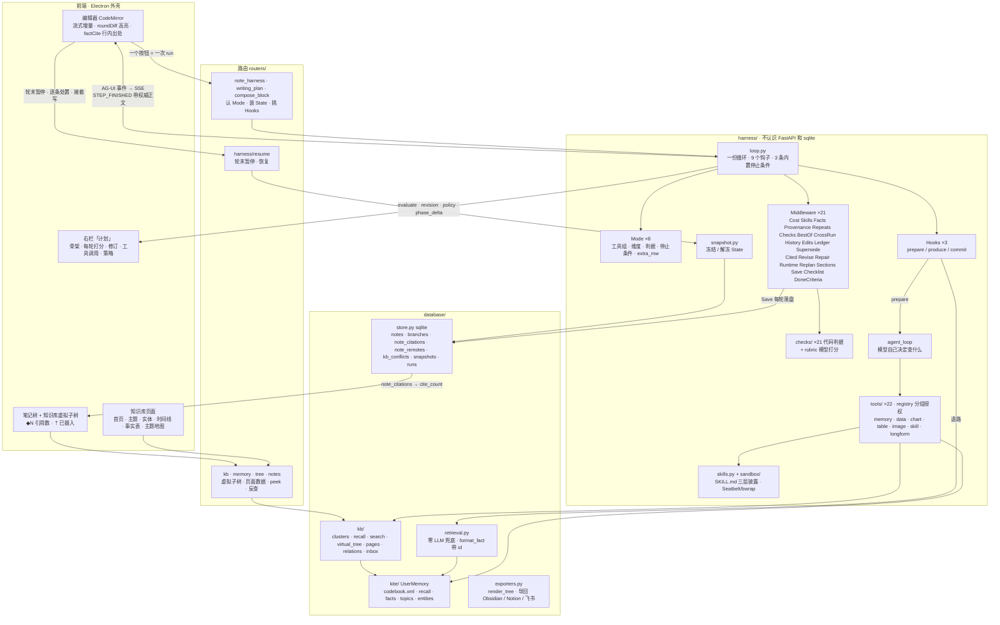

# MEMOKET_NOTE Harness 框架

> 这份文档描述**重构完成后**的架构（2026-09-11）。之前那版是「改造方案」——
> 方案里写的东西现在全部在代码里，所以这版按代码写，不再区分「现在 / 之后」。
> 结构性的数字（几个 Mode、几个工具、几条 check、几条 middleware）有
> `backend/tests/test_doc_counts.py` 盯着，跟代码对不上测试会红。
> 逐批改动和踩过的坑在 `docs/TRACELOG-trilium.md`。

---

## 0. 一页纸

**一句话**：一份写死的循环（`loop.py`），每一轮「取材料 → 写 → 判 → 决定继不继续」；
8 个功能的差别全部表达成配置（`Mode`）+ 三个回调（`Hooks`）+ 可插拔的能力
（`Middleware`），循环本身谁都不碰。

```
用户 ──点一个按钮──▶ 路由（note_harness / writing_plan / compose_block）
                          │ 认 Mode、装 State、挑 Hooks
                          ▼
              ┌──────────────── loop.run(st, hooks) ────────────────┐
              │  for round in 1..max_rounds:                         │
              │    before_round ──▶ hooks.prepare()   ← 取材料（agent 工具循环）
              │    after_prepare ─▶ hooks.produce()   ← 流式写（TEXT_MESSAGE_*）
              │    after_produce ─▶ Save（先把这一轮原样落一次）
              │    before_judge  ─▶ Checks（代码判据，零成本；`fix` 在这儿改正文）
              │                     rubric.evaluate（模型打分，可被 Checks 短路）
              │    after_judge   ─▶ BestOf / Repair / Runtime / Replan
              │    after_round   ─▶ Save（定稿再落一次）· STEP_FINISHED（带权威正文）
              │    _stop(st)     ─▶ 内置 4 条 OR Mode.stop_when                 │
              │  hooks.commit()  ─▶ RUN_FINISHED（带最终正文、run_id）          │
              └──────────────────────────────────────────────────────┘
                          │ AG-UI 事件 → SSE
                          ▼
              前端：编辑器（流式增量 · 轮末对齐服务端正文 · roundDiff 高亮）
                    右栏「计划」（骨架 · 每轮打分 · 修订 · 工具调用 · 策略）
                    状态栏（第 N 轮在干什么）
```

### 架构图



读法：一个按钮触发一次 run；`loop.py` 是唯一的循环，`Mode` 说这次跑什么、`Hooks` 说
三件不同的事怎么做、`Middleware` 是默认全开的能力；材料从工具循环进来（带事实 id），
判据先代码后模型；每轮结束把**服务端正文**随事件送回编辑器；引用落成
`note_citations`，树上就能看到每篇引用了几条。

三个词的位置：

| 词 | 是什么 | 在哪 |
|---|---|---|
| **Mode** | 一个功能的全部配置：工具组、维度、判据、停止条件、额外 middleware、轮数 | `harness/modes.py`，8 个 |
| **Hooks** | 三条 harness 真正不同的三件事：怎么取材料、怎么写、怎么收尾 | `harness/hooks/{note,section,block}.py` |
| **Middleware** | 一项能力，挂在循环的 9 个钩子上，自带状态字段；默认全开 | `harness/middleware/`，16 个 |

### 六条核心判断

| # | 判断 | 依据 |
|---|---|---|
| 1 | **循环写死，一份** | 调研的 12 个框架无一例外。重构前是三份手抄的（555 + 245 + 156 行），现在 `loop.py` 一份 |
| 2 | **判据分两类，代码判得准的不交给模型** | 打分器和被打分的是同一个模型——它的盲区和写作时的盲区是同一个（R2） |
| 3 | **判据尽量往早了放**：工具层 → 检查层 → 打分层 | 越早越省。工具拒绝的根本到不了打分器，成本为零（R8） |
| 4 | **能力做成 middleware，默认全开** | 「一条 harness 有、另一条没有」重构前发生过四次，全是遗漏不是决定 |
| 5 | **不自造标准**：事件用 AG-UI，skill 用 SKILL.md | 自造的代价是两头不通——第三方装不进来，我们的也拿不出去 |
| 6 | **用户配「要什么」，系统配「用什么能力」** | 用户不知道 `filter_facts` 和 `search_memory` 的区别，配错了坏得很隐蔽 |

**第七条是这次实战里加的**：**服务端的正文是唯一权威**。客户端靠 anchor 在本地重放
修订来追平，anchor 一有歧义正文就被改烂（实拍：引用 `[terrence-1848-5F6]` 变成
`-1848-5F6]`）。轮末事件直接带正文，客户端只负责对齐（第 12 节）。

---

## 1. memoket-note 需要什么

架构从需求推，不从现有代码倒推。十三条，每条都能在产品行为里找到出处；最右一列
是现在怎么落地的。

| # | 需求 | 从哪来 | 落地 |
|---|---|---|---|
| **R1** | 没有 oracle，合格与否靠一组可插拔的判据 | 写作没有编译器和测试 | `Dimension`（模型打分）+ `Check`（代码判定），都是 Mode 的配置 |
| **R2** | 判据不能只靠模型：打分器和被打分的是同一个模型 | 实测打分器给通篇假图打过 `has_charts=2` | 28 条 check 在打分之前跑，命中就不花模型调用 |
| **R3** | 多种任务形态：整篇 / 分段 / 生成一段 / 改选区 | 8 个功能共用一套闭环 | 8 个 Mode，三组 Hooks |
| **R4** | 流式：一次调用几十秒，产出必须边生成边看 | 本地模型的实测延迟 | `TEXT_MESSAGE_CONTENT` 逐段流；子步骤用 `phase_delta` 也流 |
| **R5** | 可追溯 + 可处置：修订逐条 accept/reject，能看到依据；**改动按层（每次动作一层）整层接受 / 撤回** | `roundDiff.ts`（`addLayer` / `acceptLayer` / `dropLayer`）· 右栏「改动」「计划」 | 轮末暂停（snapshot）+ `/resume`；`revision` / `dropped` 事件带原因和依据 |
| **R6** | 内容必须来自知识库，不能编 | KITE 是这个产品的立身之本 | 材料带事实 id，正文照抄 `[id]`；`citations_exist` 判据；`note_citations` 表 |
| **R7** | 数字和图表语法由代码产出，模型只决定算什么画什么 | 模型自己写 mermaid 会写出渲染不了的语法 | `chart` / `data` / `table` 工具组；`charts_from_tools` 逐字比对 |
| **R8** | 省调用：能在工具层拦的不留给检查层，能检查的不留给打分器 | 一次打分几十秒 | 工具白名单 → Checks 短路 → 才打分 |
| **R9** | 并发：同一篇笔记多个 `/` 同时跑，状态不能串 | `runningBlocks.ts` | 状态全在 `State` 上，没有模块级全局 |
| **R10** | 一步失败不能炸掉整个 run，且已有产出必须落盘 | 高负载下单次调用超 300s | 三级错误（第 17 节）；`Save` 每轮落盘；`warning` 事件 |
| **R11** | 用户随时可以关掉页面，取消要干净 | 每条 harness 各有一处 `is_disconnected()` | 循环里一处；`BestOf` 兜底保最好的一轮 |
| **R12** | skill 是按需加载上下文的机制 | `SkillsPanel` | SKILL.md 三层渐进披露：菜单 → `load_skill` → `read_skill_ref` |
| **R13** | 第三方 skill 的脚本要能跑，但不能在我们的进程里跑 | 生成 .pptx、按模板渲染 | `sandbox/`：Seatbelt / bubblewrap，资源上限，网络一律不给 |

## 2. 每条需求借鉴谁

调研了 14 个框架（完整笔记见 `_research/harness-survey.md`）。

| 需求 | 借鉴 | 具体是什么 |
|---|---|---|
| R1 | DSPy `Refine` · smolagents `final_answer_checks` | 判据是配置传进去的；`best_reward` 全程跟踪 → `BestOf` |
| R2 | LLM-as-judge 的公认实践 | 「把复杂 rubric 拆成离散检查」→ `checks/` |
| R3 | LangChain 1.0 `AgentMiddleware` | 循环写死，差异表达成 middleware + 配置 |
| R4 | AG-UI 协议 | `TEXT_MESSAGE_CONTENT` 逐 token 流 |
| R5 | AG-UI `CUSTOM` · LangGraph `interrupt` | 领域事件走 CUSTOM；interrupt + checkpointer = 轮末暂停 |
| R6 | RAG 的 citation/attribution | 起草 → 逐条对照来源验证 → 修补或删除 |
| R7 | 无先例 | 工具产出 mermaid，检查比对字符串是否原样 |
| R8 | PydanticAI 两阶段验证 | 语法（零成本）先跑，语义（要 I/O）后跑 |
| R10 | DSPy `fail_count` · OpenHands Controller | 失败有预算；管约束的跟做决策的分层 |
| R11 | LangGraph checkpointer | 每个 super-step 存快照，中断能恢复 → `snapshot.py` |
| R12 | Claude Agent Skills | 三层渐进披露 |
| R13 | Claude Code 的沙箱 | 内核级强制、白名单 |

十条横向结论（12 个框架无一例外）：循环写死 · 观察型和干预型扩展点分开 · 能力打包
成 middleware 自带状态 · 停止条件可组合 · best-of · 便宜的判据先跑 · 管约束和做决策
分层 · 必需能力由框架拒绝移除（`rails_off` 只对非必需项生效）· 每步前可改配置
（`Runtime`）· 失败要有退路。

---

## 3. 目录

```
backend/app/
  harness/                 agent 运行。不认识 FastAPI，不认识 sqlite
    loop.py                  一份循环 + 5 条内置停止条件（complete · blocked · cost_cap · no_progress · regressed）
    types.py                 Mode · Hooks · Middleware · Check · Verdict · StopCondition · Dimension
    state.py                 State：一次 run 的全部状态，middleware 的 bag 也在这
    tailing.py               撞 token 上限后：要不要续尾 / 续回来的像不像半句
    tray.py                  材料托盘（P14，agent-native-editor §3.4）进 harness 的**只有三条**：优先（prompt 里单独一块摆在检索材料前）·
                             不筛（拼在 relevance.gate 之后）· 不滚出窗口（middleware/facts 钉在 st.facts 头上、不进一行索引）。
                             托盘 ≠ 账本：不经工具循环、不进 ledger、facts_irrelevant 数不到它。
                             笔记项标题是「未命名」这种占位时用摘要首行（`display_title`，跟前端 `displayTitle.PLACEHOLDER` 同一份，P15 #3）；
                             导入 / 录音 / 网页剪藏默认进托盘是前端的事（`util/trayDefaults`，托盘格里的开关），剪藏走 `POST /api/notes/{id}/tray/clip`
    modes.py                 8 个 Mode + 各自的停止条件 + for_run()（按 profile / polish 塑形维度）
    events.py                AG-UI 事件 + 14 个 CUSTOM 名字 + to_sse()
    score_context.py         打分器除了正文还能看到什么：block 的前后文 / 指令 / 选区（for_block）
                             ＋这次跑累积的材料（with_material，loop 每轮现拼。
                             批 16 起材料排在 `[Content]` **之后**，拆分由这个模块说了算）
    hooks/                   三组回调 + 客户端镜像用的两个记录函数
      note · section · block · mirror
    middleware/              19 个挂在模式上的能力 + compact.py（只剩「智能续写」那条路在用）
                             + _order.py（顺序依赖，verify() 起跑时校验）
      skills · facts · history · ledger · supersede · cited · compact · sections · best_of · checks
      · checklist · provenance · revise · repeats · replan · repair · runtime · save · _order
      · done（P13 #1：这篇「完成标准」里代码判得了的那几条 → 一条判据，before_run 挂上；跟 checklist 一个做法）
      · cost（这次跑花了多少 + 超了就停，计划 12.3）
      · cross_run（这次跑完比**上一次跑**差就报一句，只报不回滚，计划 9.3）
      · edits（跑完落一版正文 + 开一行采集用户接下来对它做了什么，计划 9.1）
      （sections 批 15 顶替了 compact 在两条长文 harness 上的位置；compact.py 本身还在，
        「智能续写」那条一次性路径仍然用它——那条路没有工具循环，给指针取不回来）
    checks/                  28 条代码判据 + rubric.py（模型打分）+ pick.py（打翻哪一维）
      citations · grounding · grounding_rules · structure · charts · numbers · instructions · claims
      · budget · blockcheck · rubric · pick
      · shape（P37 #1：这一轮整段答成一串 JSON → `output_not_json`，不落正文 + 短路打分 +
        下一轮 steer 要求重写。判据跟前端 `editor/blockShape.looksLikeJson` 逐字同一条，
        量程是 `st.fresh`，`fix` 只摘这次跑新写的那几段）
      · relevance（P8 问题 5：材料进 prompt 前的零模型相关性筛——只认「从 >1000 条的主题里抽样回来
        **且** 跟标题 + 骨架 + 正文 + 这次跑的查询零重合」的；纯函数，`hooks/note.prepare` 调。
        **P8 退回、关了八批**（`params.RELEVANCE_FILTER`，真剔那版让 da080 / 3a3a 变差）；
        **P57 起默认开**，开着时也剔不到 `MIN_KEPT = 3` 条以下。
        **P28 补了开开关之前的三条前置**（那一批开关照旧关）：① 夹逼回填的排序确定下来
        （候选的 `scored` 全是 0，只按它排就是按 `set` 迭代序、跟 `PYTHONHASHSEED` 走——
        实测同一篇三个 seed 塞回三套不同的，**开关一开 prompt 就跨进程不可复现**）；
        ② `strip_ids()`：context 那一侧也剥掉行内 `[terrence-…]` 编号再抽词元
        （`_NUM` 会从编号里抽出 `16` 当「重合」）；③ `gate(refill=…)`：剔到下限先**再检索一次**
        （`hooks/note` 传的是零模型关键词检索），补够了就一条旧的都不塞回去，
        `refill` 空手才退回 P8b 那套按重合度塞回来的兜底。
        **P56 量完说「不够格」，卡点是 ③ 的播种**：会触发下限的那几轮 `refill` 正好全部空手，
        于是下限一响就把刚判过的那批垃圾塞回去（5 个轮里只救回 2 个）。
        **P57 修了两处，然后才开**：
        ⓐ `hooks/note.refill_facts` 的**两级台阶**——第一级照旧（标题 + spine + beats + 正文尾部），
        **一条都没拿回来**时退回「标题 + spine」再问一次。病因在 `search.plan` 只拿
        `CJK_GREPS = 4` 个中文 grep 词、而 `_cjk_terms` 的轮转是「每个句段先给头三个字」——
        **查询串越长**，那 4 个名额越是被 harness 自己行文的句首碎片吃光。8 种拼法 × 20 轮量过：
        空手 **11/20 → 5/20**，一轮都没变少。**台阶上没有「只用标题」那一级**：它 0/20 不空手、
        是所有组合里最好看的一格，逐条读完才知道召回的是库里带「命名」的句子（标题是 `未命名`）。
        ⓑ **中文数字月份**（`就八月` 对不上正文里的 `8月`，P56 那 3 条误剔全是这个形状）：
        归一**复用 `kb/relations.cn_month_to_digits`**，由 `hooks/note` **注入**
        （`relevance` 在 `test_layering.PURE` 名单里，只许依赖标准库，所以不是 import）；
        另一半是 `terms()` 里把 `N月` 本身当一个词元——光归一救不回任何一条
        （`八月` → `8月` 之后那个 CJK run 只剩一个字，2-gram 都出不来）。误剔 3 → 1，
        剔对的 29 条一条都没被顺手救回来。**开它的判据和真跑三列写在 `params.RELEVANCE_FILTER` 的注释里**）
      · language（P8 问题 8 / 10：正文主语言（CJK 字 vs 拉丁字母占比）+ `language_consistent`
        这次写的换了语言；`no_foreign_script` 混进正文没有的书写系统的字符（实拍「મંત્રી」「अ」），可自动修）
        （instructions 是批 17 / 阶段 6.2：用户那条指令里**能用代码判准**的那几类约束
         ——字数 / 段数 / 「必须提到 X」/ 「用表格」。它挂在 Mode 上的方式跟别的判据不同，
         由 `middleware/checklist` 在开跑时按这一次的指令装，所以不算进上面那个 19）
      · done（P13 #1：「完成标准」可检查的那几类——字数上下限 / 每条有日期 / 有出处 / 各有一节 / 结论在前——
        的**后端版**，跟前端 `util/doneChecks.ts` 是同一份判定（`shared/done-cases.json` 两边各跑一遍、
        正则 / 措辞字面逐条核对）；`done_criteria` 由 `middleware/done` 在开跑时按这篇的意图装，
        同 instructions 那样不算进 Mode 上写死的判据数；量程「每条有日期 / 出处」只判这次跑新写的单位）
        （numbers 是批 16 / 阶段 5 新加的：图 · 表 · 正文里的数跟工具返回逐个 diff——
         三条判词原话都是「每个数字都能追到源」，那是一次比对不是一次判断）
      · slides（幻灯片那几条：每页有没有依据 / 数字有没有在总结的路上被改掉 / 有没有整节漏掉。
        不进闭环——幻灯片是一次成型的重构，判据结果跟着产物一起显示）
      · skeleton（骨架那五条：节拍太少 / 两条节拍撞车 / spine 只剩一个话题名 /
        一条节拍都不带锚点 / 把正文的毛病写成了写作意图。批 19 / 阶段 4.3，形态照
        slides：**判了不拦着落库**——`skeleton` 是整条闭环最上游、也是唯一没有闭环
        的一步，而 `spine_fidelity` 实测 1.88–1.96 封顶，那不是扣题扣得好，是
        「对着一个从没被验过的计划打分，太容易满足」。五条的阈值都在 20 份真实骨架
        上量过，那 20 份上开火 0）
      · tap（magic tap 那四条：停在半句上 / 复述了光标前已有的段落 / 脚手架标题 /
        提示词里的例子被抄进正文。批 20 / 阶段 8.1，形态同 slides——magic tap 的
        定位是「点一下几秒出一段」，套完整闭环就变成智能续写了。四条在 18 篇真实
        笔记上误伤 0；另有三条量完之后**不做**，见模块文档）
      · journey（屏幕活动日报那五条：模型自己算了时长 / 写出规定之外的小节 /
        有条目一个具体东西都不带 / 同一节里两条说同一件事 / 条目里的名字在记录里
        查无出处。批 20 / 阶段 8.2。最后那一条正是日报提示词注释里写着的
        「跟 `material_used` 是同一场仗」。阈值在两份真实日报（18 条 bullet）上量，
        五条开火 0；两条量完不做）
    tools/                   22 个工具 + registry（分组授权）
      memory_tools · data_tools · tabular · blocks · imagegen · sandbox_tools · skill_tools
      · longform_tools（read_section：把自己这篇笔记的某一节原文读回来，只给两条长文 harness）
      · registry
    prompts/                 提示词
      writing · note · plan · block · selection · slides · skills · fragments
    skills.py                SKILL.md 目录 + DB 里的配置
    sandbox/                 policy（三档）· limits（资源上限）· runner（Seatbelt / bwrap）
    agent_loop.py            取材料的工具循环（模型自己决定查什么）
    query_cache.py           查询级短路：一次跑里参数完全相同的知识库查询只真查一次
                             （同一轮内的重复连上下文都不再塞第二遍；跨轮的原样返回全文）
    policy.py                Runtime 策略控制器：上一轮反馈 → 下一轮参数
    replan_rules.py          骨架重规划的约束
    revision.py              定位 / 应用修订：纯函数
    checklist.py             从用户那条指令现场生成 instruction-specific checklist
                             （二元条目 → 维度；批 17 / 阶段 6.1，[IND] §4 的 TICK / RaR）
    snapshot.py              轮末暂停：冻结 / 解冻 State
    round_snapshot.py        每轮烧进正文之前存一版 note_revisions（P16 分层历史，agent-native-editor §3.2）：套在 loop.run 的事件流外面，
                             STEP_STARTED → reason='round'；RUN_FINISHED 时 Edits 已落的 'harness' 行（带 round_no，P18 #2）就是收尾，
                             没有（暂停 / 没进 harness_runs）才存 'run_end'；只在会写这篇笔记的跑上存（writes_note）
    params.py                长文 harness 共用的参数
    adapter.py               LLMClient / RunHistoryStore 两个协议接到 util/llm 和 store
    conflict_confirm.py      摄入时那批冲突候选进收件箱前让模型确认一遍；
                             由 routers 注入给 database/kb/inbox（层次只能从上往下递）
  database/
    store.py                 sqlite：notes · branches（树）· note_citations · note_revisions（历史版本，带 run_id：哪一次跑交出来的）· note_change_layers（**这一篇上还没处置完的改动层**，P39：一层一行、每一处的处置状态在 hunks 那列 JSON 里；**故意不进 `db_guard.WATCHED`**，理由跟 harness_runs 同一条；烧进正文走 `burn_change_layers`——清完当场再数一遍，没清干净就抛，P41 #6）· harness_edits（用户拿到 AI 写的东西之后改了什么，只存指针 + 四个数，计划 9.1）· note_remotes（导回副本）· kb_conflicts（冲突收件箱）· note_trash（最近删除）· llm_usage（模型用量）· ingest_jobs / ingest_items · skills · snapshots · runs
                             启动清理：sweep_orphan_jobs / sweep_orphan_plans / sweep_stale_snapshots（7 天）/ sweep_old_rows（用量 90 天、跑完的任务 30 天、非活跃计划 30 天）/ prune_job_payloads
                             轻量列表 list_notes_brief（⌘K / `[[` 补全用：不带全文，正文命中带片段 + first_body）；搜索的 LIKE 通配符已转义
    retrieval.py             零 LLM 关键词检索（工具循环失败时的退路）；format_fact() 给材料带 id
    kite/                    KITE codebook 适配：UserMemory（recall / facts / topics / entities / fact_by_id）
    kb/                      知识库在 KITE 之上的那层：clusters · recall（簇粒度）· search（排序）
                             · virtual_tree（树上的虚拟子树）· pages（各节点的页面数据）
                             · extract_check / extract_judge / reextract（摄入质量）
                             · relations（六种关系，纯代码）· inbox（摄入时检冲突进收件箱）· units（长材料切成的段：part_labels 带 k/n · materials() 按材料归组 · parts_of() 分段导航）· scope（记忆范围：按 session 前缀分 笔记 / 会议记录 / 导入）· who（说话人写法归一：speaker a / speaker_a / Speaker A 算一个人）· entities（实体去重规则版：大小写 / 分隔符 / 别名归组，只在展示与查询层，代表 = 事实最多的码）
    ingest/                  摄入：asr · chunking · extract · importers · feishu（块 → markdown + 最小客户端）
    exporters.py             导回：render_tree（zip 导出 / Obsidian 目录共用）· markdown → Notion / 飞书块 · 最小写客户端
                             P18：飞书 mermaid → 图（前端 util/mermaidPng 在 Chromium 里渲 PNG，按源码哈希 mermaid_key 交到
                             /api/export/renders，导回时走图片三步上传；没渲的退化成代码块 + 一行说明；不用外部服务）；
                             Notion 本地图片走 File Upload API 两步（POST /file_uploads → /send multipart）挂成 file_upload 块
    assets.py                资产目录（粘贴的图 / 录音落在哪；assets 路由和整库导出共用）
    backup.py                启动时一天一份笔记库备份（sqlite 在线备份；留 7 日 + 3 月）
  editor/                    既不是 agent 也不是知识库：outline · restructure · textshape · vision · profile
  journey/                   屏幕活动里**不用模型也能算准**的那一半：stats（时长 / 连续专注的块 / 反复来回的地方）
                             · prompt（日报提示词）。纯函数、零 I/O——日报的「时间去哪了」由代码写死，
                             模型只写「推进了什么 / 卡在哪 / 计划外的」（模型数时长会数错，而它数错的时候
                             读起来跟数对了一模一样）
  routers/                   和前端对接：认 Mode、装 State、翻事件
    note_harness.py            POST /api/note-harness/run（单篇：写 / 打磨）
    writing_plan.py            分段写作（一棵子树一篇篇写）
    compose_block.py           `/` 块生成
    harness.py                 GET /paused · POST /{run_id}/resume
    compose.py                 单点动作：skeleton · magic-tap · rewrite · expand · verify · digest
    tree.py · notes.py         笔记树（branches / 克隆 / 重排 / 路径；克隆 / 移动都判环，目标父节点要存在）· 笔记 CRUD（标题压成一行 ≤200 字）· POST /{id}/icon 笔记图标（boxicons 类名，Trilium 的 NoteIcon）· GET /{id}/graph 这篇周围有什么（引用 + 贡献的事实 → 主题 / 实体局部图）· /links 带 dangling（链到已删笔记的）——前端「清掉这些引用」「改成纯文本」都只改正文里的记号（`util/wordCount.citationRanges / noteLinkRanges`，走 CM changes 可撤销）· GET /brief 轻量列表 · 最近删除（note_trash，30 天可恢复；空的未命名不进；恢复时父链也在回收站的先一起回来）· 启动时空页 ≥1MB 且 ≥25% 就 VACUUM（sqlite 删行不缩文件）· 启动时删掉没有任何笔记 / 历史版本 / 最近删除引用且超过 7 天的图（`sweep_orphan_assets`）· 今天的日记（日记/年/月/日）
    kb.py · memory.py          知识库虚拟子树、各节点页面、检索、事实 peek / 反查
    ingest.py · import_sources.py · skills.py · settings.py · profile.py · assets.py · export.py
    journey.py                 屏幕活动：GET /day · POST /catch-up（看图 → 一句话 → 进知识库）· POST /report（日报）· DELETE /day（连事实一起删）
    client_log.py              前端错误报进后端日志（打包版没有 DevTools）；error / warn / info 三档，info 是纯观测（首屏耗时、大树计时、harness 开跑），扫 warn 找问题时别被它淹
  util/                      config · llm（stream / stream_events / complete_json / extract_json · 用量记账 llm_usage）· parent_watch
```

前端与桌面壳（不是 Python，单独一张）：

```
frontend/src/
  App.tsx                    外壳 + 所有 harness 事件处理（noteHarnessHandlers）
  api.ts                     类型 + fetch + SSE 解析（runNoteHarness / resumeHarness / watchJob）
  editor/                    CodeMirror 扩展：roundDiff（轮次高亮）· revisions · factCite（行内出处）
                             · recallCompletion（@ 引用）· mermaid · runningBlocks（并发块）…
  components/                外壳（TabBar · NoteTree · Ribbon · RightPane · ContextMenu · CommandPalette · SplitEditor（分屏第二栏，自己持正文 + util/autosave 防抖保存）…）
                             harness 面板（AgentActivity · SkeletonPanel · RevisionPanel · TapProvenance）
                             知识库（KbNoteView · kb/* 各页面 · KnowledgeGraph · MemoryBrowser）
  util/displayTitle.ts       树 / 标签 / 面包屑共用的显示名

desktop/src/                 Electron：main.ts（窗口 · 菜单 · --probe / --shot 探针）· backend.ts（拉起后端）
```

---

## 4. 一轮里发生什么

`loop.run(st, hooks, mw)`：

```
chain = BASE + Mode.extra_mw − Mode.rails_off      # verify(chain) 校验顺序依赖
RUN_STARTED
before_run
for round:
    STEP_STARTED(round, mode.label)
    before_round                                      # Sections（发布分节给 read_section）/ Revise（改已有正文）
    facts, trace = hooks.prepare(st)                  # agent 工具循环：模型自己决定查什么；托盘（ctx.tray）拼在 relevance.gate 之后、排最前（P14）
    after_prepare                                     # Facts 累积 · Provenance（工具真的返回了什么）· Skills
    TEXT_MESSAGE_START
    for piece in hooks.produce(st): TEXT_MESSAGE_CONTENT   # 正文已有目录时先发 CUSTOM insert_at（定向续写，见 §4.1）
    TEXT_MESSAGE_END
    after_produce                                     # Save（先落一次原样，判分那几十秒里关页面不丢）
    before_judge / evaluate / after_judge             # Repeats → Checks（`Verdict.fix` 在这儿改 st.content）· rubric.evaluate（可被 skip_judge 短路）· BestOf · Repair · Runtime · Replan
    after_round                                       # Save（**变了才再落一次**：判据 fix 改的正文得进库，P45 #1）
    STEP_FINISHED(round, content)                     # ← 权威正文（跟库里那一份逐字相同）
    reason = _stop(st)                                # 内置：complete / blocked / no_progress / regressed；再 OR Mode.stop_when
    if reason: break
hooks.commit(st)
after_run
RUN_FINISHED(content, reason, run_id?)
```

**顺序有讲究**，两条（`middleware/_order.py` 起跑时校验）：
① 同一个钩子上，先跑产出材料的，最后跑可能短路的——`Repeats` 产出 `dup_hints`
给打分用，`Checks` 可能判定不合格直接跳过打分。② `Revise` 在 `before_produce` 改已有
正文，必须在 `Sections` 拼「小节索引 + 当前小节逐字」之前——否则续写 prompt 拿到的
是**修订前**的正文（这条依赖是从 `Compact` 原样继承的，它当年就是为这件事写的）。

**判据的三层**（R8）：工具层拒绝（模型调不到没授权的工具）→ 检查层（28 条 check，
纯函数，命中就不打分，能自动修的当场修）→ 打分层（`rubric.evaluate`，一次几十秒）。

**打分器能看见什么**（批 8 改过一轮，改之前这里是一笔空账）：
`loop._evaluate` 给的是正文、这个 Mode 的维度判词、机械查重的 `dup_hints`，
外加一份 context——context 由 `harness/score_context.py` 拼，两段：

1. 这次跑的 `st.bag["score_context"]`：长文两条是 spine/beats 或分段主题（router 装），
   **六个 block 模式是 `score_context.for_block` 装的前后文 / 用户那条指令 / 选中的原文**；
2. **这次跑累积的材料 `st.facts`**（`score_context.material`，所有模式一视同仁，
   排在 context 最后一项紧挨着正文）。

**批 8 之前，1 的 block 那一半和 2 整个都不存在**：六个 block 模式一个 `score_context`
都没有，事实块一条都没传，而好几条维度的判词明确写着要对着这些东西判
（`material_use` 说「只在【知识库事实】块里确实给了材料时才判，**没给材料就算达标**」、
`numbers_from_tools` 说「每个统计量都能追到工具结果」、`fits_context` 说「读起来要像
本来就在这篇笔记里、标题比上方最近的标题低一级」、`follows_prompt` 说「有没有照指令做」）。
**那几维的满分因此说明不了任何事**——不是「做得好」，是「无从判断，默认给过」。
`routers/note_harness._score_context` 的 docstring 当时还写着「the loop hands evaluate
the run's accumulated material directly」，那句话是假的（仓里第二处文档与实现不符），
批 8 把实现补上它才成立。

**仍然不传的**：个人偏好档案（`style_fit`）。**这是有依据的**：批 7 实测补了偏好的
那一臂只掉 0.17（n=2，p=1.0），没有证据说明传了有用——判据宁可窄一点。

灵敏度实测（批 5 量、批 6 驳回、批 7 在**只留真实用户语料**上重算，
**批 9 在批 8 那条新接线上重跑了全部 396 格**；n / p 见台账批 9）：

* `numbers_from_tools` 批 7 干净版**恒为 0 分**（3 篇 18 次没有一次例外）——
  判词要的证据打分器根本拿不到。**批 8 接上工具返回值之后翻转**：
  干净 1.11 / 植入 0.0，掉 1.11（n=3 篇 18 次，p=0.006），**抓住**。
  这是整批里最干净的一次「空账 → 灵敏」。
* `follows_prompt` 批 7 补了指令那一臂掉 0.0（n=3，p=1.0），看上去像「接了线也没用」。
  **批 9 推翻了它**：真接进生产之后干净 1.44 / 植入 0.33，掉 1.11
  （n=3 篇 18 次，p=0.0005），**抓住**。批 7 那条「没抓住」是坏测量，不是判据的毛病
  ——那一臂其实没拿到指令。
* `material_use` **不是废了**：批 9 as-deployed 干净 2.0 / 植入 1.33，掉 0.67
  （n=4 篇 24 次，p=0.027）。**按「材料块到底空不空」拆开看才是真相**——
  材料块非空的 3 篇掉 0.89（18 次，p=0.025，**抓住**），材料块为空的那 1 篇掉 0.00
  （6 次，p=1.0）。后者是判词规定的正确行为（「没给材料就算达标」），
  它被平均进来才把整行压到线下。**「条件没出现」不该跟「判据废了」算同一个均值。**
* `fits_context` 接线补上之后**基线抬起来了**（干净 0.56 → 1.22），但掉分只有 0.44
  （n=3 篇 18 次，p=0.10，**不显著**），没到批 7 预测的 0.78。
  已知限制：这 3 篇的「这一块后面的正文」全是空占位符（取材器挑的密数段正好都在文末），
  等于只给了一半上下文。
* `data_grounding` 批 7 干净版恒 0（无从判断），批 9 干净 2.0 / 植入 0.0，掉 2.0
  （`--repeats 5`，n=**1 篇** 10 次，p=0.006）。**n=1 篇，只说明这一篇上不是噪声，
  不能外推。**
* `right_kind` 批 7 把工具画的 mermaid 换成不存在的图片引用后从 0.33 **涨**到 2.0；
  批 9 同一格是 2.0 → 1.8（掉 0.2，n=1 篇 10 次，p=1.0）。两批方向都不稳，
  **只有 1 篇真实语料带图，这一维至今没有可用结论。**
* `factual_grounding` 对占位符**两批都没抓住**（批 7 掉 0.07、批 9 掉 −0.07，
  n=5 篇 30 次，p=1.0）。这一维靠别的 probe 过关，占位符这条是稳定的失败。

> **图表那一组（`chart_validity` / `right_kind` / `has_charts` / `no_duplicate_charts` /
> `covers_the_data` / `table_validity` / `data_grounding`）全部 n=1 篇**——
> 5 篇真实用户语料里只有 1 篇带 mermaid、1 篇带 markdown 表。批 9 把这一组加到
> `--repeats 5` 拿到了篇内显著性，但**跨篇一概不下结论**。要量准它得先有真实语料。

> **批 12 之后，`chart-block` 那几行连"结论"都不剩了**（台账批 12 ⑤）：那唯一一篇
> 带 mermaid 的笔记里，图前面那一段是**一个游离的围栏收尾符**，取材器把它当引子交给
> 了打分器（整段奇数个围栏）。所以 `chart_validity`「干净版恒 0 / 无从判断」
> **是取材缺陷，不是"这篇没图"**。取材修好之后那 60 格自动作废。

> **批 13 重跑了这一组，结论是：6 条 probe 里只有 3 条跑得起来。**
> `has_charts`（掉 1.4，p=0.0445，抓住）、`right_kind`（掉 0.6，p=0.399，只动了一点）、
> `chart_validity`·break_mermaid_fence（1.2→1.2，**没抓住**）。另外 3 条在唯一那篇
> 带图语料上**结构性跑不起来**，不是预算不够：`handwrite_mermaid` 干净版本身就带这个
> 缺陷、`shift_dates` / `duplicate_chart` 植入器不适用，而 `covers_the_data` 依赖的
> `chart-block-narrated` 在批 12 把引子收紧成「不含围栏的正文段」之后**一段都挑不到**。
> 取材修好换来的是：`chart_validity` 的干净版基线从 0 抬到 1.2（原来那个 0 确实是取材
> 缺陷），但**这一维仍然判不出被打断的围栏**。全组仍然 n=1 篇，**跨篇一概不下结论**。

---

### 4.1 定向续写：这一轮写到哪一节

正文已经有目录、各节都有内容之后，「接着往下写」只会把所有新内容堆在最后一节底下
（实拍：讲硬件延期的段落离「硬件」隔了两千字）。现在 `produce()` 在提示词末尾附一张
现有小节清单，要求模型**第一行**只写 `【放到：标题原文】`（或 `【放到：文末】`）；
`hooks/note.py` 攒到第一个换行解析这一行，位置由 `editor/outline.section_end()` 算
（下一个层级不深于它的标题之前），写进 `st.bag["insert_at"]`；`loop.py` 在第一个
delta 之前发 `CUSTOM insert_at {section, pos}`，前端按自己的正文重算落点、把 delta
插在那里（`util/sectionEnd.ts` 同一条规则）；轮末 `insert_into()` 落到那一节末尾。
大纲模式下还有空节时走原来的 `next_gap()` 定向，不用这条。没写指令行就照旧追加。

修订环节的两条硬上限也在这轮加上：单条修订最多删正文 35%、一轮累计 50%
（`revise.too_destructive()`——骨架被另一篇顶掉时模型按「离题」把 4493 字删到 754）；
`revision.breakage()` 除了破字还认「半截链接」（从 `[x](note://…)` 中间切开）。

## 5. 类型

```python
# harness/types.py
@dataclass(frozen=True)
class Mode:
    key: str; label: str; task: str; verb: str = "在写"   # 活动条动词：画图类是「在画」
    groups: tuple[str, ...]        # 授权的工具组
    focus_groups / exclude         # 组为主，工具为辅
    dims: tuple[Dimension, ...]    # 模型打分的维度（note / section 由 for_run 按 profile、polish 塑形）
    checks: tuple[Check, ...]      # 代码判据
    skill_scope: str               # 哪些 skill 进上下文
    stop_when: tuple[StopCondition, ...]
    precheck: Callable[[State], str | None] | None   # 跑之前的确定性门槛：返回一句原因就直接 blocked，一次模型调用不花（EDA：光标附近没数字没表）
    extra_mw: tuple[Middleware, ...]
    rails_off: tuple[str, ...]     # 关掉哪些非必需 middleware
    max_rounds: int

class Hooks(Protocol):             # 三条 harness 真正不同的三件事
    async def prepare(st) -> (facts, ToolTrace)      # 取材料
    def produce(st) -> AsyncIterator[str]            # 流式写，并更新 st.content
    async def commit(st) -> None                     # 收尾。每轮落盘是 Save 的事；这里落的是
                                                     # **交出去的那一份**——循环末尾 `st.content = st.best[1]`
                                                     # （SHIP_BEST_ON / 轮数用尽）发生在最后一个 after_round
                                                     # **之后**，只有它接得住（P45 #1）
                                                     # 这条契约由 `tests/test_p47.py` 按**性质**钉住：
                                                     # 凡是 `extra_mw` 里有 `save` 的模式（从 `modes.ALL`
                                                     # 数出来，不抄名单），hooks 由生产那条路
                                                     # （`routers/harness._hooks_for`）造，`fix` / `fix_done`
                                                     # 动过正文之后，`STEP_FINISHED` / `RUN_FINISHED`
                                                     # 交出去的那一份必须跟 `notes.content` 逐字相同

class Middleware(Protocol):        # 9 个钩子，都是可选的
    before_run / after_run / before_round / after_prepare / before_produce /
    after_produce / before_judge / after_judge / after_round

Check = Callable[[State], Verdict | None]        # 纯函数，只读
Verdict(dimension, message,
        fix: Callable[[str], str] | None,        # fix = linter 的 --fix
        fix_done: Callable[[str], bool] | None,  # 「我管的那件事修好了没有」（P23 #1）
        fix_note: str,                           # 「上一轮我替你改了什么」（P26 #3；P59 ② 起 12/12 处处都填）
        advisory: bool)                          # 「说话但不收这一轮」（P58 A）——报 + 放行，打分器照跑
StopCondition = Callable[[State], str | None]   # 返回停止原因；可组合，OR
Dimension(name, guidance)                         # guidance 直接渲染进打分 prompt
```

```python
# harness/state.py —— 一次 run 的全部状态；middleware 的临时数据放 bag
State: mode · ctx(user/note/cursor/intent/tray) · request · round        # ctx.tray = 材料托盘那几条（P14，router 装、快照跟着走）
       before / after / content / fresh          # 光标前后 / 当前正文 / 这一轮写的
       facts / facts_new / charts / trace        # 材料 · 工具真的画出来的图 · 工具轨迹
       skill_bodies / skill_menu
       ev / skip_judge / best / steer            # 打分 · 判据命中 · 最好的一轮 · 下一轮的引导
       stopped · bag
```

---

## 6. 8 个 Mode

| key | label | 工具组 | extra_mw | stop_when | 轮数 | 维度 |
|---|---|---|---|---|---|---|
| `note` | 续写整篇 | memory · skill · longform（P8 起不带 chart：要图走「/ 智能插图」） | Cited Revise Repair Runtime Replan Sections Save | check_stuck · material_used_up · stalled · best_stalled · nothing_left_to_fix · pause_for_review | 8 | spine_fidelity · beat_coverage · non_repetition · factual_grounding · coherence · material_use · style_fit |
| `section` | 分段写作 | memory · skill · chart · longform | Cited Revise Repair Sections Save | check_stuck · material_used_up · pause_for_review | 4 | topic_fidelity · non_repetition · factual_grounding · material_use · coherence · style_fit |
| `eda` | 数据可视化 | data · chart · memory · skill | — | — | 3 | numbers_from_tools · honest_caveats · has_charts · no_duplicate_charts · covers_the_data · fits_context · actionable |
| `chart` | 智能插图 | data · chart · image · memory · skill | — | — | 3 | chart_validity · data_grounding · right_kind · fits_context |
| `table` | 生成表格 | data · table · memory · skill | — | — | 3 | table_validity · data_grounding · fits_context |
| `analysis` | 数据分析 | data · chart · memory · skill | — | — | 3 | answers_the_question · numbers_from_tools · states_limits · chart_validity · fits_context |
| `prompt` | 按指令生成 | memory · skill | — | — | 3 | follows_prompt · fits_context · no_fabrication |
| `custom` | 改写选区 | memory · skill | — | — | 3 | follows_prompt · replaces_cleanly · no_fabrication |

- `note` / `section` 的维度由 `for_run(mode, has_profile, polish)` 塑形：有个人偏好才
  加 `style_fit`；打磨模式（只修不写）去掉覆盖类维度。
- Mode 的停止条件（`modes.py`）：**`check_stuck`**（P6：同一条代码判据**按名字**响够
  `CHECK_STUCK_ROUNDS` = 3 轮就停、交最好的一轮——`STUCK_ROUNDS` 卡满只是不再短路打分
  （**这一支不写 `check_released`，所以 `after_judge` 那条「判据还在响就不许判写完了」对它不生效**；
  P59 ④ 把局面摆出来过——`<scratch>/p59/stuck9.py`，真 `loop.run` + 假打分器，停机从 `'complete'` 变 `'check_stuck'`——
  **结论还是不加**，三条理由在 `Checks.after_judge` 的 docstring 里，最硬的两条是
  「这一支在 15 批 / 61 份跑 / 284 轮里 0 次开火」和「8 个模式里 6 个的 `stop_when` 没有 `check_stuck`，
  在那 6 个上压回 `continue` 没人接得住，会一路跑到 `max_rounds`」；
  **P61 #3 换了个角度又量了一遍，结论一样**——把 `streak` 改读按判据名数的那一份
  （`check_name_streak`，`citations_present` 的判词里带「这一轮写了 N 字」，按原话数永远升不到 3）
  之后，放行轮是 **r3 起每一轮**；可在真跑的条件下（`JUDGE_FLOOR` 活着）**它买不到东西**：
  `JUDGE_FLOOR` 已经在 r2 放行、r2 就有真分，而 `modes.check_stuck` 本来就读按名字数的那一份，
  r3 就成立——NOTE / SECTION 上停机轮和交付轮**一轮不变**；在那 6 个模式上则是从 r3 起
  每轮多一次真打分调用、没人接得住。**「误伤」那一栏是空的**：放行不停跑，它只是「不短路」。
  局面在 `<scratch>/p61/stage61.py`（真 `Checks.before_judge` 八轮，五列对照），闸 `tests/test_p61.py::test_3_*`。
  **P65 ③ 去核了一遍这条结论今天还成不成立（P59 的 `advisory` 之后），成立，而且理由变硬了一格：**
  `STUCK_ROUNDS` 够不着的第一大户 `citations_present`，它那两档 `located == 0` 现在是
  `advisory=True`（P58 量过，这条判据报得出档的 **29 轮全是这一档**），而 `advisory` 那一支
  **每一轮**都放行、不用攒 streak——**那个大户今天根本不经过 `STUCK_ROUNDS`，改它一分钱买不到**。
  真改了还会**倒亏**：`streak > STUCK_ROUNDS` 那一支排在 `advisory` **前面**，又不写
  `check_released`、不写 `advisories`；按判据名数的话 r3 起它会抢先，于是 P24 #5 那条
  「判据还在响就不算写完」失效、P58 A 那条「判词得自己找条路进下一轮 prompt」也断掉。
  **就此结案**，闸 `tests/test_p65.py::test_3_stuck_rounds那条结论今天更硬了_advisory让它买得更少`
  （钉两支的先后 + 那一支不写这两个键 + `key` 还是带判词原文的那一份 + `grounding` 里正好两处 `advisory=True`）），
  在这之前没有任何规则看「连响」；P5 实拍 `citations_present` 连响 10 轮跑到 15 轮 385 秒。
  **P24 #3 把「连续 3 轮」换成「最近 `CHECK_STUCK_WINDOW` = 4 轮里 3 次」**：`Checks.before_judge`
  每轮把 `check_name_streak` 整只换掉（「连续」该有的语义），于是**两条判据交替响就互相清零**
  ——P22 实拍 `e78306202d78` 的 `citations_present`(r2/r3/r5) 和 `no_repeated_lists`(r4/r6) 谁也凑不满 3 连，
  跑满 8 轮按 `stalled` 交卷，被点名两次的那处重复原样留在最终正文里。窗口口径**严格是连响口径的超集**
  （连 3 轮当然也是 4 轮里 3 次），只会更早停；库里 22 次带 `fired_checks` 的真跑上量过：
  原规则命中 1 次、新规则 2 次，多出来的那次正是 `e78306`，三次 `complete` 的跑一次都不碰。
  哪条、几轮由 `Checks.after_run` 发一条带 `stopped` 的 `check_hit`）·
  `material_used_up`（材料用完就停，不然覆盖维度会
  逼它编）· `stalled`（连续几轮没变化）·
  **`best_stalled`**（P55 #4：`best` 连着 `BEST_STALL_ROUNDS` = 4 轮**一格没涨**就停、交 `best`）——
  这一条**不看判据**，只看 `best`。判据响不响是「有没有人抱怨」，`best` 涨不涨是「这几轮换来更好的一份没有」；
  前者漏得掉（轮流响、隔轮响），后者漏不掉。P53 实拍 `3a3a96354546`：`citations_present` 响在 r1/r2/r5/r7，
  **任何 4 轮窗口都凑不满 3 次**，`check_stuck` 漏出去，跑满 8 轮 224k prompt token，
  而 `best` 从 r3 的 [4, 1.667] 起 r4–r8 五轮没涨。阈值是量出来的（`<scratch>/p55_beststall.py`）：
  射程先收对——p5/p6/p8/p11/p14/p15 那 20 份 run json **没记 `best_rank`**，拿它当「没涨」会凭空多算 20 份，
  只在真记了的 **27 份**上反事实重放：N=3 提前停 7 份省 12 轮但**误伤 2 份**（`p22/da080ca847cf`、
  `p24/da080ca847cf`，两份都是第 5 轮才 `complete`），**N=4 停 4 份省 5 轮、误伤 0**，N=5 只动 1 份等于没加。
  取「误伤为 0 的最小阈值」。计数在 `BestOf.after_judge`（`st.best` 只有那一处在写）· `nothing_left_to_fix`（打磨模式一轮零修订）·
  `pause_for_review`（每轮停下等用户）。内置三条在 `loop.py`：`complete` / `blocked` /
  `no_progress`。**`regressed`**：最好的一轮只差一个维度没达标、这一轮排名反而更低——别再跑了，
  best_of 交最好的那轮（实拍生成表格：第 1 轮好表，第 2、3 轮「[tool call needed]」没表，白花两次调用）。
  它对**没判过的一轮**一律返回 None——判据短路（`skip_judge`）和打分调用失败
  （`st.ev is None`）都算，两种都不是「变差了」。武装条件正是「最好那轮只差一个维度」，
  而那也正是最不该因为一次接口抖动收工的时刻。
- **交出去的是哪一轮，和界面上那个「+N 字」**（P64 #1 → P65 ②）。
  把正文换成 `st.best[1]` 的地方 **`loop.py` 里有两处**：`SHIP_BEST_ON`
  （`regressed` / `cost_cap` / `check_stuck` / `best_stalled`）那一支，**和轮数用尽那个 `else:`**。
  数「有多少跑会回退」时漏掉第二处，答案就是 0——**而真值是 8**。
  跑批台账（`tests/fixtures/harness_runs.jsonl`，175 跑 / 489 轮）上量出来的：
  停机理由**记下来了**的只有 17 跑，其中 **8 跑是 `max_rounds`** = 会回退
  （`SHIP_BEST_ON` 那四个理由在这 175 跑里**一次都没出现过**）；8 跑全是 3 轮、
  **逐轮字数都不一样**，没有一跑落在「最后一轮正好就是 best」那种无害情况上，
  最坏口径差 **16 ~ 1333 字**。
  **但界面那一侧的口径本身是对的**，所以 P64 #1 那 320 字判不出是产品的：
  会打「+N 字」的产品代码有两处，两处都拿**交出去的那一份**重算——`App.tsx` 的收工那行
  在算 `delta` **之前**先 `liveContentRef.current = serverContent`，`util/runRounds.runTitle`
  从 `note_revisions` 的收尾行 `chars` 减起点；而后端交出去的确实是回退之后那一份
  （`tests/test_p45.py` 两条闸）。**更像读它的那个走查脚本**（P64 同一批抓到四个量具问题，
  而走查脚本不在 git）——**写「没核」，不写「没做」**。
  闸 `tests/test_p65.py::test_回退名单不止SHIP_BEST_ON_轮数用尽那个else也换` /
  `test_台账里会ship_best回退的跑是8_而且不是全都无害` / `test_产品那几处打字数的地方_口径本身是对的`。
- **那 6 个 block 模式要不要也停 `check_stuck`：分母一格没长，所以还是答不了**（P61 #4 → P65 ③）。
  P63 把跑批台账蒸馏进 git 时写的是「每批 `--append` 分母会自己长」。P65 去数了：
  **还是 175 跑 / 489 轮、出身全是 `p63-realdb`、时间跨度还是 09-17 ~ 09-18、判据真响过的轮还是 3**，
  跟 P61 #4 量的那份逐格相同（这一批照样 `--append` 了一次，**新增 0**）。
  原因查清楚了：**走查那种跑落在 `$S/pNN/<udd>/data` 里，`--append` 只导真库**，
  而真库自 P63 之后没有新的跑。**要让分母长，得让走查那一趟的 udd 也导一次**——
  记成下一批的动作，别再指望它自己长。买到的那件事是**复现得出来了**：
  闸 `tests/test_p65.py::test_那6个模式的分母一格没长_所以还是答不了` /
  `test_那6个模式跑满的历史里还是没有一次判据连响到底`。
- 加一个功能 = `modes.py` 加一个实例；路由不动。

---

## 7. 21 个 middleware

`BASE`（默认全开，顺序即执行顺序）：

| 名字 | 钩子 | 做什么 |
|---|---|---|
| **Skills** | after_prepare | 把「有哪些 skill」放进上下文（菜单一行一条；命中才 `load_skill`） |
| **Facts** | after_prepare / before_round | 跨轮累积材料并修剪——只做一半各出过一个 bug。**托盘行钉在 `st.facts` 头上**（P14）：不进 `facts_all`、不算 fresh、不受 `fact_budget` 窗口滚动、不压进一行索引 |
| **Provenance** | after_prepare | 把工具真的返回了什么给用户看（`tool_result` 一发一条 + `round_summary`），依据不能靠模型自报。**游标长在 `ToolTrace.reported` 上不在 `st.bag` 里**（P28 #1）：bag 跨轮活着而 trace 每轮新建，放 bag 里第 2 轮起就只报得出这一轮的尾巴 |
| **Repeats** | after_produce | 机械近重复检测（difflib），结果作为打分的证据 |
| **Checks** | after_produce / after_judge | 跑 Mode 的代码判据；命中就 `skip_judge`，能自动修的当场修，发 `check_hit`；同一条原样卡满 `STUCK_ROUNDS` 轮就只发事件不再短路（改不动的老正文不该把剩余轮数烧掉）。**连着 `floor` 轮一次真打分都没有，下一轮无论哪条命中都不短路**（P24 #5；`floor` 分两段，见下）：上面那条数的是「同一条判据卡死」，这一条数的是「**不同判据轮流**把打分饿死」——P22 实拍 18 轮只有 6 轮真打过分，`e78306202d78` / `a941efecd390` 两篇**一轮都没有**，于是 `complete` 结构上到不了、`st.best` 从头到尾是空的、`stalled` 只能把最后一轮原样交出去（那正是留下率最低的那篇）。放行那一轮的分数照样进排名（要的就是它），但 `after_judge` 把这一轮的 `complete` 压回 `continue`——一条代码判据还在响的时候，不许判「写完了」。**门槛分两段**（P26 #2）：这一跑还一份真分都没有时按 `JUDGE_FLOOR` = 2，已经有过真分之后按 `JUDGE_FLOOR_AFTER_FIRST` = 3。依据是 P24 那 5 跑 30 轮逐轮读出来的 3 个放行轮——**一条也没改变交付轮**（带 streak 级联重放 floor=3，5 跑交的还是同一轮），`after_judge` 那条压制**一次都没派上用场**（0/3，status 本来就是 continue），唯一有价值的那个（`e78306202d78` r3）价值全在「它是这一跑第一份真分」上。所以不是 2 也不是 3：**平白提到 3 不安全**——全轮命中的跑在 floor=3 下要到 r4 才放行，而 `check_stuck` 最早 r3 就停，那种跑会一份真分都拿不到，正好踩回 `JUDGE_FLOOR` 要修的那个病 |
| **Ledger** | before_round / after_prepare / after_judge | **材料账本**：把这一轮的工具轨迹折进一份跨轮的状态（查过什么、查到过什么、每条事实的日期、各轴共 N 条取了 M 条），并把这一轮写进 `harness_rounds`（含短路省掉了几次查询）。`before_round` 给 `query_cache` 报轮次——跨轮的重复必须原样返回全文。**账本本身只记不改**——接进 prompt 是单独一步，因为「把已经有什么摆给模型看」有实测证据会缩小它的搜索空间 |
| **Supersede** | after_prepare | 取材之后把「这条已经被取代了」补上：账本里的事实对一遍 `superseded_by`（人已裁决）和 `kb_conflicts`（未裁决的候选），被取代的**把取代它的那条一起带回来**，未裁决的只挂一句「两条都别当定论」。知识库一直知道 6/3 被 8/5 取代，而写作侧从来不问。写出来的每一行都带 `score_context.NOTICE_MARK`——**打分那一侧的 6000 字截断按记号优先保留它们**，否则被更正的那条留在材料里、说它过时的那行反倒被切掉（批 11 H2） |
| **BestOf** | after_judge | 记住最好的一轮；跑满轮数时交付最好的，不是最后的。**被 `done_criteria` 短路的轮不作废**（P18 #1）：沿用上一轮的排名（不升不降）、平手归后来者——它说的是「用户自己的完成标准还没全满足」，不是这一轮坏了；别的判据（重复段 / 没出处 / 占位句）照旧 (0, 0.0) 打到底。量：p5–p15 21 次多轮真跑里 7 次交的是更早那轮，后面的命中轮只有 1 次是 `done_criteria`（P15 da080：交 r1 的 2 段，人读该留 r3 的 4 段 + 弃答句）；「打 1 分不打 0 分」那个候选量过不成立（单维 (0, 1.0) 仍输给 (5, 1.83)）。`Checks` 把「这一轮是哪条短路的」写进 `bag["short_circuit"]` 给它读。**P55 #3 把 `citations_present` 也放进 `NOT_A_VETO`**（P53 问题 #4）：实拍 `603dca25403a` r2/r3/r5 各写 340 字左右，因 `citations_present` 短路只拿单维假分，`best` 五轮钉在 r1 的 [4,1.8]，`check_stuck` 一停就交 `best`——**25 次调用 / 154k prompt token / 131 秒，用户拿到第 1 轮那 421 字，后 4 轮 1,469 字全扔**。量（12 批 47 份跑，`<scratch>/p55_shortcircuit.py`）：短路轮 **136** 个、其中写了字的 **131** 个；**14/47 份跑（30%）交的是更早那一轮，合计扔掉 15,031 字**；按判据分 `citations_present` 占 **72 轮 / 32,700 字**（一半以上），第二名 `no_same_sources_twice` 28 轮。**只放它一条进来**：它说的是「**缺**了编号」不是「这一轮坏了」，而且它要的那件事这条路上办不到（P30 量过可引率只有 7.7–9.1%，P53 D4 逐条回查：终稿编号**全部**是修订那一步补的）；正文是**累积**的，沿用排名 + 平手归后来者 = 交更长的那份，而更长的那份**包含**前一轮的字和编号。`no_same_sources_twice` / `no_placeholder` / `no_repeated_lists` 照旧一票否决（`tests/test_p18.py` 两组闸）。**`JUDGE_FLOOR` 接不住这条**：那一跑 r1 就有真分（门槛走 `JUDGE_FLOOR_AFTER_FIRST` = 3），r2/r3 短路攒到 2、**r4 真打分把 streak 归零**、r5 再短路 → 最长只到 2；何况那一跑真打分率 55%，压根不饿——`JUDGE_FLOOR` 治的是「没人给这一轮打分」，这一条治的是「打了分的轮也选不上」 |
| **Cost** | before_run / after_round | **这次跑花了多少**（计划 12.3）。`before_run` 在调用链上绑一份账本（`llm.bind_usage_sink`，`util/llm._record` 是全仓唯一记用量的地方），轮末结一次账并写进 `harness_runs.tokens/.calls`；超过 `params.RUN_TOKEN_CAP` 就发一条 `cost` 事件，停机规则 `_over_budget` 跟着收工、交最好的那一轮。**在这之前一次跑能花多少没有任何约束**（[MECH] §7）。上限是量出来的：158 次跑的 token 中位 85,041 / p90 186,243 / 最大 248,160，上限取 500,000 ≈ 最大值的 2 倍——**它是安全网不是控制器**，在已量到的跑上一次都不开火 |
| **CrossRun** | after_run | **这次跑完比上一次跑差就报一句**（计划 9.3）。`BestOf` / `_regressed` 只管一次跑内部，而实测三篇笔记反复跑同一篇是 9→6→4、9→7→4→3。维度集合相同才比（不同就是配置差异不是质量差异），差了发 `cross_run`。**只报，不替用户决定**——计划第 4 节写死了不做跨跑自动回滚。必须排在 `History` 前面（它一写库，「最近一次」就是自己），靠 `History.after=("cross_run",)` + `_order.verify` 保证 |
| **History** | after_run | 记录这次 run 怎么跑的（跨 run 学习的原料）。批 23 起 `harness_runs.id` 用的就是 `harness_rounds.run_id` 那个 id——**这三张表在这之前没有任何 join 键** |
| **Edits** | after_run | **采集用户的编辑**（计划 9.1 / [MECH] §5 / [IND] §8⑥）：跑完往 `note_revisions` 落一版正文（`reason='harness'` + `run_id`），同时在 `harness_edits` 里开一行；用户下一次真的改了正文再保存时那一行被关掉，记下他留下了多少字。这是这个回路里**唯一可能的 ground truth**——没有任何证据表明「五维全 2 分」等于「用户愿意留下这篇笔记」，而 Goodhart 已经发生过一次。**只采集，不调参**，且**认 `rails_off=("save",)`**：不许写正文的跑也不许往它的历史里塞版本 |

Mode 按需追加的：

| 名字 | 谁用 | 做什么 |
|---|---|---|
| **Cited** | note · section | **正文里已经引着的事实展开成材料**（P6 问题 2）：正文里的 `[id]` 不在 `st.facts` 里的，先从这次跑攒下的全量 `facts_all` 按 id 找（滚出 `fact_budget` 窗口的就在这儿，零 I/O），找不到的（用户自己贴的、上一次跑留下的）才 `fact_by_id`，一次跑每个 id 只查一次。结果放 `bag["cited_facts"]`，打分（`loop._evaluate`）和修订（`Revise`）都读；**不进 `st.facts`**——那份是「这次检索回来的」，`dry_rounds` / `material_used` 按它算。P5 实拍：a941 用户贴的 9 条正确引用被删 8 条、理由全是「不在本轮材料里」；603dca 第 6 轮打分说滚出窗口的 `1604-18F4`「没有对应事实」→ `regressed` 扔掉 5 轮 |
| **Revise** | note · section | 写新的之前先改已有正文（修订 pass，`max_tokens=4000`，截断时报 `dropped`）。**P6 起 replace / delete 不许落在开跑前就有的段落上**（`revision.user_text_touched`，量程 `content_at_start`；打磨模式不拦；编号 / 层级 / 标点这类不换字的机械修正放行），拦下的逐条发 `dropped`、跑完发一条合计；`text` 里带元话语的整条丢（`revision.meta_in_text`），不再落地后切句。**P8 又三条**：delete / replace 的范围后面紧跟着 `[编号]` 串时，这条修订自己的 `anchor_end` 延长到吞掉编号（`revision.absorb_trailing_citations`，事件带出去的就是延长后的，客户端按同一条重放——`apply_revision` 和前端那份判据表一字没动）；一段里只剩编号没有正文 → 整段删、走 `scrub` 镜像（`drop_citation_only_paragraphs`）；replace 换掉的引用必须来自同一场会议（事实 id 的中段 = unit，`source_switch`），换语言的 text 整条丢（`checks/language.switched`） |
| **Repair** | note · section | 把这一轮的打分读成下一轮的计划（弱在覆盖 → 多写；弱在质量 → 多改）。内在质量 = `non_repetition` · `coherence` · `topic_fidelity`（**跑题是已写文字的缺陷，后面补几段切题的不会让它不跑题**——所以跟重复同一族，排「只修不写」）；覆盖度 = `beat_coverage` · `section_coverage` · `material_use`。两族必须互不重叠、且长文维度不能一族都不落（孤儿的分数只能停机、驱动不了修复），`tests/test_check_stuck.py` 有两条断言钉着 |
| **Runtime** | note | 策略控制器（`policy.py`）：上一轮反馈 → 下一轮的工具预算 / 温度 / 修订额度 / 是否要求溯源 |
| **Replan** | note | 骨架中途重规划（`replan_rules.py` 约束：能更新，不能把目标改到不收敛） |
| **Sections** | note · section | 续写 prompt 里的正文：**小节索引（每节一行）+ 按需读回的小节 + 当前小节逐字**，配 `read_section(n)` 工具（修订和打分仍读全文）。批 15 顶替了 `Compact`：摘要是**有损的替换**，索引是**无损的指针**（[CE] §7）。`compact_context` 那个函数还在，「智能续写」那条一次性路径仍然用它——**那条路没有工具循环，给指针取不回来**。开关 `params.SECTION_INDEX` 能整条退回 |
| **Save** | note · section | 每轮落盘（块生成不落盘）。**一轮两下**（P45 #1）：`after_produce` 先把这一轮原样落一次（判分要几十秒，用户在这中间关掉标签页不能丢），`after_round` **变了才再落一次**——`Verdict.fix` 在 `before_judge` 里改 `st.content`，改在第一下**之后**，不补这一下库里留下的永远是没修过的那份。实拍：streamjson 档三轮，编辑器 / `STEP_FINISHED` 都是 119，`notes.content` 是 166（尾巴就是那串 JSON），**重开 app 它就摆在正文里**。写库照旧只有 `save.persist` 一个出口，由它自己认 `rails_off`（批 16）。**收尾那一下在 `hooks.commit` 里**（`NoteHooks` / `SectionHooks`），不在 `after_run`：`Save` 在 `extra_mw` 里排在 BASE 的 `Edits` 后面，挂 `after_run` 的话 `Edits` 那版 `note_revisions` 快照会比落库先跑。**P47 把那 7 条判据 × 2 个模式逐档摆完了**：P45 只真跑验过 `output_not_json` / `no_foreign_script` / `SHIP_BEST_ON` 三档，P47 给剩下 5 条（`no_junk_tail` / `no_echoed_text` / `citations_exist` / `charts_from_tools` / `chart_restates_list`）各造一个形状真跑 `loop.run` + `NoteHooks`、**读 `notes.content` 不读编辑器**，五条全是「修之前库 ≠ 编辑器、修之后逐字相同」；**注意 `charts_from_tools` 的 `fix` 只在 `note` 上真的存在**（`section` 的 `groups` 里有 `chart`，走的是「下一轮再调工具」那一支，不带 `fix`）。**P49 把这个差量完了**：源码口径 **14 处**（2 个挂 `Save` 的模式 × 7 条带 `fix` 的判据），运行时口径 **13 处**（每条各造一个真会命中它的形状去打），**差 1 处**，就是 `section` × `charts_from_tools`——P47 当时写的「14 处里 12 处」是错的。再往下一格：这 7 条判据一共 **10 支** `Verdict`，其中 **2 支不带 `fix`**（`charts_from_tools` 的「有 chart 组」那一支，由**模式**决定；`no_echoed_text` 的「两段几乎相同」那一支，由**形状**决定、跟模式无关）——所以「一处带不带 `fix`」**压根不是每处一个值**。守这件事的闸不再是名单：`tests/test_p47.py` 按**性质**判（见 `Hooks.commit` 那段） |
| **DoneCriteria** | note | **跑之前把这篇「完成标准」里代码判得了的那几条挂成一条判据**（P13 #1）：意图里那句「完成标准」拆条，字数上下限 / 每条有日期 / 有出处 / 各有一节 / 结论在前 由 `checks/done.py` 判——**跟前端 `util/doneChecks.ts` 是同一份判定**（`shared/done-cases.json` 一张表两边各跑一遍、正则和措辞字面逐条核对），命中走 `check_hit` 进下一轮 steer。量程：「每条有日期 / 出处」只判这次跑新写的单位（用户自己那几条修订碰不了）、照提示弃答的那几句不算（P15）；勾过的（`intent.checked`）不判；打磨模式不判要它写的那几类。一条都判不了就一条都不挂。**挂在 `material_used` 之后、`no_repeated_lists` 之前**（P15 #1，`insert_done`；P13 排最后 4 轮一次没轮到，真跑改后 8 轮里 4 轮轮到） |
| **Checklist** | prompt · custom | **跑之前把用户那条指令变成这一次专属的判据**（批 17 / 阶段 6）：能用代码判准的那几类（字数 / 段数 / 必须提到 X / 用表格）抽成约束挂一条 `Check`；判不准的花一次调用生成 instruction-specific checklist，每条一个**二元**维度接在原来那三条后面。依据是 RaR（ICLR 2026）的消融——**对所有 prompt 用同一份通用 rubric 明显更差**，而我们八个功能全是那一档。三道闸兜底：条目的依据要能在指令里逐字找到、程序已经判了的不许重复、生成不出来就退回原来那三条维度。开关 `params.PROMPT_CHECKLIST` |

每个 middleware 一个文件、不认识循环、能拿假 State 单测。

---

## 8. 28 条 check（代码判据）

| check | 打翻哪一维（按 Mode 挑） | 可自动修 | 抓什么 |
|---|---|---|---|
| `no_placeholder` | factual_grounding / no_fabrication / data_grounding | | 「待补充」这类占位句 |
| `no_audit_voice` | style_fit / fits_context / **mechanics** | | 「现有材料不足以说明…」这种谈证据不谈事情的句子 |
| `citations_hold` | factual_grounding … | | 模型自报的引用跟材料模糊对不上；**这一轮写的 `[标题](note://id)`**（引托盘里的笔记）那篇得存在、引它的那句在那篇里得找得到依据（P15 #2，词法：跟那篇共用 ≥ 3 个特征词——P14 真跑 5 处真引用 30–51 个、编的 0–2 个），不认的报「引了不存在的笔记」/「那篇里找不到它说的事」 |
| `citations_exist` | factual_grounding … | ✔ 摘掉编造的 `[id]` | 正文里的 `[事实 id]` 既不在材料里也查不到知识库。**P55 #2 补上「被吃掉中段」那一档**：P53 实拍 `3a3a96354546` r2 写进 `[terrence-8F6]`（真编号 `terrence-1833-8F6` 的残骸）一路到终稿，而**这条判据当时连看都没看见它**——`cited_ids` 的 `CITE` 要三段、`_LOOSE` 要两条短横，两个都不收，于是第一行就 `return None`，手边的 `fact_by_id` **一次都没被问到**（P5/P22/P24 三批这格都是 0，这是第一次破）。`citations.truncated_citations` 只认「长得像**这篇笔记自己那套编号**」的方括号（前缀必须来自本篇某个合法 id），所以 `[Fig-1]` / `[TODO-2]` / `[see-A]` 天然不在射程里；查得到就不报。**不放宽 `CITE`**（跟 `store._CITE` / 前端 `editor/factCite.ts` 对拍，放宽会把残骸画成角标），**也不放宽 `_LOOSE`**（`{2,}`→`{1,}` 会收进正常方括号）。量程：**只报这次跑新写进来的**（`content_at_start` 里已有的一个不碰）——理由同 `Cited`：P5 实拍 `a941efecd390` 被删 8 条正确引用，就是从「把用户贴的当成本轮产物」开始的。**命名空间是两个来源的并集**：`id_prefixes(cited_ids(text)) | id_prefixes(supplied_ids(facts))`——P58 走查 #4 看到壳上一个都不报，留下问题「要不要把正文里已有的合法 id 也算进去」，**P59 ③ 读源码：它本来就算了**，空只发生在两边同时空。量（`<scratch>/p59/reach9.py`，p53/p55/p57/p59 四批 75 轮）：正文光靠自己就够得着 **65/75**；材料那一半（逐轮材料清单 P59 ⑤ 才记进 run json，所以只有 p59 量得到）**20/20 轮都有**；**两边都空 0**。P53 那份唯一的残骸 `[terrence-8F6]` 活了 7 轮到终稿，**其中 3 轮光靠正文就够得着**。P58 走查上那一格空，是**假模型不发工具调用**（`st.facts` 空）加上走查那篇壳笔记正文里一个合法 id 都没有，两个条件同时成立——真跑里没见过。所以 **P59 ③ 一个字没改**；正面那一半的闸是 `tests/test_p59.py::test_3_命名空间光靠正文那一半就够得着`（`tests/test_p55.py` 只钉了反面） |
| `citations_present` | factual_grounding / material_use / no_fabrication | | 这一轮写了 ≥300 字、手上有材料，却一个 `[事实编号]` 都没有（第 593 轮真跑：1066 字零引用，写的还是另一个项目的内容，整条判据链都放行了）。**`[标题](note://id)` 也算出处**（P15 #2：P14 真跑第 1、2 轮引了托盘里两篇笔记却被它短路）——「这一轮一个引用都没有」这个谓词是 `citations.has_citation`，它和 `material_thin` (b) 档读同一个。**连响第 2 轮起换一句话说**（P24 #2）：`citations.locate_sources` 把「这一句逐字对得上哪条材料」算出来（共享一个数字锚，或有 ≥6 字连续汉字一模一样，且只回**唯一**命中的），有就逐句点名连编号一起给；**一句都定不到时就直说**并把要求换成「改写成材料里真有的那几条 / 这一段收住」。**为什么不自动贴**：P22 五跑续写写出来的 89 句里 78 句没编号，其中**唯一能逐字定位的只有 1 句（1%）**、落在 ≥2 条材料上的 5 句、**一条都定不到的 72 句（92%）**——续写写的本来就是模型自己的组织语言，材料里没有逐字来源；而贴错的代价是这个仓自己写过的那句「一个像真的一样的引用比不引用更糟」。**第 1 轮那句 P33 #2 也换了**：P30 量出可引率只有 7.7–9.1%，旧那句（「把真正用到的那几条的编号写在对应句子末尾」）九成以上是冲着材料里根本没出处的句子喊的。改成按 `citation_coverage` 的**分母**分三档——`located>0` 且唯一 → 逐句点名给编号；`located>0` 但每句都沾着好几条 → 说「贴哪个都可能错」、要求「先把句子写窄」；**`located==0` → 不喊补编号**（喊了也补不出来），换成「把这一段改写成材料里真有的那几条」。分子分母都报、**不报百分比**（分母常常是个位数）。跟面板那一格**共用 `citation_coverage` 这一个函数**，不是第二套算法。**P58 A 给那两档 `located==0` 加了 `advisory=True`**（报、不短路、照常打分；`located>0` 三档照旧短路）：量出来 17 批 268 轮里判据报得出档的 29 轮**全是 `located==0`**，而这一档的下一轮真照做只有 11/72 = 15%，代价却是 **79/268 = 29% 的轮子拿不到真分**（按判据分第一名）。**P59 ① 在真跑上复测了**（同 5 篇原样重跑 `<scratch>/p59/p59_run.py`）：`citations_present` 响了 2 轮，**2 轮全拿到六维真分、2 轮都带 `advisory` 事件键、2 轮都有下一轮**（P55 是 4 响 4 短路、P57 是 3 响 3 短路）；真打分轮 12/17 = 71% → **20/20 = 100%**，留下率 52/52 = 100% **没跌**，**每轮 token 23,284 → 23,031（−1.1%）**。边际成本**就是多一次打分调用**：P59 那两轮按 judge 实测均价 4,903 token 算 **≈ 9.8k，占这一跑 460,629 的 2.1%** |
| `material_used` | material_use / factual_grounding | | 查到了材料一条都没用（大纲模式下关闭） |
| `material_thin` | factual_grounding / material_use / no_fabrication | | **这一节压根没有材料，正文却照样写满了**（批 18 / 阶段 7.2，[LED] §10③ 的 `Sufficient Context`：材料不够时强模型不会弃答而是直接答错，RAG 系统在材料不足时仍有 35–62% 给出答案）。两个触发条件都窄：①「这次跑查过，而手上一条材料都没有」；②「问过的方向库里一条都没有 + 这一轮零新材料 + 这一轮零引用」。**看的只有分母，从不看用掉的比例**——[LED] §4 那条边界写死了「覆盖率是诊断不是指标」，报出来的话里一个「你还有 N 条没用」都不许出现。触发时给的是**弃答的正确形态**（「这里需要补上 XX 的实际记录」，`grounding_rules.abstention_lines` 认得出来，照做了就不再拦）。开关 `params.SUFFICIENT_CONTEXT` |
| `section_budget` | section_coverage / beat_coverage / material_use | | **这一节只开了个头就要收尾**（批 20 / 阶段 7.3，[LONG] 建议四的 AgentWrite 字数预算）。第 605 轮实拍：三条线各写一篇，三节各跑一轮就五维全 2 判 `complete`，交出来 620 / 434 / 429 字，而那一档知识库里 412 条事实这一节用上四条——**短、干净、扣题、有引用、不重复的残篇是这个闭环的最优解，因为没人问它够不够**。两个条件同时成立才开火：正文还只有一轮的量（< 600 字，在 13 条真实分段正文上量的，只有最短那条在门槛以下）**且**手上的材料还剩一大半没写进去（`material_used` 只在一条都没用上时开火，用了四条就放行）。**它是下限不是目标**：诊断里一个「还差多少字」都不许出现（[LONG] §6 明确不建议为写得更长优化），说的只有「接着写还没写到的那一面」。大纲 / 打磨模式和最后一轮不开火 |
| `outline_intact` | fits_context / coherence | | 这篇是大纲，标题层级被压平了 |
| `heading_fits` | fits_context / coherence | ✔ 标题整体下沉 | 插入块的标题跟周围平级而不是下级 |
| `tail_clashes` | fits_context / coherence | ✔ 去掉收尾小节 | 插入块自己写了「总结」而下文已有 |
| `no_echoed_text` | non_repetition / factual_grounding / style_fit | ✔ 前两种形状删掉第二次 | **这次跑把同一串字逐字写了两遍**（P24 #4）。三种形状，先命中的先说：① 一句话里同一段 ≥12 个汉字抄了两遍（P22 实拍：「项目本身包含硬件、嵌入式和 APP，并按 KO、EVT、T0、DVT、PVT、MP 推进；」在同一句里出现两次）；② 同一段里同一个 `[事实编号]` 贴了两次；③ 两段的 difflib 逐字重合 ≥ 0.85（P22 实拍 0.931：`Memocad exists because…` 那一整段换个开头又写了一遍）。门槛都在真库 482 篇用户正文上量过：①「≥8 汉字」开火 5 篇全是人话里正常的重提、「≥12 汉字」一篇都不开火；③ 0.6 那档 7 篇里有两篇是不同小标题 / 两行光秃秃的编号，0.85 以上 5 篇全是真损伤，下面最近的一档是 0.810。量程绑 `content_at_start`（理由同 `no_repeated_lists`：修法是删除，够得着用户原文）。**「同一件事换说法写 4–5 段」那一类明确不做**——P22 那 12 处里有 9 处是这个形状，段间 Jaccard 0.177–0.238，跟正常承接段没有缺口 |
| `no_repeated_lists` | non_repetition / coherence / style_fit | | 同一组清单换个说法列了两遍（段落级查重稀释到 0.4 看不见，第 596 轮读产出发现） |
| `no_restated_paragraph` | non_repetition / coherence / style_fit | | **同一段里把一件事逐句说了两遍**——模型把整节重写了一遍，新旧并排落在同一自然段内部，连空行都没有。段落级的三条（`find_repeats` 按 `\n\n`、`drop_already_written` 按段、`repeated_lists` 按清单块）一条都够不到它。实测一篇 42.9% 的正文是段内重复；阈值 0.62 / 3% 在 18 篇真产出上量过（相似度分布双峰，P75 只有 0.20、P90 就到 0.63；按比例 15 篇精确等于 0），表格行和围栏代码不参与（它们按设计就该长得一样） |
| `no_same_sources_twice` | non_repetition / coherence / style_fit | | 两段引的是同一批事实编号，把同一件事说了两遍（整段相似度只有 0.39，段落级和清单级查重都看不见；第 608 轮读产出发现，阈值在 30 份 harness 产出 / 548 段上量过，零误报） |
| `no_fake_charts` | has_charts / chart_validity / coherence | | 用文字描述的图（`[柱状图：…]`），以及把一条流程写成箭头链（`A → B → C → D`，第 592 轮） |
| `charts_from_tools` | has_charts / chart_validity / coherence | | 手写的 mermaid——不是工具原样返回的 |
| `table_present` | table_validity / coherence | | 生成表格那条路的产出里没有 markdown 表（模型写「[tool call needed]」交卷） |
| `table_columns_match` | table_validity / coherence | | 表头和数据行列数对不上。`table_validity` 的达标线原话就是「header and rows have matching column counts」——**一句纯粹能用代码判准的话**，而批 16 之前仓里没有一处在数列（`table_present` 只查有没有表、`blockcheck.has_table` 只查有没有分隔行）。实现是从 bench 侧搬进来的，bench 反过来 import 它 |
| `chart_numbers_grounded` | data_grounding / numbers_from_tools / coherence | | **图和表的数值位**上的数在工具返回和笔记原文里都找不到出处。只取数值位（mermaid 的 `bar [...]` / pie 的 `"标签" : 值`、整格就是一个数的表格子），标题 / 轴名 / x 轴标签 / 表头一个不取——位置即判据（批 16 / 阶段 5.1，[IND] §2–3） |
| `numbers_from_tools` | numbers_from_tools / data_grounding / coherence | | 正文里的**统计量**追不到工具结果（eda / analysis，这两个模式的 task 明写「所有数字都来自工具返回，不要自己算」）。判据窄成三道：先挖掉 `tabular._NOT_A_QUANTITY`（引用 id / 链接 / 日期 / 第 N / 型号）再挖掉五条正文专属的（「2026 年」、`## 2.1`、有序列表编号、版本号、`3:2`），最后只留带 % / 带小数 / ≥100 的——小整数一律不算（批 16 / 阶段 5.2） |
| `chart_readable` | has_charts / chart_validity / coherence | | VisEval 的 **readability 档**：y 轴没名字、多系列图的图例数不上、类目多到读不出、x 轴标签被 `safe_label` 截断（「三月Kickstarte…」）、流程图节点过多（批 16 / 阶段 5.3） |
| `unsupported_specifics` | factual_grounding / no_fabrication / material_use | | **decompose-then-verify**（批 18 / 阶段 7.1，[IND] §8① 的 FActScore / SAFE / VeriScore）：把这一轮写的正文拆成**句级**单元，抽出能机械核对的原子，逐条去对那份封闭的本地材料。原子只有两类——**完整日期**（年月日三字段齐全）和**署名里的那个拉丁名字**（`X 说 / 提到 / 确认…`），两类在 24 篇 `origin=user` 真实笔记上两个档都 0 开火。另外四类量完之后明确不取（两字段日期 21.7% 误伤 / 中文人名 4 个候选 3 个是错的 / 所有拉丁专名 45.4% / 正文统计量 47.3%，详见 `checks/claims.py` 模块文档）。SAFE 第三步「这条值不值得查」在这里是**结构性**的：整条流水线只有正文→源头一个方向，「检索到的事实没用完」产生不了任何裁决 |

| `chart_restates_list` | has_charts / non_repetition | ✔ 整块摘掉 | **这次跑画的图只是把紧挨着的清单 / 段落逐节点重画一遍**（P8 问题 7）：P5 / P6 十跑最终正文 5 张 mermaid，人读只有 1 张用户会留（P6 `603dca` 那张核实流程，7 个节点里正文只说过 1 个），其余 4 张节点逐字来自上面的四步清单 / 前一段（e783 7/7、da080 4/4 与 6/6）。判法零模型：每个节点标签的特征词在图前后各 4 段里盖住 ≥ 50% 算「说过」，≥ 3 个节点且 ≥ 80% 说过 → 复述。开跑前就有的图不判 |
| `language_consistent` | style_fit / fits_context / **mechanics** | | **这次跑新写的内容跟开跑前正文的主语言不一致**（P8 问题 8，a941 实拍：英文笔记被修订「翻译并压缩」成中文）。主语言由代码定（CJK 字数 vs 拉丁字母数 / 4，≥ 40 个字才判），不靠模型、不靠 profile——没有偏好档的用户没有 `style_fit`，此前没有任何一维在看语言。同一份量程也拦修订：`reject_revision(body_lang=)` 把换语言的 text 整条丢 |
| `no_foreign_script` | **mechanics** | ✔ 摘掉那几个字符 | **混进了这篇笔记没有的书写系统的字符**（P8 问题 10，两次实拍：P6 e783 段末「મંત્રી」、P5 da080 打分器点名「अ」）。「正文脚本」= 开跑前正文 + 这轮材料里出现过的 Unicode 块，CJK / 拉丁 / 希腊 / 西里尔 / 数字标点符号 emoji 一律常见块；其余块的字符出现在这次写的字里就摘掉。用户自己写阿拉伯文 / 泰文不受影响 |
| `no_junk_tail` | **mechanics** | ✔ 摘掉那句 | **段落末尾硬贴了一句跟正文无关的中文垃圾**（P19 #5，实拍「 日本一本道」）。`no_foreign_script` 认不出它——它是中文。**判据宁可窄，三条同时成立才开火**：① 位置在段末、前面是句末标点（**空白可有可无**，见下）；② 2–12 个汉字且跟这一段其余部分 **2-gram 零重合**；③ 命中 `JUNK_WORDS`——**词表只从实拍来**，现在两个词根，不拍脑袋扩。**P55 #1：同一条判据上叠着两个洞，补一个还是拦不住。** P53 实拍 `3a3a96354546` 第 3 轮写进「…应把这一步退回文案和设计重新处理。**做爰片**」一路到终稿，那一轮**六维全打了分、`best` 还涨了一格**——① 这个词不在词表里；② 它前面**一个空格都没有**，而 P19 那版 `_TAIL` 要求句末标点后必须有空白。两处一起改：空白 `\s+` → `[ \t\u3000]*`（`strip_junk_tails` 跟着改，不然 `fix` 一个字都摘不掉、原子 fix 那一支会把改动整份丢回去），词表加 `做爰片`。**加这一个词的依据**（12 批 47 份跑 / 229 轮，`<scratch>/p55_junkscan*.py`）：两条口径各扫一遍，**都没有第三个词**——形状扫（不带词表、空白放宽）全语料只有 `日本一本道` 和 `做爰片`；字扫「模型写出来、而用户原文 + 这轮材料里都没有」的汉字共 **765** 个，按整份语料出现次数升序逐个读，**只有 `爰` 一个异常**（全语料 1 次），其余 764 个全是正常汉字。计数：`一本道` 出现在 **14** 份跑里、**全部是开跑前正文里就有的**，这 47 份跑里模型当轮流出 **0** 次；`做爰片` 当轮流出 **1** 次。量：p5–p18 全部 25 份真跑日志，这个形状**只命中过它**，模型当场吐出来 7 次（p5 r8 / p6 r1 / p8 r8 / p8b r5 / p11-intent r7 / p11-noint r5 / p14-tray r8，全是 da080 这一篇）；落进正文之后一路带下去（p15 / p18 那两篇开跑前正文就有，4 轮 + 终稿共 13 处）。量程同上：只看这次跑新写的，开跑前正文里的不动（那归用户处置，P6 守卫也碰不了） |
| `output_not_json` | fits_context / **mechanics** | ✔ 把那几段从正文里摘掉 | **这一轮整段答的是一串 JSON，不是能写进正文的内容**（P37 #1，P35 #2 实拍：智能续写「写」这一步吐 `{"text": …, "reason": …}`，**两段整串落进正文、还跟着进了目录**，117 → 211 字，一句话都不说）。**闸装在判据层而不是前端**：流式增量逐 token 落地，在前端拿到第一个 `{` 时不知道整段是什么，落完再撤又会跟 `undoRound` 打架；`STEP_FINISHED` 本来就带服务端的权威正文回去，前端 `onRoundEnd` 照它对齐，所以后端改完前端一行不用动。**判据跟 P32 的 `blockShape.looksLikeJson` 逐字同一条**：整段 unfence 之后能 `json.loads` 成对象 / 数组——只看开头那个 `{` 会把「{产品名} 的定价还没定」判死；块生成那三条（该是表格 / 该有围栏 / 该有图片）**一条都不搬**，长文写的是一段人话，形状本来就只有这一种。量程是 `st.fresh`（这一轮流出来的字），不是整篇——拿整篇判的话用户笔记里贴的一段 JSON 会每轮都响而模型改不动它（第 601 轮 `no_placeholder` 那次死锁的形状）。`fix` 摘掉的也只有**这次跑新写的**、本身是整串 JSON 的自然段。命中后三件事一起发生：产出不落正文（`fix`）+ 正文留下摘完那版（`fix_done`）+ 短路打分并把「这一轮重写」送进 `State.steer`。真跑验过（零真模型调用）：修前 53 → **169** 字、两段 JSON 在正文里、当轮唯一响的是 `no_echoed_text`（「这两段重复了」，**指错了地方**）；修后 53 → **53**（一个字没进）、⚑ ×2、下一轮 steer 有话说；**误伤那一侧同样跑了**：同一套代码下正常中文产出照样落进正文（53 → 187，0 条 ⚑） |

- **第 29 条判据不在这张表里，因为它不在 `Mode.checks` 上**：
  `instruction_constraints`（批 17 / 阶段 6.2）判的是用户那条指令里可程序验证的约束，
  内容来自用户刚打的那句话，所以由 `middleware/checklist` 在 `before_run` 里
  `dataclasses.replace` 进这一次跑的 Mode。上面那个 28 是「写死在 Mode 上的判据」，
  `tests/test_doc_counts.py` 数的也是那一个。
- **第 30 条同理**：`done_criteria`（P13 #1）判的是这篇文档意图里的「完成标准」（字数上下限 /
  每条有日期 / 有出处 / 「X、Y 各有一节」/ 结论在前），内容来自用户在标题下写的那句话，由
  `middleware/done.DoneCriteria` 在 `before_run` 挂进 `note` 这次跑的 Mode。**它跟前端右栏
  「计划」第一格用的是同一份判定**（`checks/done.py` ↔ `util/doneChecks.ts`：`shared/done-cases.json`
  两边各跑一遍 + `tests/test_p13.py` 逐条核对正则 / 措辞字面），差别只在量程——后端「每条有日期 /
  出处」只判这次跑新写的单位，**照着它自己的提示弃答的（「这里需要补上 XX 的记录」，`abstention_lines`）不算没出处**（P15 真跑第 3 轮：模型照做了，判据还把那两句数成没出处）。
  **`_hint` 说的是「哪一段 + 手上怎么改」**（P19 #6）：P18 真跑 p18b 三轮原话一字不差（模型三轮没照做，而它看到的确实是同一句话），
  两处没说清——「比如」只给开头 24 个字（模型得自己回正文里找是哪一段）、「补上日期」说的是要什么而不是怎么落到字面上。现在按正文段落数出
  「第 N 段「…」」，并给二选一的具体写法（句末加 `[事实编号]` / 改写成「这里需要补上 XX 的记录」；点明日期 / 句末写「（日期待补）」），
  末尾明说「别把没日期的句子原样留着」。**连响第 2 轮起换话**（「上一轮就提过这条…这一轮先只做这件事，别再往下写新段落」）——
  连响次数要读 `bag["check_name_streak_prev"]`：`Checks.before_judge` 在跑判据**之前**就把 `check_name_streak` 换成当轮空表，
  判据读它永远是 0（P19 真跑实拍，三轮一次都没升级）。修后真跑 3 次命中 3 句不同、每轮点名具体段落；但**日期那一侧模型仍然不照做**，`check_stuck` 照旧三轮停下。
  **所以日期那一侧从连响第 2 轮起判据自己动手**（P23 #1）：`mark_date_pending` 在那几条的行尾贴一个「（日期待补）」，走的是 `Verdict.fix`。
  先量后定——p15 / p18b / p19hint 三批真跑重放：日期那一侧 9 次命中、8 个不同的段，连着点名 ≥2 轮的 6 个里 **0 个**被补上过真日期，
  照做率 **0 / 11 = 0%**；那 6 段全是「回看这一年…」「下一步还需要…」这种回顾 / 展望句，**材料里本来就没有日期可给**。
  误伤靠四条量程掐死：只动这次跑新写的单位（用户原文不碰）、只在连响第 2 轮起、那一行已有日期 / 已标过就跳过、一条只贴一行。
  标了记号的**在 harness 那一侧不再数成没日期**（`date_pending_ok`，跟弃答句同一个形状：判据不能跟自己的提示打架），
  **右栏给用户看的那份照旧数**——「待补」就是「还欠着」，用户该看到那个 ✗；所以记号**不进 `RULES`**（那张表两边一字不差）。
  这条 `fix` 还逼出 `Verdict.fix_done`：`Checks` 原来那句 `if not check(probe)` 是「整条判据都过了才留下改好的正文」，
  而「每个节点有日期、有出处」**一条判两件事**——贴完记号出处还欠着，整条照样命中，**贴好的正文被原样丢掉**（三批真跑每一轮都会这样）。
  给了 `fix_done` 就用它判「我管的那件事好了没有」：正文留下，剩下的按新的那条说；「fix 没真修好就不许改正文」那条纪律一个字没松。
  **动了手就得说一句**（P26 #3）：P23 立的这两条路当时都是**静默**的——全修那一支直接 `continue`、连事件都不发，
  半修那一支只把 message 换成剩下没好的那条。于是下一轮模型看到的正文里多了 / 少了自己没写过的东西，而**没有任何一句话告诉过它**，
  用户也只能从正文里的记号倒着猜。p13–p24（7 批 / 17 跑 / 77 轮）逐条读出来的实例：`e78306202d78` 那句
  「项目本身包含硬件、嵌入式和 APP，并按 KO、EVT、T0、DVT、PVT、MP 推进；」在 p22（`fix` 还不存在）连着 r4/r5/r6 三轮原样活着、
  同段的 `[terrence-1833-8F6]` 也贴了两次，p24（`fix` 在了）同一篇终稿里两处都没了——**动手是真的，一句话也是真的没说**。
  修法是给 `Verdict` 加一行 `fix_note`（说**做了什么**，不重复**哪里错了**——后者是 `message` 走 `focus_note` 那条线的活），
  `Checks` 两条出口各把它写进 `bag["auto_fixes"]` + 发一个带 `auto_fixed` 的 `check_hit`，
  下一轮的续写提示开头渲染成「上一轮我替你改了正文——别再改回去，也别再写一遍」（`prompts/note.auto_fix_block`），
  在**下一轮**的 `before_judge` 里整只换掉（跟 `check_streak` 同一个「轮末换掉」的套路，不然第 3 轮会把第 1 轮改的又说一遍）。
  **`fix_note` 空着的判据一个字都不说**：说不出改了什么时，「我改了正文」这半句只会让模型去猜哪儿变了，比不说更糟。
  **P58 走查 #2 发现 P26 只修了自己点名的那几处**：静态一扫，`app/harness/checks/**` 里带 `fix=` 的 `Verdict` 有 **12 处，当时只有 5 处填了 `fix_note`**，
  另外 7 处（`charts_from_tools` / `chart_restates_list` / `citations_exist` 主支 / `no_junk_tail` / `no_foreign_script` / `heading_fits` / `tail_clashes`）动了用户眼前的正文一个字不说——
  而 P26 那条闸的抬头当时逐字写着「仓里带 `fix` 的判据就这三处」，**它一次都没数过**。
  **P59 ② 把那 7 处配上了措辞，现在是 12 / 12。** 改之前先量了射程（`<scratch>/p59/silent9.py`，15 批 / 61 份跑 / 284 轮的 run json）：
  **这 7 条判据在真跑语料里一次都没响过（0/284）**，唯一真开过火的 `fix` 是 `no_echoed_text`（4 次，3 次走全修）——所以这一改在已量到的语料上动不了任何一轮的产出，
  补的是「哪天响了，用户和模型能知道正文被改了什么」那个洞。
  措辞里有一条**反过来的纪律**：`no_junk_tail` 那一处**故意不把摘掉的垃圾词抄进 `fix_note`**。
  `fix_note` 有两个读者，其中之一是**下一轮写作的 prompt**，而 `JUNK_WORDS` 收的是语料里混进来的色情 / 垃圾站字样——抄回去等于拿刚扔掉的东西喂下一轮，
  而这条判据修的正是那个字出现在正文里。`message` 那一份照旧抄（它的读者是打分器，不是写作）。其余 6 处都抄，用户得能回正文里核。
  数它的闸是 `tests/test_p26.py::test_3_仓里每一处fix_note都得是数出来的`（AST 静态扫 12 / 12 / 0）
  加 `tests/test_p59.py::test_2_*`（逐处摆素材，还查「给的值不是空串」——`fix_note=""` 骗得过前者，而它跟没填一模一样）。
  **它排在 `material_used` 之后、`no_repeated_lists` 之前**（P15 #1，`middleware/done.insert_done`）：P13 照 `instruction_constraints` 抄成排最后，
  真跑 4 轮一次没轮到；p5–p14 22 次真跑 74 次命中里材料族 41 / 重复族 33，带完成标准的 19 轮离线重放它会响的 5 轮里 1 轮材料族先响且说的是同一件事、
  4 轮重复族先响说的是另一件事——材料族先说不亏，用户明写的标准不该排在重复判据后面；「第一条响的赢」不改。打翻哪一维按类挑：没出处 / 没日期 → `factual_grounding`（进检索规划的
  steer），不够长 / 缺一节 → `beat_coverage`，超长 / 结论没在前没有对应的评分轴 → `mechanics` 兜底桶（不拿 `coherence` 当垃圾桶，诊断逐字在 message 里、修订那条线读的是 `focus_note`）。
- `pick_dimension(st, *candidates)`：一条 check 被多个 Mode 共用，打翻的维度按当前
  Mode 实际有的挑；`tests/test_harness_modes.py` 断言每条 check 在一段「踩满所有毛病
  的正文」上至少触发一次、且打的维度这个 Mode 真的有。
- 两半判据是同一种东西的两种实现：`Check` 是零成本的 `Dimension`。模型打分在
  `checks/rubric.py`（`evaluate(llm, content, dimensions, context, dup_hints)` → 三态
  `continue / complete / blocked` + 最弱维度）。
- **「这一轮没打上分」不是第四种状态，是 `st.ev is None`。** 打分调用超时/断连
  会抛异常，返回体解析不出任何一个维度的 level 会抛 `ScoreParseError`，两条都被
  `loop._score()` 接住变成 `None`。在那之前解析失败是条**静默**的路：每个维度
  落回 `level=0`，一份"全 0 分"的 `Evaluation` 照常流进下游，而它跟「模型真判
  每一项都远不达标」在 `Repair`（排 `cleanup_only`）、`BestOf`（`rank()` 给
  `(0, 0.0)`，比没判过的 `(-1, -1.0)` 还高）、`_regressed` 和 `kb/extract_judge`
  的汇总里**一个字节都分不出来**。判据窄一条：只有「一个维度都没解析出可用的
  level」才算没判上；模型明确回了 `blocked` 是例外（那是真裁决，而且当轮停机）。

---

## 9. 22 个工具

注册表 `tools/registry.py`；授权粒度**组为主，工具为辅**（`Mode.groups` − `exclude`）。

| 组 | 工具 | 说明 |
|---|---|---|
| memory | `search_memory` `filter_facts` `facts_in_range` `gather_subject` `list_topics` `list_entities` `fact_sources` `search_session_context` | 知识库检索；结果带事实 id（`[terrence-2046-2F3] 正文…`） |
| data | `list_tables` `describe_table` `aggregate_table` `correlate_columns` `numbers_near_cursor` | 数字由代码算 |
| chart | `chart_column` `chart_from_text` `render_chart` | mermaid 由代码产出，`charts_from_tools` 逐字比对 |
| table | `render_table` | |
| image | `render_image` | 智能插图 |
| skill | `load_skill` `read_skill_ref` | SKILL.md 的第二、三层 |
| skill_script | `run_skill_script` | 沙箱里跑第三方 skill 的脚本 |

`agent_loop.py`：取材料的工具循环放在 app 层不在 harness 包里——包的 `LLMClient`
只有 `complete()`，工具执行是 I/O，属于宿主。实测两条：模型从来不会自己走到
`fact_sources` 这第二级，所以「回溯原话」由代码在需要时直接调；限定到某次会议的
问题（「那次」「除了 X」）prompt 让它选 `search_session_context` 没用，代码识别后
直接调。

**什么时候停（批 13 / 计划 2.5）**：不只看 `policy.tool_iters` 那个上限了。
一轮工具循环里**连着两次调用一条新事实 id 都没带回来就停**（`BARREN_STOP = 2`），
确定性判断、不用模型。跨轮那份「已经有哪些 id」由**账本**喂进来（`known_ids`）——
`prepare` 每轮新建 `ToolTrace`，循环自己看到的永远是空的。只有 `FACT_TOOLS` 参与
计数：`list_topics` / `list_entities` 本来就不带事实 id，算进去会把「先看有什么 →
再精确取」这条两级路径在第一步判成走到头。`stopped_barren` 跟 `truncated`
**是反义的**（查到头 vs 还想查被拦住），策略器拿前者收预算——它换掉了
「上一轮没用工具就扣预算」那个脏信号（`policy.py` 自己的注释记着那个信号是脏的）。

**账本摘要进检索规划的 prompt（批 13 / 计划 2.4）**：`ledger.gap_summary()` 把账本
摘成一段话接在 `retrieval_plan_user` 最前面，**以「缺口」形式、不是「库存」形式**
（「定价：18 条，一条都没取」，而不是「已经取到 40 条」）——有实测研究说明注入的
上下文会把 agent 锚定到特定解法、缩小搜索空间，同一份数据两种写法效果相反。
三条硬边界：① **覆盖率是诊断不是指标**，摘要里一个「用了几条 / 还剩几条」都不许有
（`_FACTUAL_GROUNDING` 的 guidance 写着「检索到的事实没被全部用上不算不足」）；
② 缺口按库里条数排，最大的桶常常跟这一篇无关，所以末尾那句必须带相关性护栏；
③ 这是账本唯一会改 prompt 的一步，`params.LEDGER_IN_PROMPT` 能把它**单独**关掉。

---

## 10. Skill 与沙箱

- 格式就是 Agent Skills 的 `SKILL.md`，frontmatter 只有 `name` / `description`，一个字段
  都不加；我们的配置（启停、顺序、scope、沙箱授权）在 DB 的 `skill_config` 里。
- 三层渐进披露：菜单常驻（每条一行）→ 模型要用才 `load_skill`（body）→ 引用文件
  `read_skill_ref` 不读不花。`Mode.skill_scope` 决定谁进菜单。
- 第三方 skill 直接装目录；脚本走 `run_skill_script` → `sandbox/`：三档
  `SandboxLevel`，Seatbelt（macOS）/ bubblewrap（Linux）内核级强制，`limits.py` 写死
  CPU 10s / 墙钟 30s / 输出 20MB / 每次 run 最多 3 次；**网络一律不给**。macOS 上
  `RLIMIT_AS` 设不上，`runner.enforced_limits()` 如实报告，不假装一致。
- prompt injection：skill 正文进的是 system 之后的一段，工具授权仍由 Mode 决定，
  skill 不能给自己加工具。

---

## 11. 事件：AG-UI

`events.py`，标准事件直接用 AG-UI 的名字，领域事件走 `CUSTOM {name, value}`：

| 标准事件 | 载荷 |
|---|---|
| `RUN_STARTED` / `RUN_FINISHED` | 后者带 `content`（最终正文）· `reason` · 暂停时带 `run_id` |
| `STEP_STARTED` / `STEP_FINISHED` | 后者带 `content`——**这一轮结束时的权威正文** |
| `TEXT_MESSAGE_START/CONTENT/END` | 一轮一个 message，严格配对（AG-UI 有状态机校验） |
| `TOOL_CALL_RESULT` | 工具名、参数、结果。**一轮一发、一发不少**——游标是 `ToolTrace.reported`，跟 `calls` 同生共死（P28 #1：它原来放 `st.bag`，而 trace 每轮新建，第 2 轮起报的是这一轮的尾巴，整库漏 53.4%）。条数的分母在 `round_summary.tool_calls` |
| `ACTIVITY_SNAPSHOT` | 「在看要用哪些材料…」「在写…」（画图类 Mode 是「在画…」，见 `Mode.verb`）「在核对…」 |
| `RUN_ERROR` | 可恢复的降级，**前端不能 throw** |

| CUSTOM 名 | 什么时候 |
|---|---|
| `skeleton` | 自动生成 / 读回的骨架 |
| `round_summary` | 这一轮取到了什么（Provenance）。批 24 起还带**「这一轮为什么这么跑」**（计划 12.1）：`steer` / `steer_dim` 上一轮最弱那一维的诊断原话、`steer_material` 它是不是**检索**改善得了的那一类（`policy.MATERIAL_DIMS`）、`steer_in_plan` 它有没有真的进这一轮的检索规划 prompt（**`null` = 这一轮压根没有检索规划这一步**，跟 `false` 不是一回事）、`checks_total` 这个模式一共几条代码判据（命中的那几条走 `check_hit`，分母只有这里给得出来）、`depth_dropped` 有几发检索被深度门丢掉（`truncated` 特意不算它们，于是它此前在任何一个数上都不存在）；P8 起再带 `facts_irrelevant` / `irrelevant_sample` / `irrelevant_dropped`：相关性筛认出来的「抽样来的、零重合」材料条数和前三条（`checks/relevance`）；`irrelevant_dropped=false`（默认，`params.RELEVANCE_FILTER` 关）= 只标出来、还在 prompt 里，界面写「标出 N 条」，开了才写「筛掉 N 条」；**P28 起带 `tool_calls`**：这一轮真发了几发工具调用，**它是上面那些 `TOOL_CALL_RESULT` 事件的分母**——两个数由同一份 `calls` 算出来，对不上就是事件漏了（P28 之前只有事件、没有分母，游标错了 13 批没人发现）。取值：`N>0` 正常检索轮 · `0` 打磨 / 只清理 / 关了 `AGENT_TOOLS` / 模型这一轮一个工具都没发 · **键不在一次都写不出来**（无条件发，`st.trace is None` 那一档也发 0 而不是省略——「没有 trace」和「有 trace、零调用」在面板上本来就是同一句话）。**P30 起再带 `cite_located` / `cite_marked` / `cite_matched`**（这次跑**累计**）：这次跑写的字里有几句**能**逐字定位到材料（= 本来就该贴编号）、其中贴了几句、贴的编号又有几句正好是定位到的那条。**后端不给比值**——`cite_located === 0` 是「这段没有可直接引的材料」（答不了），不是 0%，折成一个百分比就把这两件事又抹平了；面板那一行是 `AgentActivity.citeCoverLine`，两句话分开 |
| `revision` | 应用了一条修订（op / anchor / reason / sources） |
| `dropped` | 一条修订被防线丢了（不是错误：同义重写、锚点歧义、切出破字、动到用户标题、输出被截断、整句插到一句话中间——第 570 轮用户实拍「…漏斗后半段：如果要把…；KOL 是否愿意…」） |
| `scrub` | 服务端在轮内整句删掉的元话语（`sentence` 全量 + `why`）：客户端在本地正文里删同一句。`revision` 的 `anchor` / `text` 也是全量——客户端拿它本地重放，截过就会插半句 / 定位失败（第 375–382 轮真跑抓到的） |
| `dedup` | 流给客户端之后服务端落进正文前又剥掉的段落 / 行（跟已有正文重复的段、模型自己写的标题、重写了一遍的小节标题；`paragraph` 全量）：客户端删同一段。`hooks/mirror._record_dropped` 按段和行两级找（单篇和分段两条 harness 都发）「流里有、留下的里没有」，loop 在 TEXT_MESSAGE_END 之后发（第 561 轮） |
| `check_hit` | 代码判据命中，这一轮不打分；带 `stuck_rounds` 时表示它已经卡满、这一轮放行照常打分。批 24 起带 `check`（**判据自己的名字**）和 `ran`（跑到第几条）：`dimension` 答不了「哪条判据命中了」——`no_placeholder` / `citations_hold` / `citations_exist` / `material_thin` / `unsupported_specifics` 五条全落在 `factual_grounding` 上。**一轮可以到达好几条**（卡满放行的那几条 + 最后短路的那一条），前端要攒成一串（`editor/agentRound.withCheckHit`），原来是单数字段、后到的把先到的盖掉 |
| `evaluate` | 打分：各维度 level + note、status、最弱维度；P11 起再带 `judge_hallucinated`：打分器判词里引号引着、正文 + 材料 + 打分上下文里都找不到的「原文」（P5「अ」、P8「من」「մե」那种末尾异常字符）——那一维**不计入分数**（`checks/rubric.drop_hallucinated`，状态按同一条规则重算；一维都不剩 = 这一轮没打上分），界面写「这一维没计分：打分器说正文里有「x」，正文里没有」 |
| `policy` | Runtime 调了下一轮参数、原因 |
| `replan` | 骨架中途变了 |
| `phase_delta` | 子步骤（retrieval / edit / write / evaluate）的实时输出，`kind` 分 thinking / output |
| `warning` | 某个 middleware 失败，run 继续 |
| `insert_at` | 定向续写：这一轮的正文要插进某一节末尾（`section` · `pos`），在第一个 delta 之前发；没有它就是追加到文末 |

客户端轮内正文怎么跟服务端保持一致（服务端正文是唯一权威，轮末 `round` 事件带全文对齐；轮内靠镜像）：`revision` 按同一套 `locate`（最小跨度那一对）本地重放，应用完 `tidyBlankLines`；`insert_at` 的落点客户端用 `util/sectionEnd` 拿自己的正文重算（服务端给的 pos 只在找不到标题时兜底；两边同一条规则，对拍在 check-stream-parity），再按服务端 `outline.insert_into` 的规则腾位置（`prepareInsert`：前后各收成一个空行、紧跟插入点的孤立标点去掉），`delta` 逐块拼进去，接缝处 `\n{3,}` 压成 `\n\n`（`editor/streamJoin.ts`；`scripts/check-stream-parity.mts` 拿样本跟 Python 的 `tidy_blank_lines` / `insert_into` 对拍）；`dedup` 删同一段（找不到记 `dedup miss`）；`scrub`（修订中间件和续写收尾两路都发——续写那一路是 `hooks/mirror._scrub_and_record` 记到 `st.bag["scrubbed"]`、loop 在 TEXT_MESSAGE_END 之后发，第 557 轮补的）照服务端 `scrub_meta_sentences_v` 同一套规则删（`editor/streamJoin.applyScrub`：命中的段按「。！？」切句、删那句、其余每句 strip 后无缝拼回、整篇 trim——只抠那句的话同段的「。 [id]」空格就对不上，第 492 轮真跑每轮差 1 字；`scripts/check-scrub-parity.mts` 拿样本跟 Python 对拍）；TEXT_MESSAGE_END 时客户端对整篇做一遍 `fixBoldPunct`（服务端续写收尾会做 `fix_bold_punct`，`editor/format.fixBoldPunct` 同一条规则、围栏里不动，check-scrub-parity 对拍）；轮末只差尾部空白不记 warn。都从 `liveContentRef` 算、不走 React updater（updater 晚一拍会把 ref 盖回去）。差异定位靠 `harness-sync` client-log：第一处不同的位置和前后 20 字。

面板数据的新鲜度（第 402–411 轮）：能从**本地正文**算的就本地算（引用 id、链出的笔记、坏链接——`citedIds` / `noteLinkRanges` / notes 列表），改一个字立刻对；必须由服务端从**落库正文**算的（链入、stale、局部图、历史版本）跟着这篇的 `updated_at`（自动保存落库后变）重查，**不要**跟着本地内容变化立刻重查——那一次拿到的是保存前的旧版，还会再等下一次变化才对。

`to_sse()` 把事件翻成 SSE 帧；前端 `api.ts` 一处解析、分发给 `NoteHarnessHandlers`。

---

## 12. 前端：编辑器怎么跟 harness 对上

`App.tsx` 的 `noteHarnessHandlers(noteId, mode)`——**开跑和「接着写」共用同一份**，
两条路径各写一份的话恢复之后总会少几个 handler。

| handler | 做什么 |
|---|---|
| `onSkeleton` | 骨架进右栏「计划」，并落库（不落库下次又得生成） |
| `onRoundStart` | 状态行「第 N 轮：修订 M 处，续写中…」；本地正文先补分隔（跟后端 `join_round_text` 一致） |
| `onRevision` | 本地 `applyRevision` 先让用户看到；状态行说一句（不弹 toast，一轮四处会叠四张） |
| `onInsertAt(section, pos)` | 定向续写：按本地正文重算落点（`util/sectionEnd.ts`），之后的 delta 插在那里，视口滚过去 |
| `onDelta` | 增量进编辑器（从 `liveContentRef` 算，不走 updater），同时流进「计划」面板的「本轮写出的正文」 |
| `onRoundEnd(round, content)` | **用服务端正文对齐**；差异记 `client-log` `harness-sync`；重算 roundDiff 高亮 |
| `onEvaluate` / `onPhase` / `onPhaseDelta` / `onToolCalls` / `onPolicy` / `onDropped` | 右栏「计划」的每轮卡片 |
| `onCheckHit` | 同一张卡片上**攒成一串**（`withCheckHit`）：一轮里可以先后命中好几条判据。显示的是判据的中文名（`editor/dimLabel.checkLabel`，后端每条判据都必须有一个，`tests/test_why_this_round.py` 钉着） |
| `onDone(reason, blocked, runId, content)` | 对齐正文；`awaiting_review` 时进「等你处置」态；结果行常驻（原因 · 轮数 · 字数） |

所有 handler 由 `noteHarnessHandlers()` 统一包一层：run 属于哪篇笔记，用户切走之后它的每个事件都不碰当前这篇（onDone 只提示「已保存在那篇里」）。编辑器接外部正文用最小 diff（`editor/minimalChange.ts`），不整篇替换，光标和视口不被拽走。

编辑器侧（`editor/`）：
- `roundDiff.ts`：整次 run 起点 vs 当前的词级 diff，新增标绿、删掉的以 widget 补出
  （超过 40 字折成「已删 N 字」小标签）；hunk 可逐处接受 / 撤回。位置**先夹到文档
  长度再 `mapPos`**——超出就是 RangeError，React 卸整棵树（白屏根因之一）。
- `factCite.ts`：`[user-n-hex]` 标成行内出处，悬停 peek（`GET /api/memory/facts/{id}`，
  找不到 404 → 浮层说「找不到」，不藏）。
- `recallCompletion.ts`：`@` 补全，插的是 `原文 [id]`——跟「相关记忆」「⌘K」三条路径
  同一种东西，否则只有一条会算成引用。

右栏「计划」（`AgentActivity` + `SkeletonPanel`）：骨架 · 每轮卡片（修订数 / 工具调用 /
六维打分 / 最弱维度 / 策略调整 / 各阶段的思考与输出 / 丢弃的修订及原因）。harness 跑
起来右栏自动切到它——判据 3「计划要看得见」。渲染一律兜底（`?? []`）：事件到达顺序
不定，一张卡片字段没到齐就 `undefined.length`，那是白屏根因之二。

#### 同一句诊断在卡片上只说一遍（P33 #1）

轮次卡片上有**三处**会显示「上一轮/这一轮诊断出了什么」，而它们常常是**逐字同一句**：

| | 卡片上的样子 | 来源 |
|---|---|---|
| A | 「最弱是「事实依据」：…」 | `st.ev.scores[weakest].note`，走 `evaluate` |
| B | 「⚑ 代码判据 X 判了 Y 不合格。…」 | `check_hit.note` = `Verdict.message` |
| C | 下一张卡「上一轮诊断：…」 | `State.steer` = `bag[focus] + ": " + bag[focus_note]`，走下一轮 `round_start` |

两条等式是**结构性的**，不是统计出来的：
* **`C(第 N+1 轮) ≡ A(第 N 轮)`** —— `loop.py` 每轮末尾无条件写
  `bag["focus"] = st.ev.weakest` / `bag["focus_note"] = _weak_note(st)`，`steer` 当场从它们算出来；
* **`A ≡ B`（判据短路轮）** —— `middleware/checks.py` 短路那一支伪造
  `Evaluation(scores={verdict.dimension: DimensionScore(level=0, note=verdict.message)})`，
  打分器根本没跑，「最弱那一维的诊断」就是判据那句话。

真库 `harness_rounds` 489 行量出来（`p33/m1_wall.py`）：有 A 的轮 **429**，其中判据短路轮
**261 = 60.8%**；会显示 C 的卡片 **311**，C ≡ 上一张卡的 A **311 = 100.0%**；三处同一句
**191 = 61.4%**。那段话本身常有一两百字，三遍下来右栏就是一堵墙（P31 走查问题 #5）。

**合并规则**（`sameDiag` / `weakestEchoedByCheck` / `steerEchoedByPrev`，纯函数、闸够得着）：
逐字一样就**只显示一次**并标明另一处在哪儿（C 折成「就是上面第 N 轮那张卡上那句，这一轮就是照它改的」、
A 折成「这一轮没打分，判词就是下面那条 ⚑ 代码判据」）；**不一样就一个字都不折**。
比法只归一化空白、**不做任何近似匹配**，维度名也要对上——折错的代价是告诉用户
「那两处说的是同一句」而其实不是，比多读一遍严重得多。被折起来的原话进 `title`，不是删掉。

真跑实拍（打包壳 + 假模型走一遍 SSE，两趟起跑状态完全一致、7 次判据命中逐条相同）：
右栏 **3909 → 3159 字（−19.2%）**、三张卡总高 **3682 → 3012 px（−18.2%）**
（`p33-rounds-{old,new}-{light,dark}.png`）。

`ErrorBoundary` + `window.error` / `unhandledrejection` → `POST /api/client-log` →
Electron 日志。打包版没有 DevTools，白屏时这是唯一的线索。主进程把每行同时追加到 `app.getPath('logs')/memoket-note.log`（macOS：~/Library/Logs/memoket-note-desktop/，dev 实例是 memoket-note-dev.log；2MB 滚一代），帮助菜单「打开日志文件夹」；崩溃对话框末尾带这个路径。

---

## 13. 轮末暂停与恢复

`pause_for_review` 停止条件 + `snapshot.py`：一轮结束时把 State 冻结进
`snapshots` 表，`RUN_FINISHED(reason=awaiting_review, run_id)`。用户在编辑器里逐条
接受 / 撤回，点「接着写」→ `POST /api/harness/{run_id}/resume {content}`：**正文的最终
形态由编辑器说了算**，服务端用它覆盖 `st.content`，从 `round + 1` 继续，Mode 从代码
重新取（换过判据的 run 恢复后用新判据），快照消费即删（不能恢复两次，会分叉写同一篇）。
`GET /api/harness/paused` 找回断了流的暂停 run（关标签页、后端重启之后 run_id 只在那
条断掉的流里）。

---

## 14. 引用链路：AI 写的每一句都有据可依

```
retrieval.format_fact / memory_tools._fmt_facts   →  "[terrence-1872-5F8] [2026-06] 正文…"
prompts.fragments.facts_block                      →  材料带 id 时加一条引用规则：「句末原样照抄 [编号]」
模型产出                                            →  "…定在 6 月 30 日 [terrence-1872-5F8]"
checks.citations_exist                             →  不在材料里、知识库也查不到的 [id] 摘掉（fix）
store.update_note → sync_citations                 →  note_citations 表随每次保存重建
tree()                                              →  cite_count / ingested_at → 树上 ◆N / ⇡
factCite.ts                                         →  行内 peek
GET /api/memory/facts/{id}/citing                  →  反向链接：这条事实活在哪几篇里
```

正则 `\[([A-Za-z][A-Za-z0-9_-]*-\d+-[0-9A-Fa-f]+)\]` 在**五处同步**：`store._CITE` ·
`checks/citations` · `prompts/fragments` · `editor/factCite.ts` · `App.tsx citedIds`，各有
测试。用户名段以字母开头——否则 `[2026-01-01]` 也算引用（`01` 是合法十六进制）。

真跑验证（TRACELOG [15]）：对 terrence 的库调一次 magic tap，6 条材料带 id，产出三处
引用全是真的；智能续写十轮连拍，引用完整。

### 这条链子跑得好不好，量的是哪个数（P30 #1）

**不是「这次跑写进终稿的引用处数」。** 那一格量到批 28 就判死了：四批同 5 篇是
17 / 16 / 10 / 8（极差 / 均值 **71%**），而方差主要由「这一跑抽到哪几篇」决定
——51 处新引用里 `da080ca847cf` 一篇占 27 处（53%），`a941efecd390` 四批合计 1 处；
它还把三条不同的路（模型自己敲的 / 修订带进去的 / 判据 fix 带进去的）混成一个数。

换成 `checks/citations.citation_coverage`（纯函数、零模型），它给四个数：

| | 是什么 | 四批（同 5 篇终稿） |
|---|---|---:|
| `sentences` | ≥15 字、算得上一句的 | 169 / 154 / 144 / 156 |
| `located` | 其中**能**逐字定位到材料的（= 本来就该贴编号）——**分母** | **15 / 14 / 12 / 12**（极差 / 均值 **23%**） |
| `marked` | `located` 里真贴了出处的（`[编号]` 或 `[标题](note://id)`）——分子 | 3 / 1 / 0 / 2 |
| `matched` | `marked` 里贴的编号**正好是**定位到的那条（贴了 ≠ 贴对） | 0 / 1 / 0 / 2 |

`ratio = marked / located`，**分母 0 时是 `None` 不是 `0.0`**。

**这个指标真正有用的是分母，不是比值**（照实说）：比值四批是 20.0% / 7.1% / 0% / 16.7%，
分子只有个位数，一句话就能把它拉动 8 个点，跟「判据催了没有」（`citations_present`
的命中密度 0.41 / 0.52 / 0.56 / 0.52）**对不上**——n=5 篇判不了这种差别。
真正说明问题的是**可引率 `located / sentences` = 8.9% / 9.1% / 8.3% / 7.7%**，
四批几乎是一条直线：**终稿里九成以上的句子在材料里根本没有逐字出处**，
而 `citations_present` 正是在对着这九成喊「把编号写上」。
这跟 P24 #2 在**流式正文**上量到的 92% 是两份不同语料上的同一个数。

逐字定位的判法（`locate_sources` 和 `citation_coverage` 共用 `_sentences` / `_hits`，
只在「已经带编号的句子」那一处分岔）：共享一个数字锚（日期 / 带单位的量），
或一段 ≥6 字的连续汉字一模一样，**或 ≥4 个连续相同的英文词**。
最后那条是 P30 加的：加它之前定位器**只认汉字**，于是整篇英文的笔记上它结构性地
永远返回空——`a941efecd390` 那篇（英文访谈转写）四批里三批分母都是 0，
而判据每一轮都在说「这一轮写的 N 字里没有一句能在材料里找到逐字的出处」，
那句话在英文篇上是**无条件成立**的、不是量出来的。门槛 4 是量的：四批 623 句上
只多出 1 句（而那句是真出处、模型还贴对了编号），中文那 4 篇 547 句一句没多；
放到 3 会多出 7 句，**7 句全是 `speaker a says` 这种转写模板的虚词串**。

落库在 `harness_rounds.cite_located / cite_marked / cite_matched`（**逐轮**，
`-1` = 这一轮压根没算过，跟「算了、0 句」严格分开），
面板在 `round_summary` 的同名三个键（**这次跑累计**，同一个算法的加总）。

#### `MIN_VERBATIM_EN = 4` 的样本有多大（P33 #4）

P30 定这个门槛时只有 **1 篇**英文笔记撑着。这一批去全库找第二篇，**没有**：

* 按篇（`p33/m4_en.py`）——482 篇里正文 ≥200 字的 326 篇，汉字占比 `min 0.000 / p05 0.924`，
  **0.000 和 0.740 之间完全是空的**。「英文为主」的只有 `a941efecd390` 一篇。
* 于是量程换成**按句**（`p33/m4b_en_sents.py`）——全库 3383 句里不含汉字、≥5 个英文词的
  只有 **21 句**，其中 19 句所在的 user 有知识库。

| 门槛 | 多出几句 | 逐条读是什么 |
|---|---:|---|
| n=3 | 6 | **多出的 3 句全是假的**：`to the next`（功能词）、`speaker b says`、`speaker a says`——对上的材料跟正文零关系（`[terrence-1815-31F8] Speaker A says you mean Anson, right?`） |
| **n=4** | **3** | 全是真出处。除 P30 那句 OneNote 外，**多了第二篇笔记上的第二个真出处**：`e78306202d78` 的 `Memocad exists because we believe that you think better…` ↔ `[terrence-1812-0F1]` **整句逐字一模一样**，唯一命中 |
| n=5 | 3 | **跟 n=4 一个字不差**——笔记正文这份语料判不出 4 和 5 的差别 |

**所以门槛不动，而理由要分两层说**：n=3 这一侧现在有两份独立语料的反证（P30 的产出语料 +
这一批的笔记正文语料）；**4 和 5 的差别只在 P30 那份语料上看得见**（`a941` 那句 OneNote
跟材料的重合正好是 4 个词，抬到 5 就丢了，`test_p30.py::test_1_突变_英文门槛降到3就把转写模板认成出处`
守的正是它）。样本仍然小，多几篇英文 / 中英混排的笔记进来之后要回来重量。

---

## 15. 知识库与笔记树（简述）

harness 的材料来自这里；设计在 `docs/kb-architecture.md` 与 `docs/kb-fusion-design.md`。

- 笔记树照 Trilium：`notes` 没有父子，边在 `branches`（多条 = 克隆），没有文件夹。
- 知识库是树底部的**虚拟子树**（`kb/virtual_tree.py`，`GET /api/kb/tree`）：主题 / 实体 /
  时间线 / 最近摄入 / 事实表 / 主题地图 / 定期回顾；展开分类时才取事实。实体超过 200 个不随树下发
  （展开「实体」再取；说话人伪实体不进树）；最近摄入按**材料**列，多段材料是 `kb:material:<第一段 id>`，
  展开给「第 k/n 段」的 `kb:unit:` 行；主题计数三处（首页 / 树 / 主题页）都按不同事实数；实体按 `kb/entities.py` 的组只列代表行；闭包里一条事实都没有的主题不上树；一个主题 / 实体展开最多 300 条，之后尾巴给一行 `kb:facts?topic=…`「还有 N 条 · 去事实表看」（主题页 / 实体页的翻页器旁也有同样的出口）。
- 每个节点打开是一页（`kb/pages.py`：首页 / 主题页 / 实体页 / 会议页 / 时间线 / 某一天），
  一条事实是一篇只读笔记（原话 · 被哪些笔记引用 · 相关事实）。
- 检索三条路：`kb/recall.py`（簇粒度，给写作）· `kb/search.py`（查询先过 `clean_query` 剥掉引用标记 / 图片 / 链接地址——后端自己拿正文查的几条路都走它；零 LLM 排序：ASCII 词整词、不分大小写，
  数字 / 月日 / 量词也是查询词，英文虚词和「speaker b」这类说话人标签不当查询词也不占 grep 槽、说话人实体不进符号通道，同一个词出现不止一次每多一次 +1（最多 +2），词面前两名挂的主题回头给其它候选 +1（伪相关反馈），一个词都没命中的候选不返回；行级回退要同一行两个词命中；自召回复测 `backend/scripts/recall_selfcheck.py`）·
  `memory/trace`（来龙去脉：问题由后端拼，用户不写 prompt）。记忆范围 `scope` 贯穿召回 / 关系 / 续写 /
  扩写 / 校验 / 回顾 / 写作计划取材料；前端召回前先剥掉引用 id、图片、链接地址。
- 页边圆点（`relations/batch`）一篇 30k 字 143 段首开：P11 12.8 s → 3.9 s（`re` 编译缓存），P15 → **1.8 s**（冷 2.6 s 含建表）：
  剩下的时间是 kite 对 2 万条事实的全表 grep，量出来 249 个 grep 词里 162 个一个 unit 都不命中、54 个只落在 ≤ 8 个 unit。
  **不改 kite，改问法**（`kite_memory._GrepIndex` / `_prescreen`）：调用侧按索引 mtime 建字符 2-gram 倒排表，`{"grep": 词}` 子查询带上
  `units`（kite 自己的过滤语法，≤ 8 个）；零命中给一个不存在的 unit（kite `parse_plan` 只取前 3 条子查询，删一条会让第 4 条顶上来——那就是换了查询）；
  行级回退零命中的词不发。判定对拍：143 段 112 个点 digest `bc385fd1fd9e445d` 修前修后一字不差，`tests/test_p15.py` 在真 codebook 上预筛前后 rows 逐条相等。

---

## 16. 桌面外壳（简述）

`desktop/`：Electron 拉起 PyInstaller 打包的后端（`backend.ts`：找空闲端口、等健康检查、
父进程看门狗），数据落在系统用户数据目录（不在 .app 里）。身份也落在那里的
`identity.json`（渲染进程定下身份就回报主进程，下次启动塞进 `?user=`）——只靠
localStorage 的话，它一丢用户就会拿到一个随机新身份、看到空库。`--user=<id>` 固定用户，
`--probe=<name>` 把界面驱动到某个状态（`harness:<noteId>` 对一篇笔记跑智能续写、
`open:<虚拟节点>`、`graph-zoom` …），`--shot=path --shot-delay=a,b,c` 用
`capturePage` 连拍——比 `screencapture` 可靠，不依赖前台和辅助功能权限。每批改动
都靠它截图核对（`docs/TRACELOG-trilium.md`）。

---

## 17. 错误与取消

三级错误，各归各的层：

| 级 | 例子 | 处理 |
|---|---|---|
| 工具 | 查不到、参数错 | 结果字符串以「（」开头，agent 循环跳过，不当材料 |
| middleware | 修订调用超时、修订被空改守卫丢掉 | `warning` / `dropped` 事件，这一轮少一项能力，run 继续 |
| 打分 | 调用超时/断连、返回体解析不出分数 | `st.ev = None`＝**这一轮没打上分**（不是 0 分），`evaluate` 事件报 `status=unknown`，计进 `no_change_rounds` 这张网；`rank()` 垫底、`Repair` 不排修复 |
| 循环 | 异常冒到 `loop.run` | `RUN_ERROR` + `hooks.commit`（已有产出落盘），流正常结束 |

取消：循环里一处 `request.is_disconnected()`；`Save` 每轮落盘所以关页面不丢；
`BestOf` 保证交付的是最好的一轮。前端点「停止」**同时**复位状态，不指望 fetch 的
`finally`——后端重启切断 SSE 后 `reader.read()` 永远不返回。

流式重试的约束：一轮一个 message，`START / CONTENT* / END` 严格配对；重试只能在
`START` 之前，一旦流出了 `CONTENT` 就不能重开。

---

## 18. 怎么测

| 层 | 测试 | 测什么 |
|---|---|---|
| 循环 | `test_harness_loop.py` · `test_harness_parity.py` | 假 Hooks + 假 LLM，毫秒级确定性：钩子顺序、停止条件、BestOf |
| Mode | `test_harness_modes.py` | 每条 check 打的维度这个 Mode 真的有；每条 check 在踩满毛病的正文上至少触发一次 |
| 判据 | `test_grounding_check.py` · `test_check_fixes.py` · `test_citation_ids.py` | 真实失败产出做素材；自动修的结果 |
| 引用 | `test_citation_ids.py` · `test_kb_fusion.py` | 五处正则一致；日期不算引用；材料带 id；反查 |
| 快照 | `test_harness_resume.py` | 冻结 / 解冻 / 只能恢复一次 |
| 沙箱 | `test_sandbox.py` | 资源上限、路径白名单、平台差异如实报告 |
| 文档 | `test_doc_counts.py` · `test_api_contract.py` | 这份文档里的数字；README 里的端点；前端没有死导出 |
| 笔记 | `test_note_links.py` · `test_note_revisions.py` · `test_delete_cleanup.py` | 内链 / 反链；历史版本间隔、可逆恢复；删笔记不留孤儿行 |
| 改动层 | `test_p39_change_layers.py` · `test_p41.py` | 四个处置状态每个都真写真读；淘汰三条路各自吵闹；写多少层 `note_revisions` 一行不动；**三条**路由真挂上了、删笔记带走层；**烧进正文（「全部接受」）之后一层都不许剩**，清不干净当场抛（P41 #6） |
| 「说的是不是真的」 | `test_p41.py`（`_no_info_to_chinese`） | 「来龙去脉」空手而归时分三档说三句：KITE 串出来了 / 词法召回有数 / 真的一条都没有。**`recalled` 那一格要真的被填上**，而且用的是跟「校验」同一个 limit——两块面板报的数出自同一把尺子（P41 #1） |
| 导入导出 | `test_export.py` · `test_export_roundtrip.py` · `test_export_back.py` | 层级 / 克隆 / 孤儿 / 资产；导出再导入树长回原样；导回按 id 覆盖、对方改过报冲突 |
| 出口 | `test_llm_sanitize.py` · `test_bold_punct.py` · `test_kite_ask.py` | 提示词不带 base64；粗体标点；KITE Answer 字段漂移 |
| 前端 | `vitest` + 11 条检查脚本 | roundDiff · factCite · 树扁平化 · SSE 解析 · mermaid 回退 · minimalChange · sectionEnd · friendlyError · runWritingPlan 事件映射 |
| 判据本身 | `scripts/dimension_sensitivity_bench.py` + `test_dimension_sensitivity_bench.py` | **往真实产出里机械植入已知缺陷，看对应那一维掉不掉分**（CriticGPT 的路子）。语料取 `harness_runs` 跑过的笔记、按血缘**只留 `user` 那一类**；植入只在内存副本上做；28 个植入器**每个都有自验闸**（单边 `gate` 或成对 `verify`，没闸的构造时直接抛）；格子的身份带正文指纹，改了植入器旧分数自动作废；**报告头记着这次跑的 `repeats`**（`repeats` 变了就是另一张表，两张表不能比「显著了没有」），日志里没进统计的行**分三类报**（`repeats` 排在外面 / probe 不在 `--only` 范围里 / 指纹真对不上，前两类数据仍然有效，只有第三类要重跑），材料那几维在报告里标着**是上界**（材料从干净正文摘，不是真实检索结果）；结果分「抓住 / 掉了但不显著 / 只动了一点 / 基线偏低 / 无从判断 / 没抓住 / 反着来了 / 未跑」八档，每行带 n 和 permutation p，「算抓住」那条线按实测噪声标定 |
| 语料血缘 | `scripts/corpus_lineage.py` + `test_corpus_lineage.py` | **所有测量脚本共用的一份判据**：把笔记分成 `user`（用户真在用的）/ `script`（soak / suite / bench 用**真实 user_id** 跑出来的）/ `fixture`（模板硬生成、没过模型）三类并说明理由。只按 user_id 和标题筛挡不住 `soak.py`，要靠 `writing_sections` → plan → parent 标题 `soak-*` 这条血缘 |
| 不许绕过血缘判据 | `test_corpus_lineage.py` 末尾那一节 | **建了判据不等于用了判据**（批 11 新规矩）。两侧规矩不同：**脚本**从笔记库取数就必须 import `corpus_lineage`；**产品代码**反过来——不许 import 它（那份知识只在开发机上成立），但也不许「拿本机库里的行当依据」，`app/harness/` 里每一句「库里 N 行」都要进白名单并注明这个数出自哪次真跑 |
| 真跑 | `--probe=<name>` 连拍（`scratchpad/shot.sh`） | harness / tap / plan-run / sel:* / ingest / delete / draft / imgdrop … 每个探针一张图 + 一份后端日志（client-log 和 traceback 都在里面） |

**反向验证**：新断言先注入违规看它变不变红，再落。**日志优于猜**：主题地图「放大了
缩回去」猜了三轮，一条 client-log（`new simulation` 每 1.5s 一次）一轮定位。

### 18.1 量的是哪一份笔记库（**两份，不是同一份**）

所有跑批 / 测量脚本量的是 **`backend/data/notes.sqlite3`**——开发库，
今天 **482 篇 / 321,250 字**。`scripts/db_guard.DEFAULT_DB` 指的是它，
`corpus_lineage.load_notes()` / `criteria_drift.py` / 各个 bench 全都从它取数，
`Watch()` 核对的那份指纹也是它。

**而打包之后的桌面版用的不是这一份。** `desktop/src/main.ts` 在
`app.isPackaged` 时把 `KITE_DATA_DIR` 指到系统用户数据目录
（`backend/app/util/config.py` 里那段注释写着为什么——相对路径会落进 .app 包内部，
而 macOS 更新时整个包被替换，用户数据跟着没）。macOS 上那一份是

    ~/Library/Application Support/memoket-note-desktop/data/notes.sqlite3

2026-09-18 的一次盘点：**62 篇 / 144,870 字 / 最后改于 2026-09-18**。
开发时（`app.isPackaged` 为假）不传 `KITE_DATA_DIR`，后端退回 `./data`，
也就是上面那一份；`--probe` 连拍走的是开发那条路，所以它跟跑批量的是同一份，
**只有装起来用的那个 app 不是**。

**为什么要把这件事写进来**：两份库的篇数差了将近八倍，而入口报出来的百分比
（`criteria_drift` 的「18 篇 `origin=user` 上开火 5 篇」之类）说的**只是开发库
那一份**。把它读成「用户在 app 里看到的笔记有 27.8% 带审计腔」是一句错话，
而在这行字写下来之前，仓里**没有任何一处**说过这两份库不是同一份。
（批 25 补。`criteria_drift.py` 的开头也写了同一件事，并说明想量另一份怎么给。）

**这份文档不建议去读用户那一份**：它是真实使用中的数据，跑批脚本一律只读、夹在
`db_guard.Watch()` 里，而 `Watch()` 的指纹基线是照着开发库那一份定的。
真要量它，`db_guard` 的每个入口都收 `db` 参数，
`criteria_drift.py --db <路径>` 直接传，别去改 `DEFAULT_DB`。

---

## 19. 明确不做的

- 不做 Trilium 的属性系统 / 加密 / 分享 / hoist / 横版布局（`trilium-ui-gap.md` §10）。
- 不给 skill 网络。要联网的能力走系统工具池。
- 不让用户配工具。用户配「要什么」（Mode · skill · 偏好），系统配「用什么能力」。
- 不在客户端重放修订当权威。服务端正文是唯一权威（第 0 节第七条）。
- 分屏第二栏不带 harness / 续写 / 提案层 / 引用高亮：它有自己的正文与自动保存（`SplitEditor` + `util/autosave`，第 309 轮起可编辑），但那些能力都长在主编辑器上，分屏的定位是「看着另一篇改几笔」。主栏正开着的那篇在分屏里只读，两边不互相盖。

---

## 20. 维度是怎么建立的（七条方法）

> 出处 `docs/harness-evaluators.md` §3（第 756 轮的调研，从代码注释里反推出来的）。
> 搬进这份文档是因为**它们原来只活在注释里，下一个加维度的人未必会读到**
> （计划 10.1）。每一条后面写的都是它的**真实出处**，不是重新论证的道理。
> 其中两条可以机械验，`tests/test_dimension_method_gates.py` 钉着（计划 10.2）。
> 第⑦条是批 24 补的，它不管「怎么加一条」，管的是**已经加好的那些什么时候失效**。

### ① 先读产出，再加维度——不照着别处抄

`_COHERENCE` 的来历（`modes.py`）：真实质量采样里有两篇被四个维度**全打 2 分、
判定 complete**，而人一眼就看出问题——一篇正文中间夹了个完整结尾，一篇小节
编号是 1、2、4、3。**原来的四个维度没有一条在管「这篇作为一个整体自不自洽」。**

`_SECTION_COVERAGE` 同一个来历（第 605 轮）：三节各跑一轮就全 2 分判完成，
交出来 620 / 434 / 429 字——**短、干净、扣题、不重复的残篇是这个闭环的最优解，
因为没人问它够不够。**

### ② 代码能判准的，不许写成维度

`checks/__init__.py` 开头写着为什么：

> The scorer and the thing being scored are the same local model, so its
> blind spots line up exactly with the writer's.

真例子：一段「图表」其实是 `[bar chart: clicks by channel …]` 这种句子，
`has_charts` 给了 2 分。所以「图是不是工具产出的」归 `charts_from_tools`（代码），
「图有没有信息量」才归 `has_charts`（模型）。

### ③ guidance 写成句子，不是标签

`modes.py`：

> The wording is what the scorer reads, so these read as sentences about what
> good and bad look like, not as labels.

`_COHERENCE` 是一张五条的检查清单（多个结尾 / 标题层级 / 编号 / 体例 / 自我拆台），
注释里明说「泛泛说『检查结构』实测没用」。

### ④ 放宽判据也要有据，而且放宽之后要有确定性兜底

`_NON_REPETITION` 改过一次，是这套方法最完整的一次示范：

- 原判据：「同一个结论换说法讲了不止一次 = 不足」。
- **九批 2160 次实测**，这一维稳在 1.3 下不来，判词永远是同一句。
- 同一批产出里**段落两两最高相似度只有 0.29**——一处字面重复都没有。
- 结论：**是判据在罚正常写法**（开头点题、结尾收束），不是文章差。
- 改法：「小节之间主题撞车」留下，「重申核心结论」明确算达标。
- **兜底**：真正的字面重复交给确定性手段（`find_repeats` / `drop_already_written`）。

> 放宽有「为了刷分而降标准」的风险。这里的做法是**同时把被放掉的那一半交给
> 代码**，风险才不成立。

**同一条方法也管判据的「量程」**（批 21 补的一次实拍）：`no_audit_voice` 判的是
整篇正文，而整篇里一大半是用户自己写的字——18 篇 `origin=user` 真实笔记上
**开火 5 篇（27.8%）**，其中两篇命中的是用户在谈的产品对象「政务知识库」。
词表分不开「机制词」和「业务词」，所以收的不是词表是量程：
**开跑时正文里已经有的句子，这一轮不报、也不删**（`st.bag["content_at_start"]`）。
放宽 / 收窄哪一侧都一样——**要有据，而且要能说清被放掉的那一半由谁接住**。

**量程要绑在「开跑时有没有」上，不能绑在「这一轮写了什么」上**（批 24 的实拍）：
`no_repeated_lists` 的量程写的是 `repeated_lists(st.content, st.fresh)`，里面是
`if fresh and …`——**打磨轮和只清理轮的 `st.fresh` 是空的**，那一句直接短路，
量程当场静默失效，整篇（包括用户自己写的字）重新落回判据的射程里。
`no_restated_paragraph` / `no_fake_charts` 更直接：**它们根本没有量程**。
对照组是 `no_audit_voice` / `charts_from_tools`，两条都绑在
`st.bag["content_at_start"]` 上，在 18 篇真实笔记的「整篇都是开跑前就有的」
那一档上开火 **0 篇**。**「这一轮写了什么」会是空的，「开跑时有什么」不会。**

**但「该不该收」是逐条的事，不是一刀切**（批 25 把上面那三条各处置了一次）。
先得答一个先决问题：**修订那条线够不够得着上一次跑写进用户笔记里的东西**——
够得着的话，把「开跑前就有的」一律放过就会漏掉真缺陷。答案是**够得着**，
三处证据：① `middleware/revise.py` 对锚点的唯一限制是「在 `st.content` 里找得到」，
而 `st.content` 开跑时就等于整篇笔记；② 库里实拍过反向的后果（批 14，
`e78306202d78` 被这条线删掉 1326 字用户自己写的内容）；③ `dup_hints`
（`find_repeats(st.content)`）本来就整篇算、没有量程，开跑前的重复每轮都在递给修订。

够得着意味着**收与不收都有代价**，所以分头定，依据是「逐条读出来误伤了没有」
加上「它的修法落在谁身上」：

| 判据 | 18 篇 `origin=user` | 处置 | 依据 |
|---|---|---|---|
| `no_repeated_lists` | 开火 3，**2 篇纯误伤** | **收**到 `content_at_start` | 量程本来就有（docstring 写着「用户原来正文里就有的重复不该每轮都报」），只是绑在会消失的 `st.fresh` 上；修法是一次删除，落在用户自己的正文上。换口径两侧都更准：打磨轮从「整篇都报」收窄，写作轮从「只认追加的字」扩到「认这次跑写的字」（修订就地改出来的不在 `st.fresh` 里） |
| `no_fake_charts` | 开火 1 | **收** | 它的孪生兄弟 `charts_from_tools` 判同一维、早就收了同一档（第 604 轮真跑：删图和要图来回打架）；而且判词第一句「**这一轮**没有真的画图」对着开跑前就有的内容是假的；再加上长文两个模式里它落进 `MECHANICS` 兜底桶，**排不出修复轮**——修不掉也停不下来 |
| `no_restated_paragraph` | 开火 1，**0 误伤** | **不收**，把「它还会开火」钉成断言 | 那 1 篇是上一次跑留下的机器损伤（从词中间接上、36% 段内重复），是唯一够得着这一类的判据；而且 `RESTATED_RATIO = 3%` 是在「整篇」这个分母上量出来的，换分母等于用一个没量过的门槛 |

**收窄也要数调用点。** 会消失的那个量程一共有两处（`blockcheck.repeated_lists`
和 `citations.same_sources_twice`，两边都写着 `if fresh and …`）。
第二处在这份语料上一次都没开过火（分母 0），跟着改的理由不是数据，
是「同一件事挡住一半等于没挡」——修一处留一处，下一次踩的就是留下的那处。

### ⑤ 永远不要用一个「这次跑无权改善」的维度去打分

`for_run()` 的两个真实代价：

- 没有风格档案时 `style_fit` 无从满足 → 每一轮都在追一个追不到的东西。
- 打磨模式禁止写作，而 `beat_coverage` / `material_use` 量的是「写了多少」→ 判 0
  → 永远到不了 complete → 撞 max_rounds，**每轮的诊断还在推它去写它不许写的东西**。

**可机械验**：`test_每个模式至少有一维是这次跑有权改善的`——18 种运行时形态逐格
过一遍，`dims` 不许为空（空集合会被「所有维度都到 2」判成做完了），没档案时
不许出现 `style_fit`，打磨模式下不许出现 `beat_coverage` / `material_use`。
另有一条反向的：削完之后**该留的要真的留下**，否则把 `dims` 改成恒空也是绿的。

### ⑥ 每条判据必须落在这个模式真有的维度上

`pick_dimension` 的来历：`no_fake_charts` 原来写死打 `has_charts`，在智能插图
模式下打的是一个**这个模式根本没有的维度**（那儿叫 `chart_validity`）。
24 个「判据 × 模式」组合里有 8 个这样。

**可机械验，而且必须静态验**：`tests/test_harness_modes.py` 那条是**动态**的
——拿一段「踩满所有毛病的正文」跑每条判据，看开火时打翻了哪一维，
**开不了火的组合它看不见**。`test_每条判据都落在这个模式真有的维度上` 改成静态：
从 `checks/*.py` 里把每条判据的 `pick_dimension` 候选名单用 AST 读出来，跟 18 种
运行时形态的 `dims` 逐格求交，落进 `MECHANICS` 兜底桶的格子**逐格写死**。
配两条辅闸：候选里的维度名必须真的存在（写错一个名字会**安静地**掉进兜底桶），
以及所有 `Verdict` 的维度都必须出自 `pick_dimension`（写死一个维度名会让上面两条
闸安静地看不见它，而「安静地看不见」正是 `pick_dimension` 要治的病）。

### ⑦ 判据会随语料漂，所以要有一个能反复跑的重新校准入口

出处 [IND] §8③ —— `EvalGen` / *Who Validates the Validators?*（UIST 2024）
给这件事起了名字，叫 **criteria drift**：

> 用户需要判据才能给产出打分，**而给产出打分这件事又反过来帮他定义判据**。
> 有些判据是依赖于具体看到的那些产出的，不是先验可定义的。

这正是上面第①条的代价：**每一条判据都是读着当时那批产出长出来的**，
所以它只对那批产出有效。`_NON_REPETITION` 改过一次、`_COHERENCE` 是后加的、
`_SECTION_COVERAGE` 更后加——**每一次都是因为旧判据对新产出失效了**，
而每一次都是人偶然读到才发现的。

入口是 `backend/scripts/criteria_drift.py`（**只读，只报不改**）：
拿当前语料把每条判据的触发率量出来，`user` / `script` / `fixture`
**三类血缘分开给数**（`scripts/corpus_lineage.py`；批 4 / 批 6 两次栽在混着算上），
并且每条都能 `--show` 一键列出**原文命中片段**。

**为什么是「只报」**：§21 那条「顺手量出来的数，当分母用之前得先逐条读」。
批 20 报的「4 篇业务词误伤」，逐句读出来是 2 篇误伤 + **3 篇真缺陷，而且正是
被批 20 提议删掉的那个词抓住的**——照着那个数去改判据，会把真正要抓的三篇全漏掉。
批 24 第一次跑这个入口又验了一次：`material_thin` 在真实笔记上开火 72.2%，
而那个数说的是**这个脚本没去检索**（`st.facts` 恒空正是它的第一个触发条件），
不是这批文字。所以入口自己也得把这一档单独数出来，而不是报一个会被当成结论的数。

---

## 21. 这十几批定下来的规矩

> 散在 `docs/TRACELOG-harness.md` 里，每一条都是**栽过之后**写下来的。
> 它们不是方法论，是账单。

| 规矩 | 哪次栽的 |
|---|---|
| **量任何阈值之前先排掉夹具** | 批 4：「31 篇真实笔记」上量出来的句级查重阈值是假的——里面有一篇 `shot-perf` 的 47k 字合成探针（100 个逐字相同、只有周数不同的小节）。排掉之后同一个数从 33.3% 掉到 8.3%，**差一个数量级** |
| **「真实产出」≠「用户写的」** | 批 6：灵敏度 bench 的「13 篇干净语料」里有 6 篇出自同一次 `soak.py` 压测，而 soak 是**拿真实 user_id 跑的**，按 user_id 和标题筛一个都挡不住。去掉 3 篇重算，**4 条结论直接翻转**。于是有了 `scripts/corpus_lineage.py`：`user` 才能算比例，`script` 只能看形状，`fixture` 是纯噪声 |
| **建了判据不等于用了判据** | `check_citations` 带着测试在仓里躺了整个改造期，**从来没接到任何一条路径上**。同一个形状后来在 `table_columns_match`（`table_validity` 的达标线原话就是「列数要对得上」，而仓里没有一处在数列）上又出现一次。**批 25 是第三个变体：算了没人读**——`loop.py` 每轮末尾算一次 `st.steer`，而长文两个模式里没有任何功能读者。量完才发现它不是一个空字段（380 个 note 轮次里非空 351 轮 = 92.4%），是一份**重复**字段：它拼的就是紧挨着两行存进 `bag["focus"] / ["focus_note"]` 的同一句话，而修订那一步读的正是后者。所以既不是「接上」（再喂一遍，而且绕过 `MATERIAL_DIMS` 那道过滤）也不是「删掉功能」，删的是**那一份重复**——`State.steer` 改成从唯一那份载体算出来的只读属性。*一句诊断只许有一个载体* |
| **凡是只能靠自报来保证的性质，迟早会被报错一次** | 批 14：实施 agent 的报告写着「一篇笔记都没写」，实际两篇 terrence 的真实笔记被改了，一篇丢了 1326 字用户自己写的内容。修法不是「下次小心点」——第一次之后写的就是一段警告注释，第二次照样发生。现在是 `scripts/db_guard.py` 的两道闸：只读连接 + 出来时自动核对笔记表指纹（行数 / `max(updated_at)` / 正文总字数 / **逐篇正文摘要**） |
- **自报「我违规了」跟自报「我没违规」一样要核。** 第 774 轮：一个 agent 自认写坏了
  `~/Library/Application Support`，核下来那次写的形状是「午夜翻天」、是用户自己的 app 落的空盘；
  而它留下的「那条路不安全」会让后面每一批都绕开一个其实安全的做法。**核法是看写操作的形状跟谁的行为对得上。**
| **突变没被抓住时，先怀疑用例不够** | 连着十三批。三种典型：① 纯函数那一侧的用例**看不见端点怎么调它**（把 `check_tap(written, before)` 改成 `check_tap(before + written)`，函数行为一个字没变，全套照绿）；② 用例里的素材**是自己编的**，根本没到门槛（把「按节切」整个拆掉照样绿）；③ 断言**跟着被测常量一起变**（`"正" * MIN_SECTION_CHARS`，门槛改成 700 / 900 / 2000 它都绿）——**一个跟着被测常量一起变的断言，没有在断言任何东西**。**批 23 加了第四种**：突变抓不住，也可能是**那条守卫本身多余**——`cross_run` 里那句「这次一分没打上就不比」删掉照样绿，因为「维度集合必须相同」已经答了同一个问题。这时候两条路，一条是删掉它，一条是**把它挡住的那件事变成可观测的**（这里选了后者：不该比的时候连历史都不该去读，断言改成「`recent()` 一次都没被问过」）。**留着一条谁也证明不了它在挡什么的守卫，比没有更糟**。**P28 加了第五种：怀疑那一刀本身**——23 条突变里两条第一轮没杀掉，两条都不是闸的问题。一条是 `ToolTrace.merge` 改成 `max(self.reported, other.reported)` 照样绿，追下去它在生产里**行为等价**（`hooks/block` 的 `trace2` 是没被报过的新 trace，`reported` 永远 0，`max(x, 0) == x`）——**一刀砍在一条不可能被走到的差别上，红不了是对的**，换成三条真会出事的（游标推到末尾 / 照抄 / 相加）才杀得动；另一条是想撤「只记不剔那一档不许去检索」，可改的那一行本来就在 `if apply and drop_ids:` 里面，`apply=False` 根本走不到，要撤的是**外面那道 `apply`**。*突变要落在那条闸真正在守的那道门上；红不了先问这一刀砍没砍到东西* |
| **上一批的纪律不能按字面抄到下一批** | 批 19 ㉜ 刚为「词袋」这个病把断言从整张图收到 `checks/` 那一块，批 20 ㉞ **同一个病在那一块里又长回来了**：整条列表项摘掉，断言照样绿，因为同一行后半截的「magic tap」顺手把 `tap` 满足了。**收窄一个词袋的时候，要连「这个词还能从哪儿被顺手满足」一起想**；照抄结构时连「它为什么在那儿」一起抄。**批 25 第六次**，而这次是专门去扫它扫出来的：`checks/claims.unsupported_specifics` 每点名一个原子，就顺手把**它所在的整句**也引进诊断里（`f"「{a.surface}」（出现在：{unit}）"`），而 `test_编造的日期和署名会被抓住` 断言的是 `"Speaker K" in v.message`——**把署名类原子整个不抓，全套 1887 条闸一条都没红**，因为日期那一条的「出现在：…」把它顺手引出来了。断言收到只有点名那一行造得出来的形状（`「Speaker K」`）+ 点名的个数，再撤修复当场红 |
| **同一件事挡住一半等于没挡** | 批 3 查出 `_score()` 的 docstring 撒谎（「返回 None 不会触发任何停机条件」是假的），当时补了 `_regressed` 那一行守卫，并写着「同类的大概率不止一处」。批 16 兑现了一次（`rails_off=("save",)` 只摘掉 `Save`，而 `revise.py` 自己也在调 `store.update_note`），批 22 一次找出四处：`st.ev is None` 在 `History` 那儿同时是「打分失败」和「循环末尾清空了」，于是**跑满轮数的跑一行历史都不记**（实测 158 次跑里 17 次跑满，`stopped='max_rounds'` 0 行）；`_regressed` 的覆盖守卫只挡「这一轮还没写够」，不挡「最好那轮之所以排名高正因为它没写够」；批 13 保证了「宣称的 `tool_call` 都有回复」却没保证「宣称的非空」（`kept == []` 照样 400）；`hooks/block` 合并第二次工具循环时手抄了两个字段、漏掉四个。**批 24 是第六种形态，也是同一条 bug 的第三个入口**：`agent_loop._parse_call` 明确兜了两种非 OpenAI 形状的 `tool_call`，**可它只在「读」的那一侧兜**——写回 `msg["tool_calls"]` 的还是端点原样给的那份 dict，于是异形原封不动进了 `extra`，`hooks/block` 把它喂给补图那一轮就是 400。**容错只做在读的那一侧，等于把问题藏到下一跳**；修法是拿归一化之后的结果**重建**那条消息（`id` 缺失时补合成 id）。**批 25 是第七种**：批 24 报出来的「量程绑在会消失的 `st.fresh` 上」有**两个调用点**（`blockcheck.repeated_lists` / `citations.same_sources_twice`），两边逐字一样的 `if fresh and …`；第二处在语料上一次都没开过火（分母 0），照样跟着换成 `content_at_start`——**分母为 0 不是「不改」的理由，那条理由只对「加一条谁也证明不了它在挡什么的守卫」成立，对「一个已经证明会失效的机制的第二个调用点」不成立**。**修法不是逐处补**：一个信号有两个来源、或者一个守卫有两个调用点，就得把它们逐个数过来 |
| **造语料时「看起来像正文」和「统计性质像正文」是两件事** | 批 19 ②／批 20：十条材料第一版是同一个模板换数字，于是一句话同时命中十条（`fact_usage` 数的是 2-gram 重合，模板本身就贡献了一大半）——`used=10/10`，判据当场闭嘴。换成十条各说各事的真实形状才对 |
| **血缘判的是「笔记」，不是「跑」** | 批 26：`corpus_lineage` 是**笔记**分类器，而 `harness_runs` / `harness_rounds` 的每一行是一次**跑**。按 `key` 里的 note_id 去分，`user` 那一桶看着很干净（反复跑单调下滑 0/7、最弱维度持平 51%）——**那是假的**：探针脚本刻意拿真实 `note_id` 当种子（`block_rounds_probe.py` / `revision_ledger_probe.py` 的 docstring 逐字写着「拿假笔记跑出来的分布不作数」），于是一次脚本触发的跑会被判成 `user`。`run_cost_probe.py` 的 docstring 早写过同一句：这两张表里「绝大多数是测量脚本触发的」，**只看形状，不算生产发生率**。这是批 6 那条规矩的新形态——批 6 是「真实产出≠用户写的」，这一次是**一个分类器的输入类型，跟你要分类的那个东西的类型，可能根本不是一个东西**。要真判跑的血缘，得记触发者（`llm_usage.user_id` 那一路有 `sensitivity-bench` 这种值，`harness_runs` 没有），**在那之前这两张表出来的数一律标「形状」** |
| **「编辑器里没有」≠「库里没有」** | P44 走查 → P45 #1：智能续写跑完，探针逐 `.cm-line` 读到 119 → 119、面板上写着「已经从正文里撤掉了」、⚑ `output_not_json` ×3——**界面这一侧全对**；可 `notes.content` 是 **166**，尾巴就是那一整串 `{"text": …, "reason": …}`，**重开 app 它就摆在正文里**。根因是落库那一下的**时机**：`Save` 写库在 `after_produce`，而 `Verdict.fix` 改正文在 `before_judge`——**改在写之后**，谁都没再写一次库。这不是 `output_not_json` 一条的事：`note` / `section` 两个会写库的模式上带 `fix` 的判据**一共 7 条**（`chart_restates_list` / `charts_from_tools` / `citations_exist` / `no_echoed_text` / `no_foreign_script` / `no_junk_tail` / `output_not_json`），条条同一个洞（`no_foreign_script` 也实拍过：库里留着 `मंत्री`）。**还有第二半**：循环末尾 `st.content = st.best[1]`（`SHIP_BEST_ON` + 轮数用尽那个 `else:`）发生在最后一个 `after_round` **之后**，实拍交出去 139 字、库里躺着被明确丢掉的 228 字。修法是补落库的时机（`Save.after_round` + `hooks.commit`），**不是给七条判据各打一个补丁**。**规矩**：凡是判「正文动没动」的验收，编辑器和库各读一遍——`STEP_FINISHED` / `RUN_FINISHED` 交出去的那一份，必须跟 `notes.content` 逐字相同。**P47 把这条规矩从「靠人扫」变成一条闸**：P45 留下的两层闸都是**清单对清单**（「挂 Save 的是 note / section 这两个」「带 fix 的是那 7 条」），名单式的闸只在有人改名单时红一次、被照着改掉就什么都没验（P21）。`tests/test_p47.py` 改判性质——模式从 `modes.ALL` 里按「`extra_mw` 有没有 `save`」**数出来**、hooks 从生产那条工厂造、正文被改那一下由一条**合成**的 `fix` 提供（判据一条名字都不出现）、而且**真的 `create_note` / 真的读 `SELECT content FROM notes`**。突变验 9 刀：删掉 `Save.after_round` 方法 → 逐轮那 4 条红；`commit` 退回 no-op → 交最好那一轮那条红；**只改 `hooks` 元组 → P47 一条都不红**（`_fire` 按 `getattr` 派发，元组只管声明），红的是 P45 的接线闸——「红了」和「红的是那条」分开核的第三次。**P49 把「类闸要不要改成按运行时数」量完了，决定是不改**：差只有 1 处（`section` × `charts_from_tools`），而且那 1 处**由 `mode.groups` 决定**——给 `note` 加上 `chart` 组它那支 `fix` 当场消失、给 `section` 摘掉 `chart` 它当场回来（`tests/test_p49.py` 有这一刀）。按源码数正好是这件事的**上界**：源码里写了 `fix=`，那条路就**可能**被走到；按运行时数会把「今天这个形状走不到」读成「这条路不存在」，闸会跟着 `groups` 变松变紧，而 `groups` 改动跟「落库够不够晚」完全无关——**那是一条会漏的闸**。「14 处」从今天起读成「**源码上界 14 处，运行时按形状最多 13 处带 fix**」 |
| **落库加一列之后要问「它的每个取值都真写得进去吗」** | 批 22：`harness_runs.stopped` 从加进来那天起就记不到 `max_rounds`——实测 158 次跑里 17 次跑满，而库里那一档 **0 行**，因为 `History` 那一侧把「跑满」和「打分失败」混成了同一个 `st.ev is None`。**批 27 把它当成加列的前置动作做了一次**：三列探针（`claim_atoms` / `fired_checks` / `abstained`）落库之前先把取值列全，再**逐个构造真能出现的那个局面**验一遍（`tests/test_round_probes.py`，一个取值一条，不是往 bag 里塞值）。这条规矩逼出了三处设计：① `claim_atoms` 用 **-1** 表示「这个模式压根没有那条判据」，跟「判了、0 个候选」分开；② 探针**算在判据循环之前**而不是挂在 `unsupported_specifics` 里面——循环是「第一条命中的赢」，挂在里面的话别的判据先短路这一轮就什么都记不到，而那正是最该看的那些轮；③ `fired_checks` 是**数组**，因为 `STUCK_ROUNDS` 卡死放行之后后面还能再命中一条。库里还会有一个 `DEFAULT ''`——**活着的跑一次都写不出它**，这件事明写在取值表里，免得下一个人把它当成一档 |
| **一个可能为空的量程，就不是量程** | 批 27：修 bench 的 `derived_facts` 切句口径时，第一版把 markdown 结构（表格行、围栏内容）整条剔了——干净利落，而且两篇 markdown 重的笔记上效果立竿见影。**但 `chart-block` / `table-block` 那几条 probe 的选区本身就是一整块图或表**，剔干净之后材料是空的，而 `data_grounding` / `numbers_from_tools` 正是靠材料里那几个数判的。抓住它的是一条**批 8 留下的老闸**（`test_真正发出去的那一格带的就是生产那份上下文`），不是新写的。改法不是「删掉」是「**排序**」：散文一档、只能当语法读的一档，散文摘得够就轮不到后者。*剔排版的时候，先问被剔掉的那一块是不是某个量程的唯一来源* |
| **「报不报」和「动不动」是同一条量程；判据不看它，修订也不看它，两边都会去打用户的字** | P6（第 772 轮）：批 21 把 `no_audit_voice` 的量程收到 `content_at_start`，收的是「报不报」；同一个量程在**三处**没接上——修订的 replace / delete 锚点、打分器 `factual_grounding` 判的范围、修订提示词里「哪些段落能改」——于是 P5 五篇真实笔记 85 条修订 40 条落在用户段落上、四篇被打分器拿用户原文判「查无此事」。修法不是三处各写一份判断，是一条 `user_text_touched(before=)` + 一块「这次跑新写的句子」，量程都从 `content_at_start` 来。**顺手第七次**：`fix_bold_punct` 在同一条落盘路上对整篇跑，把用户的 `**保留**…；**停止**` 配错对——一条对「整篇」跑的变换，默认就在动用户的字 |
| **「相关不相关」量的不是正文重合，是来处** | P8（第 773 轮）：给 P5 那五篇的 80 条材料逐条数「跟标题 + 骨架 + 正文共用几个词元」，人读相关的（da080 六条填空节的时间线、603dca 那条 310 / 265 / 235 的房价）重合 **0–2**，人读无关的（a941 / 3a3a 的 EVT / PCBA、Angela 那场访谈）也是 **0–2**——来填空节的材料跟已有正文不重合是必然，任何一个整体阈值都会剔掉相关的、留下无关的。分得开的是**来处**：无关的全部出自 `filter_facts` 返回头「共 N 条，返回 15 条」N > 1000 的桶（一个上千条的桶只返回最近 15 条，那是抽样不是检索），具体主题（≤ 440 条）的返回人读全相关。于是筛法是两个条件同时成立才剔（`checks/relevance.gate`）。**筛对了也可能让产出变差**：真剔那版五篇重跑，da080 第 1 轮三批全是抽样、筛完剩 2 条 → 8 轮（P6 1 轮）、留下 95% → 50%；3a3a 12 条全剔 → `material_thin` 弃答（70% → 40%）——第 1 轮空手的代价比材料脏的代价大。计划铁律第 7 条退回：默认只记不剔（`params.RELEVANCE_FILTER`），开着也剔不到 3 条以下；只记的两篇重跑留下率回到 75 / 70，但 3a3a 的 EVT 又回来一句——**两边都量过了，等 `harness_edits` 攒出「用户留没留」再拍板**。**同一批的另一半**：打分器三次点名「末尾出现异常字符」，回正文核对三处都不在（P5 的「अ」同款）——打分器的话也要回正文核，`no_foreign_script` 只认正文里真有的。**顺手第八次**：`_splits_a_sentence` 对换行开头的 insert 一律放行，603dca 一次跑把用户两句劈成两截——用户原文的第三种动法（P6 拦的是 replace / delete） |
| **「打分器说正文里有」也要回正文核；一个没做完的「挡住一半」要在下一批数过来** | P11（第 775 轮）：P8 记着两条「记着」——`search_memory` 取回的 `apple-*` 不走筛、打分器三次点名正文里没有的「末尾异常字符」。这一批把两条都做成代码判：① 按查询取回却**跟取回它的那句查询零重合**的事实，来处跟 `filter_facts` 抽样是同一个形状（词法命中必然跟查询共用词元；零重合 = 从查询解析到的主题 / 实体桶按时间取的），进同一道 `relevance.gate`（默认照旧只记）；② 判词里引号引着的字在正文 + 材料 + 打分上下文里都找不到 → 那一维不计分（p5 / p6 / p8 / p8b 四组 255 条判词里 10 条，5 条是 अ / من / م / մե / אלעד，5 条是复述加了引号）。**同一批的另一半是前端**：P10 给「续写」封的撤销单位（删掉再插回）搬不到智能续写——一轮多处落地，回退是一笔不记历史的改动，它把**更早**的撤销事件沿途映射坏（实拍第 2 轮删掉第 1 轮的半句再封，⌘Z 两次之后那半句留在正文里）；修法不是事后封，是落地时就并进同一条（`input.type.compose`），没有任何不记历史的改动。**顺手**：首次打开圆点 15 s 的 2/3 是 `re` 缓存只有 512 条、几千个表层词轮着重新编译——子串预检 + 按表层词缓存，判定一字不变（143 段 digest 修前修后一样）；剩下的 70% 在 memoket_kite 的全表 grep，< 3 s 没到 |
| **判据的提示教模型怎么写，判据自己就得认那种写法；一个「先量再定位置」的判据，量的是「谁在它前面响、说的是不是同一件事」** | P15（第 777 轮）：① P13 把 `done_criteria` 排最后是照抄 `instruction_constraints`，真跑 4 轮一次没轮到。这一批先数 p5–p14 22 次真跑的 74 次命中（材料族 41 / 重复族 33），再把三次带完成标准的真跑 19 轮离线重放——它会响的 5 轮里，材料族先响的 1 轮说的是同一句话（补编号），重复族先响的 4 轮说的是另一件事——于是插在材料族之后、重复族之前，「第一条响的赢」不动（同时报只是重复）。改后两篇真跑 8 轮里 4 轮轮到它。② 同一次真跑第 3 轮抓到判据跟自己打架：`_hint` 教模型「编不出来的结论改成『这里需要补上 XX 的记录』」，模型照做，判据把那两句又数成「没出处」——修法是量程认 `abstention_lines`，跟 `material_thin` 的「它已经照做了，别再拦一次」同一形状。③ 托盘里的笔记被引用是 `[标题](note://id)`，`citations_present` 只数 `[编号]` → P14 真跑第 1、2 轮把「引了两篇笔记」判成「一个编号都没有」；「这一轮一个引用都没有」这个谓词有两个读者（它和 `material_thin` (b)），收成一个 `has_citation`。**顺手**：首开圆点剩下的 70% 是 kite 对 2 万条事实的全表 grep——量出来 143 段 249 个 grep 词里 162 个在库里一个 unit 都不命中、54 个只落在 ≤ 8 个 unit；不改 kite，改问法：调用侧建 2-gram 倒排表，把 `units` 当过滤条件交给 kite（零命中给一个不存在的 unit，**不能删那条子查询**——kite 只取前 3 条，删一条第 4 条会顶上来），3.9 s → 1.8 s，143 段 digest 一字不差 |
| **一个「判 0 率」下面可能是三种病，读比例之前先看同格的其他维** | 批 28：批 27 修完 bench 的材料切句和量程，确定性对照五篇全绿，真跑 336 格回来 `factual_grounding` 干净臂判 0 率 **48.1% → 48.7%，双峰原地不动**。逐格读才看出三个峰是三种东西：`06647b9c2031` 的 42 格**全部 ≥3 维同时为 0**（`non_repetition` / `coherence` 均值 0.00）——打分器给整篇机器损伤笔记判死刑，`factual_grounding` 只是陪葬，修材料修不动；`309f19202309` 的 `whole-piece` 档是「材料上限 12 条」对三万字正文的结构性结果；只有 `e78306202d78` 是真的「材料撑不住正文」。而代码可数的「材料盖不住的原子」跟模型的判 0 不相关（`ecfac` 3 个原子判 0 率 0%，`06647` 1 个原子 97.6%）。**修法先是分母口径**（损伤笔记从干净臂里拿出来单独成表），不是判据。同一批还有个同形状的：`eda` 的重复查询率 34.1% → 32.5% 没动，因为 `repeat_calls` 数的是全部工具、而 2.4 的缺口摘要只列 `CACHEABLE` 那八个——**一个分母里混着两种东西，量出来的比例谁也不代表** |
| **「判据命中」不是一种病，是几种；把它们一律打成 (0, 0.0) 之前先按判据分开数** | P18（第 778 轮）：P15 记着「`done_criteria` 命中的轮 `factual_grounding=0`，BestOf 交的是第 1 轮的 1,433 字，后三轮写的 6 段用户看不到」。先量：p5–p15 21 次多轮真跑，7 次 BestOf 交的是更早那轮、后面全是命中轮；那些命中轮按判据分开数——`no_same_sources_twice` 14、`citations_present` 3、`no_repeated_lists` 2、`no_placeholder` 1、`done_criteria` 2（同一跑）。前四种读产出确实不该交（同一批依据说两遍 / 一个出处没有 / 占位句）；只有 `done_criteria` 是「用户自己写的标准还差一点」，读 da080 那跑 r2 的 4 段、r3 的弃答句人会留。修法不是改 `rank()`、不是改判据分数（「打 1 分」量过：单维 (0, 1.0) 照样输给 (5, 1.83)），是 `BestOf` 对**这一种**判据沿用上一轮的排名。**顺手第二处**：P16 收尾时 `run_end` 和 Edits 的 `harness` 行是同一份正文两行——两个写者说的是同一件事，改成一个先问一句「另一个写过没有」（`find_run_revision`），而不是再加一个开关。**第三处**：「只撤第 N 轮」映射时逐字 diff 会把第 N 轮那句的句号跟后一轮新写的最后一句的句号对上（公共后缀掐得太贪），一撤把后一轮那段也撤了——映射要按**段落**先对齐再逐字（`paragraphDiff`）；同一个 `diffParts` 画层是对的，拿来做位置映射就不对，**一个函数在两个用途上不一定都成立**。**第四处是突变脚本自己**：`.pop` → `.get` 这种同字节数的突变、同一秒内恢复，Python 按「源码 mtime（秒）+ 大小」判 `.pyc` 有效，整套测试接着跑的是突变版字节码——全量红了一条、源码却是对的，追了半小时才想到缓存。**突变验恢复原文之后要把 `__pycache__` 一起清掉** |
| **上一批清单里的建议也要先量一遍再照做——它可能是反的；而照做了的那一条，也要能证明自己在挡什么** | P24（第 781 轮）：P22 #1 给 `verify_beats` 开了三条药方，其中「把节拍自己的否定从句（否则 / 尚未 / 仍是…）剔掉再算」**实测是反的**——分母掉得比分子快，两条真·待补的覆盖率反而从 0.371 / 0.387 涨到 0.429 / 0.524，正好把误判做得更牢。同一批还有一条「把正文里『未定 / 缺位 / 没有写入』那种缺口自述小句也剔掉」，只把 0.387 压到 0.355，却把三条真·已写各砍掉 0.13–0.28，按铁律第 7 条一起退回。**真正有用的是第三条**（正文里「填写具体金额」这种还没填的格子不计进分子）。**而那条真正有用的，量完发现它一条结论都不改**（0.371 → 0.229，新旧门槛下都判「待补」）：P4 + P22 两批 57 条上，判据真要做决定的 6 条里真·已写是 0.385 / 0.458、真·待补最高 0.387，**两簇本来就重叠，任何门槛都得付一边的代价**，选 0.42 就是选「宁可说待补」。占位格那一条留下来是因为它修的是**机制**（命中词元逐字来自「填写具体金额」这种格子）+ 把余量从 0.049 撑到 0.19；而按前面那条「留着一条谁也证明不了它在挡什么的守卫比没有更糟」，**它的断言必须落在分数上**——第一版只断言「结论是待补」，把整条 `_strip_placeholders` 拿掉全套一条不红，是突变验抓出来的。*先量、逐条读，再决定照不照做；一条不改结论的守卫要么删掉，要么让它挡的事变成可观测的*。**P55 #5 是同一条规矩的第二次兑现，而且这次「射程」本身先算错了两遍**（P53 #7：N4 B5 覆盖 0.452 ≥ 0.42，把「试点责任 / 接入对象 / 课程标签 / 时间表」四件事里只写了三件的节拍标成「已写（第 29 行起）」）。**门槛一格没动**——P24 已经量过两簇重叠，再抬会误伤真·已写；另加一条「并列成分逐项核」。算错射程的两遍：前四刀把**标了「已写」的节拍**也算进「会被翻掉」，而 `verify_beats` 只把 `status == missing` 那一支往上翻（另外两支原样留着）——**真射程是「被翻成『已写（正文第 N 行起）』的那几条」**，五批骨架产出（P4 / P4-after / P22 / P25 / P53）加起来**一共 8 条**。在这 8 条上：旧规则按今天的 0.42 会翻错 3 条（`P4-after/N2 B6` 0.463、`P25/N5 B3` 0.429、`P53/N4 B5` 0.452，**三条真值全是「待补」**，逐条读原文核过——`N2 B6` 要的「验收负责人 / 测试样本」正文没有，`N5 B3` 那张表格子里逐字写着「填写具体金额」），新规则 **3 条全挡住、0 条误伤**。两个设计决定各有实拍钉着：**只用顿号串的内部项**（首项挂着动词 / 定语「**把午餐会后的**试点责任」，末项拖着谓语「证据**逐**」= 「证据、逐项填入表格」被截断——没有分词器，两端就是切错的重灾区，切错的项会**凭空报一个漏项**；实测内部项与全部项挡对的都是同样 3 条、误伤都是 0，**一样的收益、更小的面**）；**一项要 ≥半数词元落在那个窗口**（`COVER_ITEM_MIN` = 0.5，两边都分得开：松一格「任意一个词元」会放掉 P53 那条（`课程标签` 命中 1/3），紧一格「全部词元」会误伤 `行情判断`——正文写的是「对行情**的**判断」，`情判` 跨不过那个「的」，命中 1/2 正好卡在门槛上，全语料 89 条里这么被误伤的有 12 条）。**顺带一条只记不改的**：P53 说那条的行号「该指 L51 而不是 L29」，逐段数过是**两个窗口打平**（[L29,L43,L45] 和 [L49,L51,L53] 都是 14/31 个词元），`if score > best` 保留先到的那个——不是「取了窗口首段」（代码本来就取贡献最大那一段）。**平手没有依据可以偏向谁，所以不动** |
| **一份「量出来的 0」先要问的是量程对不对，不是「现象不存在」** | P26 #3：要数「判据自己动手改过几次正文」，第一版把探测器跑在每轮的 `streamed`（模型这一轮新写的那一段）上，p13–p24 **77 轮全 0**——而 P24 台账白纸黑字写着 P22 那 12 处重复里「3 处是逐字的」。回文一读就知道错在哪：**回声的两半跨了这一轮新写的那段和更早的正文**，只喂 `streamed` 当然找不到。换成逐轮跑在 `content_after` 上 + 同 5 篇的 p22/p24 终稿对照，当场指认出两处（`e78306202d78` 的那句 KO/EVT/T0/DVT/PVT/MP 在 p22 连着 r4/r5/r6 活着、p24 没了）。**一个跟已知事实矛盾的 0，先查自己的量程**——这是批 4「量阈值前先排掉夹具」的反面：那次是分母脏了，这次是**取样窗口根本没覆盖到现象**。*一个 0 和一份台账打架的时候，输的默认是那个 0* |
| **一条有两个出口的路，突变验要**分别**杀到每个出口上** | P26 #3：`Verdict.fix` 有两条出口——全修（`again is None` → `continue`）和半修（`fix_done` 为真 → 换 message 接着报）。给它们加「动手了就说一句」之后写了一条闸，素材用的是 `e78306202d78` 那段真正文；**把全修那一支的两行整个删掉，那条闸照样绿**。原因：那段里回声和重编号同时在，`drop_echo` 修完回声判据**接着报重编号**，走的从来是半修那一支——**它一次都没走过被测的那条路**。把段尾那个重复的 `[terrence-1833-8F6]` 去掉才只剩回声、`again` 才是 None。修法是两条出口各一条闸，外加一条「先证明两份素材分别走的是哪一支」。这是批 19 ②「造语料时看起来像和统计性质像是两件事」的分支形态：**素材过得了门槛，不等于它把被测的那个分支走到了** |
| **一个降级判据要挡的是三个调用点，就得把三个都数过来——包括那个「看起来不归它管」的** | P26 #1：P23 抓到「新一代 OpenAI 模型不收 `max_tokens`，400 要 `max_completion_tokens`」，只修了 `editor/vision.py`。这一批真发了三次最小请求量清楚：真库里配着的 `gpt-5.6-luna` @ api.openai.com **确实 400**（原话逐字：`Unsupported parameter: 'max_tokens' is not supported with this model.`），而 `util/llm._payload` 那条线（写作 / 打分 / 工具循环全走它）**本来就是对的**——它统一发 `max_completion_tokens`，所以「写作那档看起来是好的」不是因为它没传这个参数，是因为它传的本来就是对的那个。**真正还坏着的是第三处**：`routers/settings.py` 那条纯文字探针原样发着 `max_tokens=1`，`/models` 列不出来的网关（注释里写着「有些网关不实现」）一走到这儿，「测一下」就会对着一份**完全正常**的配置说「返回 400」。**探针把好的说成坏的，比不测更糟**。修法不是第三处再抄一份字符串判断，是把判据和换字段收成 `llm.rejects_max_tokens` / `swap_to_max_completion_tokens` 两个函数、三处共用 |
| **假件缺一个真件有的字段，等于让被测代码只能用假件认得的那几个** | P26 #1：给探针接上降级判据（读 `r.content`）之后，`test_p19` / `test_p23` 两个文件里的 `_FakeResp` 当场 `AttributeError`——它只有 `status_code` / `json()` / `text`，而真的 `httpx.Response` 有 `content`。**第一反应是把生产代码改成读 `r.text` 迁就假件，那是反的**：真实现里 `content` 才是那几条 `_rejects_*` 判据一直在读的字段。改的是假件。*一个假件少一个字段，下一个降级判据就得绕着它写* |
| **一个只有「报出去了几条」、没有「本该有几条」的信号，坏了也没人会发现** | P28 #1：`middleware/provenance` 报 `tool_result` 的游标是 `st.bag["traced"]`，而 `hooks/*.prepare` **每轮新建一份 `ToolTrace`**——bag 跨轮活着，trace 不活，于是第 2 轮起 `calls[already:]` 切的是**这一轮的尾巴**。整库重放（先在 P26 那 5 跑 21 轮上验重放模型跟真事件数 21/21 全同，再扫全库）：**1,751 发真调用只报出去 816 发，漏 53.4%**；有调用的 409 轮里 249 轮报错数；175 次跑里 125 次受影响。**它漏了 13 批**，而这一整段时间里用户那块「这一轮查了什么」的面板就少着一半。为什么没人发现：跑记录里**只有事件、没有任何一个数说本该有几条**——P26 想数材料时撞上它，只能「绕过去量」。修法两半：① 游标搬到 `ToolTrace.reported` 上，「新的一轮 = 新的 trace = 从 0 报起」变成**结构保证**，不靠谁记得清一个键；② `round_summary` 加 `tool_calls` 当**分母**，两个数由同一份 `calls` 算出来，对不上就是漏了。**回头量的时候要把「哪些结论建在它上面」逐条读**：`harness_rounds.tool_calls` 那一列**一行都没错**（它走 `Ledger.fold(st.trace.calls)`，跟这个游标没关系），批 10/13/28 的重复查询率也全部不受影响（都是库和短路层自己的计数）；真作废的是 **P13 那句「19 次工具调用 vs 8 次」**——数的正是这个事件，而 p13 的数据目录已经不在、重算不了，结论靠轮数和 prompt 两个独立证据留下、**那两个数删掉**。*一个观测量要么有分母，要么迟早会静静地错着* |
| **一条压制 / 守卫「开过几次火」，得先把**分母**数出来，才知道那个 0 是「没用」还是「没机会」** | P28 #3：P26 说 `after_judge` 那条 `complete`→`continue` 压制「0/3 没开过火」，按 §21 该处理。先数分母才发现它只可能在一种轮上开火——**判据命中了、而且这一轮真打了六维分**（放行轮 / 卡死轮）；普通命中轮走短路，`st.ev` 是判据伪造的单维 `continue`，压制无从谈起。批 27 加的 `fired_checks` 列让这件事第一次数得出来：**558 行里分母只有 5 行，0 次开火**。**顺手查出这条压制唯一的计数口径，而它是靠中间件次序保住的**：`BASE` 里 `Ledger()` 排在 `Checks()` 前面，两者都挂 `after_judge`，所以 `harness_rounds.status` 记的是**压制之前**那个 `complete`——「库里（判据命中 + 六维分 + complete）的行数」就是它开过几次火。这不是设计出来的、是次序碰巧给的，所以钉一条闸把它变成**说明白的性质**，免得下一个人对调两者、让台账里那个 0 悄悄变成另一件事的 0。构造局面时按批 27 那条规矩**跑出来**而不是往 bag 里塞键：拿真判据 `citations_present` 连响到把打分饿死、让 `before_judge` 自己写下放行标记。*一个 0 的分母是 3 还是 300，决定它是证据还是噪声* |
| **「产出变了」和「这一批改了什么」之间要有一条能验的链子，不能靠对着表读涨跌** | P28 收尾：同 5 篇重跑 0.52M → **0.66M（+27%）**，「改原文」3 → 7、「无关材料」3 段 → 6 段、真打分轮 57% → 31%，表面上像是改坏了。而这一批**改不到写作 prompt 的任何一个字节**：`RELEVANCE_FILTER` 关着时 `gate` 逐字返回原样（不是读代码得出的——在 5 篇真材料上核过 **5/5 全同**、`refill` 调用 **0 次**），`facts_irrelevant` 全仓扫过只有界面一个读者，`provenance` 只多发事件而事件不进 prompt。涨的是**轮数**（21 → 26），**每轮 token 24,916 → 25,544（+2.5%）**；四批同 5 篇的轮数本来就是 18 / 30 / 21 / 26。所以那几格该读的是**归一化之后的数**，而「改好了 / 改坏了」这句话在 n=1 的真跑上根本说不出口——P24 台账早写过同一句（「那 +6 轮跟这批改动无关，n=1 的真跑比不出这种差别」）。*报一个涨了的数之前，先把「它能不能由我改的东西造成」这条链子走一遍；走不通就报归一化的那个数，并说清为什么* |
| **一条按字符串 grep 的闸，注释和文档也在它的射程里** | P28 #2：给 `checks/relevance.py` 的模块 docstring 补一句「开不开要等 `harness_edits` 攒出『用户留没留』」，`test_采来的数据没有任何一处写回路` 当场红——那条闸是按表名 grep 整个 `app/` 的，**只跳过 `#` 开头的行，docstring 不跳**。第一反应是「把闸放宽成跳过 docstring」，那是反的：它守的性质是「除了采集口，`app/` 里没有别人碰这张表」，而一份**写着表名的文档**恰恰是下一个人把它接进 prompt 的第一步。改的是措辞（只提采集口、不写表名），不是闸。同一批还有一条同形状的：`ToolTrace` 加了 `reported` 字段，`test_ToolTrace_merge_每个字段都合并了` 红——它问的是「merge 和这条闸都要跟着改」，而答案是 **`reported` 是唯一一个明确不该合并的字段**（它不是采到的信号，是「前几发已经报出去了」的游标），所以给它一条**反向**断言，不是把它塞进那张表。*闸红了先问它守的是什么，别先想怎么让它绿* |
| **一条「到点停」的闸，停下来之后那些活还回不回得来，是它是不是闸的全部区别** | P26 #4：导入 job 的子任务各有超时、整体没有上限（一千篇 × 每篇 M 块 × ≈13 s/块）。加整体预算时最容易写的是「到点把剩下的标成 `cancelled`」——而 `resume_job` 跳过的正是 `("done", "cancelled")`，**那一行会把「到点先停」变成「到点把活丢掉」**。`failed` 是现有三个取值里唯一两条都满足的：对 `store._TERMINAL_ITEM_STATUSES` 是终态（job 因此收敛到 `error` 而不是永远 `running`），又在 `resume_job` 的续跑集里。真正的原因写进 item 的 `detail`（「{N} 篇里已完成 {A} 篇，剩下 {B} 篇还没开始，点「继续」接着跑」）。突变验专门杀了 `failed` → `cancelled` 这一刀。*加一个终态之前，先把读这个字段的人全找出来* |
| **换一个坏指标的时候，先说清楚新的那个稳在哪一格——很可能不是比值那一格** | P30 #1：P28 判了「这次跑写进终稿的引用处数」是坏指标（四批 17/16/10/8，方差主要来自抽到哪几篇），留话换成「有逐字出处的句子里贴了编号的比例」。换完量下来：**分母**（能逐字定位的句数）15/14/12/12，极差/均值从 **71% 降到 23%**；而**比值**是 20.0% / 7.1% / 0% / 16.7%，分子只有 3/1/0/2，一句话能拉动 8 个点，跟「判据催了没有」（命中密度 0.41/0.52/0.56/0.52）**对不上**——照这个仓自己的规矩，n=5 篇比不出这种差别。**所以不能说「新指标更稳」，只能说新指标有分母**：真正说明问题的是可引率 `located/sentences` = 8.9/9.1/8.3/7.7%，四批几乎一条直线——终稿里九成以上的句子在材料里根本没有逐字出处，`citations_present` 正是在对着这九成喊。**还有一件旧指标做不到的**：`a941efecd390` 那种篇现在报的是 `None`（答不了）而不是 `0`（贴得很差），这两件事此前在同一个 0 里。*换指标先量新指标的分母，分母不稳就换回去；分母稳了、比值还是噪声，那就报分母* |
| **一个只认一种文字的判据，在另一种文字上说的每一句话都是无条件成立的** | P30 #1：`citations.locate_sources` 的逐字判法是 `_CJK_RUN`（连续汉字）+ 中文量词数字锚，**整篇英文的笔记上它结构性地永远返回空**。于是 `citations_present` 第 2 轮起那句「这一轮写的 N 字里没有一句能在材料里找到逐字的出处」在 `a941efecd390`（英文访谈转写）上**每一轮都成立、而且不是量出来的**——四批 cp 响了 4/5/4/6 轮，模型一轮都没照做，台账记的是「催不动」。逐句读完材料和产出才看见两层：① 材料那 24 条里 12 条是另一个项目的中文事实、12 条是 `Speaker A greets Angela.` 这种三五词的英文转写摘要，跟正文的组织语言确实零重合——**这一层是真的**；② 但定位器压根没资格下这个结论。修法是加一条英文规则，而门槛**量完再定**：4 个连续相同的词在四批 623 句上只多出 1 句（真出处，而且模型已经贴对了编号），3 个会多出 7 句、**7 句全是 `speaker a says` 这种转写模板的虚词串**、还一句同时命中 3 条材料。*一条判据在某一档上从不开火 / 从不命中，先问它在那一档上有没有判的能力，再问模型听不听话* |
| **「本地模型」不是一家，照着其中一家的实测写死会在另外两家上安静失效** | P30 #5：`llm._payload` 统一发 `max_completion_tokens`，依据是「OpenAI 推理档只认它、本地 llama.cpp 两个都认」。**但出厂默认的 `llm_base_url` 是 `127.0.0.1:11434/v1` —— Ollama 的端口**，而查两家官方兼容文档：Ollama 和 LM Studio 的 supported 名单里**都只有 `max_tokens`**（要 `max_completion_tokens` 的 ollama#7125 从 2024-10 开着到今天），而且两家都不会为认不出来的字段报错（Go / JS 的 json 解码默认忽略未知字段）。合起来的后果不是 400，是**一点上限都没有**——假端点实测：调用方要 700 token，两家一路吐到 4096，真端点上就是跑满上下文。修法是按 `get_active_llm_config()["provider"]` 分一次叉（用户自己在设置页选的，不是嗅 base_url），`gpt` 那档一个字节不变，其余两个都发，撞 400 的由 `_drop_rejected_param` 剥掉一个再来——**而且只在「另一个还在」时才剥**：剥到一个上限都不剩再重试，拿回来的是一次完全没有上限的生成，比 400 更糟。*没有真端点就起一个假端点，但假端点要照着对方的文档写，不是照着自己的想象写* |
| **同一句话在界面上出现三遍，先把三处各自的来源读清楚，再决定合哪两处——「碰巧一样」和「结构上就是同一个值」是两件事** | P33 #1：轮次卡片上「最弱是 X：…」/「⚑ 代码判据 …」/ 下一张卡「上一轮诊断：…」看着像三条信息。读后端才看见两条**结构性恒等**：`loop.py` 每轮末尾把 `st.ev.weakest` / `_weak_note(st)` 写进 `bag`，`State.steer` 当场从它们算出来——**下一张卡那句逐字就是上一张卡那句**（真库 311/311 = 100%）；而判据短路时 `middleware/checks.py` 伪造一份单维 0 分的 `Evaluation`，`note` 就是 `Verdict.message`——**同一张卡上那两处也逐字相同**（429 轮里 261 = 60.8%）。合并规则因此能写成一句能验的话（逐字一样只说一遍并标明另一处在哪儿，不一样一个字不折），而不是「看起来差不多就折起来」。**比法只归一化空白、不做近似匹配**：折错的代价是告诉用户「那两处是同一句」而其实不是。*一段重复的文案，根因可能在三百行外的那两行赋值里* |
| **突变验之前先确认闸跑了几条，而且那个数要钉死** | P33：突变脚本第一版的前置断言写的是 `pytest 收到的条数 > 100`——真数是 **94**，脚本当场把我拦下。要是当时写的是 `> 0`，一个拼错的文件名就会让整轮突变「全红」，而红的原因是一条用例都没收到。P30 立的是「闸跑绿不等于闸有用」，这一条是它的前半截：**闸跑了没有，本身要有一个数**。钉死（`== 94` / `== 18`）而不是写下界，是因为下界只挡得住「一条都没跑」，挡不住「少跑了一半」。*一个没有上界的健康检查，只能证明进程还活着* |
| **前后对比的两趟，起跑状态得逐项核过——探针自己的状态最容易漏** | P33 #1：拍「墙拆了没有」的前后两张图，第一版两趟的数字完全没法比。两个累积源都在探针这一侧：① 假模型的 `STATE` 是**进程级**的，第二趟从上一趟的第 4 轮接着写——而 `pkill -f p33/fakellm.py` **匹配不上** `python fakellm.py 18131` 这条命令行，以为杀了其实没杀（改成按端口 `lsof -t` 杀，杀完再核一次端口空了）；② 笔记正文被上一趟追加过，第二趟的起跑点长了几百字。复位到「同一份 166 字的笔记 + 刚起的假模型」之后，两趟的 7 次判据命中**逐条相同**，字数差才是这一批改出来的那一份。*一个没被复位的探针，量到的是两次实验的差，不是两版代码的差* |
| **`--user-data-dir` 不等于「没碰 `~/Library/Application Support`」** | P33 #1：打包壳按 P31 的办法用 `--user-data-dir` 把 userData 指到 scratch，`data/`（笔记库）确实跟着走了（收尾核对：`data/` 下没有一个文件新于 09-18 21:21）。**但 `journey/` 和 Chromium 的 GPU / Session 缓存没跟着走**——真目录里 `journey/2026-09-20/segments.json` 被写了一次（2 字节 `[]`，那一天本来就没有任何记录，`shots`/`thumbs` 都是空的，没有覆盖掉任何东西）。P31 记的是「那个目录未写」，实际是**那一趟碰巧没写到**。*一个「重定向到别处」的开关，要逐个目录核过才算数* |
| **一条守「这个数没变」的闸，判据里不能出现那个数本身** | P49 ①：`test_阈值一个都没动` 第一版拿常量算素材年龄（`days_ago=CHANGE_LAYER_MAX_AGE_DAYS - 1` / `+ 1`），读起来很对——**突变验当场量出来那是个 no-op**：把 30 改成 60，素材年龄跟着一起变，这条闸一声不吭。改成写死 29 / 30 / 31 之后那一刀立刻红。同一个形状的通用说法：**自指的判据什么都不判**——闸要守的那个值，不许出现在它自己的素材里。 |
| **走查判的是「打开之后是哪一篇」，不是「点了」；截图是走查唯一的物证，覆盖它得吵** | P47 问题 #4 / #5 → P49 ④：① 两篇同名笔记时，⌘K / 左栏树点的一直是另一篇，**差点把「改动页签没了」记成一个产品缺陷**——判据得是 `localStorage['memoket-note-active:<user>']`（app 自己记「现在开着哪一篇」的那一格），点完核 id、对不上就接着点下一个候选、候选点完还对不上**直接抛**。（顺带查出 P47 那版 `openid.mjs` 找的 `[data-note-id]` **整个前端里根本不存在**——选择器指着一个不存在的东西也得吵。）② 步骤脚本把截图名写死成 `-old-`，新用户那一趟把老用户几张**无声覆盖**了：`d.shot(name)` 现在名字必须由调用方给、同名文件已经在就抛。两条都在 `$S/cdp.mjs`（= `$S/p49/cdp.mjs`，以后每批拷这一份），`$S/p17` / `$S/p44` 那两份旧的顶上加了指路的横幅。 |
| **一格最好看的数，先读了它的东西再当分母用** | P57 #1：`refill` 的播种在 8 种 query 组合 × 20 轮上量完，**「只用标题」那一格 0/20 不空手**——所有组合里唯一一个满分。逐条读回来的材料才知道它拿回的是什么：P53 那 5 篇的标题是 `未命名` / `hi`，`未命名` 召回的是库里带「命名」的六句（`给他命名的规则` / `版本命名为一点儿零` / `ai writing agent`）。**那个 0 不是「够得着」，是「随便撞到了什么」。** 同一个形状还出现在「短探针」那一档：`603dca` 从 0 变成 9 条，读完只有 3 条沾边、其中 3 条正是那个 `未命名` 探针带进来的。两档都因此没进台阶，标注留在 `memory_sample.jsonl` 的 `p57-titleonly6`。*一个覆盖率指标不会告诉你捞回来的是不是垃圾；当分母用之前，先把捞回来的东西逐条读了* |
| **上一批的诊断也是「顺手量出来的数」，也要先复核再照着修** | P57 #1：P56 把 `refill` 空手的病因钉得很具体——「`603dca` 的 query 被切成 3 字碎片 `seeds=0`，**同一篇只用标题 + spine 时 `seeds=6`**」，并据此给下一批留了确切修法。P57 把 8 种组合在 20 轮上重量一遍：**那个 `seeds=6` 是 `3a3a` 的数，不是 `603dca` 的**；`603dca` 五轮 × 8 种组合**全部空手**，根因在 `kite_memory._cjk_terms` 挑 grep 词那一层（`CJK_GREPS = 4` 个名额全给了每个句段的头三个字，语料里 `中介` 7 条 / `报价` 16 条 / `成交` 14 条都在，够不着而已）——**不是 query 拼法能救的**。照着 P56 那句改完，`3a3a` 六轮全救回来了，`603dca` 五轮一条没动；要是没重量，那五轮会被当成「修好了」写进台账。*台账里一句带着具体数字的诊断，跟一个顺手量出来的数是同一种东西——引用它之前，先在自己的材料上跑一遍* |
| **反例得真的落在被测的那个分支里——「看起来最像」的那个往往不是** | P57 #3：给 `relevance._MONTH` 的 `(?<!\d)` 前瞻写闸，第一版的反例是 `2026年12月18号`，断言「切不出 `26月`」。**突变验当场量出来那是个 no-op**：那个 `年` 把数字串断开了，撤掉前瞻它照样只切出 `12月`。第二个候选 `2026月` 也不算——撤掉前瞻它切出的是 `26`，被后面 `1 <= n <= 12` 那一行挡掉，红的不会是前瞻这一刀。**只有「一长串数字、而它最后两位正好落在 1–12 里」才落在那个分支上**（`交付量202612月` / `报价3110月`）。十刀突变里九刀第一次就红，红不了的正是这一刀。*一条判据的反例，要能说出它是从哪一行的哪一个分支跑出来的；说不出就是还没找到* |
| **找不到第二份样本的时候，换量程比硬凑样本诚实** | P33 #4：P30 留话「`MIN_VERBATIM_EN = 4` 的样本只有一篇英文笔记，多几篇之后回来重量」。去全库找第二篇，**没有**：482 篇里汉字占比的分布在 `0.000` 和 `0.740` 之间完全是空的，只有 `a941efecd390` 一篇。于是把量程从「篇」换成「句」——门槛管的本来就是句（`_shares_verbatim_en` 只在汉字那一侧没命中时才轮得到），全库 3383 句里纯英文句 21 句，多量出**第二个真出处**（`e78306202d78` 那句品牌语跟 `[terrence-1812-0F1]` 整句逐字相同）和 **n=3 的三条新反证**。而 4 和 5 的差别在这份新语料上**一个字都看不出来**，所以那一侧的依据仍然只在 P30 那份语料上——照实写，不含糊过去。*「样本不够」有两种：还没找，和这个库里就这么多；第二种要说出来* |
- **别人报告里的收尾命令，是针对他自己那个环境写的。** 第 776 轮：一个 agent 在 worktree 里
  收尾 `rm -rf backend/data/notes.sqlite3`（那儿是拷贝），我原样搬到主仓跑了一遍——
  那儿是用户 482 篇笔记的真库。**同一个相对路径，两种东西。** 搬之前先问「这条路径在我这儿
  指的是同一个东西吗」；闸是 `db_guard.assert_real_db_present()`（`Watch` 进门就核，
  「没了」和「变了」分开说，且**不自动恢复**——挑备份补哪几刀得有人看着决定）。
- **一个数被抄进台账时没带着参数和语料，它就不再是个数。** 第 777 轮：`recall_selfcheck`
  那三格台账上有两组数、都没写参数，其中一组被**五批**抄着当「留下率不许跌」的闸，
  而那五批各自都改过 `kb/` 的代码——说明它不是每批真跑的。实测同一份语料上那个数
  在 seed 7/11/42 三档里一档都对不上。修法是**让量具的输出行自带出身**
  （`user/seed/n` + 语料指纹），整行抄走就等于出身跟着走；
  靠人记得补参数，跟靠人记得核指纹一样迟早会漏。

---

## 22. 变更记录

落地记录——按批的改动、实拍抓到的 bug、每条根因，全在 `docs/TRACELOG-trilium.md`（[0]–[25] 是改造期，[26]+ 是巡检循环，到 2026-09-13 已到 [300]）。
进度台账 `docs/PROGRESS.md`。这份文档只记「现在是什么」，不记「怎么变过来的」。
