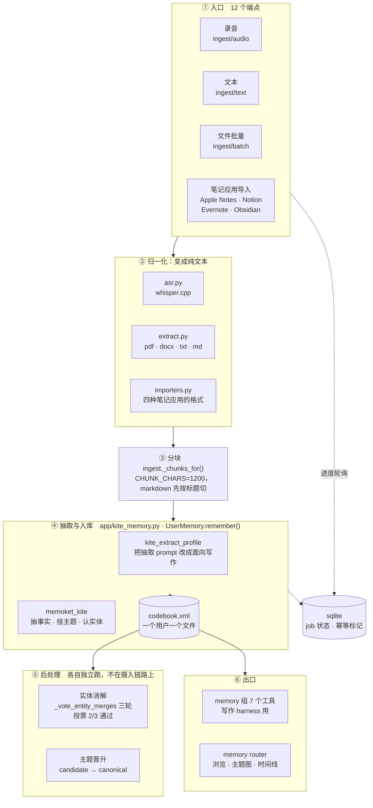
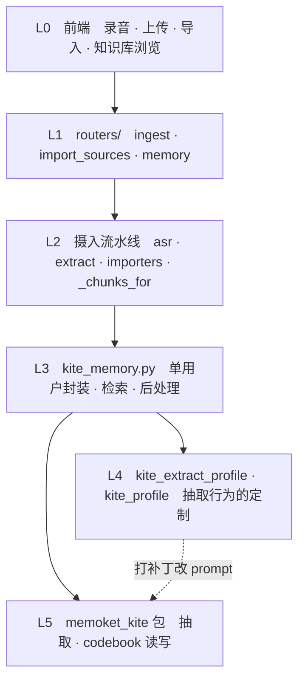

# 知识库构建：架构

> 写作 harness 的架构见 [harness-framework.md](harness-framework.md)。
> 实测数据和待处理的问题见 [`_research/kb-findings.md`](_research/kb-findings.md)。

知识库是这个产品的地基——写作 harness 的每一条事实、每一次溯源都来自它。
这份文档梳理它现在长什么样、边界在哪、该长成什么样。

---

## 1. 一页纸



**六段，每段的职责边界是清楚的**：入口只管收、归一化只管转文本、分块只管切、
抽取只管调 KITE、后处理不在摄入路径上、出口只管读。

---

## 2. 跟 KITE 的边界

`memoket_kite` 是一个独立的 PyPI 包（跟 `writer_harness` 一样的定位）。
我们**只调它两个方法**：

```python
memory.remember(messages, session_id=..., date=..., title=..., profile=...)  # 写
memory.answer_with_evidence(question, limit=...)                            # 问答
```

其余全是我们自己在 `kite_memory.py`（798 行）里基于 codebook 做的：
检索、分页、时间线、主题图、实体消解、词表匹配。

| 谁负责 | 什么 |
|---|---|
| **KITE 包** | 抽事实（一次 LLM 调用）· 挂主题 · 认实体 · codebook 的读写格式 |
| **`kite_memory.py`** | 单用户封装 · 缓存 · 词法检索 · 多跳 · 分页 · 时间线 · 实体消解投票 |
| **`kite_extract_profile.py`** | **改 KITE 自带的抽取 prompt**——把「面向问答的原子事实」改成「面向写作的自足事实」 |
| **`kite_profile.py`** | 写作场景的 profile 定义 |

`kite_extract_profile` 是这套系统里最微妙的一块：它用打补丁的方式修改包内置的
prompt（锚点匹配 + 替换），**包升级会失效**。它现在改了三条规则，其中
「topics 要更具体」那条正是 P1 的来源（见 `_research/kb-findings.md`）。

---

## 3. 分层



L4 那条虚线是这里唯一不干净的依赖——**它靠字符串锚点改 L5 内部的 prompt**。
干净的做法是 KITE 把 prompt 做成可注入的（就像 `writer_harness` 的
`dimensions` 是参数），那样 L4 就变成传一个配置进去，而不是打补丁。

---

## 4. 一次摄入实际发生什么

```
POST /api/ingest/audio  （或 text / batch / import）
  ↓ 立刻返回 job_id，后台跑（BackgroundTasks）
  ├─ asr.transcribe()                      音频 → 文本
  ├─ _chunks_for(text, kind)               切成 ~1200 字的块
  └─ for chunk in chunks:                  ← 每块一次 LLM 调用，约 13s
        UserMemory.remember(chunk, session_id=f"{source_id}#{i}")
        store.set_job(job_id, "running", facts=total)   ← 每块落一次，前端能看到涨
     store.set_job(job_id, "done")
```

**三个已经做对的设计**（不要在重构时弄丢）：

| 设计 | 为什么 |
|---|---|
| **`session_id` 用稳定的 `source_id` 拼** | KITE 拒绝重复 session_id **且不花 LLM 调用**——于是重跑导入自动变成增量同步 |
| **每块落一次 job 状态** | 一次摄入几分钟，前端要能看到 facts 数逐块往上涨，而不是最后一次跳到终值 |
| **后台任务的异常必须落库** | 不落的话前端只看到永远 `running` |

---

## 5. 出口：写作 harness 怎么用它

| 出口 | 谁用 | 是什么 |
|---|---|---|
| `memory` 组 7 个工具 | 写作 harness 的 agent | `search_memory` · `list_topics` · `list_entities` · `filter_facts` · `facts_in_range` · `fact_sources` · `search_session_context` |
| `memory` router | 前端 `MemoryBrowser` · `KnowledgeGraph` · 时间线 | 浏览、统计、主题图 |
| `UserMemory.recall()` | 预装配检索（零 LLM 的退路） | 词法匹配，工具循环失败时兜底 |

**`fact_sources` 是溯源的关键**——写作 harness 的 `TapProvenance` 靠它把
「这段话依据哪条事实、那条事实来自哪次会议的哪几行」串起来。
**任何重构都不能弄丢这条链路**。

---

## 6. 可视化：知识库怎么看

`MemoryBrowser`（436 行）是入口，四个 tab：

| tab | 画什么 | 数据来源 |
|---|---|---|
| **overview** | 统计 + 力导向图 | `stats` · `topics` · `entities` · `topic-entity-links` |
| **topics** | 主题树，按层级折叠 | `topics`（`parents` 字段拼出层级） |
| **timeline** | 按日期的 unit / fact 数 | `timeline()` 服务端聚合 |
| **facts** | 事实分页 + 溯源 | `facts` · `facts/{id}/sources` |

### 6.1 力导向图：一张图画两种节点

`KnowledgeGraph.tsx`（713 行，d3-force）把**主题和实体画在同一张图里**：

| 元素 | 画法 | 是什么关系 |
|---|---|---|
| 主题 | 圆 | — |
| 实体 | 方 | — |
| 主题 → 主题 | 实线带箭头 | 层级（`parents`，**存储的**） |
| 实体 → 实体 | 实线带箭头，另一色 | `Entity.rels`（**存储的**） |
| 主题 ⋯ 实体 | 虚线无箭头 | **共现**（派生的，服务端 `topic_entity_links()` 聚合） |

第三种边是这张图的要害：**KITE 的数据模型里主题和实体没有任何直接关联**——
每条 fact 各自带 `topics` 和 `entities` 两个数组，唯一的真实关系就是
「它们总在同一批事实上一起出现」。所以那条边是虚线且无箭头：它是对称的
「一起出现过」，不是方向性的。**画成实线箭头会是在暗示一个数据里不存在的关系。**

交互上刻意不做「点击即跳走」：hover 出详情卡（零网络调用，数据组件手里都有），
只有卡片上的「查看详情」才真的跳转。

### 6.2 已经踩过的坑：真实数据量

> 「一进入就卡死」——真实库有约 2200 个主题+实体，把这么多 `<g>`/`<line>`
> 挂上 DOM、每个都绑 d3-drag、再跑几十次仿真 tick（每次都碰所有节点和边的
> DOM 属性），全是同步阻塞主线程的活。
> **当初调优用的 305 节点压测没抓到——因为它没试过高一个数量级。**

现在的做法：

- `MAX_RENDERED_NODES = 400`，**按事实数取 top**
- `densityScale`：节点越多画得越小，用 `sqrt` 不用线性（线性会缩成看不见的灰）
- **搜索在进入这个组件之前过滤**，所以搜索命中永远不会被上限截掉

### 6.3 可视化的问题跟知识库是同一个

| 问题 | 表现 |
|---|---|
| **只能看到 1/3** | 1220 个实体里只渲染事实数最多的 400 个——用户看到的是「最热的那部分」，不是全貌 |
| **没有聚合视图** | 只有「全部节点（截断）」和「搜索出来的几个」两档，中间没有「按簇看」 |
| **主题碎片化直接反映在图上** | 200 个主题里一半 ≤10 条事实 ⇒ 图上一堆几乎没有边的孤立小圆点 |

**这三条跟第 8.2 节要解决的是同一件事——缺一层聚合。**
主题簇既是写作要的（单簇材料够写一段），也是可视化要的（400 个簇比 1346 个
节点画得下）。**同一个机制解决两个领域的问题，这是它值得做的信号。**

### 6.4 目标：聚合视图作为默认，全量图作为下钻

```
现在：  全量图（截断到 400）  ⇄  搜索结果（几个节点）
目标：  簇视图（默认，几十个簇）→ 点开一个簇 → 簇内全量图 → 单节点详情
```

时间线也该跟着分层——现在是按天聚合 unit/fact 数，
簇视图下应该能看「这个簇的材料是什么时候产生的」。

**不需要新的图算法**：主题已有 `parents` 层级，簇的确定性版本就是
「把 ≤N 条事实的兄弟主题合成一簇」（第 8.2 节）。可视化直接消费这个结果，
不用自己再算一遍。

---

## 7. 现状的问题（清单，详见 `_research/kb-findings.md`）

| # | 问题 | 有数据吗 | 影响 |
|---|---|---|---|
| **P1** | 主题碎片化——写作库 52% 的主题事实数 ≤10，中位数 10（原始库 28） | ✓ 实测 | 直接导致写作 harness 的 `non_repetition` 长期垫底 |
| **P2** | 写作库只覆盖 8% 的材料，时间停在 3/12 | ✓ 实测 | 材料不够 |
| **P3** | 126 个主题里 120 个是 `candidate` 态 | ✓ 实测 | 主题体系没收敛 |
| **P4** | 分块是固定 1200 字符，无语义边界 | ✓ 但**不一定是问题** | 2026 多个 benchmark 显示固定分块反而胜过语义分块 |
| **P5** | **抽取质量没有任何判据** | — | 跟写作 harness 早期一模一样的处境 |

---

## 8. 目标架构

### 8.1 一条原则：摄入也是「产出 → 判 → 改」

P5 是最有架构意义的一条。抽取的产出是一批事实，而**事实好不好是可判的**：

| 判据 | 谁判 | 例子 |
|---|---|---|
| 自足性 | 模型 | 「他说这个方案不行」——「他」是谁？脱离上下文读不懂 |
| 无重复 | **代码** | 同一件事在两个 chunk 里被抽了两遍 |
| 主题合理 | 模型 | 挂到了一个只有 1 条事实的新主题上，而已有主题更合适 |
| 没有编造 | **代码** | 事实里的数字/日期在原文里找不到 |
| 粒度 | **代码** | 一条事实里塞了三件事（分号/换行计数） |

这跟写作 harness 是**同一套机制**：`Dimension`（模型判）+ `Check`（代码判）
+ 不合格就重来。`writer_harness` 包的 `evaluate()` 本来就是「维度可插拔」的——
换一组维度就是换一个领域，这是它当初设计成包的全部理由。

```python
EXTRACT = Mode(
    key="extract", label="抽取事实",
    task="把这段内容抽成面向写作的自足事实…",
    dims=(self_contained, topic_fit, no_fabrication),
    checks=(no_duplicate_facts, atomic_enough, numbers_in_source),
    max_rounds=2,          # 抽取比写作便宜，但也别无限重试
)
```

**但要先算账**：一次摄入 2429 个 chunk × 13s ≈ 9 小时。加一轮判据就翻倍。
所以判据必须**先跑代码的那几条**（零成本），只有代码判不了的才上模型——
跟第 8 节「判据尽量往早了放」是同一条原则。

### 8.2 主题粒度：加一层，不要调细粒度

P1 的诱惑是「把 `_STRONGER_TOPICS_RULE` 调回去」，但那会牺牲检索精度——
**细粒度对问答有利、对写作有害，这是个真实的权衡，不是 bug**。

GraphRAG 的解法值得抄：**实体保持细粒度，另外用社区检测建一层聚合**
（Leiden 算法递归分层，每个社区一份 LLM 摘要）。

映射到我们：

```
现在：  事实 → 主题（200 个，一半 ≤10 条事实）
目标：  事实 → 主题（细，检索用）→ 主题簇（粗，写作用）
```

写作 harness 检索时按「簇」取材料，问答按「主题」取。**同一份数据两种视图，
不是二选一。**

实现上不需要引入图数据库：主题已经有 `parents` 字段（层级），
缺的是**按事实密度自动聚合**的那一步——把 ≤N 条事实的兄弟主题合成一簇。
这是纯规则，可以先做一个确定性版本，不急着上 Leiden。

### 8.3 抽取 prompt 的定制方式要换

`kite_extract_profile` 现在靠字符串锚点给 KITE 的内置 prompt 打补丁，
**包一升级就失效**，而且改了什么、为什么改，散在三个 patch 里。

目标：KITE 把抽取 prompt 做成**可注入的配置**（`profile=` 参数已经有了，
把 prompt 规则也纳进去），我们这边就变成「传一份写作侧的抽取配置」，
跟 `writer_harness` 传 `dimensions` 是同一个模式。

**这是要给 KITE 提的需求，不是我们这边能单方面解决的。**

### 8.4 摄入要能续跑

P2 的根因是 `reextract.py` 是「跑一批停下来看」的渐进式脚本，跑到 200 就没继续。
这本身是对的（当时要评估效果），但**没有一个「把剩下的补齐」的常规入口**。

目标：摄入 job 支持**断点续跑**——
`session_id` 的幂等已经具备（重复的直接跳过且不花 LLM 调用），
缺的只是一个「扫一遍源、找出没抽过的、接着抽」的端点。

### 8.5 明确不做的

- **不换分块策略**：P4 有 2026 的 benchmark 反对（固定分块胜过语义分块），
  除非有端到端指标支持，否则不动
- **不引入图数据库**：主题已有层级字段，聚合可以先做确定性版本
- **不动 codebook 格式**：那是 KITE 包的事，我们只是使用者
- **不为了统一把摄入塞进写作 harness 的循环**：它们共用 `evaluate()` 和判据
  机制，但摄入是批处理（2429 个 chunk）、写作是交互式（一次一篇），
  调度需求完全不同

---

## 9. 落地顺序

| 步 | 做什么 | 依据 | 风险 |
|---|---|---|---|
| **1** | 摄入续跑端点，把写作库补齐到全量 | P2，且它是 P1 之外影响最大的 | 低——幂等已具备 |
| **2** | 补齐后重测写作 harness 的 `non_repetition` | 验证 P1/P2 到底哪个是主因 | 无 |
| **3** | 主题簇（确定性版本）：≤N 条事实的兄弟主题合成一簇 | P1 | 中 |
| **4** | 抽取判据：**先上代码判的三条**（重复 · 粒度 · 数字有出处） | P5，零成本 | 低 |
| **5** | 抽取判据：模型判的（自足性 · 主题合理） | P5 | 中——成本翻倍，要先算账 |
| **6** | 可视化改成「簇视图默认 + 下钻」（复用第 3 步的簇） | 6.4 | 低——数据是现成的 |
| **7** | 给 KITE 提 prompt 可注入的需求 | 8.3 | 外部依赖 |

**第 1、2 步必须先做**：P1 和 P2 现在纠缠在一起（写作库既碎又少），
补齐材料之后才能判断主题粒度到底是不是主因。
