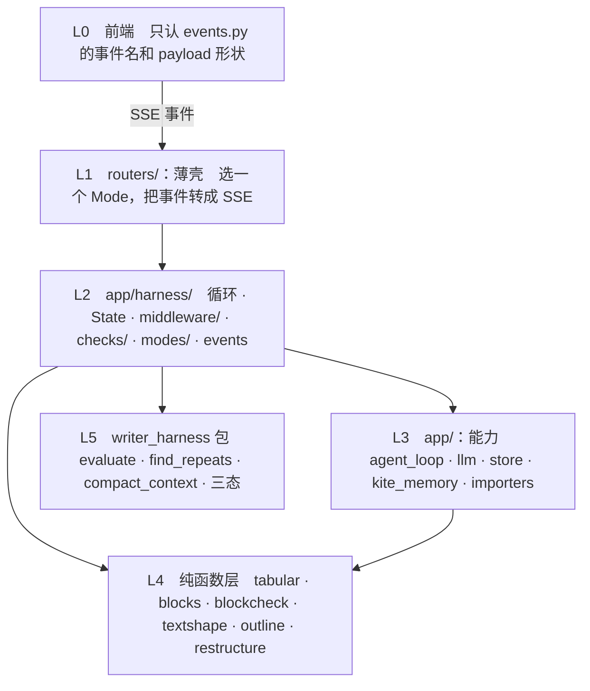

# 框架梳理：harness 循环该被抽成一等公民

> 架构评审 · 2026-09-08 · 只出方案，不动代码
> 依据全部来自实扫，不是印象：54 个模块的 import 图、三条 harness 的步骤矩阵、
> 23 个 SSE 事件名、53 个 pydantic 模型

## 一句话结论

**结构上**：`writer_harness` 抽走的只是「打分」这一个步骤，循环本身
（取材料 → 生成 → 判 → 三态 → 反馈）从来没有被抽象过，被三个 router
各抄了一遍。第 1–3 节是证据。

**效果上**：闭环有没有用，**三条 harness 方向相反**——`compose_block`
每多跑一轮平均涨 0.222，`note_harness` 基本持平，`writing_plan` 每轮掉 0.278
（而它正是有「材料每轮清零」bug 的那条）。第 4 节是数据，
以及一个「混着算三条数据得出错误结论」的教训。

方案照搬 12 个框架的成熟做法（第 5 节），**没有一个自造概念**；目标架构在
第 6 节。**当前最高优先级不是重构，是修 `writing_plan` 那个 bug 然后重测**——
它是目前唯一有数据支持的质量问题。

---

## 1. 证据：循环被抄了三遍

三个巨型异步生成器，做的是同一件事的不同子集：

| | note_harness | writing_plan | compose_block |
|---|---|---|---|
| 生成器函数行数 | **555** | 245 | 156 |
| 取材料 / 工具 | ✓ | ✓ | ✓ |
| 生成（流式） | ✓ | ✓ | ✓ |
| 打分 `evaluate()` | ✓ | ✓ | ✓ |
| 三态分支 | ✓ | ✓ | ✓ |
| 最弱维 → 下一轮 | ✓ | ✓ | ✓ |
| 确定性兜底 | ✓ | ✓ | ✓ |
| 机械查重 `find_repeats` | ✓ | ✓ | **✗** |
| 上下文压缩 `compact_context` | ✓ | ✗ | ✗ |
| 清理 / 编辑 pass | ✓ | ✓ | ✗ |
| 策略控制器 `runtime_policy` | ✓ | ✗ | ✗ |
| 骨架重规划 `replan` | ✓ | ✗ | ✗ |

后三行是 note_harness 真正独有的能力，缺席是合理的。**前面那些不是**——
`compose_block` 没有机械查重不是设计决定，是抄的时候没抄到。

### 最硬的一条证据：同一个 bug 修了两遍

- [note_harness.py:599](../backend/app/routers/note_harness.py#L599)
  「round_facts 每轮重置，而正文是累积的」——修过一次。
- [compose_block.py:303](../backend/app/routers/compose_block.py#L303)
  「产出是累积的，材料却每轮清零」——**又犯一次，又修一次**。注释里写着
  「跟写作 harness 里…是同一类 bug」。

写下这句注释的时候就该意识到：能被写成「同一类」的东西，说明它本来该只有一份。
下一条 harness 还会再犯第三次。

---

## 2. 证据：确定性检查有两种互不相容的范式

同样是「代码判定出的缺陷」，两条路走法完全相反：

| | 做法 | 用户看得到吗 | 在哪 |
|---|---|---|---|
| `compose_block` | 判定 → **把那一维打回 0** → 强制重跑一轮 | 看得到（evaluate 事件里带原因） | [compose_block.py:422](../backend/app/routers/compose_block.py#L422) |
| `note_harness` | 判定 → **直接改 content** | 看不到 | [note_harness.py:891](../backend/app/routers/note_harness.py#L891) |
| `writing_plan` | 同上 | 看不到 | [writing_plan.py:483](../backend/app/routers/writing_plan.py#L483) |

`grounding_check.scrub_meta_sentences()` 是静默改写：它删掉模型写的审计腔句子，
用户不知道发生过这件事，也没法说「这句我要留着」。而同一个系统里 `blockcheck`
走的是完全另一条路——判定不合格，让模型自己重写，全程可追溯。

**两种范式没有优劣之分，但一个系统里只能有一种。** 现在是哪条 harness 先写的
就用哪种。

---

## 3. 其余五个结构问题

| # | 问题 | 实测 | 后果 |
|---|---|---|---|
| 3 | **评分维度定义分两处、形态不同** | `harness_adapter.py` 8 个（函数返回）· `compose_block.py` 23 个（MODES 字典内联） | 加一个维度要先想清楚"我这条 harness 的维度住在哪" |
| 4 | **SSE 事件契约 23 个名字，大量同义** | `round-start`/`section-start`、`done`/`plan-done`/`section-done` | 前端 `api.ts` 878 行专门消化这套契约；加一条 harness 就要再加一组名字 |
| 5 | **依赖方向有一条是反的** | `store.py` → `prompts.py`（因为 `DEFAULT_SKILLS` 住在 prompts 里） | 数据层依赖文案层。改一句 prompt 文案要考虑会不会影响建表种子数据 |
| 6 | **router 之间互相 import** | `compose_block` → `compose._profile` · `note_harness._sse` | 只有两个小函数，但方向已经乱了——router 应该都依赖下层，不该互相依赖 |
| 7 | **`prompts.py` 1328 行是个混合体** | system 常量 + user 构造函数 + `DIM_SHORT` 映射 + `SKILL_SCOPES` + `DEFAULT_SKILLS` + 文档渲染 | 它同时是"文案"和"配置"和"渲染层" |

`schemas.py` 53 个模型、`content` 字段在 13 个模型里重复——**这条不算问题**，
不要动。它是 HTTP API 的表面，合并公共基类会让接口契约变得要跳转才能读懂，
而收益只是少写几行。

---

## 4. 实证：多跑一轮到底有没有用——三条 harness 方向相反

前三节讲代码结构乱。这一节问一个更要紧的问题：**这套闭环有没有在提升质量。**

### 4.1 数据

`scripts/harness_stress_log.jsonl` 的 200 条旧记录（2026-09-02），
加上今天新跑的 8 次 `compose_block`：

| harness | 相邻轮次平均变化 | 上升/下降 | 最后一轮不是最高分 | 样本 |
|---|---|---|---|---|
| **compose_block** | **+0.222** | 7 / 1 | 1/8（12%） | 今天，8 次 run |
| **note_harness** | −0.042 | 3 / 5 | 2/4（50%） | 旧，4 次 run |
| **writing_plan** | **−0.278** | **0 / 3** | 3/4（75%） | 旧，4 次多轮 run |

逐轮均分：

- `compose_block`：1.714 → **1.982**
- `note_harness`：1.67 → 1.69 → 1.70 → 1.65 → 1.50
- `writing_plan`：1.78 → **1.50 → 1.33**

### 4.2 三条结论

1. **`compose_block` 的闭环是有效的**（+0.222，8 次里 7 次上升）。
   best-of 在它身上只能挽回 +0.018——**对这条 harness，best-of 是可有可无的**。
2. **`note_harness` 基本持平**（−0.042，12 对样本，在噪声范围内）。不能下结论，
   要更多数据。
3. **`writing_plan` 明显退化**（−0.278，6 对里 0 次上升）。而它**正是那条有
   「材料每轮清零」bug 的 harness**（见第 1 节）——打分器拿本轮材料去审判
   累积的正文，分数当然越跑越低。**数据和 bug 对上了。**

### 4.3 一个方法论教训，记在这里

我第一版把三条 harness 的数据**混着算**，得出「多跑一轮平均掉 0.12、
62% 的 run 最后一轮不是最高分、闭环基本没在起作用」——听起来很有分量，
**但那个结论对三条里的任何一条都不成立**。

这是同一类错误的第五次（前四次记在第 8 节）。这次是在动机制之前抓住的，
靠的是分组重算 + 补一批新数据。**规矩再加一条：聚合之前先问「这些数据是同一
个东西吗」。**

### 4.4 顺着数据往下挖，以及一个没成功的修复

**掉的是哪一维**：旧数据里 `writing_plan` 逐轮
`non_repetition` 2.00 → 1.25 → 1.00，`topic_fidelity` 2.00 → 2.00 → 1.50，
而 `factual_grounding` 基本持平（1.33 → 1.25 → 1.50）。
**掉的是「重复」不是「事实」**——症状是材料不够、同一批事实反复说。

**机制差异对上了**：`note_harness` 有两条「材料用完就停」的防线
（`dry_rounds >= 2` 和 `material_exhausted()`），**`writing_plan` 一条都没有**。
这是「同一个能力一条 harness 有、另一条没有」的第四次
（前三次：`find_repeats`、`compact_context`、`record_harness_run`）。

**于是做了两件事**：

1. 修 `writing_plan` 的材料每轮清零（按 section 分开累积——分段写作里
   A 段的材料拿去审判 B 段是另一个方向的同一个错误），
   并加 `tests/test_facts_accumulate.py`：用 `ast` 检查「传给打分的材料变量
   初始化在不在循环体内」，反向验证过（回退修复测试变红）。
2. 给 `writing_plan` 补上那两条停止条件，并加
   `tests/test_harness_parity.py` 盯住长循环 harness 的能力对等。

**第 2 件没成功，如实记下来**：实测 `material_used_up` **触发 0 次**。
所以那次重测里分数的改善（1.4 → 2.0、1.6 → 1.8 → 1.8）**不能归因给它**，
是波动。判据太严了——`dry_rounds` 要求「连着两轮零新事实」，而实测每轮都能
检索回**字面不同、语义相同**的新事实条目，所以计数器永远归零。
（这条在 `note_harness` 上早有记录：20 轮只触发 1 次。我照搬了一个已知低效的
机制，只是这次先测了触发率才没把功劳记给它。）

**这指向一个更根本的判断**：`non_repetition` 掉的根因可能不在架构，在**材料**——
写作用的 `terrence-rewrite` 只有 1398 条事实，是原始 `terrence`（20361 条）的 7%。
一个主题就那么几条，写三轮只能重说。**如果是这样，任何循环层面的修补都是治标。**

**该验证的**：把知识库补全后重测同一批 goal。这比继续改循环更值得先做。

### 4.5 对优先级的影响

- **材料清零 bug 已修**（4.4），并用结构性测试焊死，防止第四次。
- **「材料用完就停」补上了但不触发**（4.4）——判据要重新设计，
  或者承认这条路走不通。
- **best-of 降级**：对 compose_block 收益 +0.018，对 note_harness 待测。
  仍然值得做（20 行、防最坏情况），但不是紧急的。
- **`Repair` 定点修复（6.4）的理由减弱了**：它是为「整轮重来毁掉好东西」
  设计的，而这个现象目前只在 writing_plan 上明显，且可能是 bug 导致而非机制导致。
  **先修 bug 重测，再决定要不要做。**
- **该补的数据**：note_harness 的样本太少（4 次 run），要跑一批新的。

---

## 5. 调研：12 个框架怎么做的

完整笔记在 [`_research/harness-survey.md`](_research/harness-survey.md)。
每个框架问同样六个问题：循环写死还是可配置、扩展点能不能改流程、状态怎么组织、
能力怎么打包、必需能力怎么防漏、有没有质量闭环。

### 5.1 十条横向结论

| # | 结论 | 谁这么做 | 我们现状 |
|---|---|---|---|
| 1 | **循环写死，不可配置** | 全部 12 个，无一例外 | 三份手抄的循环 |
| 2 | **观察型和干预型扩展点分开** | OpenAI（hooks 只读 / guardrails 可拦）、LangChain（lifecycle / wrap） | 混在一起 |
| 3 | **能力打包成 middleware，自带状态字段和工具** | LangChain 1.0、deepagents | 散在循环里 |
| 4 | **停止条件是可组合的一等公民** | Vercel AI SDK `stopWhen` | 5 种停法散在循环里 |
| 5 | **best-of：留最好的一次，不是最后一次** | DSPy `Refine` | 无 |
| 6 | **便宜的判据先跑，贵的后跑** | PydanticAI 两阶段验证 | **反了** |
| 7 | **管约束的和做决策的分层** | OpenHands Controller / Agent / Runtime | 混在一起 |
| 8 | **必需能力由框架拒绝移除** | deepagents 拒绝 `excluded_middleware` 掉文件系统 | 靠人记得接 |
| 9 | **每步前可改配置** | AI SDK `prepareStep` | 有（`runtime_policy`），只一条 harness 用 |
| 10 | **失败要有退路** | DSPy `fail_count` | 有（退回关键词检索），只两条用 |

### 5.2 LangChain 1.0 AgentMiddleware —— 最匹配的模式

```python
class AgentMiddleware(Generic[StateT, ContextT, ResponseT]):
    state_schema: type[StateT]     # 自己声明要什么状态字段
    tools: Sequence[BaseTool]      # 能力和它要的工具打包在一起

    # 生命周期：返回 dict 更新状态 / None 不变 / Command 流程控制（jump_to）
    def before_agent(self, state, runtime) -> dict | None
    def before_model(self, state, runtime) -> dict | None
    def after_model(self, state, runtime) -> dict | None
    def after_agent(self, state, runtime) -> dict | None

    # 拦截：可多次调 handler（重试）、跳过（短路）、改请求改响应
    def wrap_model_call(self, request, handler) -> ModelResponse
    def wrap_tool_call(self, request, handler) -> ToolMessage | Command
```

顺序规则照抄：`before_*` 正序、`after_*` **逆序**、`wrap_*` 第一个包住其余；
非 reducer 字段冲突时**外层胜**；**wrap 重试时早先 handler 产生的更新被丢弃**。

### 5.3 Vercel AI SDK —— 停止条件可组合

```typescript
stopWhen?: StopCondition | StopCondition[]      // 数组 = OR
// 内置 isStepCount(n) · hasToolCall(...) · isLoopFinished()
const custom: StopCondition = ({ steps }) => boolean    // 纯函数、只读
```

### 5.4 DSPy Refine —— 质量闭环的标准实现

`best_reward` 全程跟踪、`threshold` 早停、不达标时 `OfferFeedback` 生成 advice
注入下一次的 `hint_`、`fail_count` 容错。**判据是单个 float + 阈值**——
换来「可比较、能取最好的一次」，代价是缺陷没有名字。

### 5.5 PydanticAI —— 两阶段验证

Pydantic 语法验证（零成本）→ `output_validator` 语义验证（要 I/O），
任一失败都 `ModelRetry(msg)`，msg 回给模型。**便宜的先跑。**

### 5.6 writing-harness —— 唯一的写作专用 harness

骨架 `Baseline → Architecture → Modules → CTA → Draft → Sensors → Rollback`：

- **Sensors** = 机械质量检查：写作 lint（套话、弱开头弱结尾）、K/P/A 校验、
  体裁契约、**失败分类法**（`generic_abstraction`、`overexplained`、
  `false_balance`——给缺陷起名字）
- **Rollback by failed dimension**：K 失败只回 M-01/M-02、P 失败只回 M-03、
  A 失败只回 M-04/M-05。**只重启失败的那一层，不盲目整体重来。**

### 5.7 LLM-as-judge —— 我们有个硬伤

公认结论：**self-preference bias**，judge 给自己模型家族的输出打分会虚高，
明确建议「never use the same model family as both generator and judge」。
**我们正是这样**：`muse-glimmer-30b` 既写又判。其它已知偏差：position、
verbosity（奖励长答案）。

标准缓解按成本排：① **把 rubric 拆成离散检查**（我们做确定性检查的方向被验证了）
② 换个模型打分（我们有 `gpt-5.6-luna`，打分只占一次调用）
③ pairwise 双向比较代替打分。

**第 ② 条值得单独做一次 A/B**：同一批产出，本地模型打分 vs 换模型打分，
看分歧多大——分歧大就说明 self-preference 确实在起作用。

---

## 6. 目标架构

全部照搬调研里的成熟模式，**没有一个自造概念**。

### 6.1 循环：写死，三步

12 个框架无一例外，循环都是写死的。我之前几版试图做「可配置的步骤列表」，
是在给自己造麻烦。

```python
for round in 1..max_rounds:
    prepare()   # 取材料
    produce()   # 生成：改已有的 + 写新的
    judge()     # 判断：便宜的先跑（checks）→ 贵的后跑（evaluate）
    if reason := first_match(mode.stop_when, state): break
```

钩子点：`before_run`/`after_run` · `before_round`/`after_round` ·
`wrap_prepare`/`wrap_produce`/`wrap_judge`。

### 6.2 七个概念，每个都有出处

| 概念 | 干什么 | 出处 |
|---|---|---|
| `Middleware` | 能力包：钩子实现 + 自带状态字段 | LangChain 1.0 |
| `StopCondition` | 可组合的停止条件，纯函数只读 | Vercel AI SDK `stopWhen` |
| `Check` | 代码判的判据 | PydanticAI validator · smolagents `final_answer_checks` |
| `Dimension` | 模型判的判据 | 我们已有（`writer_harness`） |
| `Verdict.fix` | 能直接改的直接改 | linter 的 auto-fix |
| `Repair` | 失败时定点重做，别整轮重来 | writing-harness rollback |
| `State` | 一次 run 的数据 | 全部框架 |

### 6.3 判据尽量往早了放

同一个缺陷越早拦越省。我们其实已经在三个位置都拦过，但没当成原则：

| 位置 | 谁拦 | 成本 | 真实例子 |
|---|---|---|---|
| **工具层**（最早） | 工具拒绝产出坏东西 | 零 | `chart_from_text` 拒绝混量纲 `[10 倍, 576 台]`、拒绝单值图 |
| **检查层** | 产出后代码判定 | 零 | `blockcheck` 抓假图、手写 mermaid、标题层级 |
| **打分层**（最晚） | 模型判定 | 一次 LLM 调用 | `has_charts` · `honest_caveats` |

**现在的顺序反着**：先打分再跑确定性检查，检查命中那次打分就白花了。

### 6.4 失败了怎么修：三档

这是针对「整轮重来会毁掉已经好的部分」的正面解法。**但按 4.4，这个现象目前
只在 `writing_plan` 上明显，而那条有 bug——先修 bug 重测，再决定这一档要不要做。**

| 档 | 怎么修 | 成本 | 例子 |
|---|---|---|---|
| **auto-fix** | 代码直接改 | 零 | 标题层级过浅 → 整体下沉；收尾节跟后文撞车 → 删掉 |
| **定点重做** | 只重跑一个步骤 | 一次调用 | 没画图 → 只跑画图那步，文字不动 |
| **整轮重来** | 现状，兜底 | 全轮 | 跑题、结论重复这类结构性问题 |

```python
@dataclass(frozen=True)
class Verdict:
    dimension: str
    message: str                        # 给模型看的话
    fix: Callable[[str], str] | None    # 能直接改就给一个纯函数

Dimension(name="has_charts", ..., on_fail=Repair.step("draw_charts"))
Dimension(name="coherence",  ..., on_fail=Repair.FULL_ROUND)
```

**auto-fix 做过实证，边界比想象的窄**：拿真实失败样本跑，标题层级能修好
（正文一个字没动），但「4 个小标题太碎」修不了——删哪个是语义判断。
**判据是「修法唯一且不需要语义判断」。** 而且 auto-fix 之后要重跑检查，
剩下的问题再走定点或整轮。

### 6.5 自查：能不能表达三条 harness 的全部真实行为

拿实扫得到的 15 条真实行为逐条对：

| # | 真实行为 | 怎么表达 |
|---|---|---|
| 1 | edit pass（生成前先改一遍已有正文） | `before_produce` middleware——跟 LangChain 的 Summarization 同类 |
| 2 | cleanup | 另一个 `before_produce` middleware |
| 3 | 取材料三种方式 + 工具失败退回关键词检索 | `wrap_prepare`：调 handler，失败走退路 |
| 4 | `compact_context` | `before_produce` middleware（就是 Summarization） |
| 5 | 往后写 | `produce` |
| 6 | dedupe + scrub_meta | `after_produce` middleware |
| 7 | 两次落盘 | `after_produce` / `after_round` middleware |
| 8 | 打分 | `judge` |
| 9 | `runtime_policy` 调下一轮参数 | `after_round` middleware（= `prepareStep`） |
| 10 | **writing_plan 一上来先打分决定这节还写不写** | **`StopCondition`**，不是「一轮里的一步」 |
| 11 | **compose_block 取材料后没图就再调一轮画图** | **`wrap_prepare`**，多次调 handler 正是它的标准用法 |
| 12 | best-of | 循环层写死 |
| 13 | 材料累积 + 压缩 | middleware + 自带状态字段 |
| 14 | `find_repeats` | `before_judge` middleware，产出 dup_hints |
| 15 | run 历史 | `after_run` middleware |

**15/15 都能表达。** 第 10、11 是关键验证——它们是我前几版设计里怎么都别扭的
地方（「先打分是第一个步骤？」「画图补一轮写在循环里？」），套上标准模式之后
自然了。**这说明模式选对了。**

再拿本次会话实测到的 10 个真实失败对第 6.4 的三档：

| 真实失败 | 归档 |
|---|---|
| 8 个 `###` 塞在 `##` 下面 | auto-fix（实证可行） |
| 自带收尾节跟后文 `## 下一步计划` 撞 | auto-fix（实证可行） |
| 通篇没图 · 主角没进图 · 没说样本量 · 假图 · 手写 mermaid | 定点（5 个） |
| 混量纲 · 单值图 | 工具层已拦 |
| 跑题 / 结论重复 | 整轮 |

**10 个里 2 个能 auto-fix、5 个能定点、2 个在工具层就拦住，只有 1 个真需要
整轮重来。现在这 10 个全部走整轮重来。**

### 6.6 消歧规则

防止「两个地方都能放」：

- **改内容的 → produce 侧**（`before`/`after_produce`）；**只读的 → judge 侧**
- **决定还跑不跑 → `StopCondition`**，不是 middleware
- **重试 / 多次调用 / 改请求 → `wrap_`**，不是 `before`/`after`
- **一次 run 只做一次 → `before_run`/`after_run`**

### 6.7 分层与依赖规则



四条规则写成 `tests/test_layering.py`，用 `ast` 扫 import：

1. **L4 只 import 标准库** —— 现在成立，焊死
2. **L5 不 import `app`** —— 现在成立，这是包能开源的全部条件
3. **L1 之间不互相 import** —— 现在**不成立**：`compose_block` →
   `compose._profile`、`note_harness._sse`
4. **L3 不 import L1 / L2** —— 现在有一处反向：`store` → `prompts`

**没有测试焊死的话，三个月后会全部漂回去**——现有的四处违反就是这么来的，
每一处当时都有「就这一个小函数」的理由。

### 6.8 分步落地

优先级按第 4 节的数据排，不按「架构应该长什么样」排。

| 步 | 做什么 | 依据 | 风险 |
|---|---|---|---|
| **0a** | **修 `writing_plan` 材料每轮清零**，然后重测那三个指标 | 4.2 结论 3：唯一有数据支持的质量问题 | 很低，约 20 行 |
| **0b** | 补跑一批 `note_harness` 样本（现在只有 4 次 run） | 4.4：数据不够，不能下结论 | 无 |
| **0c** | 打分和确定性检查调换顺序（6.3） | 检查命中时省一次 LLM 调用 | 低 |
| **0d** | best-of（约 20 行） | 收益已测：compose_block +0.018。**防最坏情况，不紧急** | 很低 |
| **1** | `events.py`：23 个事件名归并，旧名留别名 | 第 3 节问题 4 | 低 |
| **2** | `middleware/`：现有能力一个个搬，搬一个测一个 | 第 1 节：轨道靠人接就会漏 | 中 |
| **3** | 循环 + `modes.py`：三个 router 改薄壳 | 第 1 节：循环抄了三遍 | 高 |
| **4** | `Repair` 三档（6.4） | **待定**——见 4.4，先做 0a 再决定 | 中 |

**0a 必须最先，而且它可能让第 4 步不必做**：如果 `writing_plan` 修完 bug
之后多轮变成正向，那「整轮重来毁掉好东西」就不是机制问题。

## 7. 明确不做的

- **不拆 `prompts.py`。** 1328 行但按用途分段清晰，拆成八个小文件之后，
  改一句话要先猜它在哪个文件里。它的问题是"混了配置和文案"，只需把
  `DEFAULT_SKILLS`、`SKILL_SCOPES`、`DIM_SHORT` 这三块配置搬走。
- **不合并 `schemas.py` 的 53 个模型。** 见第 3 节末尾。
- **不动 `writer_harness` 包。** 实扫确认它对 `app` 零依赖，边界是干净的——
  这次要修的全部在 app 侧。
- **不追求"三条 harness 完全一致"。** `runtime_policy` / `replan` /
  `compact_context` 是 note_harness 真正独有的，就让它们只出现在那条的
  middleware 列表里。共用的是循环和 middleware 库，不是列表本身。

---

## 8. 怎么验证改完没改坏

现有 351 个测试全部要过。除此之外这次特别需要的：

- **必需能力回归**：遍历所有 `Mode`，断言必需的 middleware 都在
  （查重、打分、跑检查、记 run 历史）。以前靠人读代码才发现
  「compose_block 漏了 find_repeats」，现在由测试发现。
- **消歧规则回归**：断言每个 `Check` 都是纯函数（不 import store/llm）、
  每个 `StopCondition` 无副作用——见 6.6。
- **事件契约测试**：`events.py` 里的名字集合 == 前端 `api.ts` 处理的集合。
  两边不一致就红。
- **soak 前后对比**：第 3、4 步动的是核心循环，必须跑 20 轮 soak，比较
  六维均分、`complete` 率，**以及第 4 节那三个指标**（分数随轮次、
  相邻轮次涨跌、最后一轮是不是最高分）。按已有教训——**先读两篇完整产出，
  再看表**。
