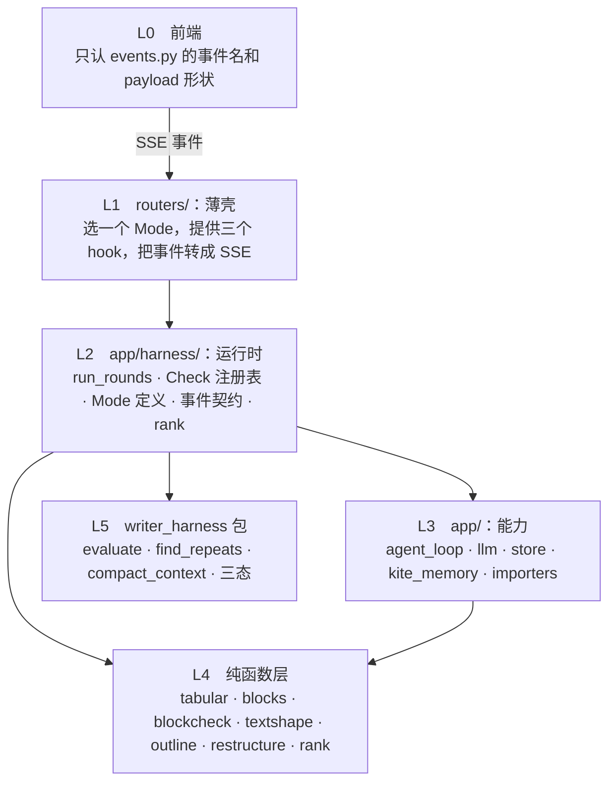
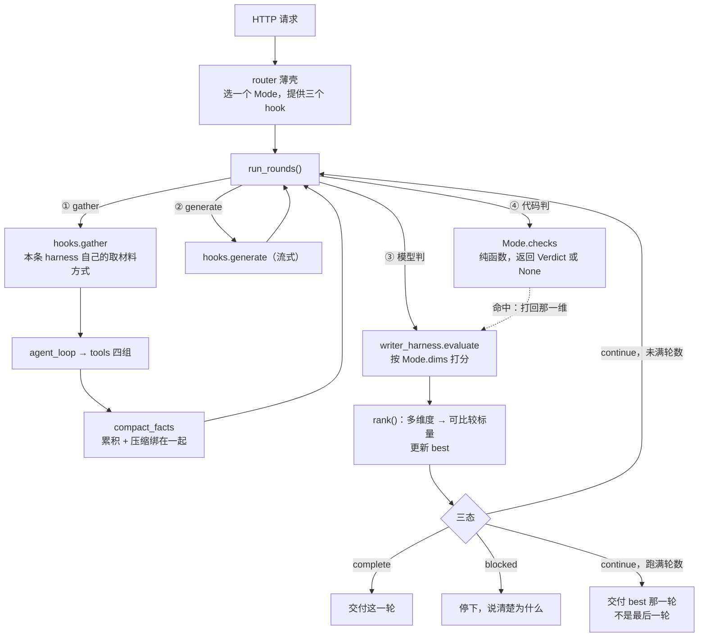

# 框架梳理：harness 循环该被抽成一等公民

> 架构评审 · 2026-09-08 · 只出方案，不动代码
> 依据全部来自实扫，不是印象：54 个模块的 import 图、三条 harness 的步骤矩阵、
> 23 个 SSE 事件名、53 个 pydantic 模型

## 一句话结论

`writer_harness` 抽走的是**打分这一个步骤**，而「取材料 → 生成 → 打分 → 三态 →
把最弱那一维喂回下一轮」这个**循环本身从来没有被抽象过**，被三个 router 各抄了
一遍。所有下面列的问题都是这一件事的推论。

---

## 1. 证据：循环被抄了三遍

三个巨型异步生成器，做的是同一件事的不同子集：

| | note_harness | writing_plan | compose_block |
|---|---|---|---|
| 生成器函数行数 | **555** | 245 | 156 |
| 取材料 / 工具 | ✓ | ✓ | ✓ |
| 生成（流式） | ✓ | ✓ | ✓ |
| 打分 `evaluate()` | ✓ | ✓ | ✓ |
| 三态分支 | ✓ | ✓ | ✓ |
| 最弱维 → 下一轮 | ✓ | ✓ | ✓ |
| 确定性兜底 | ✓ | ✓ | ✓ |
| 机械查重 `find_repeats` | ✓ | ✓ | **✗** |
| 上下文压缩 `compact_context` | ✓ | ✗ | ✗ |
| 清理 / 编辑 pass | ✓ | ✓ | ✗ |
| 策略控制器 `runtime_policy` | ✓ | ✗ | ✗ |
| 骨架重规划 `replan` | ✓ | ✗ | ✗ |

后三行是 note_harness 真正独有的能力，缺席是合理的。**前面那些不是**——
`compose_block` 没有机械查重不是设计决定，是抄的时候没抄到。

### 最硬的一条证据：同一个 bug 修了两遍

- [note_harness.py:599](../backend/app/routers/note_harness.py#L599)
  「round_facts 每轮重置，而正文是累积的」——修过一次。
- [compose_block.py:303](../backend/app/routers/compose_block.py#L303)
  「产出是累积的，材料却每轮清零」——**又犯一次，又修一次**。注释里写着
  「跟写作 harness 里…是同一类 bug」。

写下这句注释的时候就该意识到：能被写成「同一类」的东西，说明它本来该只有一份。
下一条 harness 还会再犯第三次。

---

## 2. 证据：确定性检查有两种互不相容的范式

同样是「代码判定出的缺陷」，两条路走法完全相反：

| | 做法 | 用户看得到吗 | 在哪 |
|---|---|---|---|
| `compose_block` | 判定 → **把那一维打回 0** → 强制重跑一轮 | 看得到（evaluate 事件里带原因） | [compose_block.py:422](../backend/app/routers/compose_block.py#L422) |
| `note_harness` | 判定 → **直接改 content** | 看不到 | [note_harness.py:891](../backend/app/routers/note_harness.py#L891) |
| `writing_plan` | 同上 | 看不到 | [writing_plan.py:483](../backend/app/routers/writing_plan.py#L483) |

`grounding_check.scrub_meta_sentences()` 是静默改写：它删掉模型写的审计腔句子，
用户不知道发生过这件事，也没法说「这句我要留着」。而同一个系统里 `blockcheck`
走的是完全另一条路——判定不合格，让模型自己重写，全程可追溯。

**两种范式没有优劣之分，但一个系统里只能有一种。** 现在是哪条 harness 先写的
就用哪种。

---

## 3. 其余五个结构问题

| # | 问题 | 实测 | 后果 |
|---|---|---|---|
| 3 | **评分维度定义分两处、形态不同** | `harness_adapter.py` 8 个（函数返回）· `compose_block.py` 23 个（MODES 字典内联） | 加一个维度要先想清楚"我这条 harness 的维度住在哪" |
| 4 | **SSE 事件契约 23 个名字，大量同义** | `round-start`/`section-start`、`done`/`plan-done`/`section-done` | 前端 `api.ts` 878 行专门消化这套契约；加一条 harness 就要再加一组名字 |
| 5 | **依赖方向有一条是反的** | `store.py` → `prompts.py`（因为 `DEFAULT_SKILLS` 住在 prompts 里） | 数据层依赖文案层。改一句 prompt 文案要考虑会不会影响建表种子数据 |
| 6 | **router 之间互相 import** | `compose_block` → `compose._profile` · `note_harness._sse` | 只有两个小函数，但方向已经乱了——router 应该都依赖下层，不该互相依赖 |
| 7 | **`prompts.py` 1328 行是个混合体** | system 常量 + user 构造函数 + `DIM_SHORT` 映射 + `SKILL_SCOPES` + `DEFAULT_SKILLS` + 文档渲染 | 它同时是"文案"和"配置"和"渲染层" |

`schemas.py` 53 个模型、`content` 字段在 13 个模型里重复——**这条不算问题**，
不要动。它是 HTTP API 的表面，合并公共基类会让接口契约变得要跳转才能读懂，
而收益只是少写几行。

---

## 4. 目标架构

### 4.1 三条原则

这套系统的本质是 **evaluator-optimizer**：产出由模型给，合格与否由判据说了算。
架构应该照着这个本质长，而不是照着"有几个 HTTP 端点"长。

**原则一：循环是唯一不变的，其余一切都是配置。**

「取材料 → 生成 → 判 → 三态 → 反馈 → 重来」这个骨架，四条 harness 是同一份；
不同的只有「取什么材料、生成什么、拿什么判」。所以循环必须只有一份实现，
差异全部表达成数据（`Mode`）和三个回调（`RoundHooks`），**不能表达成循环里的
`if`**。这条是硬约束：`run_rounds()` 里出现第一个 `if mode.name == ...`，
这次重构就白做了。

**原则二：判据分两半，边界按"能不能用代码判定"划。**

| | 谁判 | 形态 | 什么时候用 |
|---|---|---|---|
| 语义判据 | 模型 | `Dimension(name, guidance)` | 「这段跑题没有」「样本量小说了没有」 |
| 结构判据 | 代码 | `Check(ctx) -> Verdict \| None` | 「有没有 mermaid 代码块」「这个数在原文里带的是不是这个单位」 |

划分标准只有一条：**能写出确定性判据的，一律归代码。** 这不是洁癖——实测里
打分器给通篇假图打过 `has_charts=2`，给手写 mermaid 判过「达标」。而且打分器
和被打分的是同一个本地模型，它的盲区和写作时的盲区是同一个。

**原则三：能力向下，依赖向下，事件向上。**

前端只认事件契约，不认后端有几条 harness；router 只认 `Mode` 和 `run_rounds`，
不认别的 router；`run_rounds` 只认 Protocol，不认具体是哪条 harness；纯函数层
谁也不认。**任何一条反向依赖都是 bug，不是权衡。**

---

### 4.2 分层与依赖规则



**规则，四条，全部可执行**：

1. **L4 只 import 标准库。** 现在已经成立（实扫确认九个模块全是），要用测试焊死。
2. **L5 不 import `app`。** 现在已经成立，要用测试焊死——这是包能开源的全部条件。
3. **L1 之间不互相 import。** 现在**不成立**：`compose_block` → `compose._profile`、
   `note_harness._sse`。修法是把这两个搬到 L2/L3。
4. **L3 不 import L1、L2。** 现在有一处反向：`store` → `prompts`（因为
   `DEFAULT_SKILLS` 住在 prompts 里）。

这四条写成一个测试，用 `ast` 扫 import，违反就红：

```python
# tests/test_layering.py —— 架构规则不靠自觉，靠 CI
LAYERS = {"app/routers": 1, "app/harness": 2, "app": 3, ...}
PURE = ["tabular", "blocks", "blockcheck", "textshape", "outline",
        "restructure", "grounding_check", "runtime_policy", "replan"]

def test_纯函数层只依赖标准库():
    for m in PURE:
        assert not internal_imports(f"app/{m}.py"), f"{m} 长出了业务依赖"

def test_包不认识这个app():
    assert not any(i.startswith("app") for i in imports_of("writer_harness/"))

def test_router之间不互相依赖(): ...
def test_没有反向依赖(): ...
```

**这是整个方案里最重要的一段。** 前面写的所有边界，如果没有测试焊死，
三个月后会全部漂回去——现有的四处违反就是这么来的，每一处当时都有"就这一个
小函数"的理由。

---

### 4.3 可扩展性：七种变化，各动一处

架构好不好，不看图画得漂不漂亮，看**加东西的时候要动几个文件**。目标形态下：

| 要加的东西 | 动什么 | **不动**什么 | 怎么验证 |
|---|---|---|---|
| **一条新 harness**（比如"整篇改写"） | `modes.py` 加一个 `Mode` + router 里三个 hook（约 60 行） | 循环、事件契约、前端、工具池 | 步骤矩阵测试自动覆盖 |
| **一个新模式**（`/` 菜单第七项） | `modes.py` 加一个 `Mode` 实例 | 连 router 都不动 | 现有 compose_block 测试 |
| **一个新检查**（发现新缺陷） | 写一个纯函数 + 在 `Mode.checks` 列进去 | 循环、打分、其它检查 | 纯函数单测，拿真实产出当用例 |
| **一个新工具** | `tools/` 里写一个带 `@register` 的函数 | 调度代码、agent_loop、授权逻辑 | `test_tools.py` |
| **一个新评分维度** | `Mode.dims` 加一条 `Dimension` | 一切 | soak 前后对比 |
| **换模型 / 换供应商** | `config.py` | 一切 | 现有 provider 测试 |
| **前端加一个展示** | 读已有事件即可 | 后端 | — |

**这张表就是"可扩展"的定义。** 每一行的「不动什么」比「动什么」重要——
现在加一条 harness 要动：循环（抄一遍）、事件名（新起一组）、前端（新写一段解析）、
维度（决定放哪）、检查（决定怎么接），五处。

#### 举个具体的：加一个检查要走的完整路径

真实场景——soak 里读到模型又开始写「综上所述」这类空转收尾：

```python
# 1. app/blockcheck.py：写一个纯函数。只 import re，不认识任何业务对象。
_EMPTY_CLOSE = re.compile(r"^\s*(综上所述|总而言之|总的来说)[，,：:]", re.M)

def empty_closing(block: str) -> list[str]:
    """空转收尾：不带新信息、只是把上面说过的再说一遍。"""
    return [m.group(0) for m in _EMPTY_CLOSE.finditer(block or "")][:3]

# 2. app/harness/checks.py：包成 Check
def no_empty_closing(ctx: RoundContext) -> Verdict | None:
    if hits := blockcheck.empty_closing(ctx.produced):
        return Verdict("actionable",
                       f"结尾是空转的套话（{hits[0]}）——最后一段要给方向，"
                       f"不是把上面说过的再说一遍。")
    return None

# 3. app/harness/modes.py：哪些模式要这条，列进去
EDA = Mode(..., checks=[chart_gap, heading_gap, no_empty_closing])

# 4. tests/：拿真实产出当用例
def test_空转收尾():
    assert blockcheck.empty_closing("综上所述，各渠道表现不同。")
    assert not blockcheck.empty_closing("接下来值得按月份拆分转化率。")
```

**四步，四个文件，没有一个是循环、事件、前端或别的检查。** 而且第 1 步的纯函数
可以脱离整个系统单独写单独测——这是"模块化"的实际含义。

---

### 4.4 模块化开发：契约、并行、测试

#### 模块契约

每个模块只通过**数据类型**跟外界打交道，不通过"调用对方的函数"：

| 模块 | 输入 | 输出 | 依赖 |
|---|---|---|---|
| `Check` | `RoundContext`（只读） | `Verdict \| None` | 无 |
| `Mode` | — | 一个 frozen dataclass | `Dimension` · `Check` |
| `RoundHooks` | `RoundContext` | 事实 / 文本流 / None | 本条 harness 自己的东西 |
| `run_rounds` | `Mode` + `RoundHooks` | `AsyncIterator[Event]` | 只认 Protocol |
| `rank` | `Evaluation` | `tuple[int, float]` | 无 |
| 纯函数层 | `str` / `list` | `str` / `list` | 标准库 |

**Protocol 而不是基类**：`RoundHooks` 是 Protocol，router 里写个普通类就行，
不用继承、不用 import 基类、不用怕改基类影响别人。

#### 谁能并行开发

依赖图决定了并行度。目标形态下这四组互不阻塞：

- **A：循环本体**（`loop.py` + `events.py` + `rank.py`）——只认 Protocol，
  可以先写完并用假 hook 测通，不等任何人。
- **B：检查**（纯函数 + `checks.py`）——只认字符串，可以先写完单测。
- **C：Mode 定义**（`modes.py`）——只认 `Dimension` 和 `Check` 的名字。
- **D：router 迁移**——最后做，等 A 落地。

现在的形态下这四组全部挤在同一个 1078 行的函数里，两个人同时改必然冲突。

#### 三层测试，各测各的

| 测什么 | 怎么测 | 要不要模型 | 快慢 |
|---|---|---|---|
| 纯函数层 / 检查 | 构造字符串，断言 | 不要 | 毫秒 |
| 循环骨架 | 假 `RoundHooks` + 假 `evaluate`，断言三态走向、best-of 选对、累积有上限 | 不要 | 毫秒 |
| `Mode` 配置 | 遍历所有 `Mode`，断言公共步骤都在（步骤矩阵测试） | 不要 | 毫秒 |
| 端到端质量 | soak，读产出 | 要 | 分钟 |

**前三层都不需要模型**，这是模块化最实际的收益：现在验证一个循环改动要跑一次
真实 harness（分钟级、结果还带随机性），改完之后是毫秒级确定性单测。

---

### 4.5 架构在腐化的信号

写下来，将来出现任何一条就是该停下来的时候：

- `run_rounds()` 里出现 `if mode.xxx == ...` —— 差异该表达成数据，不是分支。
- 某个 `Check` 需要读 `store` 或调 `llm` —— 它不是 Check，是一个 hook 或一步生成。
- 某个 router 又开始 import 另一个 router —— 那个函数该往下沉。
- 新加的东西不知道该放哪一层 —— 说明分层的语义没说清楚，先把它说清楚再写。
- 事件名又多了一组同义词 —— 契约在漂。

---

### 4.6 预设轨道：哪些能力该自动有，哪些该显式挂

除了「循环」和「工具调用」，系统里还有一批**预设机制**——不由模型决定、
到点就跑的东西。它们才是 harness 的实质内容。现状是**谁用了谁没用完全随机**：

| 轨道 | 干什么 | note_harness | writing_plan | compose_block |
|---|---|---|---|---|
| `find_repeats` | 机械查重，结果喂给打分 | ✓ | ✓ | **✗** |
| 事实跨轮累积 | 产出是累积的，材料不能每轮清零 | ✓ | **✗ 有 bug** | ✓ |
| `compact_context` | 累积到一定量就压缩 | ✓ | ✗ | **✗** |
| `record_harness_run` | 落 run 历史，供跨轮经验复用 | ✓ | ✓ | **✗** |
| best-of | 跑满轮数时交付最好的一轮 | ✗ | ✗ | ✗ |
| `check_citations` | 引用核对 | ✗ | ✗ | ✗ |
| `runtime_policy` | 上轮观测 → 下轮运行参数 | ✓ | — | — |
| `replan` | 有约束的骨架重规划 | ✓ | — | — |
| `outline` 大纲保护 | 大纲笔记不许被压平 | ✓ | — | — |
| `drop_already_written` | 丢掉已经写过的段 | ✓ | ✓ | — |
| `scrub_meta_sentences` | 静默删审计腔（见第 2 节） | ✓ | ✓ | — |
| `blockcheck` 确定性检查 | 假图 · 手写图 · 标题层级 | — | — | ✓ |

`✗` = 应该有但没有；`—` = 那条 harness 用不上，缺席合理。

#### 「事实跨轮累积」这条轨道，同一个 bug 犯了三次

- `note_harness`：`run_facts` 提到循环外（[:609](../backend/app/routers/note_harness.py#L609)），
  打分用累积的（[:916](../backend/app/routers/note_harness.py#L916)）——**已修**
- `compose_block`：`seen_facts`（[:311](../backend/app/routers/compose_block.py#L311)）——
  **犯了一次，已修**
- `writing_plan`：`round_facts` 初始化在 `while` 循环**里面**
  （[:367](../backend/app/routers/writing_plan.py#L367)，循环从
  [:296](../backend/app/routers/writing_plan.py#L296) 开始），打分拿的就是它
  （[:495](../backend/app/routers/writing_plan.py#L495)）——**还没修**

症状跟 note_harness 修之前一样：正文是累积的，材料每轮清零，于是打分器拿本轮
材料去审判整篇，`factual_grounding` 被无端判低，白跑轮次。

**写方案时我预言「下一条 harness 还会再犯第三次」，实际上它早就犯了，
只是没人发现。** 一个轨道只要是"每条 harness 自己接"，它就一定会漏。

#### 三类划分：不是"内置 vs 参数"，是"在不在 STANDARD 里"

所有轨道都是同一种东西（一个 `Rail` 模块），区别只在**默认开不开**：

| 类 | 谁 | 怎么保证 |
|---|---|---|
| **默认全开**——在 `STANDARD` 里，不写就有 | 事实累积+压缩、图表溯源、`find_repeats`、确定性检查、best-of、run 历史 | 关掉要在 `Mode.rails_off` 里显式写出来，有测试盯着 |
| **按需挂载**——不在 `STANDARD`，用得上的自己传 | `runtime_policy`、`replan`、大纲保护 | `rails=STANDARD + [...]`，缺席是明确的决定 |
| **该清理** | `check_citations`（有实现有测试，从未接入）、`MAX_TOOL_ITERS=2`（三个调用点全部显式覆盖成 3，默认值没人用） | 要么做成一条轨道进 `STANDARD`，要么删掉 |

划分的判据：**这条轨道缺席会不会变成一个静默的 bug。** 会的（材料清零、
best-of、查重）就进 `STANDARD`；不会的（策略控制器只对多轮长文有意义）
就按需挂。

这才是这次重构在能力层面要买的东西——不是"让三条 harness 长得一样"，
是**让该有的默认就有，不该有的明确没有**。

#### 怎么落地：轨道 = 时机 + 产物 + 注入点

轨道不是"每轮跑一次"那么简单。实扫下来每条都有明确的三要素，
设计必须照着这三要素来，否则搬过去还是散的：

| 轨道 | 时机 | 产物 | 注入到哪 |
|---|---|---|---|
| 事实累积 | `gather` 之后 | `list[str]` | 生成 prompt + 打分的 `context` |
| 压缩 | 累积超预算时 | 更短的 `list[str]` | 同上 |
| `find_repeats` | 生成之后 | `list[DupHint]` | **两处**：编辑 pass 的 prompt（[note_harness.py:110](../backend/app/routers/note_harness.py#L110)）+ `evaluate(dup_hints=)` |
| `Check` | 打分之后 | `Verdict \| None` | 覆盖 `Evaluation` 的一维 |
| best-of | 打分之后 | 记住 `(rank, 产出, ev)` | 跑满轮数时的返回值 |
| run 历史 | 终止时 | `RunRecord` | sqlite |
| `runtime_policy` | 轮末 | 下一轮的运行参数 | `RoundContext` |
| `replan` | 轮末 | 改过的 beats | 下一轮的生成 prompt |

注意 `compact_context` 现在**只压缩续写 prompt，不压缩编辑和打分**
（[note_harness.py:703](../backend/app/routers/note_harness.py#L703)）——
那两步要通读全篇抓跨段的偏题和重复，压了反而漏掉要抓的东西。
这个取舍是对的，搬进 `run_rounds()` 时不能一刀切成"全压缩"。

#### 跨轮状态收进一个对象

轨道里有一半是有跨轮状态的（累积、best、历史）。现在这些状态是三个 router 里
各自的局部变量，这就是它们会漏、会写错初始化位置的根本原因。收进一个地方：

```python
# ── app/harness/state.py ──────────────────────────────────────────
@dataclass
class RunState:
    """一次 run 的跨轮状态。**只有 run_rounds 能改它**，hook 和 check 只读。

    writing_plan 那个 bug（round_facts 初始化写在 while 里面）之所以能发生，
    是因为"跨轮的东西"和"每轮的东西"都是同一个函数里的局部变量，
    差别只在缩进。收进这个类之后，这类错误在语法上就写不出来。
    """
    facts: list[str] = field(default_factory=list)      # 累积 + 压缩过
    charts: list[str] = field(default_factory=list)     # 工具产出过的 mermaid
    best: tuple[tuple[int, float], str, Evaluation] | None = None
    rounds: int = 0

    def absorb(self, new_facts: list[str], budget: int) -> None:
        """累积和压缩绑死在一起——这是 4.5 缺陷 B 的结构性修法。
        调用方没有"只累积不压缩"这个选项。"""
        self.facts = compact_facts(
            self.facts + [f for f in new_facts if f not in self.facts], budget)

    def offer(self, ev: Evaluation, produced: str) -> None:
        """best-of。每轮都调，留最好的那个。"""
        s = rank(ev)
        if self.best is None or s > self.best[0]:
            self.best = (s, produced, ev)
```

#### 轨道本身是模块，不是循环里的几行代码

第一版设计把内置轨道直接写进 `run_rounds()`，理由是「写死才不会漏」。
**那个理由站不住**：它换来的是循环又变成一个会长大的大函数，加一条轨道就要改
循环——而这份文档自己定的原则一是「循环是唯一不变的」，原则三是模块化。
凭什么 `Check` 是模块、轨道就不是？

「不会漏」应该靠**默认全开**来保证，不是靠写死：

```python
# ── app/harness/rails.py ──────────────────────────────────────────
class Stage(Enum):
    """轨道的挂载时机。**这个枚举就是循环的骨架**——循环本身只剩
    「遍历 stage，跑该 stage 的轨道」，没有任何具体轨道的名字。"""
    AFTER_GATHER    = auto()   # 拿到工具结果之后
    BEFORE_GENERATE = auto()   # 生成之前
    BEFORE_EVALUATE = auto()   # 打分之前
    AFTER_EVALUATE  = auto()   # 打分之后
    ROUND_END       = auto()   # 一轮结束
    ON_FINISH       = auto()   # 整个 run 结束


class Rail(Protocol):
    name: str
    stage: Stage
    async def run(self, ctx: RoundContext, st: RunState) -> Iterable[Event]: ...
```

三条真实轨道长这样——每条一个文件、能单独测、不认识循环：

```python
# rails/facts.py
class FactAccumulation:
    """产出是累积的，材料也必须是。累积和压缩绑死，没有"只做一半"的选项。"""
    name, stage = "facts", Stage.AFTER_GATHER
    async def run(self, ctx, st):
        st.facts = compact_facts(st.facts + ctx.new_facts, ctx.mode.fact_budget)
        return ()

# rails/repeats.py
class Repeats:
    """机械查重。产物注入两处：编辑 pass 的 prompt 和 evaluate(dup_hints=)。
    所以它写进 bag，由要用的人去取，而不是直接调用谁。"""
    name, stage = "repeats", Stage.BEFORE_EVALUATE
    async def run(self, ctx, st):
        st.bag["dup_hints"] = find_repeats(ctx.produced)
        return ()

# rails/best_of.py
class BestOf:
    """跑满轮数时交付最好的一轮，不是最后一轮。"""
    name, stage = "best_of", Stage.AFTER_EVALUATE
    async def run(self, ctx, st):
        st.offer(ctx.ev, ctx.produced)
        return ()
```

#### 循环里没有任何轨道的名字

```python
STANDARD: list[Rail] = [FactAccumulation(), ChartProvenance(), Repeats(),
                        Checks(), BestOf(), History()]

async def run_rounds(mode, hooks, *, rails=STANDARD):
    st = RunState()
    for i in range(1, mode.max_rounds + 1):
        ctx = RoundContext(round=i, max_rounds=mode.max_rounds, mode=mode, state=st)

        ctx.new_facts, ctx.trace = await hooks.gather(ctx)
        async for e in _stage(rails, Stage.AFTER_GATHER, ctx, st): yield e

        async for e in _stage(rails, Stage.BEFORE_GENERATE, ctx, st): yield e
        ctx.produced = ""
        async for piece in hooks.generate(ctx):
            ctx.produced += piece
            yield Event.delta(i, piece)

        async for e in _stage(rails, Stage.BEFORE_EVALUATE, ctx, st): yield e
        ctx.ev = await evaluate(llm, content=ctx.produced, dimensions=mode.dims,
                                dup_hints=st.bag.get("dup_hints", ()),
                                context=st.as_context())
        async for e in _stage(rails, Stage.AFTER_EVALUATE, ctx, st): yield e
        yield Event.evaluate(i, ctx.ev)

        async for e in _stage(rails, Stage.ROUND_END, ctx, st): yield e
        if ctx.ev.status in ("complete", "blocked"):
            break
    else:
        _, ctx.produced, ctx.ev = st.best        # 跑满轮数：交付最好的那轮

    await hooks.commit(ctx.produced, ctx.ev)
    async for e in _stage(rails, Stage.ON_FINISH, ctx, st): yield e
    yield Event.done(ctx.produced, ctx.ev.status)
```

循环从此**只认 `Stage`，不认任何一条具体轨道**。加一条轨道 = 新增一个文件 +
加进 `STANDARD` 一行，循环一个字不动——跟加一个 `Check` 是同一种体验。
`runtime_policy` / `replan` 也不再是特殊的 `extras`，就是两条 `ROUND_END` 轨道，
只不过不在 `STANDARD` 里，由 note_harness 自己传：

```python
run_rounds(mode, hooks, rails=STANDARD + [RuntimePolicy(), Replan()])
```

#### 「不会漏」靠默认全开 + 测试，不靠写死

参数化的风险是有人不传——**那就让「不传」等于「全开」，让「关掉」变成一件要
写出来的事**：

```python
@dataclass(frozen=True)
class Mode:
    ...
    rails_off: list[str] = field(default_factory=list)   # 关掉哪些，要写理由

# tests/test_rails.py
def test_没有模式偷偷关掉标准轨道():
    """关轨道必须是显式的、有人 review 过的决定。
    现状里 compose_block 漏 find_repeats、writing_plan 漏累积，
    都是"没人注意到"，不是"有人决定"。"""
    for m in all_modes():
        assert not m.rails_off, f"{m.label} 关掉了 {m.rails_off}，去 PR 里说明理由"

def test_每条标准轨道都在某个_stage_上():
    assert {r.stage for r in STANDARD} <= set(Stage)
    assert len({r.name for r in STANDARD}) == len(STANDARD)   # 没有重名

def test_轨道能脱离循环单测():
    st = RunState(facts=["a"] * 50)
    await FactAccumulation().run(ctx(fact_budget=10, new_facts=["b"]), st)
    assert len(st.facts) <= 10
```

这样三件事同时成立：**轨道是模块**（一个文件一条、可单测、不认识循环）、
**循环不再长大**（只认 Stage）、**不会漏**（默认全开，关掉要显式写出来并被测试盯着）。

#### `writing_plan` 那个 bug 现在怎么办

新架构下它自动消失（累积是内置轨道，`RunState` 在循环外）。但重构是几天的
工程，这个 bug 现在就在拉低分段写作的质量。两条路：

- **先单独修**（约 20 行）：`round_facts` 提到
  [:296](../backend/app/routers/writing_plan.py#L296) 的 `while` 外面，
  改名 `run_facts`，打分处（[:495](../backend/app/routers/writing_plan.py#L495)）
  换成累积的。改完跑一轮分段 soak 对比 `factual_grounding`——
  按 note_harness 修好时的经验，这一维应该会升。
- **等重构**：如果这几天就动第 3 步，单独修会被覆盖，不值得。

推荐先单独修：它是个明确的质量 bug，而重构的排期还没定。

### 4.7 落地形态

#### 目录

```
backend/
  writer_harness/            不动。实扫确认对 app 零依赖
    evaluate · find_repeats · compact_context · Dimension · Evaluation · 三态

  app/harness/               新增：本产品的 harness 运行时
    types.py       RoundContext · Verdict · Mode · RoundHooks
    events.py      SSE 事件契约，一处定义，前端照着它生成类型
    checks.py      Check 协议 + 注册表；blockcheck/grounding_check 在这里注册
    rank.py        多维度 → 可比较标量，best-of 用（纯函数）
    loop.py        run_rounds()：唯一的一份循环
    modes.py       所有 Mode 定义（现在散在 MODES 和 note_dimensions 两处）

  app/routers/               变成薄壳：定义 Mode + 三个 hook，其余交给 loop
    note_harness.py   1078 → ≈150
    writing_plan.py    543 → ≈120
    compose_block.py   566 →  ≈80
```

#### 五个核心类型

```python
# ── types.py ──────────────────────────────────────────────────────────
@dataclass(frozen=True)
class RoundContext:
    """一轮里检查能看到的全部东西。**只读**——检查不改状态，只出判断。

    round / max_rounds 是从 PydanticAI 的 ctx.retry / ctx.max_retries 抄的：
    检查要能写出「前两轮严格、最后一轮放行」这种策略。现在的检查拿不到轮次，
    所以「跑满三轮还是没图」时只能一直卡着。
    """
    round: int
    max_rounds: int
    before: str                 # 光标前的正文（块生成）/ 全篇（写整篇）
    after: str
    produced: str               # 这一轮的产出
    facts: list[str]            # 累积并压缩过的工具事实
    tool_charts: list[str]      # 工具真正产出过的 mermaid，unauthorized_charts 要用


@dataclass(frozen=True)
class Verdict:
    """一条检查的结论。**不带副作用**——说"打回哪一维、为什么"，改状态是循环的事。

    LangGraph 对 router 的要求就是这个：只读 state 返回一个决定，不写 state、
    不调模型。现在的 forced 逻辑既判定又 dataclasses.replace 改 ev，
    想单测「这种情况该不该重跑」得先造一个完整的 Evaluation。
    """
    dimension: str              # 打回哪一维
    message: str                # 给模型看的话，会进下一轮 prompt


class Check(Protocol):
    def __call__(self, ctx: RoundContext) -> Verdict | None: ...
                                # None = 通过


@dataclass(frozen=True)
class Mode:
    """一条 harness 的全部配置。加一条 harness = 加一个 Mode + 三个 hook。"""
    label: str
    task: str                   # 给模型的任务说明
    groups: list[str]           # 工具授权：memory / data / chart / image
    dims: list[Dimension]       # 传给 writer_harness.evaluate()
    checks: list[Check]         # 确定性检查，跑在打分之后
    max_rounds: int = 3
    fact_budget: int = 40       # 累积事实的上限，超了走 compact_context


class RoundHooks(Protocol):
    """三条 harness 真正不同的只有这三件事，其余（轨道、判据、事件）全部共用。"""
    async def gather(self, ctx: RoundContext) -> tuple[list[str], ToolTrace]: ...
    async def generate(self, ctx: RoundContext, steer: str) -> AsyncIterator[str]: ...
    async def commit(self, ctx: RoundContext, ev: Evaluation) -> None: ...
```

#### 循环本体

见 4.6「循环里没有任何轨道的名字」。要点重述一遍：循环只认 `Stage`，
不认任何一条具体轨道，也没有一个 `if mode.xxx`。三条 harness 的差异
全部落在 `Mode`（数据）、`RoundHooks`（三个回调）、`rails`（挂哪些轨道）上。

#### 一条 harness 改造后长什么样

```python
# ── routers/compose_block.py：566 → 约 80 行 ─────────────────────────
@router.post("/api/compose/block")
async def compose_block(body: ComposeBlockIn, user: str = Depends(current_user)):
    mode = modes.BLOCK[body.mode]
    ctx0 = tools.ToolContext(user=user, note_id=body.note_id,
                             content=body.content, cursor=body.cursor)

    class Hooks:
        async def gather(self, ctx):
            extra, trace = await agent_loop.gather_context(..., groups=mode.groups)
            if mode.chart_pass and not drew(trace):        # 画图单独一轮，保留
                ...
            return trace.as_facts(), trace
        async def generate(self, ctx, steer):
            async for p in llm.stream(block_prompt(mode, ctx, steer)): yield p
        async def commit(self, ctx, ev):
            store.record_harness_run(...)                  # 现在漏了，统一后自动有

    return sse(run_rounds(mode, Hooks()))
```

原来 566 行里剩下的是什么：`MODES` 搬去 `modes.py`，循环搬去 `loop.py`，
`forced` 那段搬去 `checks.py`，`_block_prompt` 留下，`table_from_image` /
`restructure_note` 两个独立端点留下。

#### 数据流



#### 改完之后，加第四条 harness 要写什么

一个 `Mode`（任务说明 + 工具组 + 维度 + 检查）、三个 hook、零行循环代码、
零个新 SSE 事件名、零行前端改动。**这就是这次重构要买的东西。**

### 分三步走，每步都能独立验证

| 步 | 做什么 | 风险 | 收益 |
|---|---|---|---|
| **0** | best-of：`rank()` + `run_rounds` 返回最好的一轮（见第 5 节缺陷 A）。可以先在 compose_block 单点做 | 很低——20 行，不动结构 | 跑满轮数时不再交付最差的那版 |
| **1** | `events.py`：23 个事件名归并成一套（保留旧名做别名，前端不动），三条 harness 改用同一组常量 | 低——纯改名 + 别名兼容 | 加第四条 harness 时前端零改动 |
| **2** | `checks.py`：`grounding_check` 三处静默改写改成 Check 返回值；`blockcheck` 现成的直接注册 | 中——行为变了：以前删句子，现在重跑一轮 | 缺陷可追溯；两种范式合一 |
| **3** | `loop.py`：抽 `run_rounds()`，三个 router 依次迁移，先 compose_block（最小）后 note_harness（最大） | 高——动的是核心循环 | 555 → ≈150 行；bug 修一遍不是三遍 |

**顺序不能换。** 第 3 步要成立，前提是事件契约和检查接入已经统一——否则
`run_rounds()` 内部还得为三条 harness 分叉，等于把混乱搬了个家。

### 顺手能修的两条（跟上面独立，各半小时）

- `prompts.DEFAULT_SKILLS` → 移到 `app/skills_seed.py`，切断 `store → prompts`
  这条反向依赖（[store.py:472](../backend/app/store.py#L472)、[:494](../backend/app/store.py#L494)）
- `_sse` / `_profile` → 移到 `app/routers/deps.py`（已存在），切断 router 之间的
  互相 import（[compose_block.py:27](../backend/app/routers/compose_block.py#L27)）

---

## 5. 业界怎么做的，以及从中捡到的两个真缺陷

这套「生成 → 评判 → 反馈 → 重来」的东西在 Anthropic 的分类里叫
**evaluator-optimizer**，是五种 workflow 模式之一，适用条件写得很明确：
**有清晰的评估标准**、且**迭代确实带来可测量的价值**。我们这套正卡在这个条件的
边缘——写作的评估标准天然不清晰，这就是为什么要不断往里加确定性检查：
每加一条，就把一块"不清晰"变成"清晰"。

主流实现分三种范式，循环放在不同的地方：

| 范式 | 代表 | 循环住在哪 | 判据形态 | 反馈怎么回去 |
|---|---|---|---|---|
| **包装器** | `dspy.Refine(module, N, reward_fn, threshold)` | 藏在 wrapper 里，用户只给 reward_fn | 单个 `float` + 阈值 | 自动生成 advice，注入下一次的 hint |
| **校验器** | PydanticAI `@agent.output_validator` + `ModelRetry` | 藏在 `agent.run()` 里 | 校验函数抛异常 | 异常消息原样回给模型 |
| **图** | LangGraph `StateGraph` + conditional edge | 显式的图，state 里带 `attempts` | evaluator node 写进 state | router 读 state 决定走哪条边 |
| **我们** | 手写在 router 里 ×3 | **没有住处，抄了三遍** | 多维度 `Dimension` | `weakest` → `steer` 拼进下一轮 prompt |

**我们的多维度判据是优势，不要换成 DSPy 那种单标量 reward**——「缺陷有名字、
可归因、可回归」是这套系统最值钱的部分，折叠成一个 float 就没了。但另外两件事
是实打实的缺口：

### 缺陷 A：没有 best-of，跑满轮数就交付最后一轮

`dspy.Refine` 全程维护 `best_pred` / `best_reward`，N 次尝试结束后交付**最好的
那次**，不是最后一次。我们是 [compose_block.py:398](../backend/app/routers/compose_block.py#L398)
`block = fresh.strip()`——**每轮直接覆盖**。三条 harness 都没有任何 best-of 机制。

后果在真实产出里见过：某次数据可视化第 2 轮画出「4 台 vs 576 台」和
「75% vs 98%」两张干净的图，第 3 轮为了满足打分器又多画了一张单值柱状图，
最后交付的是第 3 轮。**打分没达标才会继续跑，而跑满上限恰恰意味着「始终没达标」
——这时候最后一轮最不该被默认当成最好的一轮。**

多维度要做 best-of，需要一个把维度折叠成可比较标量的规则。这个规则可以是
确定性的，不用引入模型：

```python
def rank(ev: Evaluation) -> tuple[int, float]:
    """先比达标的维度数，再比平均分。纯函数，可单测。"""
    return (sum(1 for s in ev.scores.values() if s.level >= 2),
            sum(s.level for s in ev.scores.values()) / len(ev.scores))
```

`run_rounds()` 里维护 `best`，`complete` 时直接返回，跑满 `max_rounds` 时返回
`best` 而不是最后一轮。**这一条可以独立于整个重构先做，改动不到 20 行。**

### 缺陷 B：跨轮累积没有上限

PydanticAI 有一个公开 issue（#4919）正是这个：校验错误无法压缩，重试时 token 
膨胀。我们已经在往这个坑里走——三处累积**全部无上限**：

- [compose_block.py:362](../backend/app/routers/compose_block.py#L362) `seen_facts`
- [compose_block.py:368](../backend/app/routers/compose_block.py#L368) `seen_charts`
- [note_harness.py:912](../backend/app/routers/note_harness.py#L912) `run_facts`

这三处都是我为了修「材料每轮清零」加的，方向对，但只加了累积没加上限。
`writer_harness.compact_context()` 已经是现成的压缩器，note_harness 用了、
另两条没用。`run_rounds()` 应该把「累积 + 压缩」这一对绑在一起，不给调用方
只做一半的机会。

### 另外两条设计约定，值得照抄

- **LangGraph 要求 router 是纯函数**：只读 state 返回一个字符串，不调模型、
  不写 state、无副作用。我们现在的 `forced` 逻辑
  （[compose_block.py:422-433](../backend/app/routers/compose_block.py#L422)）
  既判定又 `dataclasses.replace()` 改 `ev` 对象，判定和状态变更混在一起，
  想单测「这种情况该不该重跑」得先构造一个完整的 `Evaluation`。
  `Check` 只返回「打回哪一维 + 说什么」，由循环去改状态。
- **PydanticAI 的 `ctx.retry` / `ctx.max_retries`**：校验器知道自己是第几次。
  我们的检查现在拿不到轮次，所以写不出「前两轮严格，最后一轮放行」这种策略——
  而这正是「跑满三轮还是没图」时该有的行为。`RoundContext` 要带上 `round` 和
  `max_rounds`。

## 6. 明确不做的

- **不拆 `prompts.py`。** 1328 行但按用途分段清晰，拆成八个小文件之后，
  改一句话要先猜它在哪个文件里。它的问题是"混了配置和文案"，只需把
  `DEFAULT_SKILLS`、`SKILL_SCOPES`、`DIM_SHORT` 这三块配置搬走。
- **不合并 `schemas.py` 的 53 个模型。** 见第 3 节末尾。
- **不动 `writer_harness` 包。** 实扫确认它对 `app` 零依赖，边界是干净的——
  这次要修的全部在 app 侧。
- **不追求"三条 harness 完全一致"。** `runtime_policy` / `replan` /
  `compact_context` 是 note_harness 真正独有的，做成可选 hook，不是让另外两条
  也长出来。

---

## 7. 怎么验证改完没改坏

现有 351 个测试全部要过。除此之外这次特别需要的：

- **步骤矩阵回归**：第 1 节那张表做成一个测试——遍历三条 harness 的
  `Mode`，断言公共步骤都在。以前是靠人读代码发现「compose_block 漏了
  find_repeats」，现在应该由测试发现。
- **事件契约测试**：`events.py` 里的名字集合 == 前端 `api.ts` 处理的集合。
  两边不一致就红。
- **soak 前后对比**：第 3 步动的是核心循环，必须跑一轮 20 轮 soak，比较
  六维均分和 `complete` 率。按已有教训——**先读两篇完整产出，再看表**。
